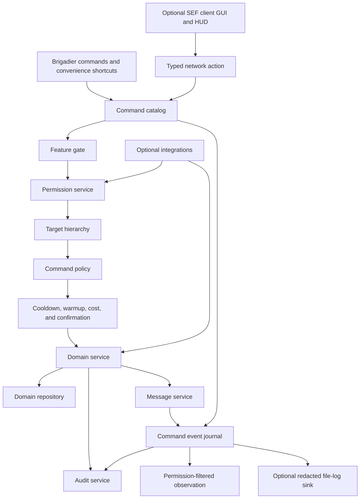
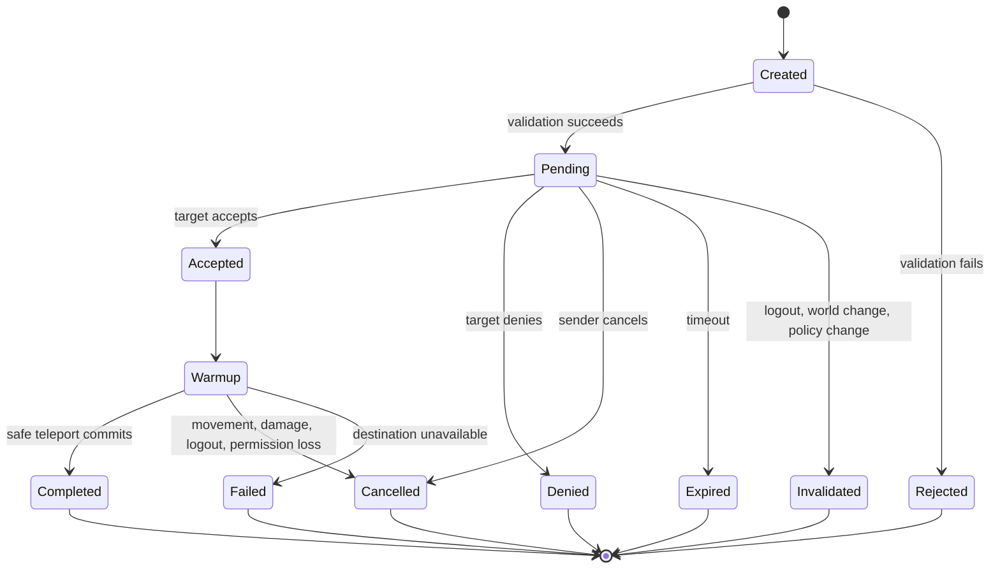
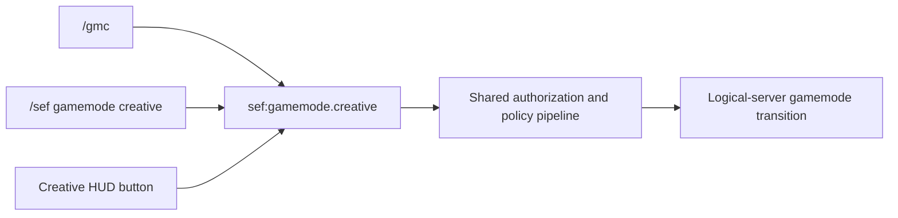
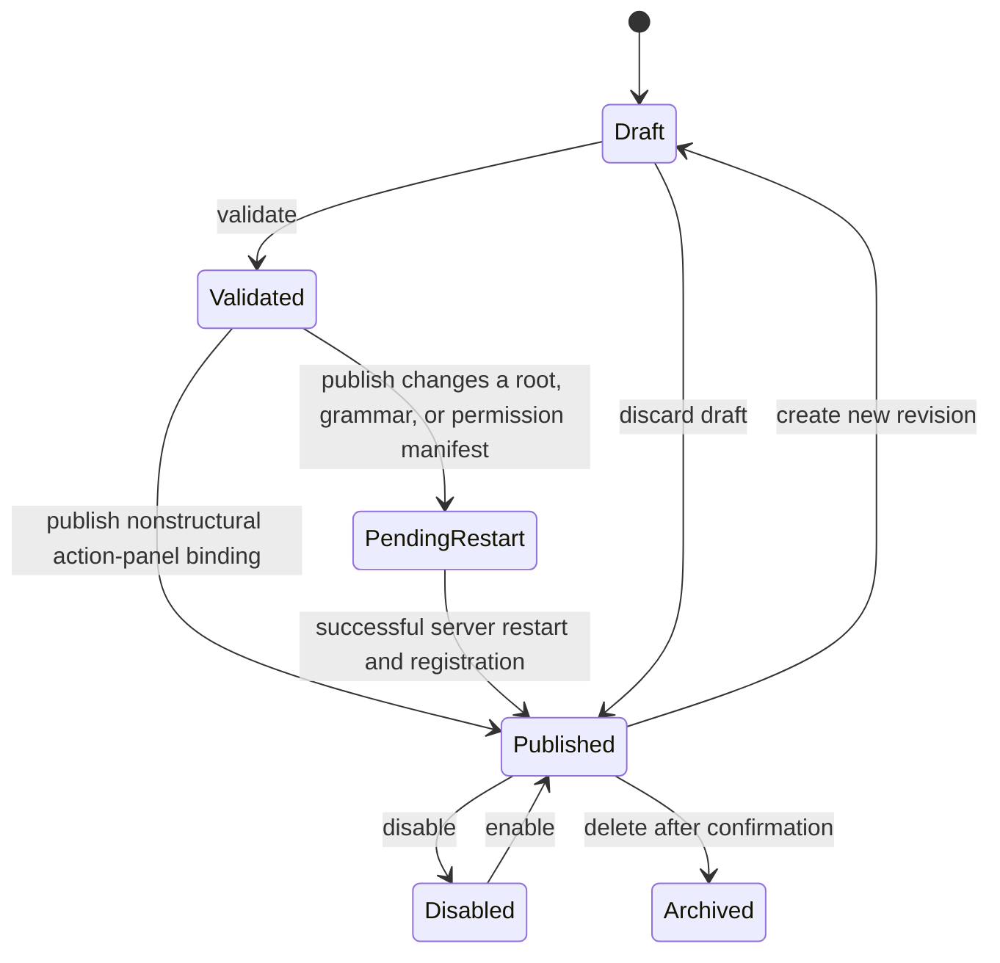
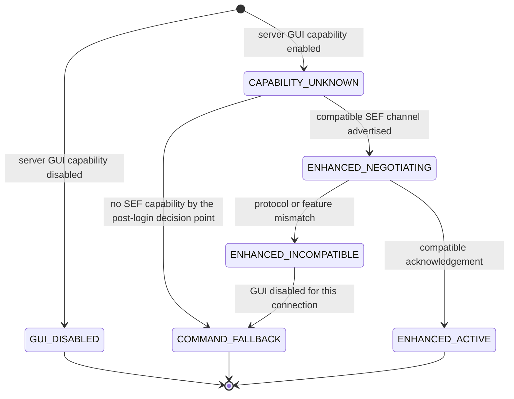

# SEF 2: Exhaustive Product, Architecture, Security, and Delivery Plan

## Document status

This document is the authoritative implementation plan for the next major evolution of Server Essentials Forge, referred to here as SEF 2.

The document is intentionally detailed. It consolidates:

- The existing NeoForge 1.21.1 port.
- The current SEF feature set.
- The workstation commands already added to the working tree.
- Every requested home, teleport, fake-message, sudo, quality-of-life, GUI, and EssentialsX-parity feature.
- Optional per-player enhanced GUI capability with complete command fallback for vanilla and non-SEF clients.
- Comprehensive nickname projection, mob and player-profile disguises, sounds, traits, and abilities.
- Configurable welcome and reminder systems.
- Scoped social-spy observation for everyone or selected UUID-backed players.
- High-risk `/run` console-source execution and `/silent` scoped-feedback execution with mandatory observation and audit.
- Collision-aware `/loggerspy` controls for SEF’s optional file logger while leaving MaxLogger’s `/logger` route external.
- Everyone or UUID-selected `/commandspy` observation with initiator and effective-actor matching, plus MaxLogger-equivalent `/loggerspy` live, recent, search, session, rotation, statistics, connection-event, and typed-filter controls.
- The integrated Fancy Tags visual-tag registry, vanilla-style editor, secure image pipeline, assignments, dynamic rendering, cache, and client-local project mode.
- Fifteen original server-control systems, twenty-five additional essential server systems, and thirty beyond-parity ultimate server-manager systems.
- The prior implementation audits and their unresolved defects.
- The second architectural and security audit performed before feature expansion.
- Required configuration, persistence, networking, compatibility, migration, testing, documentation, and release work.

This is a plan, not a statement that every described feature is already implemented. The implementation-status column and phase assignments are authoritative when a feature appears in more than one section.

## Implementation status update, 2026-07-25

Phase 1 implementation is complete.

Completed security and authorization work:

- `SEF2-SEC-001` action-level `/sef` authorization. `info`, `colors`, `test`, `reload`, `filter`, and storage diagnostics use Brigadier literal children with execution and suggestion permissions. Root access does not imply mutation access.
- `SEF2-SEC-002` typed scheduled text and command announcement records, an explicit server source policy, separate command management permission, empty default command allowlist, winning denylist, definition-time and execution-time validation, redacted structured audit events, overflow-safe scheduling, fail-closed target resolution, type-safe modification and removal, and malformed-record rejection.
- `SEF2-SEC-003` temporary sudo disablement. No `/sudo` Brigadier node is registered, including when an existing configuration enables the module. Existing values are retained for later migration and a warning reports that they are ignored.
- `SEF2-SEC-004` nickname authorization and identity repair. `/nickfor` defaults to denied, formatting capabilities are separate, visible length is checked after formatting removal, unsafe Unicode is rejected, comparisons use NFKC normalization, known online and offline identities are indexed by UUID, and ambiguous collisions fail closed.
- `SEF2-SEC-005` vanish revocation, hierarchy, and packet safety. State is reconciled on login, permission refresh, reload, dimension change, respawn, and once per second. Unauthorized state is cleared or reduced, module disablement safely unvanishes, target exemptions and hierarchy are enforced, and recipient-specific player information filtering no longer mutates a shared packet.
- `SEF2-SEC-006` central permission evaluation. `PermissionService` owns online, offline, console, and unavailable-provider behavior. A deterministic runtime permission manifest is generated, duplicate ids fail tests, and compatibility entry points delegate to the facade.
- Sensitive actions use structured audit events with bounded fields, a bounded asynchronous queue, rotation, retention, and shutdown flushing. Command arguments and alternate account addresses are not copied into broad audit output.

Completed validation and state work:

- `SEF2-CONFIG-001` strict duration parsing for announcements, countdowns, mutes, freezes, and warnings. Invalid moderation input cannot become permanent. Duplicate units, trailing data, zero values, unknown units, parse overflow, and scale overflow fail closed.
- Managed JSON domains use versioned envelopes, atomic replacement, migration backups, a JSONL migration journal, future-version refusal, 16 MiB limits, corruption quarantine, status diagnostics, and bounded background snapshot export.
- Unknown fixed fields survive rewrites. Dynamic record maps preserve extensions on retained records without restoring deleted records.
- Legacy nickname fixtures migrate into `sef.playerdata.json`. The integrated provider records UUID, last known username, nickname, and update time without taking ownership when FTB Essentials is selected.
- Alternate account collection is opt in. It defaults to salted server-local address hashing, retention is enforced, local addresses are ignored, group and profile counts are capped, display is redacted by default, and raw view, purge, and export use separate denied-by-default permissions.
- `/invsee` has separate view, modify, offline, Curios, and other-player ender chest permissions. Open menus revalidate permissions, close or downgrade after revocation, prevent collect-to-cursor bypasses, and audit mutation metadata without item NBT. Offline inventory and other-player ender chest routes remain reserved but unimplemented.
- Banned block background scanning defaults off, never forces unloaded chunks, uses an incremental cursor, and respects a configurable per-tick budget. Inventory scans, tab header updates, LuckPerms metadata, chat history, cooldown cleanup, audit writes, storage exports, and alternate account retention have bounded cadence, caches, queues, or collection limits.

Completed Phase 1 verification:

- JUnit regression coverage includes permission manifest determinism and duplicate rejection, command root policy, strict durations, nickname normalization, legacy nickname fixtures, vanish visibility, vanish permission reconciliation, vanish hierarchy, workstation cooldown cleanup, storage atomicity, storage quarantine, unknown-field preservation, dynamic deletion semantics, and alternate account privacy.
- The dedicated NeoForge server reaches ready state with no optional integrations and shuts down through normal `stop` with all dimensions saved.
- The same dedicated startup and shutdown path passes with LuckPerms NeoForge `5.4.140`, Curios `9.5.1+1.21.1`, FTB Essentials `2101.1.9` with its required libraries, and all three integration families together.
- `/sef storage status` reports the managed documents during the smoke test.
- `sudo say should_not_run` is rejected as an unknown command.
- `README.md` and `DOCUMENTATION.md` describe current behavior, recovery, privacy, permissions, integration boundaries, and remaining roadmap work.

Phases 2 and 3 are implemented in the current phase branch. The shared command and policy kernel now owns catalog, shortcut, alias compiler, bundle compiler, wrapper, feature, permission, quota, hierarchy, cooldown, warmup, confirmation, cost, audit, observation, identity, message, and diagnostic contracts. Versioned location history and persistent cooldown repositories, bounded player profiles, import diagnostics, and recovery mode provide the Phase 3 persistence foundation. Full sudo modes, offline inventory inspection, enhanced client GUIs, homes, teleportation, and the expanded command catalog remain assigned to their later phases.

## Source-of-truth order

When requirements conflict, use this order:

1. A newer explicit product decision from the project owner.
2. This `sef2.md` plan.
3. The pinned Minecraft, NeoForge, Java, Gradle, and dependency metadata in the repository.
4. The current implementation and its tests.
5. `PORTING_NOTES.md` and `SEFAudit.md` for historical port decisions.
6. `README.md` and `DOCUMENTATION.md` after they are replaced with verified project documentation.
7. External behavior references such as the EssentialsX wiki.

Unfinished work must be tracked here. Completed work must update its status here and in the user and maintainer documentation.

## Reference baseline

### SEF runtime baseline

| Property | Locked value |
|---|---|
| Minecraft | 1.21.1 |
| Loader | NeoForge |
| NeoForge | 21.1.233 |
| Java | 21 |
| Gradle | Checked-in Gradle Wrapper, currently Gradle 8.8 |
| Build plugin | ModDevGradle 2.0.141 |
| Mappings | Parchment 2024.11.17 for Minecraft 1.21.1 |
| Mod id | `sef` |
| Java package root | `com.enviouse.sef` |
| Current artifact name | `sef` |
| Current display name | `SEFPORTED` |
| Current license metadata | All Rights Reserved |
| Primary permissions provider | NeoForge Permission API |
| Optional permissions and metadata integration | LuckPerms API 5.4 |
| Optional nickname and mute integration | FTB Essentials 2101.1.9 |
| Optional inventory integration | Curios 9.5.1 for Minecraft 1.21.1 |

Version upgrades are outside this plan unless separately approved. Features must be implemented against the pinned 1.21.1 APIs rather than relying on newer NeoForge or Minecraft behavior.

### EssentialsX behavioral reference

The comparison target is frozen to the EssentialsX `2.x` branch at commit:

```text
776f7094a8d4d780899bac0f459ce0ec33f557ab
```

Reference date:

```text
2026-06-24
```

The official behavior references are:

- <https://essentialsx.net/wiki/introduction>
- <https://essentialsx.net/commands>
- <https://essentialsx.net/wiki/command-cooldowns>
- <https://essentialsx.net/wiki/color-permissions>
- <https://essentialsx.net/wiki/keywords>
- <https://essentialsx.net/wiki/text-commands>
- <https://github.com/EssentialsX/Essentials/tree/776f7094a8d4d780899bac0f459ce0ec33f557ab>

This is a behavioral and inventory reference, not a source-copying authorization.

The official introduction, module breakdown, command reference shell, permissions reference shell, and cooldown documentation were rechecked on `2026-07-24`. The official baseline still centers on homes, warps, kits, private messaging, teleport requests, nicknames, moderation, economy, chat formatting, world protection, spawn policy, optional integrations, and persistent command cooldowns. The current SEF 2 plan already covers that ordinary surface. The thirty ultimate systems in Part XIX are deliberate beyond-parity additions rather than renamed EssentialsX commands.

### Independent implementation and licensing rule

EssentialsX is licensed under GNU GPL version 3. SEF currently declares All Rights Reserved. Therefore:

- Do not copy or mechanically translate EssentialsX implementation code.
- Do not copy its tests, resources, translations, configuration text, message files, comments, or assets.
- Do not decompile or transplant Bukkit-specific implementation.
- Use public command behavior and operator documentation to identify expected capabilities.
- Design each feature independently for NeoForge and Minecraft 1.21.1.
- Record intentional differences in the parity matrix.
- Keep the SEF implementation, tests, messages, configuration schema, and documentation original.
- If the project later wants to incorporate GPL-covered implementation, stop and make a deliberate licensing decision before doing so.

This rule is a release gate.

### AdminPanelPlus clean-room behavioral reference

The user-supplied `adminpanelplus-1.0-SNAPSHOT.jar` was inspected as an authorized behavioral reference.

Artifact fingerprint:

```text
sha256 79a47e540b9a8fa3a4adffa5e6d287f2d321bb2fbacef1b22eb7b84235698fd1
```

Observed product concepts:

- NeoForge 1.21.1 client and server panel.
- `/app` open command.
- Permission-gated panel access and editing.
- Paged configurable controls.
- Searchable online-player selection.
- Self, individual, and broad target choices.
- Item or glyph icons.
- Configurable execution context.
- In-game add, edit, duplicate, reorder, move, resize, delete, and page operations.
- Live panel refresh.
- Confirmation threshold and throttled batch queue.

Clean-room restrictions:

- The JAR is not a dependency and is not redistributed.
- No decompiled source, bytecode, class organization, method structure, constants, translations, packet formats, default controls, visual coordinates, assets, or rendering code may enter SEF.
- SEF requirements are expressed as independently designed stable actions, typed bundles, permission-filtered projections, vanilla-native screens, and server-authoritative policy.
- Any optional configuration importer handles only operator-owned data and creates disabled drafts requiring review.
- A clean-room diff and artifact review is required before the configurable panel feature is released.

### MaxLogger clean-room behavioral reference

The supplied artifact `maxlogger-1.0-SNAPSHOT.jar` was inspected as an owner-provided behavioral reference.

Reference identity:

```text
sha256 35ba514a9f4871a880893ef71c5203b8f2e9ecc4e8ef6ccbb26ee82f68f1d956
declared platform Forge 1.20.1
declared version 1.0.0
declared license MIT
```

Useful product ideas observed:

- Capture who issued a command.
- Include dimension and position context.
- Distinguish player and non-player command sources.
- Keep a bounded recent history for inspection.
- Search command history.
- Toggle live command observation for an authorized player.
- Filter live observation by command root.
- Persist an observer’s requested toggle state.
- Write through a background worker.
- Maintain a stable current-session view.
- Rotate log files by size.
- Report session and logger statistics.
- Optionally record join and leave metadata.

The SEF design intentionally does not carry forward:

- OP level or one configured username as the authorization system.
- Raw unredacted command arguments.
- An unbounded writer queue.
- Copying the complete active file after every command.
- Opening a file channel for every line.
- Treating parse success as command execution success.
- Dropping every command from one actor during an arbitrary tick deduplication window.
- A logging whitelist that creates an unaudited privileged blind spot.
- Arbitrary absolute log paths.
- Exact coordinates, UUIDs, vanished identities, or full command content without separate privacy permissions.
- A persisted spy toggle that remains active after permission loss.
- Log files created and writer threads started while the feature is disabled.
- A daemon writer with no bounded shutdown flush or incomplete-session marker.

Clean-room restrictions:

- The JAR is not a dependency and is not redistributed.
- No decompiled source, bytecode, class organization, method structure, constants, messages, filenames, packet formats, or implementation code may enter SEF.
- SEF uses NeoForge 1.21.1 events and its own typed observation, permission, redaction, audit, storage, GUI, and lifecycle architecture.
- Existing MaxLogger files remain external archives. SEF does not automatically ingest, rewrite, or delete them.
- A clean-room review is required before the observation and file-log subsystem is released.

### FancyTags owner-authored design reference

The supplied `fancytagsplan.md` is an owner-authored product and architecture reference:

```text
sha256 b011f4982f9c432c6e1f6c6be4ec282c90e639bc69fff211f7a018950fd3b680
lines 1866
```

SEF adopts its product goals while integrating them into existing SEF authority, permissions, quotas, storage, audit, GUI, networking, identity, and provider systems.

Important adaptations:

- Use the existing universal optional-client negotiation rather than a second handshake.
- Use `PermissionService`, `QuotaService`, `AuditService`, `StorageService`, `IdentityService`, and `NicknameProjectionService` rather than parallel FancyTags services.
- Use SEF permission nodes and canonical `/sef tags` actions with collision-aware `/fancytags`.
- Use the existing repository contract for metadata instead of requiring a separate SQLite stack.
- Keep the arbitrary-image editor visually vanilla in its controls while allowing bounded user artwork only in declared preview and tag contexts.
- Add command-only import-inbox management so server-only operation remains meaningful.
- Add explicit cache disclosure, malicious-server, archive-import, object-store recovery, local-impersonation, vanish, signed-chat, and garbage-collection boundaries.

The integrated specification in this document is authoritative if the reference and SEF-wide architecture differ.

## Product vision

SEF 2 should be a comprehensive server-essentials platform for NeoForge 1.21.1 that:

- Provides the broad day-to-day command coverage expected from EssentialsX-like server software.
- Uses native NeoForge and vanilla Minecraft systems rather than Bukkit abstractions.
- Is fully usable as a server-only mod when enhanced GUIs are disabled.
- Provides an optional client-enhanced mode with cohesive, vanilla-looking GUIs for every player-facing feature.
- Allows vanilla and non-SEF clients to join even when enhanced GUIs are enabled on the server; those players receive the complete command-based experience and only compatible SEF clients receive GUI capabilities.
- Uses LuckPerms when installed without requiring it for startup.
- Makes every independently controllable capability permission-gated, including commands, limits, GUI controls, target scopes, audience scopes, editor operations, aliases, bundles, execution contexts, profiles, bypasses, diagnostics, and sensitive data.
- Makes ownership counts, retained collections, target fan-out, and concurrent work configurable through contextual finite quotas, including total, per-world, and per-dimension home limits.
- Applies permissions, quotas, cooldowns, warmups, costs, target hierarchy, feature toggles, and audit policy consistently.
- Keeps the logical server authoritative for every action and all persistent state.
- Preserves existing SEF configuration, permission, and data compatibility where practical.
- Avoids duplicating ownership of homes, balances, nicknames, or other state when another integration is selected as the provider.
- Treats fake-message and sudo functions as high-risk administrative tools with strict controls and auditability.
- Projects nicknames consistently across chat, nametags, tab, command suggestions, GUIs, messages, and supported integrations while retaining UUID-based security identity.
- Supports permission-controlled mob and player-profile disguises with capability-aware visuals, sounds, traits, and server-authoritative abilities.
- Provides configurable welcome, onboarding, optional-client, event, and operational reminders.
- Provides permission-gated `/socialspy` and `/commandspy` observation with configurable scopes, exemptions, redaction, formats, and vanilla-style controls.
- Provides a disabled-by-default structured command and event file-log sink under the normal server `logs/sef` directory with rotation, retention, search, export, and bounded asynchronous I/O.
- Provides collision-aware `/loggerspy` management without claiming MaxLogger’s external `/logger` route.
- Lets command-spy observers select everyone or a bounded UUID set and match authenticated initiator, effective actor, or either without weakening redaction, vanish, exemption, or hierarchy.
- Integrates Fancy Tags as an optional enhanced visual-identity platform with staff-controlled publication, arbitrary bounded raster artwork, immutable revisions, server assignments, local-only projects, content-addressed caching, and vanilla-client fallback.
- Provides disabled-by-default `/run` server-source execution and `/silent` actor or server execution through exact root policies, scoped feedback suppression, command spy visibility, SEF file-log visibility when enabled, and mandatory audit.
- Includes advanced maintenance, policy analysis, recovery, performance, community-support, reward, and world-operation controls.
- Extends beyond ordinary EssentialsX parity with staff duty and approval workflows, appeals and progressive discipline, chat safety, admission control, temporary access grants, content-pack lifecycle, world diagnostics, verified backups, privacy self-service, evidence custody, player logistics and commerce, community governance, contextual guides, and presentation ownership.
- Provides collision-aware Essentials-style shortcuts such as `/gmc`, `/gms`, `/gmsp`, `/gma`, `/gm`, and `/i` without duplicating or weakening canonical action policy.
- Provides operator-controlled custom aliases and typed command bundles with drafts, publication, permissions, throttling, recovery, and audit.
- Treats configurable vanilla-style administrative panels as a central SEF control surface, with vanish-safe targeting, complete in-game editing, “for everyone”, strictly authorized “as everyone”, bounded same-tick execution, paced jobs, reviewed server profiles, and no raw client-selected authority.
- Supports server public warps and player-hosted public, unlisted, shared, and private warps while keeping homes private.
- Expands player, IP, kick, pardon, and mute moderation with trusted address-provider and privacy boundaries.
- Gives every administrative and control family a cohesive vanilla-style management screen plus a minimal HUD or vanilla fallback when active state must remain visible.
- Applies one mandatory vanilla-style design constitution to every SEF screen, editor, overlay, form, button, progress surface, notification, and pause-screen entry point.
- Gives operators deterministic policy scope, validation, explanation, reload, rollback, and command fallback so extensive customization remains auditable and safe.
- Remains maintainable with well over 200 potential command roots, many more action-level entries, and deployment profiles that can exceed 250 roots when convenience aliases are enabled.

## Product boundaries and non-goals

The following are explicit non-goals unless later promoted into the plan:

- Supporting Minecraft versions other than 1.21.1 in the same release line.
- Supporting Fabric, legacy Forge, Bukkit, Spigot, Paper, or Sponge.
- Reproducing Bukkit internals or Vault itself.
- Creating a proxy-wide data platform for Velocity or BungeeCord networks.
- Replacing a full claims or region-protection mod.
- Rendering arbitrary Fancy Tags image pixels on vanilla clients without a negotiated enhanced client, resource pack, or separately approved compatibility mechanism.
- Treating Fancy Tags artwork distribution as confidential or revocable after bytes reach a client.
- Creating cryptographically signed chat messages on behalf of another player.
- Running arbitrary shell commands from Minecraft.
- Storing Discord bot tokens or other secrets through an in-game GUI.
- Silently sharing private IP, GeoIP, private-message, or moderation data with external services.
- Guaranteeing tamper-proof audit logs against a server administrator who controls the machine.
- Requiring a custom resource pack for the GUI.
- Replacing vanilla advancements or modifying the vanilla advancement screen through broad mixins.
- Dual-writing homes, balances, nicknames, or other authoritative state into two providers.
- Loading optional integration classes when the related mod is absent.

## Terminology

| Term | Meaning |
|---|---|
| Command catalog | The data-driven registry describing every command, alias, permission, policy, GUI entry, help entry, and test obligation. |
| Canonical route | The command route that SEF always owns, normally `/sef <feature>`. |
| Convenience root | A short root such as `/home`, `/warp`, or `/c` that may collide with another mod. |
| Shortcut | A typed convenience route such as `/gmc` or `/i` that resolves to one stable canonical action and inherits its policy. |
| Custom alias | An operator-defined published route to one stable action, bundle, or reviewed external profile. |
| Command bundle | A versioned typed workflow containing bounded, revalidated action steps. It is not a raw command script. |
| Administrative panel | A server-issued set of authorized vanilla-style controls backed by stable actions or bundles. |
| Capability | One independently controllable permission decision, including discovery, use, target scope, data view, edit, execution context, or bypass. |
| Quota | A server-authoritative finite or explicitly unlimited allowance for ownership, retention, fan-out, or concurrent work. It never replaces a permission. |
| For everyone | Execute one approved action repeatedly with the issuer as actor and each eligible participant as target. |
| As everyone | Execute one approved action separately with each eligible online participant as effective actor and the panel user retained as initiator. |
| Same-tick cohort | A small frozen audience admitted to execute sequentially within one logical-server tick. It is not parallel execution. |
| Social observation | Permission-controlled live viewing of private-message events routed through SEF or an explicit supported adapter. |
| Command observation | Permission-controlled live viewing of redacted command lifecycle events. |
| File-log sink | An optional bounded asynchronous consumer that writes structured redacted event records under `logs/sef`. It is not the authorization source or a replacement for mandatory domain audit. |
| Connection-address provider | The selected trusted source of normalized client addresses for IP moderation. |
| Player warp | A UUID-owned shared destination stored independently from homes and governed by access and publication policy. |
| Feature gate | A server-authoritative check determining whether a feature is enabled. |
| Command policy | Per-command settings for permission, cooldown, warmup, cost, confirmation, audit, and source restrictions. |
| GUI-off mode | Server-only-compatible mode. No client receives SEF enhanced GUI capabilities. |
| GUI-on mode | Enhanced capability mode. Compatible SEF clients may use GUIs, while vanilla and other clients remain connected and use commands. |
| Enhanced client session | A per-connection capability state created only after a compatible SEF client completes the optional handshake. |
| Command fallback session | The normal state for vanilla, non-SEF, disabled-GUI, and protocol-incompatible clients. All permitted features remain available through commands and vanilla menus. |
| Presentation descriptor | A data object describing how a command or feature appears in the reusable GUI framework. |
| HUD descriptor | A server-issued presentation record for one authorized active-state indicator, alert, progress view, or contextual action. |
| Action request | A typed client-to-server request for one approved operation. It is not an arbitrary command string. |
| Target hierarchy | Rules preventing one administrator from affecting a peer or superior account without explicit bypass authority. |
| Provider ownership | The single selected system that owns a data domain such as balances or nicknames. |
| Clean-room parity | Independently implementing documented behavior without copying covered source or assets. |

# Part I. Current repository baseline

## Current implementation inventory

The current source tree already contains:

- Chat formatting, colors, styles, Markdown conversion, timestamps, prefixes, suffixes, and nickname rendering.
- Private messages, reply routing, click-to-reply, admin chat, HelpOp, and operator bulletins.
- Integrated nickname storage and optional FTB Essentials nickname support.
- LuckPerms prefix and suffix metadata integration.
- Vanish with extensive server-side mixins, packet filtering, selector filtering, interaction suppression, sound suppression, tab-list suppression, status-ping suppression, and Discord-bridge compatibility.
- Muting, warnings, freezing, inventory locking, building restrictions, banned items, alternate-account tracking, chat clearing, countdowns, announcements, MOTD management, filters, sudo, and inventory inspection.
- Virtual crafting, anvil, enchanting, super enchanting, and held-item repair commands.
- JSON and custom-file persistence spread across server-root and world-root locations.
- NeoForge Permission API nodes, including command, chat, color, and cooldown-bypass nodes.
- A COMMON configuration file at `config/sef/common.toml`.
- A SERVER vanish configuration file at `sef-vanish-server.toml`.
- JUnit coverage for vanish visibility and workstation cooldown behavior.

## Current architectural constraints

1. Current code is mostly common/server code and contains no general custom networking layer.
2. Current server-only compatibility relies on `displayTest = "IGNORE_SERVER_VERSION"`.
3. Current vanilla-menu features work without a client mod because they use vanilla menu types.
4. Vanish is the most fragile subsystem because it relies on 29 mixins and access transformers.
5. Several managers are static singletons created directly by command registration.
6. Permission nodes are manually declared as static fields and discovered through reflection.
7. Configuration contains a large static list of typed fields and no complete schema-migration layer.
8. Existing data paths are inconsistent but must not be moved without migration.
9. Existing command roots sometimes override vanilla or other-mod commands at low registration priority.
10. Existing operator documentation is incomplete and must not be treated as current feature documentation.

## Current data locations that must be preserved or migrated

| Domain | Current location style | Required treatment |
|---|---|---|
| Warnings | Server directory under `serverconfig/sef` | Preserve read compatibility and migrate deliberately. |
| Alternate-account tracking | Server directory under `serverconfig/sef` | Preserve read compatibility; add privacy controls. |
| Filters | Server directory under `serverconfig/sef` | Preserve read compatibility. |
| Announcements | Server directory under `serverconfig/sef` | Preserve read compatibility. |
| Operator bulletin | Server directory under `serverconfig/sef` | Preserve read compatibility; repair unused display path. |
| Mutes | World root under `serverconfig/sef` | Preserve read compatibility. |
| Banned items | World root under `serverconfig/sef` | Preserve read compatibility. |
| Player nickname data | Existing player-data format | Add a versioned reader before changing. |
| Vanish persistent flag | Existing player persistent NBT | Preserve key and semantics. |

New storage may use cleaner domain separation, but existing files must be imported exactly once, with a backup and migration marker.

# Part II. Mandatory stabilization before expansion

No new command family may be declared production-ready until the following stabilization backlog is resolved.

## Stabilization issue register

### SEF2-SEC-001: `/sef` subcommand authorization

Problem:

- The command tree contains routes where access to the `/sef` root can expose mutations such as filters or MOTD management without a sufficiently specific action permission.
- A root permission must never imply all administrative subcommands.

Required correction:

- Register each subcommand through the command catalog.
- Require an explicit action permission at both suggestion and execution time.
- Keep `/sef`, `/sef help`, `/sef info`, and other harmless informational actions separately configurable.
- Add dispatcher tests proving a player with only `sef.commands.sef.allowed` cannot mutate filters, MOTD, configuration, data, or moderation state.

Acceptance criteria:

- Unauthorized subcommands are absent from suggestions.
- Direct execution through copied or manually typed command text still fails.
- GUI descriptors for unauthorized actions are not sent.
- Server execution repeats the permission check.

### SEF2-SEC-002: text announcements and command announcements

Problem:

- Text and command announcements must never share an execution path that can accidentally run formatted text as a console command.

Required correction:

- Create distinct immutable data types:
  - `TextAnnouncement`
  - `TitleAnnouncement`
  - `CommandAnnouncement`
- Require the command-announcement management permission for command entries.
- Store the execution source policy explicitly.
- Reject command prefixes, selectors, or roots disallowed by the shared command policy.
- Never infer an announcement type from the content of a string.

Acceptance criteria:

- A text announcement containing `/`, selectors, or command-like text is broadcast only as text.
- A command announcement cannot run when its feature or policy is disabled.
- Console execution is audited with announcement id, actor, command root, result, and timestamp.

### SEF2-SEC-003: sudo security and hierarchy

Problem:

- The current sudo design is too broad for a command that can act through another player.
- Permission to use sudo alone is insufficient.

Required correction:

- Split permissions by operation:
  - `sef.commands.sudo.run`
  - `sef.commands.sudo.chat`
  - `sef.commands.sudo.preview`
  - `sef.commands.sudo.batch`
  - `sef.commands.sudo.schedule`
  - `sef.commands.sudo.macro`
  - `sef.commands.sudo.cancel`
  - `sef.commands.sudo.watch`
- Add `sef.sudo.exempt`.
- Enforce actor-versus-target hierarchy.
- Define an allow, deny, and confirm policy for command roots.
- Reject self-escalation and any target source that would gain permissions not possessed by the real target.
- Audit the issuer, target, parsed root, normalized arguments, result, and failure reason.
- Rate-limit attempts, not only successful executions.

Acceptance criteria:

- A lower-ranked administrator cannot sudo a higher-ranked or exempt target.
- `/op`, permission-management commands, server shutdown, arbitrary plugin management, and configured dangerous roots are denied by default.
- Suggestions are generated in target context, but policy and authorization are evaluated in issuer context.
- No Brigadier redirect evaluates issuer requirements as though the issuer were the target or vice versa.

### SEF2-SEC-004: nickname authorization and identity collisions

Problem:

- Changing another player’s nickname must not be allowed by default.
- Nicknames can visually collide with usernames, other nicknames, prefixes, or fake identities.

Required correction:

- Default `sef.commands.nick.others` to false for new installations.
- Preserve existing configured behavior through a migration warning rather than silently changing established servers.
- Add normalized identity collision checks.
- Add configurable uniqueness policies:
  - unique among online players.
  - unique among all known player profiles.
  - allow duplicate display names but show username on hover.
- Validate length after stripping formatting.
- Validate formatting permissions independently from rename permission.
- Sanitize bidi controls, control characters, newlines, and misleading Unicode according to configurable policy.

### SEF2-SEC-005: vanish permission revocation and packet safety

Problem:

- Vanish state, observer visibility, and packet mutation are security-sensitive.
- Permission revocation while a player is vanished can leave inconsistent state.
- Shared packet mutation or off-thread access can create partial visibility or crashes.

Required correction:

- Re-evaluate vanish permission and maximum vanish level on login, permission refresh, dimension change, reload, and scheduled server-side reconciliation.
- Force a safe unvanish or lower-level transition when permission is lost.
- Never mutate a packet object that may be shared with multiple recipients.
- Keep per-recipient filtering isolated.
- Guard configuration reads by lifecycle and logical thread.
- Add connection-time, server-list-ping, voice-chat-packet, advancement, death-message, and shutdown-race tests.
- Add an explicit `vanish others` permission and hierarchy policy.

### SEF2-SEC-006: permission-service centralization

Problem:

- Permission behavior is repeated across commands and sometimes falls back to operator level differently.

Required correction:

- Replace direct `PermissionAPI` calls in feature code with `PermissionService`.
- Centralize offline behavior, operator fallback, LuckPerms availability, hierarchy, permission refresh, and audit context.
- Remove reflection-based registration when the command catalog can register known nodes deterministically.
- Add a generated permission manifest and duplicate-node test.

### SEF2-CONFIG-001: strict duration parsing

Problem:

- Mutes, freezes, warnings, announcements, cooldowns, schedules, and teleport delays require consistent duration behavior.

Required correction:

- Implement one strict `DurationParser`.
- Support documented units only.
- Reject overflow, negative values, duplicate units, unsupported suffixes, trailing garbage, and ambiguous values.
- Define `permanent` explicitly rather than using a magic maximum duration.
- Use the same formatter for messages, GUI previews, persistence, and audit logs.

### SEF2-DATA-001: persistence versioning

Problem:

- Existing managers use several unrelated JSON and custom formats without a shared schema version or migration transaction.

Required correction:

- Add `StorageService`, domain repositories, schema versions, backup-before-migration, temporary-file writes, atomic replacement where supported, and recovery logging.
- Never discard an unknown field merely because the current version does not understand it.
- Keep a migration journal.
- Provide read-only diagnostics and operator-triggered export.

### SEF2-PRIV-001: privacy and sensitive data

Problem:

- Alternate-account tracking stores IP-derived data.
- Private messages, chat, audit records, GeoIP, and external bridges can contain sensitive information.

Required correction:

- Make IP and GeoIP features explicitly opt-in.
- Define retention windows and purge commands.
- Restrict display and export permissions.
- Redact IPs in ordinary logs.
- Never send private or moderation messages to Discord unless an explicit route allows it.
- Never include raw chat bodies in metrics.
- Keep live private-message observation separately denied, per-event authorized, exempt-aware, audited, and off in persisted state by default.
- Redact secret command arguments before live observation, files, history, exports, metrics, or ordinary audit.
- Keep optional social-content file logging independently disabled with shorter explicit retention.

### SEF2-INV-001: inventory-view authorization

Problem:

- Viewing inventory, modifying inventory, viewing Curios, viewing ender chest, and viewing offline state are distinct authorities.

Required correction:

- Split permissions:
  - `sef.commands.invsee.view`
  - `sef.commands.invsee.modify`
  - `sef.commands.invsee.offline`
  - `sef.commands.invsee.curios`
  - `sef.commands.enderchest.others`
- Recheck permissions on every menu mutation.
- Close or downgrade an open menu if permission is revoked.
- Audit modifications, not ordinary read-only views unless configured.

### SEF2-PERF-001: hot-path limits

Problem:

- Banned-block scans, tab rendering, LuckPerms metadata reads, packet filters, cooldown maps, chat history, and future GUI queries can become hot-path costs.

Required correction:

- Establish explicit budgets.
- Remove filesystem and network access from tick, packet, render, and event hot paths.
- Cache metadata with invalidation.
- Bound histories and queues.
- Bound observation fan-out, per-viewer delivery, command-event records, file-writer queues, log searches, exports, rotation, retention, and shutdown flush.
- Keep file writing, archive scanning, compression, and log search off the logical server thread.
- Prune expired cooldown entries.
- Avoid broad block scans; use event-driven enforcement where possible.
- Record timing metrics without recording private message content.

## Stabilization release gate

The stabilization phase is complete only when:

- Every issue above has a regression test or a documented manual test where automation is impractical.
- `./gradlew test` passes.
- `./gradlew build` passes.
- A dedicated server reaches ready state without mixin application failures.
- A server shutdown produces no configuration-lifecycle or off-thread packet exceptions.
- Existing data fixtures load without loss.
- LuckPerms, FTB Essentials, and Curios are each tested both present and absent.
- The complete diff contains no generated worlds, logs, credentials, caches, or unrelated changes.

# Part III. Target architecture

## High-level architecture



Commands and GUIs are presentation layers. They must not contain independent business logic.

## Planned package boundaries

The final package layout may be introduced incrementally, but dependency direction must follow this structure:

```text
com.enviouse.sef
├── api
│   ├── command
│   ├── economy
│   ├── identity
│   ├── permission
│   ├── tags
│   └── teleport
├── audit
├── chat
├── command
│   ├── bundle
│   ├── catalog
│   ├── policy
│   ├── shortcut
│   ├── suggestion
│   ├── wrapper
│   └── execution
├── config
│   ├── migration
│   ├── policy
│   └── validation
├── control
│   ├── guardrail
│   ├── maintenance
│   ├── rollout
│   └── journal
├── disguise
│   ├── ability
│   ├── adapter
│   ├── projection
│   └── sound
├── economy
├── gui
│   ├── common
│   ├── descriptor
│   ├── hud
│   └── server
├── integration
│   ├── claims
│   ├── curios
│   ├── discord
│   ├── ftb
│   └── luckperms
├── moderation
├── network
├── observation
│   ├── command
│   ├── social
│   ├── redaction
│   ├── projection
│   └── session
├── logging
│   ├── sink
│   ├── rotation
│   ├── retention
│   ├── query
│   └── serialization
├── panel
│   ├── definition
│   ├── projection
│   └── session
├── player
├── reminder
├── social
├── tags
│   ├── api
│   ├── assignment
│   ├── definition
│   ├── image
│   ├── policy
│   ├── projection
│   ├── storage
│   └── transfer
├── storage
│   ├── migration
│   └── repository
├── teleport
├── workstation
├── vanish
└── client
    ├── gui
    ├── hud
    ├── input
    ├── network
    └── tags
        ├── cache
        ├── editor
        ├── import
        └── render
```

Rules:

- `client` may depend on common data-transfer types but common/server code may not load client classes.
- Domain services may depend on APIs and repositories, not on Brigadier or client screens.
- Optional integrations may implement internal interfaces, but domain code may not depend on optional-mod classes.
- Networking may call domain services only after server-thread dispatch and validation.
- Persistent records may not contain live `ServerPlayer`, `Level`, registry object, menu, or connection references.
- Public API types must be intentionally versioned. Internal service classes are not automatically public API.

## Core service inventory

### `CommandCatalog`

Owns:

- Stable command id.
- Canonical route.
- Optional convenience roots.
- Aliases.
- Description and usage translation keys.
- Feature id.
- Permission ids.
- Default access class.
- Source restrictions.
- Target behavior.
- Cooldown, warmup, cost, confirmation, and audit defaults.
- GUI descriptor id.
- HUD descriptor id or explicit no-HUD rationale for administrative and control actions.
- Conflict policy.
- Test and documentation obligations.

It must reject:

- Duplicate ids.
- Duplicate canonical routes.
- Alias cycles.
- Unknown permission references.
- Unknown GUI descriptors for player-facing commands.
- Unsafe default access for administrative or destructive actions.
- A command that bypasses the normal execution pipeline.

### `ShortcutRegistry`

Owns every Essentials-style short root and operator-defined convenience alias. A shortcut is a presentation route to one stable action id, never a second command implementation.

Responsibilities:

- Bind a short root such as `/gmc` to one canonical action such as `sef:gamemode.creative`.
- Bind only an explicitly declared argument adapter. An adapter may insert a fixed enum value, reorder a bounded set of typed arguments, or choose the self form when a target is omitted.
- Reuse the canonical action’s feature gate, source policy, permission nodes, hierarchy, exemptions, cooldown, warmup, cost, confirmation, audit, privacy, and result messages.
- Normalize aliases before cooldown, rate-limit, sudo deny-list, audit, anomaly, and metrics classification.
- Report root ownership and collisions before registration.
- Produce the active alias map used by help, command suggestions, GUI search, diagnostics, documentation generation, and tests.
- Keep the canonical `/sef` route available when a short root is unavailable.

It must reject:

- Alias cycles or recursive expansion.
- A shortcut with no stable target action id.
- Raw string substitution into a command.
- A shortcut that changes source class, maximum targets, target visibility, or default access.
- A shortcut that grants an `others` form when the canonical action has no separately authorized other-target operation.
- An argument adapter that creates an ambiguous Brigadier parse.
- A shortcut that weakens confirmation, hierarchy, exemption, cooldown, cost, audit, privacy, or safety policy.
- A reload that structurally changes registered roots. Structural changes are restart-required.

### `BundleService`

Owns:

- Published bundle definitions and retained revisions.
- Typed step compilation.
- Dependency graph and cycle validation.
- Preview and impact calculation.
- Confirmation binding.
- Bounded job queue.
- Per-step policy revalidation.
- Progress, cancellation, recovery, and correlated audit.

It never stores or executes an unrestricted client command string. External commands are referenced through separately approved adapter or server-profile ids.

### `AdminPanelService`

Owns:

- Built-in and operator-defined panel definitions.
- Vanilla-style category, page, slot, icon, action, bundle, and status-tile descriptors.
- Permission-filtered projection for each viewer.
- UUID-bound selected-target sessions.
- Typed audience previews and frozen eligible cohorts.
- Distinct issuer, effective-actor, target, participant-authorization, execution-context, and scheduling semantics.
- Bounded same-tick admission and paced job execution through the resource governor.
- Per-participant permission, quota, cooldown, cost, hierarchy, exemption, context, and action revalidation.
- Draft, validation, publication, rollback, and layout revision.
- Complete in-game editing of pages, controls, permissions, audiences, execution contexts, scheduling, and vanilla presentation.
- Command fallback rendering.
- Live refresh after permission, target, alias, bundle, panel, vanish, or control-state change.

The service sends only controls and player identities the viewer may observe. It does not broadcast a complete online-player list merely because a compatible client is present.

### Ultimate workflow primitives

The thirty ultimate server-manager systems in Part XIX extend the core with the following shared primitives:

- `DraftPublicationService` for immutable drafts, validation, diffs, publication, retained revisions, rollout, scheduling, supersession, and rollback.
- `ApprovalService` for exact action-bound separation and multi-approver requirements.
- `LifecycleJobService` for cancellable, revisioned, governor-managed work with progress and recovery.
- `EscrowService` for item and currency custody under idempotent transaction journals.
- `OwnedInboxService` for fixed-directory, no-link, opaque-candidate ingestion.
- `RetentionDecisionService` for holds, disclosure, export, anonymization, deletion, destruction, and immutable disposition audit.
- `PresentationOwnershipService` for scoreboard, tab, boss-bar, action-bar, toast, and enhanced-HUD surface leases and packet budgets.

Each primitive remains below domain application services and above repositories or provider adapters. None evaluates an action without `FeatureGateService`, `PermissionService`, `QuotaService`, hierarchy, policy, confirmation, and audit. Their complete contracts are defined in Part XIX.

### `FeatureGateService`

Responsibilities:

- Resolve global feature state.
- Resolve per-world or per-dimension overrides where supported.
- Resolve command-specific sparse overrides.
- Explain why a feature is disabled.
- Expose stable state to command registration, command execution, and GUI capability generation.

Feature gating happens twice:

1. Registration or descriptor exposure.
2. Execution immediately before mutation.

The second check is mandatory because configuration or permissions may change after the command tree or GUI opens.

### `PermissionService`

Responsibilities:

- Register and describe permission nodes.
- Query online and offline permission values.
- Apply operator fallback only when the configured provider permits it.
- Integrate LuckPerms without hard dependency.
- Resolve action permissions, bypass permissions, exemptions, and hierarchy.
- Refresh command trees and open GUI state after relevant permission changes.
- Return a structured decision rather than only a boolean.
- Resolve independently controllable capabilities for commands, GUI surfaces, HUD interactions, panel controls, target scopes, audience scopes, editor operations, aliases, bundles, execution profiles, bypasses, sensitive-data fields, and diagnostic views.
- Preserve an explicit negative decision from the active provider. Operator status, a permissive default, a panel definition, an alias, a bundle, or a server profile cannot turn an explicit denial into approval.
- Produce the same decision for a canonical command, shortcut, command fallback, enhanced screen, pause-screen entry point, HUD control, and panel control that converge on the same action.

Decision fields:

```text
allowed
permission id
provider
default used
target hierarchy result
exemption result
reason code
```

### `QuotaService`

Responsibilities:

- Resolve every numeric allowance through a stable quota id.
- Support global, world, dimension, context, group, player, and action-specific limits without scattering provider calls through domain services.
- Read contextual LuckPerms metadata when LuckPerms is the selected metadata provider.
- Read registered finite permission tiers when metadata is unavailable or deliberately disabled.
- Fall back to validated internal role and player overrides when LuckPerms is absent.
- Apply hard implementation ceilings after configurable limits.
- Return both the effective value and a non-sensitive explanation suitable for `/limits`, forms, previews, and administration.
- Invalidate cached values on provider events, context changes, world or dimension changes, player profile changes, and configuration publication.
- Distinguish a count quota from a rate limit, target cap, storage retention limit, and resource-pressure budget.

Quota decision fields:

```text
quota id
subject UUID or server subject
context
effective finite value or explicit unlimited marker
provider
source profile or rule id where visible
hard ceiling
current usage
reserved usage
remaining
reason code
revision
```

An unlimited result must be explicit. Missing metadata, an invalid value, provider failure, or a wildcard match never silently means unlimited.

### `TargetHierarchyService`

Responsibilities:

- Compare actor and target authority.
- Respect `exempt` permissions.
- Optionally use LuckPerms group weights.
- Provide a deterministic fallback without LuckPerms.
- Treat console as a separately configured authority rather than silently granting every operation.
- Reject acting on self where self-action creates privilege escalation.

Fallback hierarchy configuration:

```text
owner
administrator
moderator
helper
player
```

Each tier maps to explicit permissions. A missing provider must not turn hierarchy checks into unconditional success.

### `CommandPolicyService`

Responsibilities:

- Match normalized command ids, not raw untrusted strings where possible.
- Decide allow, deny, confirmation, cooldown, warmup, cost, and audit behavior.
- Support source types:
  - player.
  - console.
  - command block.
  - function.
  - scheduled task.
  - sudo.
  - bundle.
  - panel.
  - external adapter.
  - server execution profile.
  - run server wrapper.
  - silent actor wrapper.
  - silent server wrapper.
  - announcement.
  - GUI.
  - integration.
- Prevent a delegated action from bypassing the policy applied to direct use.
- Provide a dry-run explanation.

### `CommandWrapperService`

Owns the explicit `/run` and `/silent` boundaries.

Responsibilities:

- Compile one bounded nested Brigadier command against the declared actor or server source.
- Preserve initiator separately from effective source.
- Normalize root ownership, aliases, redirects, forks, targets, sensitive arguments, silence capability, and command-tree revision.
- Resolve root-specific permissions and policy.
- Perform target, hierarchy, exemption, world, confirmation, cooldown, rate, redaction, and resource preflight.
- Create the exact actor or server `CommandSourceStack`.
- Attach a scoped output consumer or suppressed-output source without mutating global logger state.
- Reject wrapper recursion and use from aliases, panels, bundles, schedules, profiles, adapters, or sudo.
- Correlate one wrapper event with the underlying execution in `CommandEventJournal`.
- Guarantee mandatory metadata audit even when command spy and file logging are disabled.
- Reparse and reauthorize immediately before execution.

It must never increase a player source’s permission level in place, trust a client-provided source, or install a process-wide output filter.

### `CooldownService`

Requirements:

- One service for all commands and GUI actions.
- Keys include player UUID and stable command or action id.
- Aliases share the canonical cooldown.
- Optional per-permission-group overrides.
- Optional persistence for long cooldowns.
- Persist epoch expiry rather than monotonic process time.
- Clamp unreasonable clock changes and log a warning.
- Prune expired entries.
- Support global and command-specific bypass permissions.
- Expose remaining time through a structured result.

### `WarmupService`

Requirements:

- Warmups are transient.
- A warmup records actor, action, initial location, start time, intended target, and cancellation policy.
- Configurable cancellation sources:
  - movement.
  - rotation.
  - damage.
  - combat tag.
  - death.
  - logout.
  - dimension change.
  - permission loss.
  - feature disable.
- Never reserve or deduct irreversible costs before the action is ready to commit.

### `ConfirmationService`

Requirements:

- Create short-lived, single-use confirmation tokens.
- Bind the token to actor UUID, action id, normalized parameters, target set or target UUIDs, relevant panel, alias, bundle, execution-profile and policy revisions, and expiry.
- Require server-side confirmation for destructive GUI and command actions.
- Reject replay, parameter changes, cross-player use, and expired tokens.
- Support typed confirmation commands without exposing secrets.

### `CostService`

Requirements:

- Use the selected economy provider.
- Validate amount bounds and currency precision.
- Reserve or atomically debit only when execution can commit.
- Refund when an action fails after debit.
- Define cancellation behavior for warmups.
- Support `sef.costs.bypass.<command>`.
- Never charge on parse failure, permission denial, hierarchy denial, feature denial, or unavailable destination.

### `AuditService`

Audit classes:

- `NONE`
- `METADATA_ONLY`
- `ADMIN_ACTION`
- `SENSITIVE_ACCESS`
- `DESTRUCTIVE`
- `DELEGATED_EXECUTION`
- `WORKFLOW_EXECUTION`
- `CONFIG_DEFINITION`
- `NETWORK_ADDRESS_ACTION`
- `PRIVATE_MESSAGE_OBSERVATION`
- `COMMAND_OBSERVATION`
- `FILE_LOG_CONTROL`
- `ECONOMY_TRANSACTION`

Required fields:

```text
schema version
event id
timestamp
server session id
actor UUID and last known username
source type
action id
target UUIDs
normalized parameters
result
reason code
duration
origin, command, shortcut, alias, panel, HUD, bundle, scheduler, or integration
parent job and step correlation ids where applicable
definition and policy revisions
provider context
redaction class and applied redaction rule ids
observer UUID when access to another event is itself audited
previous event hash when hash chaining is enabled
```

Private chat bodies, raw IP addresses, Discord tokens, and unrelated item data must not be logged by default. IP moderation uses a keyed fingerprint or restricted provider-record id unless the separately protected full-address audit class is explicitly approved.

Hash chaining is an integrity signal only. Documentation must not call a locally controlled log tamper-proof.

### `ObservationService`

Owns live permission-controlled observation without making spy state an authorization source.

Responsibilities:

- Receive normalized private-message and command lifecycle events from server-authoritative producers.
- Keep social observation and command observation as separate capabilities and separate requested toggle states.
- Resolve active observers for each event only after current permission, scope, exemption, hierarchy, vanish, privacy, feature, and rate policy checks.
- Render an independently configured typed message for each authorized observer.
- Apply redaction before any live fan-out, enhanced payload, history buffer, file sink, external sink, metric, or audit field is created.
- Track initiator, effective actor, source type, target, route, world, dimension, and position only where the observer may see those fields.
- Deduplicate by stable event id and lifecycle stage, never by actor and tick.
- Expose a bounded permission-filtered recent-event view for command fallback and enhanced screens.
- Audit observation enable, disable, scope change, sensitive-content view, search, export, and exemption override.
- Stop active observation immediately on permission loss, feature disable, session loss, target-policy change, or privacy-policy reload.
- Integrate only with private-message or command routes whose event semantics are documented. Unknown mod-private-message systems require an explicit adapter.

It must never:

- Reconstruct a private message by scraping rendered chat.
- Turn a system observation line into signed player chat.
- Forward a private message to Discord or another external route merely because a staff member enabled social spy.
- Trust a persisted toggle, open GUI, or client payload as current authorization.
- Emit a secret command argument before redaction.

### `CommandEventJournal`

Creates one correlated lifecycle record for each command entry.

Stages:

```text
received
parsed
rejected
authorized
started
completed
failed
cancelled
outcome_unknown
```

Responsibilities:

- Assign an event id before routing aliases, panels, bundles, sudo, scheduled workflows, or external adapters.
- Record the entry route separately from the normalized action or owned Brigadier root.
- Preserve parent panel, bundle, sudo, scheduler, and profile correlation ids without creating duplicate top-level events.
- Capture player, console, RCON, command-block, function, scheduler, panel, bundle, and integration source categories.
- Capture a server snapshot of world, dimension, and position only for source types that have a meaningful location.
- Report command completion only when the owning path supplies a real completion result.
- Mark an external command `outcome_unknown` when only pre-execution interception is available.
- Apply command-specific redaction policy to display and storage projections.
- Keep the canonical domain audit independent from the optional general file logger.

A Brigadier parse without an exception proves only that parsing succeeded. It must not be labeled as successful execution.

### `FileLogSink`

Owns the optional file projection under the fixed server game-directory subtree `logs/sef`.

Responsibilities:

- Remain completely inactive by default.
- Create directories and start the writer only after a validated enabled configuration becomes active.
- Accept immutable already-redacted event records through a bounded queue.
- Batch UTF-8 writes on one owned I/O worker.
- Rotate by time, size, session, and explicit command according to validated policy.
- Keep a stable current file without copying the complete file after every event.
- Enforce maximum archive count, age, and total bytes.
- Escape structured fields and line breaks.
- Flush within a bounded shutdown deadline and write an incomplete-session marker when the deadline cannot be met.
- Expose queue depth, dropped-record count, last write, last rotation, disk-policy state, and failure status.
- Fail visibly without blocking the logical server or disabling mandatory `AuditService` behavior.
- Refuse arbitrary absolute paths, parent traversal, symlink escapes, or paths outside its owned subtree.

The optional sink is for operator observability. Security-critical actions still use `AuditService` according to their domain policy even when the file sink is disabled or unhealthy.

### `IdentityService`

Responsibilities:

- Resolve online player, cached profile, known offline profile, nickname, and synthetic fake identity.
- Normalize search input and detect ambiguity.
- Merge prefix, suffix, nickname, username, vanish visibility, and rank metadata for authorized consumers.
- Perform remote profile lookup only asynchronously and only when explicitly enabled.
- Cache remote results with a bounded TTL.
- Return provenance so callers know whether the identity is online, cached, offline, defaulted, or synthetic.

### `NicknameProjectionService`

Responsibilities:

- Resolve the viewer-specific visible name for every registered presentation surface.
- Keep authenticated username and UUID separate from display identity.
- Publish revisioned updates after nickname, metadata, disguise, vanish, team, or privacy changes.
- Supply Brigadier suggestion tokens and ambiguity metadata.
- Supply tab, nametag, chat, GUI, external-route, and system-message components.
- Define server-only and enhanced-client coverage.
- Never mutate authentication, player-data, economy, ban, whitelist, statistics, or signed-chat identity.

### `FancyTagService`

Responsibilities:

- Own the versioned server tag registry, immutable artwork revisions, categories, assignments, edit leases, visibility decisions, and integrity status.
- Resolve viewer-specific tags for chat, nametag, tab, HUD, tooltip, and API contexts without replacing authenticated identity.
- Validate every create, upload, edit, publish, assignment, archive, delete, restore, export, and bulk operation through permissions, hierarchy, quotas, confirmation, and audit.
- Canonicalize bounded raster input on controlled workers and publish only validated immutable content-addressed objects.
- Produce permission-filtered manifests and assignment deltas for negotiated enhanced clients.
- Coordinate bounded upload sessions, object retention, garbage-collection previews, backup verification, and recovery.
- Expose text or no-tag fallbacks for command-only clients and never require a client mod for joining.
- Keep local client projects and overlays outside server authority and clearly separate from server-published tags.

### `DisguiseService`

Responsibilities:

- Own active disguise state.
- Validate supported entity and player-profile projections.
- Select enhanced-client or vanilla-proxy projection per viewer.
- Manage observer-scoped proxy entity ids and lifecycle.
- Authorize and execute traits and abilities.
- Coordinate sound, particles, equipment, labels, hitbox policy, vanish, and nickname precedence.
- Clear or restore state according to lifecycle and persistence policy.

### `HudProjectionService`

Responsibilities:

- Compose permission-filtered administrative indicators from authoritative domain state.
- Own indicator ids, revisions, priorities, expiry, deduplication, and maximum visible-tile policy.
- Project one domain state into an enhanced HUD, vanilla action bar, vanilla boss bar, toast-like enhanced notice, or command/chat fallback according to connection capability and presentation ownership.
- Generate only bounded deltas after the initial session snapshot.
- Reconcile vanish, staff mode, disguise, restrictions, maintenance, restart, guardrail, governor, incident, rollout, batch, warmup, and progress state.
- Invalidate indicators on permission loss, policy reload, state change, disconnect, and enhanced-session downgrade.
- Bind every interactive indicator to a typed action descriptor and server revision.
- Never treat local visibility, a rendered icon, or a client reply as authorization.

### `ReminderService`

Responsibilities:

- Load and validate welcome and reminder definitions.
- Resolve typed audiences.
- Deduplicate and rate-limit delivery.
- Track delivery count, dismissal, and acknowledgement revision.
- Select chat, title, action-bar, boss-bar, command, or enhanced-GUI presentation.
- Guarantee command fallback delivery for every player-relevant reminder.

### `OperationalControlService`

Responsibilities:

- Coordinate maintenance, guardrails, change windows, rollouts, governor queues, operational snapshots, incidents, and reversible actions.
- Expose dry-run and impact previews.
- Allow only typed, approved, bounded control actions.
- Keep automatic actions reversible where advertised.
- Prevent arbitrary script, shell, path, or command execution.

### `MessageService`

Responsibilities:

- Render typed templates.
- Validate placeholders.
- Sanitize user-controlled formatting.
- Choose audience.
- Apply vanish-aware player-list and broadcast rules.
- Separate ordinary system messages, chat-like messages, titles, action bars, external routes, and signed player chat.
- Compose observation templates from typed component placeholders rather than performing raw string replacement.
- Parse operator-owned color and style codes separately from player-controlled names, messages, commands, reasons, and coordinates.
- Never claim a synthetic or delegated message is cryptographically signed by the named player.

### `StorageService`

Responsibilities:

- Register domain repositories.
- Load and validate schema versions.
- Create backups before migrations.
- Write through temporary files and atomic moves where the platform supports them.
- Serialize on a controlled server or I/O worker path without racing domain mutation.
- Keep immutable snapshots for asynchronous writes.
- Flush on controlled shutdown.
- Record recovery and migration status.

### `IntegrationRegistry`

Responsibilities:

- Discover optional mods.
- Load an adapter only when present and enabled.
- Report adapter health.
- Select exactly one authoritative provider for a domain.
- Avoid optional types in always-loaded signatures.
- Fail closed for security-sensitive integrations and fail safely for cosmetic metadata.

# Part IV. Command platform specification

## Command routing model

Every command must have:

1. A stable internal id such as `sef:home.teleport`.
2. A canonical route under `/sef`.
3. Zero or more convenience roots such as `/home`.
4. A command-catalog record.
5. A permission policy.
6. A feature policy.
7. A source policy.
8. A GUI descriptor when player-facing.
9. Help and localization entries.
10. Dispatcher tests.

Examples:

| Internal id | Canonical route | Convenience roots |
|---|---|---|
| `sef:home.list` | `/sef home list` | `/homes`, bare `/home` |
| `sef:home.teleport` | `/sef home teleport <name>` | `/home <name>` |
| `sef:teleport.request.to` | `/sef teleport request to <player>` | `/tpa <player>` |
| `sef:workstation.craft` | `/sef workstation craft` | `/craft`, `/c` |
| `sef:gamemode.creative` | `/sef gamemode creative [player]` | `/gmc [player]` |
| `sef:gamemode.survival` | `/sef gamemode survival [player]` | `/gms [player]` |
| `sef:gamemode.spectator` | `/sef gamemode spectator [player]` | `/gmsp [player]` |
| `sef:gamemode.adventure` | `/sef gamemode adventure [player]` | `/gma [player]` |
| `sef:item.give.self` | `/sef item give <item> [amount]` | `/i <item> [amount]` |
| `myserver:staffmode` bundle | `/sef bundle run myserver:staffmode` | Operator-defined `/staffmode` alias |
| `sef:panel.open.staff` | `/sef panel open sef:staff` | `/adminpanel`, `/ap`, `/app`, or `/staff` when configured |
| `sef:warp.player.visit` | `/sef pwarp visit <owner:name>` | `/pwarp <owner:name>`, `/pw <owner:name>` |
| `sef:fake.message` | `/sef fake message ...` | `/fakemessage` |
| `sef:sudo.run` | `/sef sudo run ...` | `/sudo run ...` |

The `/sef` route is the recovery path when another mod owns a convenience root.

## Command ownership and collision policy

Each convenience root has one configured ownership mode:

| Mode | Behavior |
|---|---|
| `auto` | Register when unclaimed. Otherwise keep only the canonical `/sef` route and log the owner. |
| `sef` | Attempt to register SEF’s root and report any overwritten or overwritten-by relationship. |
| `external` | Never register the convenience root. |
| `namespace_only` | Register only the canonical `/sef` route. |
| `fail` | Stop server startup with a precise conflict report. Intended for tightly managed packs. |

Requirements:

- Do not mutate Brigadier internals through reflection to steal a root.
- Do not assume event priority guarantees ownership.
- Record the previous root owner when it can be identified.
- Produce a startup conflict summary.
- Provide `/sef conflicts`.
- Provide `/sef commands route <id>` to show the active route and aliases.
- Treat alias changes and structural command registration changes as restart-required.
- Measure command-tree packet size and login impact.

High-risk aliases include:

```text
/c
/r
/w
/set
/home
/back
/spawn
/warp
/fly
/god
/nick
/invsee
/tpa
/tp
/time
/weather
/give
/i
/gm
/gmc
/gms
/gmsp
/gma
/alias
/bundle
/app
/staff
/ban-ip
/unban
/kick-ip
/pwarp
/repair
```

Essentials-style shortcuts are resolved before the execution pipeline starts:

1. Brigadier parses the registered shortcut tree and produces typed arguments.
2. `ShortcutRegistry` resolves the shortcut record and canonical action id.
3. A declared argument adapter produces the canonical typed request.
4. The ordinary command execution pipeline runs once.

The shortcut root is retained as presentation metadata for audit and diagnostics, but policy is evaluated against the canonical action. A shortcut may add its own use permission or disable switch as an additional restriction. It may never substitute for the canonical permission.

For every optional-target shortcut:

- Omitted target means the executing player only.
- A player source with an explicit target uses the canonical `others` permission and hierarchy policy.
- Console, RCON, command blocks, functions, and scheduled sources have no implicit self. They must supply an explicit target where the action supports those sources.
- An explicit target equal to the actor still uses the self action unless policy intentionally classifies all explicit-target syntax as `others`; the selected rule is cataloged and consistent across all shortcuts.
- Nicknames and usernames use `IdentityArgument`, reject ambiguity, and exclude vanished identities the source may not observe.
- Selectors are disabled on compact self shortcuts unless the canonical action explicitly permits bounded selectors.

## Command execution pipeline

Every mutation follows this order:

1. Parse the command, shortcut, typed GUI action, or typed HUD action.
2. Resolve the stable action, alias, bundle, panel control, or execution-profile id and normalize it to its published target.
3. Check feature state.
4. Validate source type.
5. Resolve actor identity.
6. Check actor permission.
7. Resolve targets without blocking the server thread.
8. Check target exemptions and hierarchy.
9. Validate contextual policy, including world, dimension, combat, vanish, mute, jail, and provider state.
10. Validate normalized input bounds.
11. Check cooldown.
12. Start or verify warmup.
13. Calculate cost and create any required reservation.
14. Obtain confirmation when required.
15. Execute the domain operation on the logical server.
16. Commit or roll back economy and persistence changes.
17. Emit the audit event.
18. Send localized results.
19. Refresh affected command trees or GUI state when needed.

No command may perform its own shortened version of this pipeline.

A bundle performs bundle-level authorization, preview, confirmation, queue, and budget checks, then sends every mutating step through this pipeline with the parent job correlation and fresh per-step revalidation.

## Source classes

Commands declare one or more allowed sources:

- Player only.
- Player or console.
- Console only.
- Automation-safe, allowing command blocks and functions.
- Scheduler-safe.
- Sudo-safe.
- Announcement-safe.
- GUI-safe.
- HUD-safe for contextual actions exposed through a server-issued indicator.
- Panel-safe for controls issued through an authorized panel session.
- Bundle-safe for steps that may execute through the controlled bundle scheduler.

Examples:

- `/home` is player only.
- `/setwarp` is player or console only if the console supplies an explicit dimension and coordinates.
- `/fakejoin` is player or console.
- `/sudo run` is player or console but never command-block-safe by default.
- Secret-bearing integration setup is console and filesystem only.
- GUI and HUD actions are never accepted from an unmodded, incompatible, or non-negotiated client.

## Stable permission namespace

Preserve the existing `sef.*` namespace. Use these patterns:

```text
sef.commands.<command>
sef.commands.<command>.<action>
sef.commands.<command>.others
sef.cooldowns.bypass.<command>
sef.warmups.bypass.<command>
sef.costs.bypass.<command>
sef.confirmations.bypass.<command>
sef.exempt.<domain>
sef.audit.view.<domain>
sef.gui.open.<domain>
sef.gui.view.<domain>
sef.gui.interact.<domain>
sef.gui.pause.open
sef.panel.view.<panel>
sef.panel.control.<panel>.<control>
sef.panel.target.<scope>
sef.commands.panel.execute.<mode>
sef.panel.edit.<operation>
sef.bundle.use.<bundle>
sef.bundle.execute.<mode>
sef.limits.<domain>.<tier>
sef.limits.<domain>.unlimited
```

Examples:

```text
sef.commands.home
sef.commands.sethome
sef.commands.sethome.multiple
sef.commands.home.others
sef.commands.tpa
sef.commands.tpahere
sef.commands.tpaccept
sef.commands.gamemode.creative
sef.commands.gamemode.creative.others
sef.commands.gamemode.survival
sef.commands.gamemode.survival.others
sef.commands.gamemode.spectator
sef.commands.gamemode.spectator.others
sef.commands.gamemode.adventure
sef.commands.gamemode.adventure.others
sef.commands.item.give.self
sef.commands.item.give
sef.commands.item.give.others
sef.commands.alias.publish
sef.alias.use.staffmode
sef.commands.bundle.run.staffmode
sef.commands.panel.open.staff
sef.commands.panel.publish
sef.commands.kickip
sef.commands.kickme
sef.commands.pwarp
sef.commands.pwarp.publish
sef.commands.sudo.run
sef.commands.sudo.chat
sef.sudo.exempt
sef.commands.fake.message
sef.commands.fake.rankmessage
sef.cooldowns.bypass.home
sef.warmups.bypass.home
sef.costs.bypass.home
```

Existing nodes remain valid. When a legacy node maps to a more specific action:

- Read both during the deprecation period.
- Prefer an explicit value on the new node.
- Log the mapping once at startup.
- Provide `/sef permissions migration`.
- Remove the legacy mapping only in a future major data/config version.

## Universal capability contract

“Everything is permission-gated” is a release invariant, not a command-only guideline. Every independently useful capability must have a stable permission decision before it is exposed or executed.

This includes:

- Seeing a command root or subcommand in Brigadier.
- Receiving a suggestion, identity, location, address, moderation fact, balance, inventory fact, audit fact, hidden feature, or privileged status.
- Running a command through its canonical route or any shortcut.
- Opening a dashboard, panel, detail page, editor, picker, history view, diagnostic, or sensitive-data view.
- Seeing or activating a GUI control, HUD control, toast action, confirmation action, pause-screen button, or contextual quick action.
- Selecting self, another player, an offline profile, all eligible players, a world audience, a group audience, or another broad audience.
- Creating, editing, cloning, importing, validating, publishing, rolling back, enabling, disabling, exporting, or deleting operator definitions.
- Running an alias, bundle, scheduled action, execution profile, external adapter, panel control, or each individual bundle step.
- Using a cooldown, warmup, cost, confirmation, combat, safety, hierarchy, target-cap, quota, or feature bypass.
- Viewing full IP addresses, private homes, hidden warps, vanished identities, private notes, raw audit details, or other protected data.

Every action descriptor declares, where applicable:

```text
base use permission
view or discovery permission
self permission
other-player permission
offline-target permission
target-scope permission
audience-scope permission
execution-context permission
sensitive-field permission
management permissions
bypass permissions
exemption permission
quota ids
default decision
```

Rules:

- A feature toggle controls availability. It does not grant permission.
- A safe-player default is still a real permission query whose registered default is allowed.
- A GUI descriptor controls presentation. It does not grant permission.
- A panel, alias, bundle, profile, role, OP level, or console source cannot imply an undeclared action permission.
- Route-specific permissions may only narrow access unless an explicit, separately reviewed delegation profile supplies a finite capability.
- Permissions are checked for discovery and checked again immediately before mutation.
- Long-running, delayed, scheduled, queued, warmup, and confirmation flows recheck at every security-sensitive transition.
- Permission loss removes suggestions and descriptors, invalidates confirmations, cancels unauthorized work, closes or downgrades privileged screens, and refreshes the command tree.
- An explicit target exemption or hierarchy failure wins over a broad audience permission.
- Static borders, separators, backgrounds, and purely decorative vanilla widgets do not receive meaningless per-pixel nodes. The screen, data, and every interactive or sensitive element they compose are permission-filtered.
- The command catalog build fails when an action, target scope, editor mutation, panel execution mode, or bypass has no declared permission policy.

### Permission evaluation order

For one capability request:

1. Resolve the authenticated actor, source class, server, world, dimension, and action context.
2. Verify the feature and owning module are enabled.
3. Resolve the most specific provider decision for the stable permission id.
4. Apply the registered default only when the provider has no explicit result.
5. Resolve target scope, hierarchy, exemption, vanish visibility, and protected-owner policy.
6. Resolve quota, rate, cooldown, warmup, cost, confirmation, safety, and resource-governor policy.
7. Bind the decision to the actor, target or audience revision, source class, action, definition revisions, and policy revision.
8. Recheck immediately before mutation.

No later step can upgrade a denial from an earlier security step. Diagnostics return stable reason codes without exposing hidden targets or provider internals.

### Permission and limit diagnostics

Canonical routes:

```text
/sef permissions check <permission> [player]
/sef permissions why <action> [player]
/sef permissions trace <action> <player> [target]
/sef limits
/sef limits <player>
/sef limits inspect <quota id> [player]
/sef limits simulate <player> <world|dimension|context>
/limits
```

Rules:

- `/limits` shows only the caller’s non-sensitive effective allowances and current usage.
- Inspecting another player, provider source, group calculation, explicit denial, or contextual trace requires separate permissions.
- Diagnostics never change LuckPerms or internal roles.
- GUI views use vanilla book pages for explanations, inventory-style rows for quota categories, and standard disabled-state tooltips for denied capabilities.
- Command fallback prints the same effective values and reason codes.

The permissions and limits administrative panel can edit SEF-owned defaults, internal roles, UUID overrides, quota tiers, world or dimension contexts, and action-specific overrides when the viewer has each corresponding mutation permission. LuckPerms remains read-only by default. A future typed LuckPerms administration adapter may mutate only supported provider operations after explicit enablement, distinct permission, hierarchy, preview, confirmation, and audit; SEF never implements provider writes by running a free-form `/lp` command.

## Universal quota and allowance contract

Permissions answer whether an actor may use a capability. Quotas answer how much of an allowed capability the actor may own, retain, request, target, or execute. Both must approve the operation.

### Quota identifiers

Initial required quota ids include:

| Quota id | Meaning |
|---|---|
| `sef:homes.total` | Total homes owned by one player |
| `sef:homes.per_world` | Homes owned in one world |
| `sef:homes.per_dimension` | Homes owned in one dimension |
| `sef:player_warps.total` | Total player-hosted warps |
| `sef:player_warps.published` | Public or unlisted player-hosted warps |
| `sef:player_warps.shared_members` | Trust or share entries per player warp |
| `sef:player_warps.favorites` | Favorite player warps |
| `sef:teleport.pending_incoming` | Pending incoming teleport requests |
| `sef:teleport.pending_outgoing` | Pending outgoing teleport requests |
| `sef:teleport.auto_accept_entries` | Stored auto-accept relationships |
| `sef:teleport.block_entries` | Stored teleport block entries |
| `sef:back.history` | Retained location-history entries |
| `sef:mail.stored` | Stored mail entries |
| `sef:mail.recipients` | Recipients in one send operation |
| `sef:mail.attachments` | Attachments in one mail entry when enabled |
| `sef:ignore.entries` | Stored ignored-player relationships |
| `sef:message.recipients` | Recipients for a permitted broad message action |
| `sef:kits.claims_pending` | Pending or reserved kit claims |
| `sef:nickname.saved_presets` | Saved nickname presets |
| `sef:disguise.saved_presets` | Saved disguise presets |
| `sef:reminders.owned` | Player-owned reminders where enabled |
| `sef:reports.open` | Open reports created by one player |
| `sef:channels.joined` | Joined chat channels |
| `sef:socialspy.route_filters` | Stored social-spy route filters |
| `sef:socialspy.player_filters` | Stored social-spy player filters |
| `sef:commandspy.root_filters` | Stored command-spy root filters |
| `sef:commandspy.action_filters` | Stored command-spy action filters |
| `sef:commandspy.player_filters` | Stored command-spy player filters |
| `sef:observation.recent_events` | Bounded recent live-observation events visible to one observer |
| `sef:logging.search_results` | Maximum records in one paginated search result |
| `sef:logging.export_records` | Maximum records in one export job |
| `sef:panel.audience_targets` | Maximum audience resolved by a panel control |
| `sef:bundle.audience_targets` | Maximum audience resolved by a bundle |
| `sef:bundle.concurrent_jobs` | Concurrent jobs started by one actor |
| `sef:definitions.aliases` | Operator alias definitions under a delegated editor scope |
| `sef:definitions.bundles` | Operator bundle definitions under a delegated editor scope |
| `sef:definitions.panels` | Operator panel definitions under a delegated editor scope |
| `sef:definitions.panel_pages` | Pages in one panel |
| `sef:definitions.panel_controls` | Controls in one panel |

Every other collection, fan-out, retained-history feature, per-player definition, and user-created object added later must declare a quota id or an explicit `quota_not_applicable` reason.

### Provider representations

LuckPerms may supply contextual metadata:

```text
sef.limit.homes.total
sef.limit.homes.per_world
sef.limit.player_warps.total
sef.limit.panel.audience_targets
```

Values are base-10 non-negative integers or the explicit token `unlimited` where that quota permits it. Invalid, negative, fractional, overflowing, duplicate, or context-incompatible values are rejected with diagnostics and do not replace the last valid result.

Finite permission tiers remain available for servers that prefer boolean nodes or do not use LuckPerms:

```text
sef.limits.homes.1
sef.limits.homes.3
sef.limits.homes.5
sef.limits.homes.10
sef.limits.homes.unlimited
sef.limits.playerwarps.1
sef.limits.playerwarps.3
sef.limits.playerwarps.10
sef.limits.playerwarps.unlimited
```

Only tiers declared in the permission manifest are considered. When multiple finite tiers are allowed, the highest finite tier wins. Unlimited requires its explicit node or metadata value. Operators are warned when a broad wildcard would include an unlimited node.

### Resolution precedence

Default precedence:

1. A hard implementation ceiling or emergency server restriction.
2. A specific player override in the selected authoritative provider.
3. Contextual LuckPerms metadata when enabled.
4. Registered finite permission tiers.
5. An internal UUID or role quota override.
6. World, dimension, or action policy override.
7. Server default for the quota id.

The operator can choose `provider_first`, `most_restrictive`, or `most_permissive_finite` merge behavior per quota. Security-sensitive fan-out and storage quotas default to `most_restrictive`. `most_permissive_finite` never turns a missing value into unlimited.

Base permission denial always denies the action regardless of quota. Quota bypass is separately permissioned:

```text
sef.limits.bypass.<domain>
sef.limits.bypass.<quota>
```

A bypass ignores a configurable operational quota but never ignores hard packet, memory, recursion, queue, tick, world-safety, or implementation ceilings.

### Reservation and race behavior

- Create operations reserve quota before persistence or inventory mutation.
- Replacement and rename operations do not consume a second slot when they retain the same object id.
- Concurrent requests cannot both spend the same final slot.
- Failed persistence releases the reservation.
- Deletion releases usage only after the authoritative delete commits.
- Recovery-window records count or do not count according to an explicit per-domain rule.
- Provider or context changes never silently delete excess data. Existing records become over-limit and remain readable; creating or publishing more is denied until usage returns within policy.
- Moving an object between worlds or visibility classes previews the destination quota and commits atomically.
- Administrative quota overrides require their own permission, hierarchy check, confirmation, and audit entry.

## Default-access classes

| Class | Default |
|---|---|
| Safe player utility | Allowed |
| Social opt-in | Allowed |
| Self-only cosmetic | Allowed where abuse controls exist |
| Teleport request | Allowed |
| Direct teleport | Denied |
| Other-player state mutation | Denied |
| Moderation | Denied |
| Economy administration | Denied |
| Fake identity or fake message | Denied |
| Sudo | Denied |
| Destructive world action | Denied |
| Dangerous or joke command | Denied and feature disabled |
| Cooldown, warmup, cost bypass | Denied |
| Target exemption | Denied except selected owner tier |

“Full user access” means the safe player utility set is enabled by default. It does not grant moderation, economy administration, unsafe enchantment, fake-message, sudo, destructive, or other-player permissions.

## Permission refresh behavior

After a permission change:

- The next execution must see the new value immediately or after the provider’s documented cache refresh.
- The player’s command tree must be resent when command visibility changes.
- Open GUI pages must remove unauthorized entries.
- A pending warmup must cancel if its permission is lost.
- A privileged menu must close or downgrade if its permission is lost.
- Vanish level must be reconciled.
- Sudo, fake-message, invsee, economy-admin, and configuration actions must always perform an uncached final check when the provider supports it.

## Per-command policy record

Example conceptual record:

```toml
[commands."sef:home.teleport"]
enabled = true
aliases = ["home"]
permission = "sef.commands.home"
default_access = "safe_player"
cooldown = "5s"
warmup = "3s"
cost = "0"
confirmation = "none"
audit = "metadata_only"
gui = "sef:home_browser"
conflict_mode = "auto"
```

The final file format may be TOML or JSON, but it must:

- Be versioned.
- Validate all ids.
- Support defaults plus sparse overrides.
- Preserve unknown fields.
- Write an example file, not rewrite the operator’s file on every load.
- Reject invalid policy atomically rather than partially applying it.

# Part V. Configuration architecture

## Configuration ownership matrix

| Setting type | Owner | Location | Reload |
|---|---|---|---|
| Mod metadata and payload registration | Build metadata | JAR | Rebuild |
| GUI capability availability | Server operator config | Server config | Restart |
| GUI reminder and welcome policy | Server operator data | Versioned message and reminder files | Validated live reload |
| Convenience command roots and aliases | Server operator config | Server config | Restart |
| Shortcut action bindings and argument adapters | Server operator config plus built-in catalog | Versioned command policy | Restart for roots, validated reload for nonstructural policy |
| Custom alias drafts and published revisions | Server operator data | Versioned alias definition directory | Restart for roots or grammar, validated reload for panel binding |
| Bundle definitions, execution profiles, and retained revisions | Server operator data | Versioned bundle and execution-profile directories | Validated reload; server-profile changes may require restart |
| `/run` and `/silent` enablement, root policies, source anchors, output routing, silence capability, redaction, and limits | Server operator policy | Versioned execution-wrapper policy | Validated live reload; root registration remains restart-bound |
| Admin panel definitions and published layouts | Server operator data | Versioned panel definition directory | Validated live reload when action references already exist |
| Administrative HUD availability and server-visible indicator policy | Server operator config | GUI server config | Restart for capability, validated live reload for indicator policy |
| Protocol compatibility range | Code and build metadata | JAR | Rebuild |
| Feature master toggles | Server operator config | Server config | Usually restart when registration changes |
| Messages and templates | Server operator data | Versioned message file | Validated live reload |
| Social-spy and command-spy feature, scope, format, exemption, and redaction policy | Server operator policy | Versioned observation policy | Validated live reload |
| Requested social-spy and command-spy player state | Player domain storage | UUID keyed records | Runtime persistence with permission revalidation |
| Optional file-log enablement, streams, rotation, retention, queue, and text-mirror policy | Server operator config | Versioned logging policy | Validated live reload with writer lifecycle transition |
| Structured command and event log output | Logical server process | Fixed `logs/sef` subtree | Runtime append, rotation, and bounded shutdown flush |
| Permission defaults, contextual capability profiles, and sensitive-field policy | Server operator policy plus selected permission provider | Versioned permission policy and provider data | Validated live reload or provider event |
| Quota defaults, finite tiers, context overrides, and hard ceilings | Server operator policy plus selected metadata provider | Versioned quota policy and provider data | Validated live reload or provider event |
| Cooldowns, warmups, costs, and rate limits | Command policy | Versioned policy file | Validated live reload |
| Homes, warps, jails, balances | Logical server/world | Domain storage | Runtime persistence |
| Player-warp access, publication, moderation, transfer, and favorites | Logical server/world | Warp and player-profile domains | Runtime persistence |
| Player TPA, ignore, GUI, and social preferences | Player domain storage | UUID keyed records | Runtime persistence |
| Nickname provider and projection policy | Server authority | Server config plus provider-owned UUID records | Restart for provider, live refresh for records |
| Fancy Tags enablement, roots, render contexts, image limits, assignment providers, transfer limits, retention, and fallback policy | Server operator policy | Versioned Fancy Tags policy | Restart for payloads, roots, canonical format, or provider; validated live reload for bounded presentation and policy |
| Fancy Tags definitions, revisions, categories, assignments, and recovery state | Logical server/world | Separate versioned tag domains | Runtime persistence through `StorageService` |
| Fancy Tags canonical artwork | Logical server/world | Fixed content-addressed object store | Immutable publication, verified recovery, bounded garbage collection |
| Fancy Tags uploads, imports, exports, leases, and transfers | Logical server | Bounded owned temporary state plus memory session | Expiring runtime state; only committed revisions persist |
| Fancy Tags local projects, recovery, cache, editor settings, and optional local overlays | Client | Client-owned fixed SEF directories and client config | Local runtime and atomic client persistence |
| Disguise presets, traits, abilities, and sound profiles | Server operator data | Versioned definition directory | Validated reload when structurally safe |
| Active disguise state | Logical server | Memory or versioned world domain according to persistence policy | Runtime |
| Welcome and reminder definitions | Server operator data | Versioned reminder directory | Validated live reload |
| Reminder delivery and dismissal state | Player domain storage | UUID keyed records | Runtime persistence |
| Maintenance, rollout, incidents, reports, tickets, and control-plane state | Logical server/world | Separate versioned domains | Runtime persistence |
| GUI keybind and local presentation | Client | Client config | Live where safe |
| Open GUI session | Logical server | Memory only | Never persisted |
| Open panel and panel-target session | Logical server | Memory only | Never persisted |
| Interactive bundle job | Logical server | Memory by default, optional durable job domain for approved idempotent workflows | Runtime |
| Pending teleport request | Logical server | Memory only | Never persisted |
| Long command cooldown | Logical server | Cooldown storage | Optional persistence |
| Integration provider selection | Server operator config | Server config | Restart |
| Connection-address and trusted-proxy provider selection | Server operator config | Server config and secure provider configuration | Restart |
| Secrets | Filesystem/environment or integration-specific secure location | Never player GUI | Restart or provider-defined |

## Configuration file plan

Proposed files:

```text
config/sef/common.toml
config/sef/command-policies.toml
config/sef/permissions.toml
config/sef/quotas.toml
config/sef/observation.toml
config/sef/logging.toml
config/sef/execution-wrappers.toml
config/sef/fancy-tags.toml
config/sef/messages.toml
config/sef/integrations.toml
config/sef/gui-server.toml
config/sef/privacy.toml
config/sef/control-policies.toml
config/sef/kits/
config/sef/aliases/
config/sef/bundles/
config/sef/execution-profiles/
config/sef/panels/
config/sef/fake-profiles/
config/sef/fancy-tags/categories/
config/sef/fancy-tags/palettes/
config/sef/fancy-tags/templates/
config/sef/disguises/
config/sef/reminders/
config/sef/rewards/
<world>/serverconfig/sef/domain/
```

Notes:

- Existing `config/sef/common.toml` remains readable.
- Existing keys are migrated or mapped, not silently ignored.
- `command-policies.toml` uses stable ids and sparse overrides.
- `permissions.toml` declares every built-in and operator-defined capability, its default, its source and target scope, and whether a provider may override it.
- `quotas.toml` declares stable quota ids, defaults, finite permission tiers, contextual merge mode, bypass node, and hard ceiling.
- `observation.toml` declares live social and command observation scope, exemptions, redaction, templates, defaults, and history bounds.
- `logging.toml` controls only the fixed `logs/sef` sink. It cannot redirect output to an arbitrary path.
- `execution-wrappers.toml` owns `/run` and `/silent` policy, reviewed roots, source anchors, feedback routing, silence classification, and hard limits.
- `fancy-tags.toml` owns server tag enablement, render composition, assignment providers, image and transfer limits, local-overlay policy, storage bounds, recovery, and fallbacks. User artwork and assignments do not belong in TOML.
- Built-in `/gmc`, `/gms`, `/gmsp`, `/gma`, `/gm`, and `/i` definitions are catalog records with sparse operator overrides, not copied command implementations.
- Alias, bundle, execution-profile, and panel files use retained published revisions and do not expose raw client-editable server commands.
- Large user-generated state does not belong in NeoForge config specs.
- Kits and fake profiles are data definitions, not static config fields.
- Disguise, reminder, reward, guardrail, maintenance, and rollout definitions are typed data definitions rather than hundreds of static fields.
- Per-world state stays with the world.
- Server-global operator policy stays outside an individual world only where that behavior is intentional.
- The vanilla `logs` directory already exists in ordinary installations. SEF creates only its owned `logs/sef` subtree, and only after the file sink is enabled.

## Policy scope and customization model

SEF aims for complete operator control without turning configuration into an unvalidated script engine.

Every cataloged action can expose sparse overrides for:

```text
enabled state
canonical and convenience routes
discovery and use permissions
source classes
self, other, offline, and audience scopes
hierarchy and exemptions
quota ids and values
maximum targets
cooldown
warmup
movement and damage cancellation
cost
confirmation
combat restrictions
world and dimension allow or deny policy
safe-destination policy
privacy and redaction
audit detail and retention
GUI, panel, and HUD availability
messages and sound cues
rate and queue budget
integration provider
failure behavior
```

Supported policy scopes:

```text
hard code safety ceiling
emergency runtime restriction
server
world
dimension
action
permission or role context
LuckPerms context
player UUID override
panel
page
control
alias
bundle
execution profile
scheduled workflow
```

Resolution requirements:

- The effective policy is deterministic and inspectable.
- Each field declares whether scopes replace, narrow, intersect, choose a minimum, choose a maximum finite value, or append an allowlisted entry.
- Security-sensitive restrictions normally intersect or choose the most restrictive value.
- A lower scope cannot raise a hard ceiling.
- A panel or alias override cannot weaken its canonical action.
- The in-game editor shows inherited values, explicit overrides, final effective values, and restart requirements.
- `/sef policy explain <action> [player] [target]` provides the same information through command fallback with sensitive sources redacted.
- Operators can export validated effective policy and generated permission or quota references.
- Unknown fields survive only where the selected structured format explicitly supports extension data. Unknown security fields never become active behavior.

Customizability does not include arbitrary Java, reflection, scripts, shell execution, unrestricted NBT or component data, raw network payloads, filesystem paths, or unbounded selectors.

## Validation rules

All loaded configuration must validate:

- Schema version.
- Unknown command ids.
- Duplicate aliases.
- Unknown shortcut targets, recursive shortcuts, unsafe argument adapters, and ambiguous shortcut grammar.
- Alias roots, ids, target kinds, draft revisions, typed argument schemas, source classes, collision modes, and permission references.
- Bundle graph cycles, depth, step types, type bindings, target caps, time budgets, queue budgets, irreversible compensation claims, and execution-profile references.
- Permission declarations, defaults, custom namespaces, duplicate ids, missing independently controllable capabilities, and unsafe wildcard-to-unlimited relationships.
- Quota ids, finite tiers, metadata keys, merge modes, default values, hard ceilings, legacy mappings, reservation policy, and bypass references.
- Panel page, category, slot, icon, action, bundle, permission, target-mode, audience, participant-authorization, execution-context, scheduling-mode, profile, and HUD references.
- Duration syntax and bounds.
- Numeric bounds.
- Currency precision.
- Placeholder names.
- Message length.
- Social-observation and command-observation template placeholder types, color policy, final component size, and literal treatment of user-controlled fields.
- Observation scope, source category, exemption, vanish, history, redaction, rate, and permission references.
- Command redaction profiles, root ownership, sensitive-argument declarations, result-stage semantics, and adapter health.
- File-log stream ids, fixed path ownership, structured schema, optional text format, capture and view filter modes and references, security-critical unfilterable classes, recent-index bounds, typed query clauses, rotation size, interval, retention count, retention age, total-byte cap, queue capacity, batch size, flush interval, shutdown timeout, and overflow behavior.
- GUI page size.
- Missing administrative HUD descriptors, indicator fallbacks, or permission scopes.
- Network payload limits.
- Incompatible provider choices.
- Feature dependencies.
- Restart-required changes.
- Dangerous combinations.
- Nickname collision and reserved-name policy.
- Disguise entity support, metadata adapter, trait, ability, sound, and permission references.
- Reminder trigger, audience, interval, delivery cap, and acknowledgement revision.
- Guardrail cycles, rollout conflicts, change-window overlap, and unsafe automated actions.
- External command adapters with unknown roots, unrestricted text, selectors, nested execution, missing redaction, or unbounded targets.
- Actor, targeted-actor, and server command-profile drafts with unsupported Brigadier redirects, forks, parser bindings, source contexts, target products, raw substitutions, permission gaps, or runtime text fields.
- Run and silent wrapper policies with unknown roots, wrapper recursion, unavailable source anchors, unsafe redirects, unbounded input, missing redaction, missing audit, missing confirmation, unbounded targets, or unsupported output guarantees.
- Fancy Tags policy, tag keys, categories, slots, target types, composition plans, image formats, dimensions, pixels, bytes, frames, transfer chunks, quotas, retention, providers, object roots, fallback templates, palettes, templates, and cache ceilings.
- Fancy Tags records with duplicate UUIDs or keys, mutable published hashes, unknown object references, invalid revisions, unbounded assignments, stale target providers, impossible schedules, or missing recovery metadata.
- Fancy Tags project archives, imports, and URL policy with unsafe paths, entries, expansion, formats, decoders, destinations, redirects, or missing SSRF controls.
- Server execution profiles without an exact allowlist, distinct permission, confirmation, audit, target cap, and owner approval.

Example dependency failures:

- `gui.enabled=true` without optional networking registration is fatal because compatible clients could not receive enhanced capabilities. It must not make the client mod mandatory for joining.
- `click_to_reply=true` while chat formatting and the compatible click-rendering path are both disabled produces a warning or disables click-to-reply.
- `economy.provider=external` without a healthy adapter is fatal when economy commands are enabled.
- `ftb_homes.mode=sef` and `ftb_homes.mode=external` cannot both be active.
- `fake.provenance=hidden` is rejected when server policy requires visible provenance.
- `geoip.enabled=true` without an accepted database source and privacy notice is rejected.
- A disguise preset referencing an unsupported entity type, unknown ability, arbitrary sound, unsafe hitbox mode, or missing permission is rejected.
- A reminder with no command fallback surface is rejected.
- A guardrail action that is destructive, non-reversible, or not in the typed action allowlist is rejected.
- An alias pointing to a missing or draft-only action, bundle, argument schema, or execution profile is rejected.
- A bundle containing a dependency cycle, unbounded target query, unrestricted command text, invalid compensation claim, or unavailable provider is rejected.
- A panel control pointing to an unpublished alias, bundle, hidden action, or incompatible target schema is rejected.
- A panel control with no explicit view, use, target, audience, execution-context, participant-authorization, scheduling, confirmation, and audit policy is rejected.
- An `as_each_participant` control whose target action does not declare participant-source support is rejected.
- A same-tick control whose action is not admitted by the bounded same-tick allowlist is rejected.
- A quota with no finite hard ceiling, invalid unlimited behavior, or ambiguous merge result is rejected.
- An observation template containing an unknown placeholder, forbidden click event, unbounded hover, newline injection, recursive expansion, or player-controlled formatting parse is rejected.
- A command-observation policy that permits secret arguments, has no redaction fallback for an unknown root, or labels pre-execution interception as completed is rejected.
- A social-spy or command-spy audience policy whose empty selected set expands to everyone, stores mutable names as identity, lacks a finite selected-player ceiling, or omits event deduplication is rejected.
- A command-spy relation outside initiator, effective actor, or either, or a relation permission that can be bypassed through shorthand, is rejected.
- A file-log configuration with an absolute path, parent traversal, symlink-following policy, unbounded queue, unbounded retention, unbounded total bytes, zero rotation, or blocking logical-server overflow behavior is rejected.
- A loggerspy filter policy that conflates capture and view ownership, uses arbitrary regular expressions, references raw command fragments, or filters mandatory audit and security metadata is rejected.
- `/run` enabled without base, execute, root, confirmation, redaction, target, hierarchy, rate, audit, and command-journal policy is rejected.
- `/silent` enabled without an execution context, exact suppression contract, wrapper-error policy, silence capability, mandatory audit, and command-journal health requirement is rejected.
- A run or silent root policy that targets an authority wrapper, disables audit, claims suppression of independent logging, or weakens a hard-denied recursion rule is rejected.
- Fancy Tags client upload is rejected when the enhanced protocol, bounded temporary store, image canonicalizer, object store, mandatory audit, or recovery journal is unavailable.
- Fancy Tags group assignment is rejected without a healthy revisioned group provider.
- Fancy Tags URL import is rejected without exact permission, HTTPS policy, DNS and redirect revalidation, private-address denial, byte and time limits, canonicalization, and audit.
- Fancy Tags animation is rejected without frame, duration, bandwidth, cache, GPU, static-fallback, and reduced-motion policy.
- Fancy Tags rendering is rejected when a composition plan can omit authenticated display identity, duplicate a slot, expose hidden data, or parse alternative text as formatting.
- A server command profile that exposes arbitrary commands or derives authority from a client toggle is rejected.

## Reload transaction

Live reload performs:

1. Read into a new immutable configuration snapshot.
2. Parse and validate all files.
3. Resolve cross-file references.
4. Build derived permission manifests, quota resolvers, command policies, panel execution plans, Fancy Tags render and assignment policies, and templates.
5. Reject the entire snapshot if any required section is invalid.
6. Atomically replace the active snapshot.
7. Notify domain services.
8. Cancel or reconcile incompatible pending state, reservations, confirmations, panel sessions, same-tick previews, queued fan-out jobs, active observers, recent-event projections, file-log writer lifecycle, tag uploads, tag leases, tag previews, and tag transfer sessions.
9. Refresh command trees and GUI capabilities if necessary.
10. Audit the reload result without including secrets.

Structural settings remain unchanged until restart even if their file changes.

## Configuration migrations

Each migration includes:

- Source schema version.
- Target schema version.
- Preconditions.
- Backup paths.
- Transformation.
- Validation.
- Rollback instructions.
- Migration marker.

Do not rename existing keys merely for style without a compatibility reader.

# Part VI. Persistent data architecture

## Domain separation

Do not place all data in one `sef_teleports.dat` or one global JSON file. Split by ownership and access pattern.

Recommended domains:

```text
sef_player_profiles
sef_nicknames
sef_identity_revisions
sef_fancy_tags
sef_fancy_tag_revisions
sef_fancy_tag_assignments
sef_fancy_tag_categories
sef_fancy_tag_leases
sef_fancy_tag_recovery
sef_disguises
sef_homes
sef_location_history
sef_warps
sef_warp_reviews
sef_jails
sef_moderation
sef_economy_accounts
sef_economy_ledger
sef_kits
sef_cooldowns
sef_mail
sef_audit
sef_fake_content
sef_reminders
sef_reports
sef_tickets
sef_staff_notes
sef_social_relationships
sef_rewards
sef_graves
sef_inventory_snapshots
sef_maintenance
sef_rollouts
sef_incidents
sef_control_journal
sef_bundle_jobs
```

Large per-player domains should support incremental or sharded persistence so a single change does not rewrite an unbounded global file.

## Common envelope

Every domain record or file contains:

```text
schema_version
created_at
updated_at
domain_id
record_revision
payload
extensions
```

`extensions` preserves unknown forward-compatible data where practical.

## Player profile record

Fields:

```text
uuid
last_known_username
known_usernames
first_join
last_join
last_seen
preferred_locale
nickname
custom_join_template
custom_leave_template
social_preferences
social-spy requested state, scope, UUID and route filters, and authorization revision
command-spy requested state, source scope, audience scope, selected UUID set, initiator or effective-actor relation, root, action, and source filters, result preference, and authorization revision
fancy-tag viewer preferences, reduced-motion choice, optional context visibility, and last acknowledged tag policy revision
interaction_blocks
friend and trust references
teleport_preferences
gui_preferences
panel and HUD presentation preferences
player-warp favorite and recent references
reminder delivery, dismissal, and acknowledgement state
onboarding and rules revision state
privacy_preferences
provider_provenance
revision
```

IP addresses are not part of the general profile record.

Observed message bodies, observed command bodies, recent observation events, log search results, and file paths are not part of the player profile record.

Fancy Tags image bytes, local project layers, server object paths, cache paths, manifests, upload chunks, edit leases, and rendered texture handles are not part of the general player profile record. Direct player assignments live in the dedicated assignment domain and use player UUIDs.

## Home record

Fields:

```text
home_id
owner_uuid
normalized_name
display_name
dimension ResourceKey
x
y
z
yaw
pitch
created_at
updated_at
icon item id
description
visibility
group or permission requirement
safe_destination_revision
extensions
```

Rules:

- Names are case-insensitive for uniqueness but preserve display case.
- Coordinates use finite validated values.
- Dimension ids are stored as resource locations.
- Missing dimensions do not delete a home.
- The GUI displays an unavailable state and gives a diagnostic.
- Teleporting never force-loads an unbounded area.

## Location history record

Use a bounded ring buffer rather than one `/back` position.

Entry fields:

```text
reason
dimension
x
y
z
yaw
pitch
timestamp
validity hint
```

Reasons include:

- teleport departure.
- death.
- warp.
- home.
- administrative teleport.
- portal transition when configured.

## Warp record

Fields:

```text
warp_id
normalized_name
display_name
scope, server_public, player_public, player_unlisted, player_shared, or staff
location
creator_uuid
owner_uuid or server owner id
owner_name_snapshot
created_at
updated_at
permission
access policy id
approval state
moderation state
publication revision
cost_override
cooldown_override
warmup_override
icon
description
category
hidden
listed
featured
visit count
last safety validation
source home id when explicitly converted
transfer state
```

The owner and scope are authoritative. A public player warp is not stored as another player’s home, and a home is never made public by changing a visibility flag. Explicit conversion creates a new warp record after preview and confirmation.

## Economy account record

Use a scaled integer or exact decimal representation.

Fields:

```text
account_id
account_type
owner_uuid or system id
currency_id
balance_minor_units
created_at
updated_at
revision
frozen
provider
```

Never use `double` for balance storage or transaction arithmetic.

## Economy transaction record

Fields:

```text
transaction_id
idempotency_key
timestamp
actor
source account
destination account
amount
currency
reason
related action id
status
failure reason
previous ledger hash when enabled
```

Transfers must be atomic from the perspective of the logical server.

## Data migration requirements

- Migration runs before accepting player mutations.
- A failed migration leaves the original file and backup untouched.
- The server may enter read-only maintenance mode instead of discarding data.
- Every migration has fixture tests.
- Operator diagnostics show pending, complete, failed, and rolled-back migrations.
- Imports from FTB Essentials or other mods are explicit one-time operations, never automatic dual writes.

# Part VII. Homes, teleports, spawn, and movement

## Home command family

### `/sethome [name]`

Behavior:

- Creates or replaces a home at the player’s current location.
- Default name is configurable, normally `home`.
- Replacement requires confirmation when overwriting an existing home unless the player has bypass permission or uses an explicit confirm flag.
- Home creation requires the base command permission and available `sef:homes.total`, `sef:homes.per_world`, and `sef:homes.per_dimension` quota.
- A same-record replacement does not consume another quota slot. Creating a second named home does.
- A player above a newly reduced limit keeps and can use existing authorized homes but cannot create another until usage is below every applicable limit.
- The server reserves the slot before writing so concurrent command, GUI, alias, or panel requests cannot overrun the limit.
- The stored destination is validated, but later teleport safety is rechecked because the world can change.

Permissions:

```text
sef.commands.sethome
sef.commands.sethome.multiple
sef.commands.sethome.unlimited
sef.commands.sethome.overwrite
sef.limits.homes.<finite tier>
sef.limits.homes.unlimited
sef.limits.bypass.homes
```

`sef.commands.sethome.multiple` and `sef.commands.sethome.unlimited` remain compatibility nodes during migration. New installations use the base action permission plus `QuotaService`; legacy nodes are mapped explicitly and never disappear silently.

GUI:

- Bare `/sethome` may open a vanilla-style creation form when GUI mode is enabled.
- The form shows current coordinates, dimension, proposed name, selected icon, total count, world count, dimension count, each effective limit, reserved slots, and overwrite warning.
- The form does not reveal a private LuckPerms group or internal provider path. An authorized explanation book may show the applicable rule id.

Conceptual quota configuration:

```toml
[quotas.homes.total]
default = 1
merge = "provider_first"
allow_unlimited = true
hard_ceiling = 1000

[quotas.homes.per_world]
default = 5
merge = "most_restrictive"
allow_unlimited = true
hard_ceiling = 250

[quotas.homes.per_dimension]
default = 5
merge = "most_restrictive"
allow_unlimited = true
hard_ceiling = 250

[quotas.homes.legacy_permissions]
"sef.commands.sethome.multiple" = 3
"sef.commands.sethome.unlimited" = "unlimited"
```

Servers can change every default and tier. Hard ceilings are implementation safeguards and may be lowered, but not removed, without a code and performance review.

### `/home [name]`

Behavior:

- With one unambiguous home and no argument, begins teleport.
- With multiple homes and no argument:
  - GUI mode opens the home browser.
  - Command mode prints a clickable paginated list or requires a name according to configuration.
- Direct `/home <name>` always remains available.
- Applies permission, feature, safety, combat, cooldown, warmup, and cost policy.

Permissions:

```text
sef.commands.home
sef.commands.home.others
```

### `/homes [player]`

Behavior:

- Lists the actor’s homes by default.
- Viewing another player’s homes requires `sef.commands.home.others`.
- Location coordinates may require an additional sensitive-data permission.

### `/delhome <name>`

Behavior:

- Requires a confirmation token through GUI or command confirmation policy.
- Deletion is audited at metadata level.
- The record may be recoverable through a short retention window if enabled.

### `/renamehome <old> <new>`

Behavior:

- Performs normalized-name collision checks.
- Preserves metadata and creation time.
- Invalidates open GUI revisions.

### `/homeadmin`

Subcommands:

```text
/homeadmin list <player>
/homeadmin teleport <player> <home>
/homeadmin set <player> <name>
/homeadmin delete <player> <name>
/homeadmin rename <player> <old> <new>
/homeadmin limit <player>
/homeadmin export <player>
```

All subcommands require action-specific permissions and target hierarchy.

## Teleport request family

### `/tpa <player>`

Requests that the sender teleport to the target.

### `/tpahere <player>`

Requests that the target teleport to the sender.

### `/tpaccept [player|request id]`

Accepts a pending request after revalidating both players, permissions, worlds, combat state, and destination.

### `/tpdeny [player|request id]`

Denies a pending request.

### `/tpcancel [player|request id]`

Cancels a request sent by the actor.

### `/tprequests`

Lists incoming and outgoing requests.

### `/tptoggle [on|off]`

Controls whether the player accepts ordinary requests.

### `/tpblock <player>` and `/tpunblock <player>`

Maintain a private teleport block list.

### `/tpblocked`

Lists blocked players without exposing the list to other players.

### `/tpautoaccept [player|off]`

Allows configured auto-accept relationships. This must default off and never override block, vanish, combat, jail, or hierarchy policy.

## Teleport request state machine



Every request has:

```text
request id
type
sender UUID
target UUID
created time
expiry time
origin snapshot
destination snapshot or resolver
state
revision
```

Request ids prevent ambiguous acceptance when several players send requests.

## Direct teleport family

Planned commands:

```text
/tp
/tphere
/tpo
/tpohere
/tpoffline
/tppos
/tpall
/tpaall
```

Rules:

- Administrative teleports require separate permissions for self, others, offline, all, and bypass modes.
- Vanilla `/tp` ownership is configurable and defaults to avoiding a silent override.
- Offline teleports modify stored next-login location only after backup and validation.
- Teleporting vanished targets must not disclose them through suggestions or error messages.

## `/back`

Behavior:

- Uses the bounded location-history service.
- Supports selecting earlier entries through GUI.
- Direct `/back` uses the latest valid permitted destination.
- `/back death` may select the latest death location.
- Invalid or removed dimensions remain visible as unavailable history instead of being discarded.

## Spawn commands

```text
/spawn
/setspawn
/spawninfo
```

Spawn layers:

- Server default spawn.
- First-join spawn.
- Death/respawn spawn.
- Permission-group spawn.
- Per-dimension spawn when enabled.

Precedence must be explicit and testable.

## Warp commands

```text
/warp [name]
/warps
/setwarp <name>
/delwarp <name>
/renamewarp <old> <new>
/warpinfo <name>
```

Warps support:

- Categories.
- Icons.
- Descriptions.
- Per-warp permissions.
- Hidden warps.
- Per-warp cooldown, warmup, and cost overrides.
- GUI search and pagination.

### Server public warps

The existing `/warp` family owns operator-created shared destinations:

```text
/warp [name]
/warps
/setwarp <name>
/delwarp <name>
/renamewarp <old> <new>
/warpinfo <name>
/warp edit <name>
/warp feature <name>
/warp unfeature <name>
/warp enable <name>
/warp disable <name>
```

Rules:

- Server public warps have a server owner id, not a fake player owner.
- Creation, movement, deletion, publication, featuring, permission, price, icon, category, and policy changes are separately permissioned.
- `/spawn` remains a distinct spawn-layer action. A warp named `spawn` does not replace the spawn service.
- `/warp` with no name opens the enhanced warp browser or prints the command fallback list according to presentation policy.
- Hidden staff warps are never included in suggestions, counts, or GUI pages for unauthorized viewers.
- A warp deletion may enter a configurable recovery window rather than being immediately unrecoverable.

### Player-hosted public warps

Players may create their own destinations that other players can visit. The feature is called player warps and can be disabled independently from server public warps.

Canonical routes:

```text
/pwarp [owner:]<name>
/pwarps [player]
/setpwarp <name>
/delpwarp <name>
/renamepwarp <old> <new>
/pwarp info <owner:name>
/pwarp edit <name>
/pwarp publish <name>
/pwarp unpublish <name>
/pwarp access <name> <public|unlisted|shared|private>
/pwarp trust <name> add <player>
/pwarp trust <name> remove <player>
/pwarp block <name> <player>
/pwarp unblock <name> <player>
/pwarp transfer <name> <player>
/pwarp transfer accept <owner:name>
/pwarp favorite <owner:name>
/pwarp unfavorite <owner:name>
/pwarp report <owner:name> <reason>
/pwarp visits <name>
```

Optional collision-aware aliases:

```text
/playerwarp
/playerwarps
/pw
/pws
```

Identity:

- Every player warp has a stable UUID-like `warp_id`.
- Display lookup uses `owner:name`, allowing different owners to use the same local name.
- An unqualified name first checks an exact favorite or recent destination, then a unique visible match. Ambiguous names require `owner:name`.
- Owner lookup accepts authenticated usernames and unambiguous visible nicknames, but persistent ownership remains UUID-based.
- Renaming the owner or changing a nickname does not change the warp id.

Access modes:

| Mode | Listed | Who may visit |
|---|---|---|
| `public` | Yes after any required approval | Every eligible player |
| `unlisted` | No | Anyone with the exact owner and name who passes policy |
| `shared` | No by default | Owner and trusted UUIDs |
| `private` | No | Owner only, except separately authorized staff inspection |

Creation and publication:

- `/setpwarp <name>` creates a private or unlisted draft at the player’s safe current location according to config.
- Publishing is a separate state transition.
- Operators can require approval before a player warp appears in the public directory.
- A rejected listing remains private or unlisted and receives a reason code.
- Publishing checks name, description, icon, category, location, world, border, claims, protected regions, portal safety, hazard policy, and owner eligibility.
- Movement of a published warp creates a new revision and may require reapproval.
- An owner cannot use a player warp to bypass `/sethome`, `/home`, warp, teleport, world, claim, jail, combat, or quarantine restrictions.

Limits and cost:

- Per-player creation, published, shared-user, blocked-user, and pending-transfer limits.
- Permission-based quota tiers.
- Optional exact economy cost for creation, publication, relocation, renewal, or teleport.
- Cooldown and warmup use the normal teleport services.
- Inactive-warp expiry is optional and warns the owner before unlisting.
- No payment or listing policy gives a player ownership of another player’s warp.

Moderation:

- Names, descriptions, categories, and icons use bounded content policy.
- Reports reference stable warp id and revision.
- Staff may inspect, unlist, suspend, relocate, transfer, or delete a warp only through separate action permissions and audit.
- Staff action does not silently seize ownership.
- Suspended warps remain in owner management but cannot be visited.
- A player block prevents that visitor from using the warp unless a narrowly defined staff bypass applies.
- Warp access cannot reveal vanished owners or visitors.
- Public directory visit counts are aggregated and do not reveal individual visitor history to ordinary owners.
- Exact visitor history, IP information, and hidden moderation records are not part of the player-facing feature.

Safety:

- Every visit calls `SafeTeleportService`.
- The destination is revalidated at execution, not trusted from the creation snapshot.
- Removed dimensions, unloaded providers, new claims, changed world borders, hazards, and blocked destinations produce explicit failure reasons.
- Chunk-generation policy matches ordinary warps and cannot be used for uncontrolled exploration.
- Owners cannot publish Nether-roof, void, suffocation, lava, protected, or otherwise forbidden locations unless an explicit server policy permits them.

Transfer and deletion:

- Transfer uses an expiring two-party request.
- The recipient must have quota and permission at acceptance time.
- Access lists, reports, visit counts, and moderation state remain attached to the stable warp id.
- Deletion is confirmed and may enter a recovery window.
- Owner account deletion or permanent ban follows an operator-selected retain, unlist, transfer-to-server, or purge-review policy.
- No automatic permanent purge occurs merely because the owner is offline.

Home relationship:

- Homes remain private player locations.
- A home is never listed or shared automatically.
- `/pwarp fromhome <home> <warp name>` may be enabled as an explicit conversion helper.
- Conversion previews the exact destination, creates a new player-warp record, applies quota and publication rules, and leaves the home unchanged.
- Deleting either record does not delete the other.
- A later home move does not move the player warp.

Permissions:

```text
sef.commands.pwarp
sef.commands.pwarps
sef.commands.setpwarp
sef.commands.delpwarp
sef.commands.renamepwarp
sef.commands.pwarp.publish
sef.commands.pwarp.shared
sef.commands.pwarp.trust
sef.commands.pwarp.block
sef.commands.pwarp.transfer
sef.commands.pwarp.favorite
sef.commands.pwarp.report
sef.commands.pwarp.fromhome
sef.commands.pwarp.others.inspect
sef.commands.pwarp.others.moderate
sef.commands.pwarp.others.transfer
sef.commands.pwarp.bypass.access
sef.commands.pwarp.bypass.cooldown
sef.commands.pwarp.bypass.cost
```

Safe visit, list, create, delete-own, edit-own, favorite, and report permissions may be allowed when the module is enabled. Publication, shared access, quota expansions, bypasses, other-owner inspection, moderation, and forced transfer remain separately controlled.

GUI:

- The enhanced browser uses vanilla recipe-book search, advancement-style categories, player heads, item icons, favorite markers, and paginated cards.
- Tabs separate server warps, player warps, favorites, recent destinations, owned warps, shared warps, and staff review when authorized.
- Warp detail shows owner presentation, authenticated owner identity where permitted, description, category, world policy, cost, cooldown, approval state, and visit action.
- Owner editor uses typed vanilla forms and item picker.
- Staff review uses a book-like report and revision view.
- Command fallback provides paginated lists, exact `owner:name` routes, and all management actions.

Conceptual configuration:

```toml
[player_warps]
enabled = true
default_access = "private"
allow_publication = true
require_public_approval = true
maximum_owned = 5
maximum_published = 2
maximum_trusted_players = 32
maximum_blocked_players = 64
maximum_pending_transfers = 2
allow_from_home = true
deleted_recovery_retention = "7d"
inactive_unlist_after = "90d"

[player_warps.directory]
page_size = 36
allow_favorites = true
show_visit_counts = true
allow_owner_descriptions = true
maximum_description_length = 256

[player_warps.teleport]
cooldown = "5s"
warmup = "3s"
cancel_on_move = true
cancel_on_damage = true
generate_new_chunks = false
```

The runtime snapshot validates quotas, durations, page size, access states, retention, costs, world policy, and cross-references atomically. A failed reload preserves the previous valid policy.

## Random teleport

Commands:

```text
/rtp
/tpr
/settpr
```

Algorithm requirements:

- Dimension allowlist.
- Minimum and maximum radius.
- World-border intersection.
- Configurable center.
- Biome and block exclusions.
- Claim and protected-region exclusions through adapters.
- Hazard checks.
- Chunk-generation budget.
- Attempt limit.
- Time budget.
- Cancellation on shutdown.
- No blocking unbounded loop on the server thread.
- No uncontrolled permanent generation of distant chunks.

The result reports whether failure came from attempts, timeout, dimension policy, border, claim policy, or chunk budget.

## `SafeTeleportService`

### Input

```text
actor
target entity
candidate location
teleport reason
safety policy
chunk budget
claim context
```

### Validation

- Dimension exists.
- Coordinates are finite.
- Coordinates are inside world border.
- Chunk load is permitted.
- Destination and head space are collision-free.
- Support surface is valid when required.
- Fluid, fire, cactus, powder snow, lava, void, and configured modded hazards are rejected.
- Nether roof policy is respected.
- End-void policy is respected.
- Claim or protection permission is respected.
- Vehicle, passenger, leash, gliding, sleeping, and portal states are handled explicitly.
- Target is still online and in the expected revision.

### Result codes

```text
success
dimension_missing
outside_border
chunk_budget_exceeded
chunk_timeout
no_safe_space
hazard
claim_denied
combat_denied
movement_cancelled
permission_lost
target_offline
state_changed
provider_error
```

### Commit

- Dismount or preserve passengers according to policy.
- Record the departure in location history.
- Teleport on the logical server.
- Reset fall distance where appropriate.
- Apply temporary invulnerability only when configured and bounded.
- Commit cost.
- Start cooldown.
- Emit audit metadata.

## Teleport integration ownership

For FTB Essentials:

| Mode | Behavior |
|---|---|
| `sef` | SEF owns homes and teleports. FTB roots are disabled or routed away where possible. |
| `external` | FTB owns the feature. SEF exposes integration status and does not store duplicate state. |
| `coexist` | Allowed only for non-overlapping roots and clearly separate storage. No synchronization. |
| `import_once` | Explicit import into SEF with backup and report. No later dual writing. |

Player-hosted warps are a separate domain from FTB Essentials homes. FTB home ownership does not make FTB a player-warp provider. If a future external player-warp adapter is selected, it follows the same single-owner, coexist-without-sync, or import-once rules.

# Part VIII. Economy, kits, inventory, and utility systems

## Economy architecture

NeoForge does not provide Bukkit Vault. SEF must define a native economy API and explicit provider ownership.

### Provider modes

| Mode | Meaning |
|---|---|
| `native` | SEF owns accounts, balances, and ledger. |
| `external` | One selected adapter owns balances. SEF never stores shadow balances. |
| `disabled` | Economy commands, costs, and shops are unavailable. |
| `import_once` | An operator-approved migration reads an external source into native storage, then exits migration mode. |

Startup must fail clearly if economy-dependent features are enabled but the selected provider is unavailable.

### Native economy API

Operations:

```text
getBalance
has
deposit
withdraw
transfer
setBalance
createAccount
freezeAccount
listTransactions
createSnapshot
```

Every mutating operation accepts:

```text
idempotency key
actor
reason
currency
amount
metadata
```

### Currency rules

- Default currency uses a configured number of minor units.
- Amount parsing rejects exponent notation, NaN, infinity, negative transfer amounts, excessive precision, and overflow.
- Formatting is separate from arithmetic.
- Minimum and maximum balances are configurable.
- Negative balances default to disallowed.
- Administrative adjustments are ledger transactions, not direct field edits.

## Economy command family

### Player commands

```text
/balance [player]
/bal
/money
/pay <player> <amount>
/paytoggle
/payconfirmtoggle
/balancetop [page]
/baltop [page]
/worth [item|hand|inventory]
/sell <hand|inventory|item> [amount]
```

Rules:

- Viewing another balance is separately permissioned.
- `/pay` rejects self-pay by default.
- Nickname ambiguity never sends money to a guessed account.
- Large or unusual payments require confirmation.
- Offline payment policy is explicit.
- Ignore, block, and pay-toggle policies are enforced.
- Balance-top uses a cached snapshot and never sorts a large live account map on the tick thread.
- `/sell` validates item components and server-defined worth, then commits inventory removal and economy credit atomically.

### Administrative commands

```text
/eco give <player> <amount>
/eco take <player> <amount>
/eco set <player> <amount>
/eco reset <player>
/eco freeze <player>
/eco unfreeze <player>
/eco history <player> [page]
/setworth <item> <amount>
```

Requirements:

- Separate permissions by action.
- Target hierarchy.
- Confirmation for destructive resets and large adjustments.
- Full transaction audit.
- No action through a nickname that resolves ambiguously.

## Command costs

Every command may define:

- Fixed cost.
- Per-target cost.
- Per-distance cost.
- Per-item cost.
- Per-use cost supplied by a domain service.

Execution rules:

1. Show cost in command help and GUI.
2. Validate permission and destination before reserving.
3. Reserve immediately before commit.
4. Commit on successful action.
5. Release or refund on failure.
6. Define whether a user-cancelled warmup is charged. Default is no.
7. Audit charged amount and transaction id without exposing unrelated balance history.

## Economy signs

Planned vanilla sign functions:

```text
[balance]
[buy]
[sell]
[trade]
[free]
[disposal]
[kit]
[heal]
[repair]
[time]
[weather]
[warp]
```

Requirements:

- Sign type must be enabled.
- Creation and use have separate permissions.
- The creator is resolved by UUID, not current display name.
- Sign parsing is strict and normalized.
- Item ids and data components are validated.
- Buy and sell operations are atomic across inventory and economy.
- Chunk unload, sign removal, inventory-full, insufficient stock, insufficient funds, and provider failure have deterministic rollback.
- Bulk transactions have quantity and value caps.
- Edits invalidate cached sign state.
- A GUI confirmation may be used in GUI mode, but sign interaction remains server-authoritative.

## Kits

### Kit model

Fields:

```text
kit id
display name
description
icon
items with data components
commands
cooldown
one-time flag
cost
permission
world restrictions
inventory-space policy
overflow policy
created by
schema version
```

Rules:

- Missing registry entries do not crash loading.
- Unknown item components are preserved where possible.
- Command entries are disabled by default and use `CommandPolicyService`.
- Item count, component size, lore length, enchantment level, and nested-container depth are bounded.
- A failed kit grant does not consume cooldown or cost.
- Overflow may deny, drop safely, send to configured storage, or grant partial only when explicitly enabled.

### Kit commands

```text
/kit [name]
/kits
/showkit <name>
/createkit <name> [cooldown]
/delkit <name>
/kitreset <player> <kit>
/kit edit <name>
/kit export <name>
/kit validate [name]
```

GUI:

- Searchable vanilla-style kit gallery.
- Item preview.
- Cooldown and cost display.
- Missing-permission explanation.
- Administrative editor uses typed item and field operations, not raw file access.

## Inventory and item commands

Planned command set:

```text
/clearinventory [player]
/enderchest [player]
/invsee <player>
/disposal
/more
/condense
/hat
/itemname
/itemlore
/book
/recipe
/itemdb
/give
/item
/repair
/enchant
/superenchantingtable
```

### Inventory mutation rules

- Server validates slot, menu id, container revision, player state, permission, and item bounds.
- Read-only and editable views are distinct.
- Offline inventory edits use a versioned player-data adapter and backup.
- Curios is accessed only through its adapter.
- Nested containers and oversized components receive defensive limits.
- Every administrative item mutation has an optional audit snapshot containing item id and count, not arbitrary private NBT text unless required.

## Virtual workstations

Current commands:

```text
/craft
/c
/anvil
/av
/enchantingtable
/et
/superenchantingtable
/set
/repair
```

Planned additions:

```text
/cartographytable
/grindstone
/loom
/smithingtable
/stonecutter
/workbench
```

Rules:

- Vanilla workstation menus remain usable in GUI-off mode.
- Aliases share cooldowns with canonical commands.
- The vanilla anvil keeps normal costs unless a separately named administrative policy changes them.
- The vanilla enchanting table uses local enchanting power according to documented behavior.
- Super enchanting is a separate high-risk feature.

### Super enchanting safety

Requirements:

- Default disabled for ordinary players.
- Maximum level is bounded by the actual item-component and network behavior supported by Minecraft 1.21.1.
- Default maximum remains conservative.
- Unsafe item/enchantment combinations remain disabled by default.
- Existing incompatible enchantments remain removable.
- The target slot and item revision are locked while the menu is open.
- The menu rejects target replacement, duplication, disconnect races, and stale clicks.
- The feature has independent permission, cooldown, cost, audit, and GUI policy.
- Documentation warns that extreme levels can create client, performance, or gameplay problems.

## Player-state utility commands

Planned commands:

```text
/afk
/feed [player]
/heal [player]
/fly [player]
/god [player]
/speed <value|reset> [player]
/exp
/gamemode
/ptime
/pweather
/rest
/suicide
/near
/getpos
/compass
/depth
/top
/bottom
/jump
```

Rules:

- Self and others permissions are separate.
- Other-player changes use hierarchy.
- Flight and god states have logout, death, dimension-change, and permission-loss policies.
- Speed values are bounded.
- Personal time and weather are client-visible vanilla state controlled by the server.
- `/top`, `/bottom`, and `/jump` use safe-destination validation.
- `/suicide` is configurable and can require confirmation.

## Essentials-style command shortcuts

### Product requirement

SEF 2 provides the short command roots server communities expect while keeping one authoritative implementation per action. The initial required shortcut set includes:

```text
/gmc [player]
/gms [player]
/gmsp [player]
/gma [player]
/gm <creative|survival|spectator|adventure|c|s|sp|a|0|1|2|3> [player]
/i <item> [amount]
```

Examples:

```text
/gmc
/gmc Milcuz
/gms
/gm 1
/gm spectator Milcuz
/i cobblestone 64
/i minecraft:cobblestone 64
/i minecraft:elytra
```

The no-target gamemode form affects the actor. The gamemode target form is a separately permissioned administrative operation. `/i` is intentionally self-only. The short roots can be disabled individually without disabling the canonical `/sef gamemode ...` or `/sef item give ...` routes.

### Gamemode shortcut family

| Shortcut | Canonical action id | Fixed mode | Self syntax | Other-player syntax |
|---|---|---|---|---|
| `/gmc` | `sef:gamemode.creative` | Creative | `/gmc` | `/gmc <player>` |
| `/gms` | `sef:gamemode.survival` | Survival | `/gms` | `/gms <player>` |
| `/gmsp` | `sef:gamemode.spectator` | Spectator | `/gmsp` | `/gmsp <player>` |
| `/gma` | `sef:gamemode.adventure` | Adventure | `/gma` | `/gma <player>` |
| `/gm` | Mode-specific action after parsing | Parsed | `/gm <mode>` | `/gm <mode> <player>` |

Accepted `/gm` mode tokens are deliberately finite:

| Mode | Accepted tokens |
|---|---|
| Survival | `survival`, `s`, `0` |
| Creative | `creative`, `c`, `1` |
| Adventure | `adventure`, `a`, `2` |
| Spectator | `spectator`, `sp`, `3` |

Rules:

- `/gmc` with no target changes only the executing player to Creative.
- `/gmc <player>` changes the resolved target only after the actor passes the `others` permission, exemption, and hierarchy checks.
- The same self and target rules apply to `/gms`, `/gmsp`, `/gma`, and `/gm`.
- Console use requires a target. `/gmc` from console returns a localized target-required result and performs no mutation.
- Command blocks and functions are denied by default. If enabled, they require an explicit target, fixed selector caps, and the canonical action permissions assigned to their configured source policy.
- A target already in the requested mode produces an idempotent `no_change` result. It may still be audited according to policy, but it does not retrigger unrelated game-mode transition work.
- The operation runs on the logical server and uses the supported server player game-mode transition path. The client never declares success.
- The action refreshes abilities, flight state, interaction permissions, and any SEF mode-dependent cache through the normal server transition.
- Leaving Creative or Spectator reconciles SEF flight policy. A separately granted `/fly` state is restored only when its policy permits it in the destination mode.
- Entering Spectator does not automatically grant vanish. Vanish and game mode remain separate audited states.
- Entering Creative does not bypass banned-item, protection, quarantine, inventory-lock, or world-operation policy unless those systems explicitly define a Creative exemption.
- Sudo use resolves the target action after shortcut normalization and remains subject to the sudo action allowlist. `/sudo <player> gmc` cannot become a permission bypass.
- Every mode shortcut is default denied unless the operator grants its self permission.

Permissions:

```text
sef.commands.gamemode.creative
sef.commands.gamemode.creative.others
sef.commands.gamemode.survival
sef.commands.gamemode.survival.others
sef.commands.gamemode.spectator
sef.commands.gamemode.spectator.others
sef.commands.gamemode.adventure
sef.commands.gamemode.adventure.others
sef.commands.gamemode
sef.commands.gamemode.others
sef.exempt.gamemode
```

The mode-specific permission authorizes its fixed shortcut and canonical mode action. `sef.commands.gamemode` may be configured as a parent compatibility node for `/gm` and `/gamemode`, but it does not imply `.others` unless the permission provider explicitly grants it.

Suggested players are provided through `IdentityArgument`:

- Usernames and unambiguous permitted nicknames are accepted.
- Ambiguous nicknames require a real username, UUID-aware picker, or another unambiguous choice.
- Vanished players are absent for sources that cannot observe them.
- An unauthorized source receives the same non-disclosing result for an invisible player and an unknown player.
- Broad selectors are not registered under `/gmc`, `/gms`, `/gmsp`, or `/gma` by default.

### `/i` item shortcut

`/i` is the concise, self-only route to the bounded SEF item-give action. Its intended meaning is equivalent to an authorized `/give @s <item> [amount]`, but it calls the typed SEF item service rather than building and dispatching a raw command string.

Required grammar:

```text
/i <item> [amount]
```

Required examples:

```text
/i cobblestone 64
/i minecraft:cobblestone 64
/i diamond
/i minecraft:elytra 1
```

Canonical mapping:

| Shortcut form | Canonical action id | Primary permission | Target |
|---|---|---|---|
| `/i <item> [amount]` | `sef:item.give.self` | `sef.commands.item.give.self` | Executing player only |

Rules:

- Default amount is `1`.
- Amount must be a positive bounded integer.
- The recommended default maximum is `64`, allowing `/i cobblestone 64` exactly as requested. Operators may choose a lower item-policy maximum. A higher maximum requires an explicit bounded policy and never becomes unbounded.
- Item input uses the Minecraft item registry and current registry access.
- An unqualified id such as `cobblestone` resolves as `minecraft:cobblestone`.
- A qualified id such as `minecraft:cobblestone` or `othermod:item_name` resolves exactly in its namespace.
- Brigadier suggestions may show short names for the `minecraft` namespace and full ids for every namespace. Resolution remains deterministic.
- A missing or ambiguous item id fails without mutation and suggests the closest permitted registry ids.
- Tags may be used only if the policy explicitly supports a deterministic selection rule. A tag cannot silently give every matching item.
- The compact `/i` grammar accepts an item id and amount. Advanced component changes use the canonical item editor or a separately authorized item-template action.
- Raw SNBT, arbitrary data-component patches, commands embedded in item text, oversize books, nested-container bombs, and unrestricted profile or URL data are not accepted by the compact route.
- Optional approved item templates are resolved by stable template id, validated after reload, and audited by template id and resulting item summary.
- The actor’s inventory is mutated on the logical server after permission, item-policy, amount, inventory-revision, feature, cooldown, cost, and context checks.
- When inventory space is insufficient, the default behavior is to fail atomically with a required-space result. Optional `drop_remainder` behavior is separately configured, protected by world-item and protection policy, and disabled by default.
- No partial stack delivery occurs unless an explicit transactional partial-delivery policy is selected and reported.
- The audit record includes actor UUID, shortcut route, canonical action id, item registry id, bounded count, template id if used, result, and policy revision. It does not dump unrestricted item text or private component data.
- Cooldown and cost are charged once against the self canonical action, regardless of whether `/i`, the self form of `/item` or `/give`, `/sef item give`, or a GUI control invokes it.
- Console, RCON, command blocks, functions, and scheduled sources cannot use `/i` because they have no player self inventory. They must use the separately permissioned canonical `/give <target> <item> [amount]` or `/sef item give <target> ...` action.
- `/i` never accepts a player, selector, UUID, target placeholder, `give` subcommand, or server execution mode.
- Giving items to another player remains a separate `/give` action with `sef.commands.item.give.others`, target hierarchy, exemptions, visibility policy, and audit.
- Registry suggestions are permission-aware and do not expose disabled operator-only templates.

Recommended defaults:

```text
self item give: denied
maximum amount: 64
drop remainder: false
advanced components through /i: false
audit: metadata
```

### Built-in shortcut matrix

These roots are planned convenience routes. Each remains individually configurable and collision-aware. A row does not grant new behavior; it maps to the listed existing or planned action family.

| Shortcut roots | Canonical family | Important behavior |
|---|---|---|
| `/gmc`, `/gms`, `/gmsp`, `/gma`, `/gm` | `/gamemode` | Fixed or parsed mode, self by omission, separate others permission |
| `/i` | Self form of `/item`, `/give` | Bounded self-only registry item give; unqualified ids default to `minecraft` |
| `/ci` | `/clearinventory` | Self by omission; explicit target requires others permission and confirmation where configured |
| `/ec` | `/enderchest` | Opens self inventory; another player requires view or edit permission as selected |
| `/inv` | `/invsee` | Optional compatibility root, administrative by default |
| `/wb`, `/c` | `/workbench`, `/craft` | Opens the same server-authoritative vanilla crafting menu |
| `/av` | `/anvil` | Opens the same virtual anvil action |
| `/et` | `/enchantingtable` | Opens the same vanilla-limit enchanting action |
| `/set` | `/superenchantingtable` | High-risk collision and permission rules; disabled where `/set` is claimed |
| `/v` | `/vanish` | Uses the same layered vanish action and audit |
| `/god` | `/god` | Existing short root remains canonical; optional target uses others permission |
| `/fly` | `/fly` | Existing short root remains canonical; optional target uses others permission |
| `/day`, `/night` | `/time set` | Fixed world-time presets with world ownership and permission checks |
| `/sun`, `/rain`, `/storm` | `/weather` | Fixed weather presets with duration policy and world ownership |
| `/tphere` | `/tp here` | Target hierarchy, safe destination, and confirmation policy |
| `/spawn`, `/hub` | `/spawn` | `/hub` is optional and maps to configured spawn action, not another mod’s proxy route |
| `/bal`, `/money` | `/balance` | Same account lookup and privacy policy |
| `/baltop` | `/balancetop` | Same cached snapshot, pagination, and permission |
| `/m`, `/w`, `/tell` | `/msg` | Same UUID conversation, ignore, mute, and vanish rules |
| `/reply`, `/r` | `/reply` | Same valid conversation partner and privacy rules |
| `/delh` | `/delhome` | Optional compact root with the same confirmation and ownership checks |
| `/seth` | `/sethome` | Optional compact root with the same home limits and cost |
| `/tpah` | `/tpahere` | Optional compact root with the same request state machine |
| `/repairall` | `/repair all` | Separate permission, inventory scope, cost, and confirmation; never inferred from `/repair` |
| `/staff` | `/sef staff` | Opens the authorized staff control surface or prints command fallback help |

Collision-sensitive roots such as `/c`, `/set`, `/i`, `/v`, `/w`, `/r`, `/gm`, and `/staff` default to `auto`. The startup report names any root that SEF did not register and shows its canonical fallback.

### Shortcut configuration

Built-in records are overridden sparsely by stable shortcut id:

```toml
[shortcuts]
enabled = true
default_conflict_mode = "auto"

[shortcuts."sef:gmc"]
enabled = true
root = "gmc"
target_action = "sef:gamemode.creative"
argument_adapter = "optional_identity_target"
additional_use_permission = ""
conflict_mode = "auto"

[shortcuts."sef:gmsp"]
enabled = true
root = "gmsp"
target_action = "sef:gamemode.spectator"
argument_adapter = "optional_identity_target"
conflict_mode = "auto"

[shortcuts."sef:item"]
enabled = true
root = "i"
target_action = "sef:item.give.self"
argument_adapter = "self_item_and_optional_amount"
conflict_mode = "auto"
```

Requirements:

- Built-in adapter names select code-defined typed adapters. Configuration cannot inject Java class names, raw Brigadier fragments, arbitrary commands, selectors, or scripts.
- Root names are lowercase, length-bounded, and validated against Brigadier literal rules.
- Shortcut ids and target action ids are stable compatibility contracts.
- Disabling a shortcut does not disable the target action.
- An optional `additional_use_permission` can further restrict the shortcut. It cannot replace or imply the canonical permission.
- Structural root or grammar changes are restart-required.
- Nonstructural policy changes are parsed into a temporary immutable snapshot, completely validated, and swapped atomically.
- A failed reload preserves the last valid snapshot and reports every actionable validation error.
- Operators can choose `auto`, `sef`, `external`, `namespace_only`, or `fail` per shortcut.
- Configuration migration maps existing workstation alias booleans to these records without silently changing effective ownership.

### Help, discovery, and diagnostics

- `/help` shows a shortcut only when the actor can use its canonical action and the root is actually registered.
- GUI search indexes both canonical names and active shortcuts, but displays the canonical action once with its available route badges.
- `/sef commands route <action id>` lists canonical route, registered shortcuts, rejected collisions, source policy, and current effective feature state.
- `/shortcut inspect <id>` shows the argument adapter and inherited policy without exposing secret configuration.
- `/shortcut conflicts` groups collisions by owner and recommends the canonical `/sef` fallback.
- Generated command documentation lists a shortcut beneath its canonical command rather than inflating the command count.
- Metrics aggregate by canonical action id and may include a bounded `entry_route` dimension. They do not create independent cooldown or performance series for every spelling.

### GUI and HUD relationship

Shortcut roots, canonical commands, and GUI or HUD actions converge on the same typed action:



The gamemode quick panel uses the four familiar vanilla game mode item icons and text labels. The item panel uses registry item icons, vanilla search and recipe-book visual patterns, a bounded count field, a target picker when authorized, and an explicit delivery summary. No client-side button can select an action or target absent from its server-issued descriptor.

## Operator-controlled custom aliases

### Product requirement

Operators can create, inspect, enable, disable, test, publish, and remove aliases without implementing a new Java command. A custom alias is still a route to a reviewed action or bundle. It is not automatically an unrestricted command macro.

Canonical management routes:

```text
/sef alias list [filter]
/sef alias inspect <id>
/sef alias run <id> [typed arguments]
/sef alias create <id>
/sef alias edit <id>
/sef alias clone <id> <new id>
/sef alias enable <id>
/sef alias disable <id>
/sef alias test <id> [arguments]
/sef alias publish <id>
/sef alias rollback <id> [revision]
/sef alias delete <id>
/sef alias conflicts
/sef alias pending
```

Optional convenience management roots:

```text
/alias
/aliases
```

The convenience roots are denied by default and collision-aware. The canonical `/sef alias` tree always remains available.

### Alias kinds

| Kind | Target | Default | Use |
|---|---|---|---|
| `action` | One stable SEF action id | Enabled | Preferred kind for homes, warps, moderation, vanish, utility, and control actions |
| `bundle` | One stable published bundle id | Enabled when bundle module is enabled | Runs the controlled bundle pipeline |
| `external_actor_command` | One operator-approved external command adapter | Disabled until explicitly enabled | Compatibility with another mod’s command while retaining actor-source Brigadier checks |
| `server_command_profile` | One exact command profile approved outside the game or by owner-only workflow | Disabled | Exceptional server-context integration; never a free-form client command |

An alias does not target another alias. Action and bundle targets are direct stable ids. External commands use a separately validated adapter. This prevents recursive spelling chains and makes audit normalization deterministic.

### Alias record

Conceptual schema:

```text
schema version
alias id
revision
enabled
state, draft or published
literal root
optional canonical subroute
kind
target action, bundle, or profile id
argument schema id
fixed typed arguments
additional use permission
source classes
default access class
collision mode
help category
description key
usage key
examples
GUI icon
GUI category
confirmation override, stricter only
audit override, stricter only
created by UUID
created time
published by UUID
published time
```

Stable ids are lowercase namespaced resource locations such as `sef:staffmode` or `myserver:market`. Literal roots are lowercase Brigadier literals such as `staffmode` or `market`.

Conceptual examples:

```toml
[aliases."myserver:creative"]
enabled = true
state = "published"
root = "creative"
kind = "action"
target = "sef:gamemode.creative"
argument_schema = "optional_identity"
additional_use_permission = "myserver.alias.creative"
conflict_mode = "auto"

[aliases."myserver:staffmode"]
enabled = true
state = "published"
root = "staffmode"
kind = "bundle"
target = "myserver:staff_mode"
argument_schema = "none"
additional_use_permission = "myserver.alias.staffmode"
conflict_mode = "auto"
```

The first alias still requires the canonical gamemode permission and `.others` permission for a target. The second still requires the bundle permission and every underlying action permission in strict-actor mode.

### Declarative argument schemas

Custom aliases select a code-defined typed argument schema:

```text
none
identity
optional identity
identity and bounded duration
identity, bounded duration, and bounded reason
enum
bounded integer
bounded decimal
resource location
item and optional amount
home name
warp name
dimension and coordinates
typed message
approved external adapter schema
```

Rules:

- A schema defines Brigadier nodes, suggestions, normalization, maximum sizes, and typed result fields.
- Fixed arguments are validated at publish time.
- Dynamic arguments are validated at execution time.
- Identity schemas use UUID-backed `IdentityArgument`, hierarchy, exemptions, and vanish-aware suggestions.
- No configuration value injects Brigadier Java classes, parser class names, arbitrary selectors, or reflection targets.
- Greedy text exists only for actions whose catalog explicitly accepts bounded text.
- Raw placeholder substitution is not used for SEF actions.
- External command adapters render only allowlisted typed fields into a prevalidated command shape.
- Selector support is an explicit schema capability with a fixed target cap and audience preview.

### Permission inheritance

Every alias use requires:

1. Permission to see and use the alias when `additional use permission` is configured.
2. Permission for the canonical target action or published bundle.
3. The target’s source, feature, context, hierarchy, exemption, cooldown, warmup, cost, confirmation, audit, privacy, and target-limit policy.

The additional alias permission may narrow access. It never replaces the target permission.

Recommended nodes:

```text
sef.commands.alias.list
sef.commands.alias.inspect
sef.commands.alias.create
sef.commands.alias.edit
sef.commands.alias.publish
sef.commands.alias.delete
sef.commands.alias.rollback
sef.commands.alias.conflicts
sef.alias.use.<id>
sef.alias.exempt
```

All management nodes are denied. A newly published alias cannot fall back to an OP-level permission merely because its node was not registered. Publication remains pending restart when command registration or permission-manifest structure changes.

### Draft and publication lifecycle



Requirements:

- Editing a published alias creates a draft revision.
- Players continue using the last valid published revision until the new revision is activated.
- Validation resolves the target id, argument schema, permission references, collision policy, GUI descriptor, help entries, and bundle graph.
- A structural alias root, Brigadier grammar, or permission-manifest change requires restart.
- A panel binding to an already registered action or alias may reload live after atomic validation.
- Failed validation or reload preserves the last valid published snapshot.
- Rollback selects a retained valid revision and follows the same structural restart rules.
- Deletion removes the convenience route only after restart when required. It never removes the target action or data.

### Collision and ownership

Every literal root uses `auto`, `sef`, `external`, `namespace_only`, or `fail`.

The alias editor shows:

- Requested root.
- Active owner when known.
- Canonical fallback.
- Whether restart is required.
- Other aliases using the same normalized root.
- Help and suggestion overlap.
- Whether another mod’s root would be shadowed.

The editor cannot promise runtime ownership based only on the current development environment. Startup remains the authoritative collision decision.

### External actor-command adapters

External commands exist for interoperability with mods that do not expose a typed API.

An adapter declares:

```text
adapter id
exact root
source type, actor only by default
typed argument schema
fixed literals
allowed target shape
maximum targets
required SEF permission
preview formatter
redaction policy
audit class
failure mapping
```

Rules:

- The command is parsed through the active Brigadier dispatcher at publish and execution.
- Execution uses the player’s command source by default, so the external command performs its own permission check.
- SEF still checks alias permission, target hierarchy where SEF can resolve targets, target cap, cooldown, confirmation, and audit.
- An external adapter that SEF cannot analyze is marked `limited_policy_visibility` in diagnostics.
- Unknown aliases, nested `/execute`, function invocation, alias recursion, and command separators are denied by default.
- A target placeholder is a typed field, not direct string replacement.
- An adapter becomes unavailable when its command root disappears or changes incompatibly.

### Server command profiles

A server-context profile is an exceptional administrative capability, not an “execute as level 4” checkbox.

Requirements:

- Disabled by default.
- Created through filesystem configuration or a separately approved owner-only publication workflow.
- References an exact allowlisted action or command shape.
- Declares issuer permission, fixed source context, maximum targets, allowed worlds, argument schema, confirmation, cooldown, rate limit, audit, and recovery behavior.
- Cannot expose an unrestricted command text box.
- Cannot run arbitrary `/execute`, functions, data modification, permission management, alias management, bundle management, filesystem operations, or server shutdown unless that exact action receives a dedicated reviewed profile.
- Rechecks issuer permission and profile revision at execution.
- Appears with a permanent warning frame and source label in the GUI.

`/run` is a separate explicitly cataloged server-source wrapper with its own root policies and permissions. A server profile cannot target `/run` or `/silent`, and the existence of `/run` does not permit raw runtime command text in panels, aliases, bundles, or profiles.

### Alias GUI

The enhanced alias manager uses a vanilla recipe-book and advancement-style composition:

- Searchable alias list.
- Item icon, literal root, canonical target, state, conflict, and restart badges.
- Draft and published revision comparison.
- Typed argument-schema picker.
- Permission and source summary.
- Command fallback examples.
- Test panel that performs parse and policy dry-run without mutation.
- Publication impact preview.
- Two-step delete and rollback confirmation.

The command fallback exposes the same facts in paginated text. Creating or editing complex definitions may be filesystem-only if GUI-safe typed controls are not yet implemented.

## Controlled command bundles and execution profiles

### Product requirement

A command bundle groups multiple approved actions into one named administrative workflow. Bundles support quick controls such as staff mode, vanish workflows, player moderation, server maintenance preparation, and repeatable world-operation procedures without relying on copied raw command strings.

Canonical routes:

```text
/sef bundle list [filter]
/sef bundle inspect <id>
/sef bundle preview <id> [typed arguments]
/sef bundle run <id> [typed arguments]
/sef bundle pause <job id>
/sef bundle resume <job id>
/sef bundle cancel <job id>
/sef bundle status [job id]
/sef bundle history <id>
/sef bundle create <id>
/sef bundle edit <id>
/sef bundle validate <id>
/sef bundle publish <id>
/sef bundle rollback <id> [revision]
/sef bundle enable <id>
/sef bundle disable <id>
/sef bundle delete <id>
```

Optional convenience roots:

```text
/bundle
/bundles
```

### Bundle model

Conceptual record:

```text
schema version
bundle id
revision
state
enabled
title key
description key
icon
category
argument schema
additional use permission
source classes
execution authorization mode
target query policy
maximum resolved targets
execution mode
per-tick budget
overall time budget
confirmation policy
cooldown policy
cost policy
audit and privacy class
steps
compensation steps
created and published provenance
```

Each step contains:

```text
step id
step kind
target action, bundle, or external profile id
condition
typed argument bindings
target binding
failure behavior
timeout
optional compensation action
audit label
```

### Step kinds

| Kind | Behavior |
|---|---|
| `sef_action` | Calls one stable SEF action through the complete policy pipeline |
| `bundle` | Calls another published bundle after cycle and depth validation |
| `external_actor_command` | Calls one approved external adapter as the actor |
| `server_command_profile` | Calls one explicitly approved server profile |
| `delay` | Waits a bounded server-tick duration without blocking |
| `condition` | Branches on one allowlisted server-authoritative predicate |
| `notice` | Sends one typed bounded message through `MessageService` |
| `checkpoint` | Records progress and optional resumability metadata |

Arbitrary Java classes, scripts, shell commands, filesystem paths, NBT strings, functions, and raw client command text are not step kinds.

### Authorization modes

| Mode | Meaning | Default |
|---|---|---|
| `strict_actor` | Issuer needs bundle use permission and every underlying action permission | Default |
| `delegated_action_profile` | A named profile grants only enumerated stable action capabilities | Disabled until owner approval |
| `external_actor` | External adapter runs with issuer’s Brigadier source and external permission | Allowed only for approved adapters |
| `server_profile` | Exact server-context profile supplies authority for an enumerated command shape | Disabled |

`strict_actor` is the normal mode. A bundle cannot become a shortcut around actions the issuer could not otherwise perform.

A delegated profile must:

- List exact action ids.
- Declare maximum targets and allowed target relation.
- Preserve hierarchy and exemptions.
- Declare fixed or bounded arguments.
- Deny nested delegation.
- Require a distinct permission.
- Require confirmation and high-detail audit.
- Revalidate the profile at every step.

### Execution modes

| Mode | Behavior |
|---|---|
| `stop_on_failure` | Stop at the first failed step; default |
| `continue_on_failure` | Continue only where each step explicitly permits it |
| `compensate_on_failure` | Run reviewed compensation for already committed reversible steps |
| `atomic_domain` | Allowed only when one domain service can provide a real atomic transaction |

The plan does not claim a general command bundle is transactional. Teleports, messages, item drops, external commands, and world mutations cannot be magically rolled back. The preview names irreversible steps before confirmation.

### Target model

Typed target bindings:

```text
actor
selected player
explicit visible identity
previous step result
approved audience query
fixed configured identity
no player target
```

Audience queries may include:

```text
all eligible online players
same dimension
permission group
rollout cohort
incident participants
explicit UUID set
```

Requirements:

- Target resolution is server-side.
- Preview records a revisioned eligible set and an exclusion summary.
- Execution rechecks every target’s online state, visibility, hierarchy, exemption, world, quarantine, feature, and step-specific policy.
- Vanished players are not disclosed to an unauthorized issuer through target counts, names, failures, or progress.
- Selectors are not accepted as raw strings.
- Maximum target count is finite per bundle and per step.
- A target leaving, changing world, changing hierarchy, or losing eligibility is skipped or fails according to declared policy.

### Queue and fan-out controls

Every multi-target or multi-step execution creates a bounded job.

Job states:

```text
previewed
awaiting confirmation
queued
running
paused
completed
completed with failures
cancelled
expired
failed
recovering
```

Controls:

- Operator-configured per-tick action budget.
- Maximum active jobs per issuer and server.
- Maximum queued steps and target expansions.
- Overall wall-clock and tick deadline.
- Pause, resume, and cancellation.
- Fair scheduling between jobs.
- Resource-pressure governor integration.
- Cancellation on permission loss, profile revision, feature disable, or shutdown according to persistence policy.
- Immediate cancellation when a strict-actor issuer disconnects, unless the bundle was explicitly published as an approved durable automation workflow.
- Progress and failure summaries through the admin HUD and command fallback.

“All at once” is not a general option. It may appear only for a proven constant-time domain batch with a hard small cap. World mutations, external commands, messages, inventories, and target fan-out use a measured per-tick budget.

Conceptual configuration:

```toml
[bundles]
enabled = true
maximum_definitions = 256
maximum_steps = 64
maximum_nesting_depth = 4
maximum_targets = 100
maximum_target_steps = 2000
maximum_active_jobs_per_issuer = 2
maximum_active_jobs_server = 16
maximum_queued_actions = 10000
default_actions_per_tick = 2
maximum_actions_per_tick = 20
maximum_job_duration = "10m"
allow_external_actor_adapters = false
allow_delegated_profiles = false
allow_server_profiles = false
retain_revisions = 20
retain_history = "30d"
```

All counts and durations have hard code ceilings. Configuration can reduce but not remove them.

### Revalidation

Before every step:

1. Resolve the current issuer or approved durable automation owner.
2. Recheck bundle permission and enabled state.
3. Recheck bundle and execution-profile revision.
4. Resolve and recheck the target.
5. Check canonical action permission or delegated capability.
6. Check hierarchy and exemptions.
7. Check feature, world, protection, vanish, privacy, cooldown, cost, confirmation, and context policy.
8. Check the job’s resource budget and deadline.
9. Execute on the logical server.
10. Record correlated parent-job and step audit results.

A confirmation token authorizes only the normalized preview revision. It does not waive revalidation.

Cooldown, warmup, cost, and confirmation behavior:

- An optional bundle-level cooldown limits starting the workflow.
- Every step also observes the canonical action’s cooldown unless an explicitly reviewed bundle policy reserves and consumes it once.
- A bundle cannot use a cheap first step to bypass the cost or cooldown of a later action.
- Costs are previewed per action and target, bounded, then reserved or charged only according to the domain’s transaction policy.
- A warmup is represented as a bounded step state and retains the ordinary movement, damage, logout, permission, and feature cancellation behavior.
- Nested bundles cannot double-charge the same declared bundle-level cost without showing it in preview.

### Bundle conditions and variables

Conditions are allowlisted typed predicates:

```text
target online
target in dimension
target has permission
target is vanished at level
target has active mute, jail, freeze, or quarantine
server is in maintenance
change window active
feature enabled
previous step succeeded
```

Variables are typed values such as UUID, duration, enum, bounded number, resource location, home id, warp id, or reason text. They never become unconstrained string interpolation.

### Suggested built-in bundle templates

Templates ship disabled until their steps are available and approved:

| Template | Example purpose | Important rule |
|---|---|---|
| Staff mode enter | Enable configured staff HUD, optional fly, and selected vanish level | Spectator and vanish remain separate explicit choices |
| Staff mode leave | Restore only states recorded by the matching enter job | Never overwrite unrelated state changes |
| Moderation handoff | Add staff note, apply approved restriction, and notify target | Every mutation has its own permission and result |
| Maintenance enter | Announce countdown, gate admission, checkpoint state, and enter maintenance | Confirmation and abort path required |
| Maintenance exit | Run readiness checks, restore admission, announce completion | Does not run if required checks fail |
| Incident capture | Create incident, attach bounded diagnostics, and capture state snapshot | No private content without permission |
| Player recovery | Preview snapshot, restore approved inventory, teleport safely, notify | Idempotency and duplication protection required |

These are independently designed workflow ideas. They do not reproduce another mod’s default buttons, labels, commands, or layouts.

### Bundle editing and publication

The editor provides:

- Draft revisions.
- Step list and advancement-style flow preview.
- Typed action picker.
- Typed input binding.
- Target-policy picker.
- Failure and compensation behavior.
- Permission impact.
- Irreversible-step warning.
- Estimated maximum target-step count.
- Dry run using current policy.
- Publish and rollback.

Validation rejects:

- Duplicate step ids.
- Unknown action, bundle, or profile ids.
- Cycles.
- Nesting deeper than the configured hard maximum.
- Impossible type bindings.
- Missing permission or audit policy.
- Unbounded target query.
- Unsupported compensation.
- Server profile used where strict actor mode is required.
- Delay or schedule beyond bounds.
- A path with no terminal state.

### Persistence and recovery

- Definitions and revisions are versioned operator data.
- Ordinary interactive jobs are memory-only by default.
- Durable scheduled jobs require an explicit idempotent persistence policy.
- A durable job stores stable ids, revisions, normalized typed arguments, remaining step ids, correlation id, issuer UUID, and expiry. It does not store live command sources or player objects.
- Restart recovery never resumes an irreversible step whose commit status is unknown. It enters `recovering` and requires domain-specific reconciliation.
- Definition files use backup, temporary write, validation, and atomic replacement where supported.

### Bundle permissions

```text
sef.commands.bundle.list
sef.commands.bundle.inspect
sef.commands.bundle.preview
sef.commands.bundle.run.<id>
sef.commands.bundle.pause.own
sef.commands.bundle.pause.others
sef.commands.bundle.cancel.own
sef.commands.bundle.cancel.others
sef.commands.bundle.history
sef.commands.bundle.create
sef.commands.bundle.edit
sef.commands.bundle.publish
sef.commands.bundle.rollback
sef.commands.bundle.delete
sef.bundle.delegated.<profile>
sef.bundle.serverprofile.<profile>
sef.bundle.exempt
```

Player-facing bundle use may be granted for a specifically safe bundle. Bundle creation, publication, server profiles, delegated profiles, other-player job control, and audit history are denied.

# Part IX. Chat, identity, social, and connection messages

## Chat rendering pipeline

Order:

1. Receive vanilla/NeoForge chat event.
2. Respect existing cancellation.
3. Validate mute and restricted-state policy.
4. Route admin-chat or private-chat modes before public formatting.
5. Apply word filter according to bypass and audit policy.
6. Validate color, style, Markdown, RGB, link, and mention permissions.
7. Resolve visible identity and LuckPerms metadata.
8. Render the configured template.
9. Record bounded reply metadata if enabled.
10. Broadcast through vanish-aware audience selection.
11. Route externally only through explicit adapters and privacy policy.

The pipeline must preserve Minecraft’s signed-chat semantics:

- A real player message remains associated with the real player and its available signature metadata.
- A system-generated line is marked and delivered as a system/chat-like message.
- A fake or delegated message is never represented as a valid cryptographic signature from another player.

## Identity template fields

Supported typed fields should include:

```text
username
nickname
display name
prefix
suffix
primary group
world
dimension
timestamp
message
server
online count
max players
playtime
balance when economy is enabled
vanish-safe player count
```

Fields with sensitive data, such as IP address, require an explicitly privileged template context and must never be allowed in ordinary public chat.

## Color and formatting permissions

Separate permission families:

```text
sef.chat.colors
sef.chat.colors.<code>
sef.chat.colors.hex
sef.chat.styles
sef.chat.styles.<style>
sef.chat.styles.markdown
sef.nick.colors
sef.nick.styles
sef.sign.colors
sef.sign.styles
sef.message.colors
sef.message.styles
```

Validation:

- Strip unauthorized codes rather than interpreting them.
- Bound gradient expansion.
- Reject control codes, newlines where not allowed, and invalid hex.
- Preserve plain text when formatting is disabled.

## Private messaging

Commands:

```text
/msg <player> <message>
/tell
/w
/whisper
/r <message>
/reply <message>
/msgtoggle
/rtoggle
/ignore <player>
/ignorelist
/socialspy
```

Requirements:

- Alias roots use collision policy.
- Reply state is UUID-based and bounded.
- Ignore and message-toggle state persists.
- Vanished players do not leak through suggestions or different error messages.
- Offline message queue is optional, bounded, expiring, and separately permissioned.
- Social spy follows the complete observation contract below.
- External Discord routing is off by default for private messages.
- Muted-player private-message policy is explicit.

## Staff observation, social spy, command spy, and optional file logs

These are three independent systems:

1. `/socialspy` controls live observation of supported private-message routes.
2. `/commandspy` controls live observation of redacted command lifecycle events.
3. The optional file-log sink writes configured redacted event streams under `logs/sef`.

Enabling one does not enable either of the others. A player’s spy toggle never enables file logging, and file logging never grants a player live observation.

### Shared observation invariants

- Every command, subcommand, scope, filter, field, format editor, history view, search, export, exemption override, and file operation is separately permission-gated.
- The server evaluates current permission when the toggle changes and again for every delivered event.
- All observer, actor, target, route, source, location, vanish, exemption, and redaction decisions are made by the logical server.
- Observation lines are system components. They are not signed player chat.
- A persisted `requested_enabled` value is only a preference. `active` is derived from current permission and policy.
- Permission loss immediately makes the observer inactive, invalidates enhanced screens, clears pending sensitive pages, and audits the transition.
- Default policy requires the player to enable the mode again after a permission is restored. An optional `resume_after_permission_restore` setting may change that behavior.
- The viewer never receives an event and then filters it locally.
- Observation does not bypass ignore, mute, vanish, hierarchy, exemption, privacy, redaction, or provider-ownership policy.
- Live observation and recent-history views are bounded and rate-limited.
- File logging and mandatory domain audit consume already-redacted immutable projections rather than raw mutable command or chat objects.

## `/socialspy`

Canonical grammar:

```text
/socialspy
/socialspy on
/socialspy off
/socialspy toggle
/socialspy status
/socialspy recent [count]
/socialspy everyone
/socialspy everyone <on|off>
/socialspy <player>
/socialspy <player> <on|off>
/socialspy selected list
/socialspy selected add <player>
/socialspy selected remove <player>
/socialspy selected clear
/socialspy selected match <sender|recipient|either>
/socialspy scope metadata
/socialspy scope content
/socialspy filter reset
/socialspy filter route add <route id>
/socialspy filter route remove <route id>
/socialspy filter player add <player>
/socialspy filter player remove <player>
/sef socialspy set <player> <on|off>
/sef socialspy status <player>
```

Behavior:

- Bare `/socialspy` toggles the caller.
- `on`, `off`, and `toggle` are player-only.
- `status` reports requested state, active state, effective scope, filters, feature state, and any non-sensitive denial reason.
- `/socialspy everyone` enables observation of every currently eligible supported private-message conversation.
- `/socialspy <player>` enables observation only for conversations where the resolved player matches the configured selected-player relation. The default relation is `either`, meaning the player may be sender or recipient.
- The player shorthand stores UUID, not username text. Username, nickname, and formatting changes do not break the filter.
- Literal branches such as `on`, `off`, `status`, `everyone`, `selected`, `scope`, and `filter` take precedence over the player argument.
- The selected-player shorthand defaults to `replace`, so `/socialspy Notch` means exactly Notch’s eligible conversations rather than silently retaining older targets.
- Operators may configure the shorthand as `add` instead. The status response always states the resulting selected set.
- `/socialspy <player> off` removes that player. When the selected set becomes empty, the configured `empty_selected_behavior` either disables observation or switches to metadata-only disabled state. It never silently expands to everyone.
- `/socialspy everyone off` disables the everyone scope. It does not erase a separately saved selected-player set.
- `selected match sender` observes messages sent by selected players. `recipient` observes messages received by selected players. `either` observes both.
- Multiple selected players use set membership and deliver one event even when both participants are selected.
- Managing another player’s requested state uses the canonical `/sef socialspy` route, target hierarchy, and a separate permission.
- Console can inspect or manage an explicit player when permitted. It cannot enable a meaningless console observer.
- Every state change is audited without recording private-message content.
- Default requested state is off.
- Default content scope is off unless the viewer has the content permission.
- Default audience scope after the first explicit enable is configurable and initially `everyone`.

### Supported social-observation events

Initial coverage:

```text
SEF /msg
SEF /tell
SEF /w
SEF /whisper
SEF /r
SEF /reply
SEF offline-private-message delivery when enabled
explicit private-message adapter events from supported mods
```

SEF does not claim to see every mod’s private message automatically. An adapter must provide:

```text
stable route id
sender UUID
recipient UUID or bounded recipient set
sanitized message component or metadata-only event
signature and provenance classification
cancellation and delivery result
privacy classification
```

Events are emitted only after the private-message route has resolved the actual UUID participants and final delivery audience. Cancelled, blocked, ignored, muted, or failed attempts may be observed only through a separately enabled metadata scope and never reveal a hidden recipient.

### Default social-spy presentation

Default template:

```text
[{from}] -> [{to}]: {message}
```

Example output:

```text
[Notch] -> [Herobrine]: Whats up
[Herobrine] -> [Notch]: Nothing Much
```

The default remains plain and recognizable. Operators can add Minecraft color and style codes:

```toml
[observation.social.presentation]
format = "[{from}] -> [{to}]: {message}"
formatting_mode = "legacy_ampersand"
allow_hex = false
preserve_message_component = true
show_hover_identity = true

[observation.social.privacy_notice]
enabled = false
delivery = "first_private_message_per_session"
message_key = "sef.socialspy.privacy_notice"
```

Example customized format:

```text
&8[&b{from}&8] &7-> &8[&d{to}&8]&7: &f{message}
```

Formatting rules:

- Color codes in the operator-owned template are parsed according to the configured safe formatting mode.
- `{from}`, `{to}`, and `{message}` are inserted as typed components after template parsing.
- User-controlled names and message text are never reparsed as template syntax or color codes.
- A message containing `&c`, braces, hover text, a newline, or a click event cannot escape its typed placeholder.
- Existing permitted message styling can be preserved as a sanitized child component when `preserve_message_component` is enabled.
- Click events are removed by default. Hover content is rebuilt from authorized identity fields.
- Final component depth, siblings, text length, hover length, and serialized size are bounded.
- Invalid templates fail validation and leave the previous published format active.
- Operators may enable a customizable privacy notice without revealing which staff members are observing. Notice delivery state is bounded and does not imply consent where server policy requires a different process.

### Social-spy placeholders

Safe base placeholders:

```text
from
to
message
route
timestamp
```

Separately permissioned identity placeholders:

```text
from_username
to_username
from_nickname
to_nickname
from_prefix
to_prefix
from_suffix
to_suffix
from_group
to_group
```

Sensitive contextual placeholders:

```text
from_uuid
to_uuid
from_world
from_dimension
to_world
to_dimension
delivery_result
message_id
```

The template validator records the highest privacy class required by its placeholders. A viewer lacking a field permission receives either the configured safe fallback field or no event when the remaining format would be misleading.

### Social-spy permissions

```text
sef.commands.socialspy
sef.commands.socialspy.status
sef.commands.socialspy.recent
sef.commands.socialspy.everyone
sef.commands.socialspy.player
sef.commands.socialspy.selected.list
sef.commands.socialspy.selected.add
sef.commands.socialspy.selected.remove
sef.commands.socialspy.selected.clear
sef.commands.socialspy.selected.match
sef.commands.socialspy.scope.metadata
sef.commands.socialspy.scope.content
sef.commands.socialspy.filter.route
sef.commands.socialspy.filter.player
sef.commands.socialspy.others
sef.socialspy.view.metadata
sef.socialspy.view.content
sef.socialspy.view.formatting
sef.socialspy.view.identity
sef.socialspy.view.uuid
sef.socialspy.view.location
sef.socialspy.view.failed
sef.socialspy.view.vanished
sef.socialspy.view.exempt
sef.socialspy.scope.everyone
sef.socialspy.scope.player
sef.socialspy.scope.multiple
sef.socialspy.scope.sender
sef.socialspy.scope.recipient
sef.socialspy.scope.offline_filter
sef.socialspy.exempt
sef.socialspy.audit
```

Defaults:

- All nodes are denied.
- The feature may be enabled globally while every observer remains denied.
- Content permission implies neither vanished-player nor exemption visibility.
- Full UUID and location fields are separate from ordinary content permission.
- Everyone, one-player, multiple-player, sender-only, recipient-only, and known-offline filter scopes are separately permissioned.
- The selected player must be visible and targetable under current hierarchy when the filter is created and whenever an event is projected.
- A player becoming vanished, exempt, protected, or higher hierarchy stops matching for that observer without disclosing why.
- `sef.socialspy.exempt` prevents ordinary live observation when either participant is exempt.
- `sef.socialspy.view.exempt` is an owner-policy capability with high-detail audit. It is not granted through broad staff wildcards by default.
- Exemption affects live observation and optional social-content files. It does not erase mandatory metadata audit for a security-sensitive administrative action.

### Social-spy filters and duplication

- Route filters operate on stable route ids, not raw command prefixes.
- Player filters store UUIDs and require the observer to remain authorized to resolve that identity.
- An observer who is the sender or recipient does not receive a duplicate spy line by default.
- `include_own_conversations` is configurable per server and locally where policy allows.
- A vanished participant is treated through the observer’s current vanish visibility.
- Counts and filter diagnostics do not reveal that a hidden player produced an event.
- A high message rate uses per-observer coalescing or suppression summaries; it never builds an unbounded delivery queue.

### Social-spy persisted state

Player profile fields:

```text
social_spy_requested_enabled
social_spy_requested_scope
social_spy_audience_scope, everyone or selected
social_spy_selected_match, sender, recipient, or either
social_spy_route_filters
social_spy_player_filter UUIDs
social_spy_include_own
social_spy_last_authorized_revision
social_spy_last_changed_at
```

Message content, observed identities, and recent events are not stored in the player profile.

`/socialspy recent` reads only the observer’s bounded in-memory, already-authorized projection ring. It is disabled by default unless a positive recent-event quota is configured, clears on logout or permission loss, does not survive restart, and never queries private-message storage.

Conceptual scope configuration:

```toml
[observation.social.scope]
default_on_scope = "everyone"
player_shorthand_mode = "replace"
selected_match = "either"
empty_selected_behavior = "disable"
maximum_selected_players = 32
allow_known_offline_filters = false
include_own_conversations = false
```

The maximum selected-player count also passes through `sef:socialspy.player_filters` quota and its hard ceiling.

## `/commandspy`

Canonical grammar:

```text
/commandspy
/commandspy on
/commandspy off
/commandspy toggle
/commandspy status
/commandspy recent [count]
/commandspy everyone
/commandspy everyone <on|off>
/commandspy <player>
/commandspy <player> <on|off>
/commandspy selected list
/commandspy selected add <player>
/commandspy selected remove <player>
/commandspy selected clear
/commandspy selected match <initiator|effective-actor|either>
/commandspy scope players
/commandspy scope all-sources
/commandspy results <on|off>
/commandspy filter reset
/commandspy filter include root <root>
/commandspy filter exclude root <root>
/commandspy filter include action <action id>
/commandspy filter exclude action <action id>
/commandspy filter source <source type> <on|off>
/commandspy filter player add <player>
/commandspy filter player remove <player>
/commandspy filter result <result class> <on|off>
/commandspy filter world <world id> <on|off>
/commandspy filter origin <origin> <on|off>
/sef commandspy set <player> <on|off>
/sef commandspy status <player>
```

Behavior:

- Bare `/commandspy` toggles the caller.
- Default requested state is off.
- Default source scope is player commands only.
- The first explicit enable uses the configured audience scope, initially `everyone`.
- `/commandspy everyone` enables observation of every currently eligible command event inside the observer’s permitted source categories and filters.
- `/commandspy <player>` enables observation only for command events associated with the resolved UUID under the selected match rule.
- The default match rule is `either`, so a selected player matches when they are the authenticated initiator or the effective player command source.
- `initiator` means the authenticated player who requested the action. It includes their direct commands and their permitted panel, bundle, sudo, run, silent, profile, and integration requests when those events retain that initiator.
- `effective-actor` means the player source under which the normalized command actually executed. It can differ from the initiator for sudo or reviewed delegation.
- Direct player commands normally have the same initiator and effective actor and still produce only one observation event.
- The player shorthand stores UUID, not username or nickname. Rename, nickname, formatting, and case changes do not break it.
- Literal branches such as `on`, `off`, `toggle`, `status`, `recent`, `everyone`, `selected`, `scope`, `results`, and `filter` take precedence over the player argument.
- The shorthand defaults to `replace`, so `/commandspy Notch` observes exactly Notch’s eligible commands rather than silently preserving an older selected set.
- Operators may configure the shorthand as `add`. Status always states the resulting audience and match rule.
- `/commandspy <player> off` removes the UUID. Removing the last selected player disables the selected audience according to policy and never widens it to everyone.
- `/commandspy everyone off` disables the everyone audience without erasing a separately saved selected-player set.
- Selecting both the initiator and effective actor, or selecting one UUID through multiple matching paths, cannot duplicate an event.
- Known offline UUIDs may be added only when the dedicated permission and server policy allow it. No past command content is sent merely because an offline filter was created.
- `all-sources` requires separate source-category permissions.
- Result updates are off by default in chat to avoid producing two lines per command. The enhanced event list may update an existing row.
- Managing another observer uses hierarchy and a separate permission.
- The live stream uses the post-redaction command display, not the raw dispatcher input.

### Command source categories

```text
player
console
rcon
command_block
function
scheduler
panel
bundle
sudo
execution_profile
run_server
silent_actor
silent_server
external_integration
unknown_non_player
```

Each category has a separate view permission. Panel, bundle, sudo, and profile executions retain their initiator, effective actor, origin, parent job id, and stable action id.

### Command lifecycle capture

One command event receives one stable event id.

For SEF-owned commands:

1. Capture bounded entry text and source metadata.
2. Parse.
3. Normalize shortcut, alias, panel, bundle, sudo, profile, run, and silent origin.
4. Apply permission and policy.
5. Mark started.
6. Execute the domain action.
7. Record completed, failed, cancelled, or outcome unknown.

For commands owned by vanilla or another mod:

- Use the supported NeoForge command event and dispatcher hooks.
- Capture the root and source before execution.
- Reparse only through Brigadier, never with a custom split parser.
- Record the returned command result where an after-execution hook makes it trustworthy.
- Otherwise record `outcome_unknown`.
- Never treat absence of a parse exception as proof of successful execution.

Aliases, wrappers, and internal routes do not create misleading duplicate top-level lines:

```text
entry route = /gmc
normalized action = sef:gamemode.creative
origin = shortcut
event id = one stable id
```

A bundle or panel job has one parent event and bounded child step events available only to viewers with step-detail permission.

`/run` and `/silent` create one wrapper event with one correlated underlying command lifecycle. Ordinary command-spy presentation collapses them into one line with the entry route, effective source, and suppression state. Detailed viewers may inspect both correlation records.

### Default command-spy presentation

Default template:

```text
[{source}] [{dimension} {x} {y} {z}] {actor}: /{command}
```

Example:

```text
[player] [minecraft:overworld 124 68 -32] Notch: /warp spawn
```

Non-positional example:

```text
[console] [server] CONSOLE: /whitelist list
```

Optional result suffix:

```text
 -> {result}
```

Configuration:

```toml
[observation.command.presentation]
format = "[{source}] [{dimension} {x} {y} {z}] {actor}: /{command}"
result_suffix = " -> {result}"
formatting_mode = "legacy_ampersand"
coordinate_mode = "block"
unknown_location = "server"
show_result_updates = false
```

### Command-spy placeholders

Base:

```text
actor
source
command
root
action
origin
timestamp
result
```

Location:

```text
world
dimension
x
y
z
block_x
block_y
block_z
position
```

Sensitive or detailed:

```text
actor_uuid
entry_route
arguments
target_summary
event_id
parent_event_id
panel_id
bundle_id
profile_id
duration
reason_code
```

The server renders `unknown_location` for sources without a meaningful position. It never invents coordinates.

### Command redaction

Redaction occurs before live display, in-memory history, file output, export, external sink, metric tags, or ordinary audit parameters.

Redaction classes:

| Class | Behavior |
|---|---|
| `public` | Root and approved arguments may be shown |
| `staff` | Arguments require ordinary command-content permission |
| `sensitive` | Specific argument nodes are masked unless a separately restricted permission and policy permit them |
| `secret` | Secret argument values are always replaced and are never available through a “raw” permission |
| `unknown` | Root only by default; arguments masked until an operator publishes a reviewed rule |

Required default secret or sensitive categories:

```text
password and authentication commands
token, key, webhook, secret, or credential management
integration setup
permission-provider commands containing sensitive context
commands with private-message bodies
mail bodies
fake or delegated message bodies
sudo chat bodies
book, sign, NBT, component, or data commands with unbounded content
commands classified by an integration adapter as secret
```

Redaction policy is based on the parsed root and argument-node path where possible. Plain substring replacement is not the primary defense.

Example:

```text
/login hunter2
```

becomes:

```text
/login <redacted>
```

No permission reveals `hunter2`.

Rules:

- Unknown roots fail to root-only display by default.
- Newlines and control characters are escaped.
- Selectors remain bounded source text and are not expanded into hidden identities for display.
- A redaction-rule reload invalidates open history pages and applies to all future projections.
- Previously written files are not rewritten silently. Migration or purge is an explicit operation.
- Searching for a masked argument cannot reveal whether it existed.

### Command-spy permissions

```text
sef.commands.commandspy
sef.commands.commandspy.status
sef.commands.commandspy.recent
sef.commands.commandspy.everyone
sef.commands.commandspy.player
sef.commands.commandspy.selected.list
sef.commands.commandspy.selected.add
sef.commands.commandspy.selected.remove
sef.commands.commandspy.selected.clear
sef.commands.commandspy.selected.match
sef.commands.commandspy.scope.players
sef.commands.commandspy.scope.all
sef.commands.commandspy.results
sef.commands.commandspy.filter.root
sef.commands.commandspy.filter.action
sef.commands.commandspy.filter.source
sef.commands.commandspy.filter.player
sef.commands.commandspy.filter.result
sef.commands.commandspy.filter.world
sef.commands.commandspy.filter.origin
sef.commands.commandspy.others
sef.commandspy.view.player
sef.commandspy.view.console
sef.commandspy.view.rcon
sef.commandspy.view.commandblock
sef.commandspy.view.function
sef.commandspy.view.scheduler
sef.commandspy.view.panel
sef.commandspy.view.bundle
sef.commandspy.view.sudo
sef.commandspy.view.profile
sef.commandspy.view.run
sef.commandspy.view.silent
sef.commandspy.view.integration
sef.commandspy.view.location
sef.commandspy.view.arguments
sef.commandspy.view.result
sef.commandspy.view.failed
sef.commandspy.view.denied
sef.commandspy.view.vanished
sef.commandspy.view.exempt
sef.commandspy.view.steps
sef.commandspy.scope.everyone
sef.commandspy.scope.player
sef.commandspy.scope.multiple
sef.commandspy.scope.initiator
sef.commandspy.scope.effective_actor
sef.commandspy.scope.either
sef.commandspy.scope.offline_filter
sef.commandspy.exempt
sef.commandspy.audit
```

Defaults:

- All nodes are denied.
- Command content, coordinates, result, denied attempts, vanished actors, exemptions, and non-player sources are separate permissions.
- Everyone, one-player, multiple-player, initiator, effective-actor, either-match, and known-offline audience capabilities are separately permissioned.
- A selected player must remain visible and within the observer’s hierarchy at filter creation and event projection time.
- Vanish, exemption, protection, hierarchy, or privacy changes stop future matching without exposing the reason or confirming the hidden identity.
- `sef.commandspy.exempt` suppresses ordinary live observation of that actor.
- Exemption never suppresses canonical action audit, security events, or the configured file sink where owner policy requires metadata.
- `sef.commandspy.view.exempt` is separately restricted and audited.

### Command-spy filtering

- Root filters use the current Brigadier root owner and normalized literal.
- Action filters use stable SEF action ids.
- Source filters use the fixed source-category enum.
- Result filters use fixed lifecycle result classes.
- World filters use resource keys and apply only when the observer may view location context.
- Origin filters use the fixed normalized origin enum.
- Creating, listing, or explaining a world filter requires the world-filter permission and applicable location visibility. Result filters require result visibility. Creating a player filter requires current visibility and hierarchy for that UUID.
- The audience selector uses UUIDs and is evaluated before root, action, source, and result filters.
- Player audience matching uses the configured initiator, effective-actor, or either relation against normalized command-event fields.
- The older `filter player add` and `filter player remove` spellings, if retained for compatibility, are typed aliases of `selected add` and `selected remove`. They do not create a second player-filter store.
- Non-player events cannot match a selected-player audience unless they retain an authorized player initiator and the observer selected initiator or either matching.
- Include and exclude rules have explicit precedence. Deny or secret redaction always wins.
- Filters cannot widen the observer’s permission scope.
- A filter referencing a removed root, action, or player becomes unavailable with a diagnostic.
- Maximum filter counts use `QuotaService`.
- Event delivery deduplicates by stable event id after all matching paths and before the per-observer rate limiter.
- Removing the final selected UUID never selects everyone. The configured empty behavior defaults to disabling active observation while preserving the requested source and field settings.

Player profile fields:

```text
command_spy_requested_enabled
command_spy_requested_scope
command_spy_audience_scope, everyone or selected
command_spy_selected_match, initiator, effective actor, or either
command_spy_show_results
command_spy_root_filters
command_spy_action_filters
command_spy_source_filters
command_spy_result_filters
command_spy_world_filters
command_spy_origin_filters
command_spy_selected_player_uuids
command_spy_last_authorized_revision
command_spy_last_changed_at
```

`/commandspy recent` uses the same bounded per-observer projection rule. It is not a raw global command history. Global historical inspection belongs to separately permissioned structured log search or canonical audit.

Conceptual audience configuration:

```toml
[observation.command.audience]
default_on_scope = "everyone"
player_shorthand_mode = "replace"
selected_match = "either"
empty_selected_behavior = "disable"
maximum_selected_players = 32
allow_known_offline_filters = false
include_own_commands = false
```

The selected-player count also passes through the finite `sef:commandspy.player_filters` quota and its hard ceiling.

## Optional file-log sink

### Default state and owned path

The file-log sink is disabled by default:

```toml
[logging]
enabled = false
```

When disabled:

- No SEF file-log writer thread starts.
- No `logs/sef` directory is created solely for this feature.
- No active session file is touched.
- `/socialspy` and `/commandspy` can still operate independently when permitted.
- Mandatory domain audit continues according to `AuditService`.

When enabled, SEF writes only below:

```text
<server game directory>/logs/sef/
```

Minecraft already owns the top-level `logs` directory. SEF creates a namespaced subdirectory rather than competing with `latest.log` or vanilla rotated logs.

The output root is fixed. Configuration cannot supply an absolute path, `..`, a drive root, home directory, symbolic-link escape, network share, or another mod’s directory.

### File layout

Conceptual layout:

```text
logs/
  sef/
    commands/
      current.jsonl
      archive/
        commands-2026-07-24T14-30-00Z-0001.jsonl
    events/
      current.jsonl
      archive/
        events-2026-07-24T14-30-00Z-0001.jsonl
    tags/
      current.jsonl
      archive/
        tags-2026-07-24T14-30-00Z-0001.jsonl
    social/
      current.jsonl
      archive/
        social-2026-07-24T14-30-00Z-0001.jsonl
    text/
      current.log
      archive/
    state/
      active-session.json
      incomplete-session.json
```

Rules:

- `current.jsonl` is the active append target. SEF does not copy the complete file after every event.
- Rotation closes and flushes the active channel, atomically moves the file where supported, then creates a new current file.
- Sequence numbers prevent collisions when multiple rotations occur in one second.
- Social content stream is disabled separately and remains off by default even when general logging is enabled.
- The optional text mirror is for human reading. JSON Lines is the stable structured format.
- Files are UTF-8 without ANSI terminal codes.

### Streams

| Stream | Default when logging is enabled | Content |
|---|---|---|
| `commands` | Enabled | Redacted command lifecycle records |
| `connection_events` | Disabled | Join, leave, timeout, and capability metadata |
| `moderation` | Enabled | Metadata-only moderation actions already approved for audit projection |
| `panel_jobs` | Disabled | Panel and bundle parent-job progress summaries |
| `tag_events` | Disabled | Redacted Fancy Tags mutation, revision, assignment, integrity, and transfer metadata without artwork bytes |
| `social_metadata` | Disabled | Sender and recipient metadata without body |
| `social_content` | Disabled and high-risk | Private-message content after exemptions and redaction |
| `text_mirror` | Disabled | Configurable human-readable projection of enabled structured streams |

Enabling `social_content` requires:

- Explicit server configuration.
- `sef.commands.logging.configure.socialcontent`.
- Owner policy approval.
- A privacy warning and confirmation.
- Defined retention shorter than or equal to the general maximum.
- An exemption policy.
- No external forwarding.

### Structured command record

```text
schema version
event id
parent event id
server session id
timestamp UTC
lifecycle stage
source category
actor UUID or redacted actor id according to policy
actor authenticated username snapshot
world id where permitted
dimension id where permitted
block position where permitted
entry root
normalized action id when known
redacted command display
redaction class
applied redaction rule ids
origin
panel, bundle, sudo, run, silent, scheduler, or profile correlation ids
effective source and feedback-suppressed flag
result code when trustworthy
duration when trustworthy
policy revision
integrity-chain predecessor when enabled
```

No raw secret field exists in the schema.

### Optional text formats

Default command text format:

```text
[{timestamp}] [{source}] [{dimension} {x} {y} {z}] {actor}: /{command} {result}
```

Default social text format:

```text
[{timestamp}] [{from}] -> [{to}]: {message}
```

Text-format rules are the same typed placeholder rules used by live observation. Color codes are stripped from disk output by default. A template cannot add a raw JSON field, path, newline, command, click event, or unredacted secret.

### File-log configuration

Conceptual default:

```toml
[logging]
enabled = false
schema = 1
structured_format = "jsonl"
text_mirror = false

[logging.queue]
capacity = 8192
batch_records = 128
flush_interval = "1s"
overflow = "drop_noncritical_and_signal"
maximum_record_bytes = 16384

[logging.rotation]
maximum_file_bytes = 67108864
maximum_file_age = "24h"
rotate_on_server_start = true
compress_archives = false

[logging.retention]
maximum_age = "30d"
maximum_archives_per_stream = 100
maximum_total_bytes = 1073741824
cleanup_interval = "1h"

[logging.shutdown]
flush_timeout = "10s"
write_incomplete_marker = true

[logging.streams.commands]
enabled = true
stages = ["started", "completed", "failed", "cancelled", "outcome_unknown"]
include_location = true
include_coordinates = "block"
unknown_root_arguments = "redact"

[logging.streams.connection_events]
enabled = false

[logging.streams.tag_events]
enabled = false

[logging.streams.social_metadata]
enabled = false

[logging.streams.social_content]
enabled = false
maximum_retention = "7d"

[logging.streams.text_mirror]
enabled = false
command_format = "[{timestamp}] [{source}] [{dimension} {x} {y} {z}] {actor}: /{command} {result}"
social_format = "[{timestamp}] [{from}] -> [{to}]: {message}"
strip_colors = true
```

Every value has a documented hard bound. Configuration can reduce queue, size, rate, and retention limits but cannot make them unbounded.

### Writer and shutdown behavior

- Event construction and redaction occur on the logical server using bounded immutable values.
- Disk writing occurs on one named owned I/O worker.
- The queue is bounded.
- The writer drains records in batches and keeps the active channel open.
- A queue overflow never blocks a server tick indefinitely.
- Optional low-priority records may be dropped according to policy, incrementing a counter and emitting one rate-limited mandatory audit and operator warning.
- The logger never drops a record silently.
- Security-critical audit does not depend on the optional queue.
- Repeated disk failures place the sink in `degraded` or `failed` state and stop repeated stack-trace spam.
- Server stop rejects new optional records, drains for the configured timeout, forces the channel, closes it, and records completion.
- If time expires, an incomplete-session marker records counts and the last durable sequence without including event bodies.
- A later startup reports the marker and begins a new session. It does not pretend the old tail is complete.

### Rotation and retention

- Rotation may be triggered by size, age, server session, configuration publication, or authorized command.
- Retention runs only inside the verified owned stream directories.
- Every candidate is normalized, checked as a regular file without following symbolic links, and matched against the owned filename schema.
- Cleanup previews exact file count, age range, and bytes.
- Manual cleanup requires confirmation.
- Automatic cleanup is bounded per pass and runs on the I/O worker.
- Failure to delete one archive does not delete a broader directory.
- Active files, state markers, unknown files, symbolic links, directories, and another mod’s files are never deleted by retention.
- Compression, if enabled later, uses bounded background work and safe temporary files.

### Management commands

Canonical routes:

```text
/sef logging status
/sef logging enable
/sef logging disable
/sef logging stream list
/sef logging stream enable <stream>
/sef logging stream disable <stream>
/sef logging reload
/sef logging rotate [stream]
/sef logging flush
/sef logging stats
/sef logging doctor
/sef logging live <on|off|toggle|status>
/sef logging recent <commands|connections> [count]
/sef logging filter list
/sef logging filter reset <capture|view>
/sef logging filter mode <capture|view> <all|include>
/sef logging filter root <capture|view> <include|exclude> <root>
/sef logging filter action <capture|view> <include|exclude> <action id>
/sef logging filter source <capture|view> <source type> <on|off>
/sef logging filter player <capture|view> <include|exclude> <player>
/sef logging filter result <capture|view> <result class> <on|off>
/sef logging filter world <capture|view> <world id> <on|off>
/sef logging filter origin <capture|view> <origin> <on|off>
/sef logging session current
/sef logging session list [page]
/sef logging format show <stream>
/sef logging format validate <stream> <template>
/sef logging format set <stream> <template>
/sef logging format reset <stream>
/sef logging tail <stream> [count]
/sef logging search <stream> [typed filters]
/sef logging export <stream> <time range>
/sef logging retention preview [stream]
/sef logging retention run [stream]
/sef logging repair acknowledge
```

Optional collision-aware root:

```text
/loggerspy
/loggerspy on|off|toggle|status
/loggerspy live on|off|toggle|status
/loggerspy recent commands [count]
/loggerspy recent connections [count]
/loggerspy filter list
/loggerspy filter reset <capture|view>
/loggerspy filter mode <capture|view> <all|include>
/loggerspy filter root <capture|view> <include|exclude> <root>
/loggerspy filter action <capture|view> <include|exclude> <action id>
/loggerspy filter source <capture|view> <source type> <on|off>
/loggerspy filter player <capture|view> <include|exclude> <player>
/loggerspy filter result <capture|view> <result class> <on|off>
/loggerspy filter world <capture|view> <world id> <on|off>
/loggerspy filter origin <capture|view> <origin> <on|off>
/loggerspy search commands [typed filters]
/loggerspy search connections [typed filters]
/loggerspy session current
/loggerspy session list [page]
/loggerspy stats
/loggerspy reload
/loggerspy flush
/loggerspy doctor
/loggerspy rotate [stream]
/loggerspy stream list
/loggerspy stream <stream> <on|off>
/loggerspy format show <stream>
/loggerspy format validate <stream> <template>
/loggerspy format set <stream> <template>
/loggerspy format reset <stream>
/loggerspy tail <stream> [count]
/loggerspy export <stream> <time range>
/loggerspy retention preview [stream]
/loggerspy retention run [stream]
/loggerspy repair acknowledge
```

`/loggerspy` defaults to `auto` ownership and may remain unregistered when another mod owns it. `/sef logging` always remains available. SEF does not claim MaxLogger’s `/logger` root.

The optional root is a typed convenience mapping to the canonical `/sef logging` actions:

- With an enhanced client, bare `/loggerspy` opens the authorized observation and logs center.
- With a command-only client, bare `/loggerspy` returns the authorized logger status and literal subcommand help.
- Every supported suffix is registered as the same literal and typed argument tree as its canonical `/sef logging` action. It is not implemented as an unrestricted greedy command forwarder.
- Each route requires the canonical logging-action permission and may add a stricter `sef.commands.loggerspy` convenience-root permission.
- Cooldown, confirmation, redaction, content visibility, file ownership, audit, and result behavior are identical to the canonical action.
- When root ownership is unavailable, the canonical route remains complete and diagnostics state the active owner without exposing hidden commands.

#### MaxLogger-equivalent capability contract

`/loggerspy` is the unified operator-facing entry point for the useful MaxLogger concepts, while SEF keeps live observation, optional file capture, and mandatory audit as separate security domains.

| Capability | SEF behavior |
|---|---|
| Who ran a command | Records authenticated UUID and username snapshot when permitted. |
| Where it ran | Records source category, world, dimension, and bounded block position when meaningful and allowed. |
| Player and non-player sources | Uses fixed player, console, RCON, command-block, function, scheduler, panel, bundle, sudo, profile, run, silent, integration, and unknown categories. |
| Live command observation | `/loggerspy live` is a typed convenience mapping to the caller’s `/commandspy` state. It requires every applicable command-spy permission and does not enable file logging. |
| Everyone or selected-player live view | The mapped command-spy audience supports everyone, one UUID, or a bounded UUID set with initiator, effective-actor, or either matching. |
| Recent commands | Reads a bounded redacted current-session index when the command file stream is enabled. It does not read arbitrary files or reveal arguments beyond query-time permissions. |
| Search | Uses typed indexed filters, opaque pagination, cancellation, redaction, query-time permission, and hard result limits. |
| Root filtering | Supports separate capture and view include or exclude sets over normalized roots. |
| Additional filters | Supports stable action, source, UUID, result class, world, and origin fields without arbitrary regular expressions. |
| Persistent preferences | Stores only the authorized operator’s live-view and view-filter preferences. Server capture policy remains operator configuration, not a player preference. |
| Background writing | Uses the bounded owned writer, immutable records, batching, health state, and bounded shutdown already specified. |
| Current session | Exposes safe session id, start time, durable sequence, record counts, dropped counts, queue health, and incomplete marker without filesystem paths. |
| Rotation | Uses owned-stream rotation, archive bounds, atomic publication where supported, and no symbolic-link following. |
| Statistics | Shows redacted aggregate counts by stream, source, result, root classification, writer health, bytes, queue, rotation, and drops. |
| Join and leave records | Uses the separately disabled `connection_events` stream with capability, timeout, and reason metadata policy. |

The command root does not copy MaxLogger’s implementation, formats, filenames, permission system, queue behavior, or persisted tags. It provides independently implemented equivalent operator capabilities through SEF services.

#### Capture filters versus view filters

Capture and view filters have different authority:

- `capture` decides which optional ordinary records enter a configured SEF file stream.
- `view` decides which already-captured and already-authorized records appear in tail, recent, search, export preview, live command-spy mapping, or the enhanced screen.
- The UUID-owned `view` profile is the same typed observer filter model used by `/commandspy`. `/loggerspy filter ... view` and the corresponding `/commandspy filter` routes edit the same authorized fields rather than creating two competing live-filter stores.
- Capture defaults to all redacted command lifecycle events when the `commands` stream is enabled.
- View defaults to all records the viewer is currently authorized to see.
- An include-mode capture filter records only matching ordinary events after redaction.
- Exclude wins over include at the same policy layer.
- Secret redaction, actor exemption, privacy policy, and missing field permission always win over a filter match.
- Filters store normalized root owner and literal, stable action id, source enum, player UUID, result enum, world resource key, or origin enum. They never store free-form predicates or raw command fragments.
- A missing root, action, world, or player reference becomes inactive with a diagnostic; it never falls back to a broad match.
- Capture-filter changes use draft, validation, impact preview, publication revision, confirmation, and audit.
- View-filter changes may be personal and live, but still have finite quotas and permission checks.
- `/run`, `/silent`, logging administration, permission administration, audit administration, and configured security-critical action metadata cannot be excluded from an enabled commands stream. Arguments remain redacted.
- No optional capture filter can suppress `AuditService`, security warnings, logger health failures, or incident records.
- Search and export apply the current viewer’s permissions and current redaction policy again. Capturing a field does not guarantee a later viewer may read it.

Conceptual configuration:

```toml
[logging.streams.commands.filter]
mode = "all"
include_roots = []
exclude_roots = []
include_actions = []
exclude_actions = []
enabled_sources = ["player", "console", "rcon", "command_block", "function", "scheduler", "panel", "bundle", "sudo", "execution_profile", "run_server", "silent_actor", "silent_server", "external_integration", "unknown_non_player"]
include_player_uuids = []
exclude_player_uuids = []
enabled_results = ["started", "completed", "failed", "cancelled", "outcome_unknown"]
enabled_worlds = []
enabled_origins = []
security_critical_metadata_unfilterable = true

[logging.query]
recent_index_records = 4096
maximum_filter_clauses = 32
maximum_page_records = 32
maximum_export_records = 100000
query_timeout = "30s"
```

Empty include sets in `all` mode mean no narrowing. Empty include sets in `include` mode are rejected instead of silently capturing nothing or everything.

Rules:

- `enable`, `disable`, stream changes, retention changes, and format changes use draft, validation, impact preview, publication, and audit.
- `disable` stops new optional events, flushes within the bounded timeout, and closes the writer.
- `tail` and `search` read through a paginated bounded server-side reader. They never load all archives into memory.
- Search uses typed time, actor, root, action, source, result, world, and event-id fields. It is not arbitrary regex over secret content.
- Export creates a redacted bounded operator artifact in an owned export area with expiry. It does not send a server filesystem path to the client.
- Purge is not an alias for retention. Any future purge action is destructive, separately permissioned, previewed, confirmed, constrained to owned files, and audited.

### File-log permissions

```text
sef.commands.loggerspy
sef.commands.logging.status
sef.commands.logging.enable
sef.commands.logging.disable
sef.commands.logging.stream.list
sef.commands.logging.stream.configure
sef.commands.logging.configure.commands
sef.commands.logging.configure.connections
sef.commands.logging.configure.tags
sef.commands.logging.configure.socialmetadata
sef.commands.logging.configure.socialcontent
sef.commands.logging.configure.text
sef.commands.logging.rotate
sef.commands.logging.flush
sef.commands.logging.stats
sef.commands.logging.doctor
sef.commands.logging.live
sef.commands.logging.recent
sef.commands.logging.session.current
sef.commands.logging.session.list
sef.commands.logging.filter.list
sef.commands.logging.filter.capture
sef.commands.logging.filter.view
sef.commands.logging.filter.root
sef.commands.logging.filter.action
sef.commands.logging.filter.source
sef.commands.logging.filter.player
sef.commands.logging.filter.result
sef.commands.logging.filter.world
sef.commands.logging.filter.origin
sef.commands.logging.format.show
sef.commands.logging.format.validate
sef.commands.logging.format.set
sef.commands.logging.format.reset
sef.commands.logging.tail
sef.commands.logging.search
sef.commands.logging.export
sef.commands.logging.retention.preview
sef.commands.logging.retention.run
sef.commands.logging.repair
sef.logging.view.command.arguments
sef.logging.view.command.location
sef.logging.view.social.metadata
sef.logging.view.social.content
sef.logging.view.moderation
sef.logging.view.failures
sef.logging.exempt.live
```

All defaults are denied. File configuration access does not imply content access. Social-content configuration and social-content reading are distinct owner-policy capabilities. `/loggerspy live` also requires the complete applicable command-spy permission set because a convenience route cannot grant live-observation authority.

### Vanilla-style observation and logging center

The administrative command center includes an `observation and logs` tab.

Visual composition:

- Spyglass for live observation.
- Player heads in standard slots for observer and filter identities.
- Written book for history and structured event detail.
- Clock for time range and retention.
- Compass for world and dimension scope.
- Redstone lamp or torch for active and inactive state.
- Hopper for queue depth.
- Chest for archive count.
- Barrier for redaction, exemption, or denied state.
- Recovery compass for incomplete-session diagnosis.

Pages:

```text
my social spy
my command spy
social audience, everyone or selected players
selected-player relation, sender, recipient, or either
command audience, everyone or selected players
command selected-player relation, initiator, effective actor, or either
active authorized observers
social format
command format
placeholder and color palette
redaction rules
source and route filters
file logging status
stream configuration
queue and writer health
rotation and retention
tail and structured search
export and repair
```

In-game format editor:

- Uses a vanilla book-like template field.
- Shows an allowlisted placeholder palette.
- Uses dye and wool item choices for supported color codes.
- Uses standard text-style toggles for permitted styles.
- Provides sample identities and messages that are static fixtures, not real private content.
- Shows plain, colored, long-name, no-permission, vanished, exempt, and redacted previews.
- Displays required field permissions.
- Rejects invalid templates before publication.
- Publishes through immutable validated configuration snapshots.
- Keeps the prior format active when validation or persistence fails.

The enhanced client never receives the log directory, archive filenames, unrestricted filesystem metadata, complete observer list, complete log file, unredacted secret, or hidden identity. Command-only administrators retain full typed management routes.

### Coexistence with MaxLogger

- MaxLogger may remain installed while SEF observation is tested.
- The mods keep independent event handlers, state, permissions, configuration, and files.
- MaxLogger retains its own `/logger` route. SEF uses `/loggerspy`; `/sef logging` is unaffected.
- SEF does not read or mutate MaxLogger configuration, log directories, persistent tags, whitelist data, or session files.
- Running both command loggers may intentionally produce two independent records. SEF diagnostics warn about duplicate command-observation providers.
- Installing or removing MaxLogger does not change SEF’s `/loggerspy` ownership.

## Mail

Commands:

```text
/mail read
/mail send <player> <message>
/mail clear
/mail delete <id>
/mail archive <id>
/mail list [page]
```

Requirements:

- UUID addressing.
- Bounded mailbox size.
- Message-length limit.
- Expiration and retention settings.
- Ignore/block integration.
- Offline delivery notifications.
- No attachments or arbitrary serialized item data in the first release.

## Nicknames

Commands:

```text
/nick <nickname|off>
/nick set <nickname>
/nick clear
/nick setfor <player> <nickname>
/nick clearfor <player>
/nick preview <nickname>
/nick inspect <player|nickname>
/nick conflicts <nickname>
/realname <nickname>
/whois <player|nickname>
```

Compatibility aliases may preserve `/nickfor`, but the canonical action ids remain explicit.

### Product goal

A nickname should replace the player’s visible username everywhere SEF can safely control presentation or target suggestions. The authenticated username and UUID remain the security identity.

“Replace everywhere” means:

- Use the nickname as the primary visible name.
- Preserve the real username internally for authentication, UUID lookup, bans, whitelist, audit, signed chat, storage, and security decisions.
- Provide a clear real-name inspection path to authorized staff.
- Never rewrite a `GameProfile` in a way that breaks authentication, skins, signatures, player data, statistics, scoreboard storage, or third-party ownership.

### Presentation coverage

The nickname projection service must cover:

1. Public chat sender display.
2. Private-message sender and receiver display.
3. Reply headers and hover text.
4. Admin chat and HelpOp.
5. Mail sender display while retaining sender UUID.
6. Join messages.
7. Leave messages.
8. Death messages.
9. Advancement announcements.
10. Tab-list display name.
11. In-world nametag above the player.
12. SEF command suggestions.
13. Supported vanilla/Brigadier player-name suggestions.
14. SEF player arguments and target resolution.
15. `/list`.
16. `/near`.
17. `/seen`.
18. `/whois` and `/realname`.
19. Home, teleport, warp, economy, moderation, fake, and sudo player pickers.
20. GUI player lists, avatars, tooltips, confirmations, and audit-safe summaries.
21. Scoreboard-team decoration where it can be changed without altering identity keys.
22. Boss bars, titles, action bars, and system feedback generated by SEF.
23. Tab header/footer player lists and counts.
24. Vanish-aware audience previews.
25. Discord and other external bridge output when the adapter supports display identities.
26. Player-head and profile previews where the displayed label is separate from the texture owner.
27. Command feedback such as teleport, pay, warn, mute, jail, freeze, kick, and inventory actions.
28. Synthetic message identity resolution.
29. Disguise identity labels according to disguise policy.
30. Public API identity projection events.

### Nickname coverage registry

Every presentation surface is registered with:

```text
surface id
owner, SEF, vanilla, or integration
server projection implementation
enhanced projection implementation
command fallback behavior
real-identity requirement
vanish behavior
disguise behavior
refresh trigger
test id
coverage status
```

Coverage statuses:

```text
full for all clients
full with enhanced client, server fallback available
adapter dependent
not controllable by SEF
intentionally real identity
```

Commands:

```text
/sef identity coverage
/sef identity coverage <surface>
/sef identity refresh <player>
```

Build tests fail if a new SEF-owned player-name surface is added without a coverage record. Documentation explicitly lists third-party surfaces SEF cannot control.

### Coverage tiers

| Tier | Clients | Expected nickname coverage |
|---|---|---|
| Server projection | Vanilla and all clients | Chat, system messages, tab display, SEF commands, SEF suggestions, SEF GUIs where available, lists, external adapters, and vanilla surfaces that accept server-provided display components. |
| Enhanced projection | Compatible SEF client | Full in-world nametag replacement, self third-person label, enhanced tooltips, local player pickers, disguise-aware labels, and client-only presentation surfaces. |
| Third-party best effort | Other mods | Adapter or API-based projection when supported. SEF cannot guarantee that an unrelated client mod will stop reading the authenticated `GameProfile` name directly. |

An unmodded client must still see the nickname on every server-controlled surface. Full nametag replacement and unrelated client-mod UI replacement may require the enhanced client.

### `NicknameProjectionService`

Input:

```text
viewer
subject UUID
presentation surface
privacy context
formatting context
disguise context
vanish context
```

Output:

```text
primary visible name
plain visible name
real username when authorized
prefix
suffix
hover component
suggestion token
ambiguity state
provider
revision
```

The service is viewer-aware because vanish, disguise, staff authority, privacy, and provenance can change what one observer may see.

### Brigadier suggestions and nickname targeting

SEF commands use an `IdentityArgument` that:

- Suggests visible nicknames as the primary token.
- Optionally shows the real username in suggestion tooltip to authorized staff.
- Resolves exact nickname, exact username, or UUID to a real player UUID.
- Rejects ambiguous nicknames.
- Respects vanish visibility.
- Supports offline known profiles only when the command declares offline targeting.
- Never persists a nickname as the target key.

Vanilla and supported third-party command suggestions:

- Add nicknames to the server-provided online-player suggestion collection through a narrow, version-verified hook.
- Preserve real usernames as accepted compatibility tokens.
- Do not expose vanished players.
- Do not replace selector semantics such as `@a`, `@p`, UUIDs, or scoreboard identity.
- Do not globally reinterpret arbitrary free-form strings as nicknames.
- Use a compatibility registry for commands that can safely accept nickname resolution.
- Fail closed on ambiguity rather than selecting the first match.

Changing a nickname must:

- Increment the identity revision.
- Refresh tab-list display.
- Refresh server-controlled nametag projection.
- Invalidate GUI player pages.
- Invalidate identity suggestion caches.
- Refresh supported external adapters.
- Preserve active UUID-based conversations, requests, homes, balances, moderation records, and schedules.

### In-world nametag behavior

Server projection:

- Use vanilla display-name and scoreboard-team mechanisms where they provide accurate output.
- Never hide the authenticated username through malformed formatting or packet corruption.
- Do not rewrite the player UUID.

Enhanced projection:

- The compatible client receives a bounded nickname projection snapshot and revision updates.
- The client renderer replaces the visible nametag text with the server-approved component.
- Distance, crouching, invisibility, team visibility, spectator, vanish, and line-of-sight rules remain authoritative.
- The server can require real-name hover or staff-only inspection.
- The client cannot submit its own nickname component.

### Tab list

- Use server-supplied tab display components.
- Update immediately after nickname, prefix, suffix, disguise, vanish, or permission changes.
- Sort according to configured stable rule without changing UUID identity.
- Never count or expose vanished players to unauthorized observers.
- Staff may optionally see `nickname (username)` while players see only nickname.

### Signed chat and security identity

- The signed chat profile remains the authenticated `GameProfile`.
- SEF may render the nickname as the visible sender name.
- Hover or inspection can expose the real username according to policy.
- A nickname never changes command permission, ownership, economy account, ban identity, whitelist entry, statistics, advancements, or persisted player file.
- Audit always records UUID, real username, and nickname revision.

### Collision and impersonation policy

Rules:

- Self and others permissions.
- Collision checks.
- Formatting permissions.
- Normalized length and Unicode policy.
- Provider ownership:
  - SEF native.
  - FTB Essentials external.
  - disabled.
  - one-time import.
- Never dual-write.
- Show real username on privileged identity inspection and configurable hover.

Collision checks include:

- Authenticated usernames.
- Existing nicknames.
- Case-folded forms.
- Formatting-stripped forms.
- Unicode-normalized forms.
- Configured reserved names.
- Fake profiles.
- Staff role names.
- Server/system names.

Policy modes:

```text
strict_unique
unique_online
allow_duplicates_with_provenance
staff_approval
```

Default is `strict_unique`.

Reserved examples:

```text
server
console
admin
owner
system
moderator
staff
```

Servers may configure this list, but removing provenance protections for privileged-looking names requires an explicit unsafe setting.

### Persistence and provider ownership

Native nickname record:

```text
player UUID
nickname source text
normalized nickname
plain nickname
created at
updated at
changed by
provider
revision
approval state
```

FTB Essentials mode:

- FTB remains authoritative.
- SEF projects the FTB nickname across SEF surfaces.
- SEF does not write native nickname data.
- Unsupported change actions report the provider and correct command path.

### Permissions

```text
sef.commands.nick
sef.commands.nick.others
sef.commands.nick.preview
sef.commands.nick.inspect
sef.commands.nick.conflicts
sef.nick.colors
sef.nick.styles
sef.nick.rgb
sef.nick.reserved
sef.nick.collision.bypass
sef.nick.length.bypass
sef.nick.provenance.hide
```

Administrative bypass permissions remain denied by default.

### Configuration

```toml
[identity.nickname]
enabled = true
provider = "sef"
coverage = "enhanced_when_available"
collision_policy = "strict_unique"
show_real_name_to_staff = true
show_real_name_hover_to_players = false
allow_offline_targets = true
replace_tab_display = true
replace_server_nametag = true
replace_enhanced_nametag = true
include_in_brigadier_suggestions = true
allow_nickname_targeting = true
preserve_username_suggestions = true
refresh_external_integrations = true
```

### Tests

- Nickname set, clear, provider change, and restart.
- Collision by case, formatting, and Unicode normalization.
- Ambiguous suggestion rejection.
- Vanished-player suggestion filtering.
- Tab refresh for multiple viewers.
- Server-only client presentation.
- Enhanced nametag presentation.
- Permission revocation.
- Signed-chat identity preservation.
- Player disguise interaction.
- External-adapter refresh.
- Existing command, home, balance, mail, and moderation records remain UUID-bound after rename.

## Fancy Tags integrated visual-tag platform

### Product role

Fancy Tags becomes an SEF identity and presentation subsystem rather than a separately owned mod or duplicated permissions platform.

It provides:

- Arbitrary bounded raster tags created in game or imported from an image.
- Server-published tags assigned by authorized staff.
- Local client projects and local-only previews when no compatible SEF server is present.
- Chat, in-world nametag, tab-list, HUD, tooltip, GUI, and API render contexts.
- Immutable artwork revisions and content-addressed distribution.
- A vanilla-style manager, assignment browser, image editor, import flow, audit browser, cache controls, and diagnostics.
- Complete typed command management for existing server records.
- A fixed server import-inbox workflow for command-only administrators who cannot upload through the enhanced client.
- Optional LuckPerms group assignment without making LuckPerms mandatory.

Fancy Tags does not:

- Replace the authenticated username, UUID, signed-chat profile, nickname record, LuckPerms prefix, suffix, or group.
- Make arbitrary images visible to vanilla clients without a resource pack.
- Require an enhanced client to join.
- Let a local-only project impersonate a server-published tag.
- Let ordinary players upload, publish, assign, or equip server tags by default.
- Use MineSkin, signed skin textures, player-head slicing, or a required resource pack.
- Create a second permission service, audit service, GUI handshake, nickname provider, or persistence framework.

The feature id is:

```text
sef:fancy_tags
```

The stable public namespace is `sef:tags`. The product name shown to players may remain `Fancy Tags`.

### Runtime modes

Each client is in exactly one tag mode:

```text
LOCAL_ONLY
SERVER_NEGOTIATING
SERVER_COMMAND_FALLBACK
SERVER_ENHANCED_READ_ONLY
SERVER_ENHANCED_STAFF
SERVER_ENHANCED_INCOMPATIBLE
SERVER_DISABLED
```

Rules:

- `LOCAL_ONLY` applies when the SEF client is not connected to a compatible SEF tag service. Local projects, editor use, import, export, and local preview remain client-owned.
- `SERVER_COMMAND_FALLBACK` applies to vanilla clients, clients without SEF, GUI-off servers, and incompatible enhanced sessions. Commands remain available, but arbitrary image rendering and the client editor are unavailable.
- `SERVER_ENHANCED_READ_ONLY` can receive only the viewer-authorized manifest, artwork, and assignment projections needed for rendering.
- `SERVER_ENHANCED_STAFF` may receive management descriptors only after current server permissions are projected.
- `SERVER_DISABLED` means no server tag manifest or assignment data is sent.
- `gui.enabled=false` forces Fancy Tags into server and command-fallback operation. No manager, editor, manifest, assignment, texture, glyph, cache, or render payload is accepted or sent even if tag metadata remains enabled.
- Capability mode is connection-scoped and never restored from player persistence.
- Permission loss immediately closes staff tag screens, releases or expires edit leases, cancels uncommitted uploads, clears privileged audit pages, and downgrades the connection to read-only or command fallback as appropriate.
- Disconnecting preserves local unsaved editor recovery but cannot silently turn a server draft into a local published tag.
- Connecting to a different server clears server-scoped runtime mappings and uses a different cache namespace.

### Local-only projects and server policy

Local projects are private client files:

- The player may create, import, draw, edit, export, and preview them locally.
- They are clearly labeled `local`.
- Another client never receives them from SEF.
- They cannot enter server chat components, server nametags, tab data, public HUD state, audit, or server APIs.
- They cannot reuse a server-published badge indicator or provenance mark.
- Local overlays while connected are controlled by server policy.
- When connected local overlays are disallowed, the client may still edit local projects, but may not decorate server-controlled players or chat with them.
- When local overlays are allowed, they remain private to that viewer and are visually distinguishable from server tags where impersonation would be possible.
- Server-published assignments win every shared slot. An allowed local overlay uses a separate local-only lane and cannot replace, cover, reorder, recolor, or relabel a server tag.
- The client must never tell a player that others can see a local tag.
- Connected-overlay policy governs the official SEF client. A server cannot prevent a modified client from drawing private pixels or altering screenshots, so no permission, moderation, trust, or gameplay decision may rely on a client obeying that presentation preference.

Local project availability is a client feature. It does not weaken server-only installation or dedicated-server safety.

### Artwork disclosure and revocation boundary

Once canonical artwork bytes are sent to a client, the server cannot guarantee that the recipient deletes or forgets them.

Therefore:

- Tag visibility controls future distribution and ordinary rendering, not cryptographic secrecy.
- Do not use Fancy Tags to distribute secrets, private documents, credentials, personally identifying data, unreleased assets, or content whose previous recipients must be unable to retain.
- A permission or assignment revocation immediately removes the tag from active projections and sends cache invalidation where supported.
- The official client deletes or evicts revoked unreferenced objects according to policy, but documentation states that a modified client or filesystem copy may retain them.
- A tag restricted to staff is still disclosed to every staff client that receives its pixels.
- Audit records which policy authorized distribution without storing the image bytes.
- Hashes for undisclosed artwork are withheld because they can still fingerprint content.

### Canonical commands and collision-aware roots

Canonical server routes:

```text
/sef tags
/sef tags status
/sef tags list [typed filters]
/sef tags view <tag>
/sef tags create <resource key>
/sef tags duplicate <tag> <new resource key>
/sef tags edit <tag>
/sef tags validate <tag|draft>
/sef tags publish <tag>
/sef tags hide <tag>
/sef tags archive <tag>
/sef tags restore <tag>
/sef tags delete <tag>
/sef tags revision list <tag> [page]
/sef tags revision view <tag> <revision>
/sef tags revision restore <tag> <revision>
/sef tags assign player <player> <tag> <slot> [priority] [duration]
/sef tags assign group <group> <tag> <slot> [priority] [duration]
/sef tags assign team <team> <tag> <slot> [priority] [duration]
/sef tags assign default <tag> <slot> [priority] [duration]
/sef tags unassign <assignment id>
/sef tags assignments player <player> [page]
/sef tags assignments tag <tag> [page]
/sef tags assignments group <group> [page]
/sef tags report <tag> <reason>
/sef tags moderation queue [page]
/sef tags moderation suspend <tag> <reason>
/sef tags moderation clear <tag>
/sef tags category list
/sef tags category create <resource key>
/sef tags category edit <category>
/sef tags category delete <category>
/sef tags palette list
/sef tags palette create <resource key>
/sef tags palette edit <palette>
/sef tags palette delete <palette>
/sef tags template list
/sef tags template create <resource key>
/sef tags template edit <template>
/sef tags template delete <template>
/sef tags import scan
/sef tags import list [page]
/sef tags import inspect <candidate id>
/sef tags import approve <candidate id> <resource key>
/sef tags import reject <candidate id>
/sef tags import url <https url> <resource key>
/sef tags export <tag> <png|project|manifest>
/sef tags lease status <tag>
/sef tags lease release <tag>
/sef tags integrity check [tag|all]
/sef tags integrity repair <repair id>
/sef tags cache status [player]
/sef tags cache invalidate <tag|hash>
/sef tags transfer status [player]
/sef tags audit [player|tag|assignment] [page]
/sef tags backup preview
/sef tags backup create
/sef tags gc preview
/sef tags gc run
/sef tags reload
/sef tags doctor
```

Optional roots:

```text
/fancytags
/tags
```

Root behavior:

- `/fancytags` is the preferred product convenience root.
- `/tags` is disabled by default because it is collision-prone.
- `/sef tags` always remains available.
- Bare `/fancytags` opens the authorized manager for an enhanced client.
- Bare `/fancytags` returns the viewer’s tag-rendering status and typed help for command-fallback clients.
- `/fancytags local` opens the client-owned local project manager only on a compatible client. The server may project whether connected overlays are allowed, but it cannot read the local project.
- The reliable local entry points are the SEF client dashboard and an optional unbound keybind. A client-side `/fancytags local` route is exposed only when it does not shadow a server-owned root and never intercepts an unknown server command.
- Every server subcommand is a typed shortcut to the same `sef:tags.*` action used by `/sef tags`.
- Structural root changes require restart.
- No alias performs raw command forwarding.

Command-only artwork workflow:

1. A server operator places a supported image in the fixed owned Fancy Tags import inbox.
2. `/sef tags import scan` considers only regular non-link files with safe names whose size and modification time remain stable across the configured settle interval, then creates bounded opaque candidate ids after path, type, and size checks.
3. `/sef tags import inspect <candidate id>` reports decoded facts without returning a filesystem path to players.
4. `/sef tags import approve` creates a draft and runs the same canonicalization pipeline used by enhanced uploads.
5. Publication remains a separate permission, confirmation, and audit event.

Approval moves or records the candidate through an owned staging path so a concurrent inbox rewrite cannot change the reviewed bytes. Rejection and retention delete only the exact verified candidate under the inbox policy.

No command accepts an absolute path, parent-relative path, URL, raw byte array, or arbitrary object-store key.

### Permission model

Suggested stable permissions:

```text
sef.commands.tags
sef.commands.tags.status
sef.commands.tags.list
sef.commands.tags.view
sef.commands.tags.create
sef.commands.tags.duplicate
sef.commands.tags.edit
sef.commands.tags.validate
sef.commands.tags.publish
sef.commands.tags.hide
sef.commands.tags.archive
sef.commands.tags.restore
sef.commands.tags.delete
sef.commands.tags.revision.list
sef.commands.tags.revision.view
sef.commands.tags.revision.restore
sef.commands.tags.assign.player
sef.commands.tags.assign.offline
sef.commands.tags.assign.group
sef.commands.tags.assign.team
sef.commands.tags.assign.default
sef.commands.tags.assign.bulk
sef.commands.tags.unassign
sef.commands.tags.assignments.player
sef.commands.tags.assignments.tag
sef.commands.tags.assignments.group
sef.commands.tags.report
sef.commands.tags.moderation.queue
sef.commands.tags.moderation.suspend
sef.commands.tags.moderation.clear
sef.commands.tags.category.list
sef.commands.tags.category.create
sef.commands.tags.category.edit
sef.commands.tags.category.delete
sef.commands.tags.palette.list
sef.commands.tags.palette.create
sef.commands.tags.palette.edit
sef.commands.tags.palette.delete
sef.commands.tags.template.list
sef.commands.tags.template.create
sef.commands.tags.template.edit
sef.commands.tags.template.delete
sef.commands.tags.import.scan
sef.commands.tags.import.inspect
sef.commands.tags.import.approve
sef.commands.tags.import.reject
sef.commands.tags.import.client
sef.commands.tags.import.clipboard
sef.commands.tags.import.url
sef.commands.tags.export.png
sef.commands.tags.export.project
sef.commands.tags.export.manifest
sef.commands.tags.lease.view
sef.commands.tags.lease.override
sef.commands.tags.integrity.check
sef.commands.tags.integrity.repair
sef.commands.tags.cache.status
sef.commands.tags.cache.invalidate
sef.commands.tags.transfer.status
sef.commands.tags.audit
sef.commands.tags.backup.preview
sef.commands.tags.backup.create
sef.commands.tags.gc.preview
sef.commands.tags.gc.run
sef.commands.tags.reload
sef.commands.tags.doctor
sef.tags.manage.open
sef.tags.render.receive
sef.tags.render.chat
sef.tags.render.nameplate
sef.tags.render.tab
sef.tags.render.hud
sef.tags.render.tooltip
sef.tags.view.draft
sef.tags.view.hidden
sef.tags.view.archived
sef.tags.view.creator
sef.tags.view.assignments
sef.tags.view.audit
sef.tags.view.storage
sef.tags.view.hash
sef.tags.assign.hierarchy.override
sef.tags.assign.exemption.override
sef.tags.assign.vanished
sef.tags.assign.multiple
sef.tags.assign.all
sef.tags.limits.bypass
sef.tags.locks.bypass
sef.tags.delete.force
sef.tags.local.overlay
```

Defaults:

- Rendering published authorized tags is allowed only when the feature and render context are enabled.
- Status, list, and view for published viewer-authorized metadata may be configured as safe player access. Draft, hidden, archived, creator, assignment, audit, storage, and hash fields remain separately denied.
- Reporting a tag may be safe player access with rate, duplicate, reason, and visibility checks. Moderation queue, suspension, and clearance are denied.
- Every management, mutation, offline target, group target, team target, default target, bulk target, bypass, audit, storage, hash, URL import, backup, garbage collection, repair, and force-delete permission is denied.
- Operator level is not permission by itself unless the explicit internal fallback policy maps an operator level to a registered node.
- Console may manage records only through explicit console source policy. It cannot use client upload, local editor, clipboard, or client preview actions.
- A screen-open permission does not grant its controls.
- Create does not grant import, publish, assignment, export, or delete.
- Edit does not grant lock override.
- Assignment requires tag visibility, target scope, hierarchy, exemption, slot, duration, and target-provider authorization.
- Group assignment requires a healthy selected permission-group provider. LuckPerms absence disables that target type without preventing startup.
- `sef.tags.limits.bypass` can bypass a configured soft quota but never image, packet, object-store, decoder, or transfer hard ceilings.

### Quotas and hard limits

Every variable collection has a stable quota:

```text
sef:tags.total
sef:tags.drafts
sef:tags.categories
sef:tags.revisions_per_tag
sef:tags.assignments_total
sef:tags.assignments_per_player
sef:tags.assignments_per_group
sef:tags.assignments_per_team
sef:tags.assignments_per_slot
sef:tags.edit_leases
sef:tags.upload_sessions_per_player
sef:tags.upload_bytes_per_minute
sef:tags.import_candidates
sef:tags.server_palettes
sef:tags.server_templates
sef:tags.project_layers
sef:tags.project_frames
sef:tags.reports_per_player
sef:tags.audit_page
sef:tags.export_jobs
sef:tags.backup_jobs
sef:tags.gc_jobs
```

Non-bypassable hard ceilings cover:

- Encoded bytes per upload.
- Decoded width, height, pixel count, and byte count.
- Animation frame count, duration, and frame rate.
- Upload chunks, chunk bytes, concurrent sessions, and session lifetime.
- Manifest entries and assignment deltas per payload.
- Per-viewer resolved tags and total rendered width per context.
- Object-store total bytes, temporary bytes, retained revisions, and recovery bytes.
- Project archive entry count, entry bytes, total expanded bytes, path depth, and compression ratio.
- Image decode concurrency, CPU deadline, GPU texture bytes, and pending transfers.

Missing, invalid, or unavailable quota metadata resolves to a finite internal fallback, never unlimited.

### Stable tag model

Tag identity:

```text
tag UUID, immutable
resource key, unique and operator-readable
display name
description
category id
status
created by audit actor
created at
modified by audit actor
modified at
current revision
visibility policy id
render policy id
provider provenance
record revision
```

Statuses:

```text
draft
published
hidden
archived
suspended
pending_delete
corrupt
```

Semantics:

- `draft` is visible only to authorized designers and managers.
- `published` may be assigned and distributed.
- `hidden` remains valid for existing assignments but is absent from ordinary browsing.
- `archived` cannot receive new assignments and is not distributed unless an authorized preview requests it.
- `suspended` is immediately removed from ordinary distribution and rendering while preserving assignments and evidence for staff review.
- `pending_delete` waits through the configured recovery and reference-check period.
- `corrupt` is never sent to ordinary clients and requires integrity repair.

Resource keys can be renamed only through an explicit alias or migration record. UUID remains the stable identity.

Category record:

```text
category UUID
resource key
display name
description
registered vanilla item icon
sort order
visibility permission
created and modified audit actor
revision
```

Categories organize browsing and do not grant tag visibility or assignment.

Server palettes and templates:

- Use stable resource keys and retained published revisions.
- Palettes contain bounded RGBA values and names.
- Templates contain bounded canvas dimensions and canonical starting pixels or server-owned safe asset references.
- Publication, replacement, deletion, and visibility are separately permissioned and audited.
- A palette or template cannot define GUI coordinates, arbitrary texture paths, commands, click actions, permissions, assignments, or renderer code.
- Updating a template does not mutate projects or tags previously created from it.

Artwork revision:

```text
tag UUID
revision number
canonical content hash
canonical format
width
height
pixel count
encoded bytes
decoded bytes
alpha mode
frame descriptors
render settings
source type
created by
created at
parent revision
validation policy revision
object references
```

Published artwork objects are immutable. Editing creates a new draft revision and never mutates bytes referenced by an older published revision.

#### Visibility policy

Visibility is evaluated per viewer and render context:

```text
policy id and revision
eligible tag statuses
viewer permission
subject visibility
allowed render contexts
allowed connection capabilities
alternative-text policy
creator and assignment metadata visibility
vanish behavior
team behavior
disguise behavior
staff-preview behavior
distribution decision
```

Distribution and rendering are separate decisions:

- `distribute` decides whether the manifest may reference the artwork and whether bytes may be requested.
- `render` decides whether an already available tag is active in one context for one viewer.
- `inspect` decides which metadata the viewer may see.
- Revoking render permission removes active projection even if the object remains cached.
- Revoking distribution permission prevents future requests and sends best-effort invalidation, subject to the non-secret disclosure boundary.
- Staff preview never makes a draft visible to ordinary clients.
- Assignment counts and category counts are privacy-filtered and may be omitted rather than revealing hidden records.

### Slots, targets, and assignment resolution

Initial slots:

```text
chat_prefix
chat_suffix
nameplate_prefix
nameplate_suffix
tab_prefix
tab_suffix
badge
hud
tooltip
```

Assignment targets:

```text
player UUID
permission group stable id
scoreboard team stable name
server default
```

Dimension, world, event, temporary cohort, or developer-defined targets may be added only after their ownership and invalidation rules are specified. They are not encoded as arbitrary predicates.

Assignment record:

```text
assignment UUID
tag UUID and required published revision policy
target type and stable target id
slot
priority
starts at
expires at
enabled
assigned by audit actor
assigned at
assignment revision
reason
```

Resolution order:

1. Reject disabled, future, expired, missing, archived, suspended, corrupt, or viewer-ineligible records.
2. Apply target membership using the selected authoritative provider.
3. Apply tag visibility, viewer permission, vanish, privacy, team, nickname, and render-context policy.
4. Sort by explicit priority.
5. Prefer direct player assignment over group, team, and default assignment on an equal priority.
6. Use assignment creation time and assignment UUID as stable final tie breakers.
7. Enforce per-slot count and rendered-width limits.
8. Produce one viewer-specific resolved projection revision.

Assignment does not grant a player permission, rank, command, economy state, vanish state, nickname, or disguise ability. It is presentation only.

### Nickname, LuckPerms, team, and disguise composition

Fancy Tags composes with existing identity rather than replacing it.

Each presentation surface declares an ordered composition plan using typed fields such as:

```text
tag chat prefix slots
LuckPerms or selected provider prefix
server-approved nickname or username
LuckPerms or selected provider suffix
tag chat suffix slots
disguise-aware label
```

Rules:

- The visible tag image and optional alternative text are separate from the real UUID identity.
- A LuckPerms group assignment uses group identity only for membership. SEF does not write LuckPerms prefixes, suffixes, groups, or metadata.
- Provider revision or context change invalidates affected assignment resolutions.
- Team visibility and nameplate rules remain authoritative.
- Vanished players do not leak through tag manifests, assignment counts, cache requests, manager search, previews, or deltas.
- Player disguise policy decides whether the subject’s ordinary tags, disguise-specific tags, or neither render to each viewer.
- Nickname and tag updates share an identity-presentation revision so chat, tab, nameplate, and GUI do not show mismatched combinations.
- Brigadier suggestions remain text. They may show authorized alternative tag text in tooltips but never depend on a dynamic image for targeting.
- Signed chat remains bound to the authenticated player. A rendered tag is an unsigned presentation decoration, not authorship proof.

### Drafts, revisions, edit leases, and deletion

Draft flow:

1. Create a metadata draft.
2. Acquire a short-lived server edit lease.
3. Edit or import locally.
4. Validate local structure.
5. Upload bounded artwork through a server-issued session.
6. Server decodes, canonicalizes, validates, hashes, and stages it.
7. Save a new immutable draft revision with expected prior revision.
8. Preview using only viewer-authorized contexts.
9. Publish through separate permission, confirmation, policy revalidation, and audit.
10. Send a manifest delta only after metadata and object publication commit.

Lease fields:

```text
lease id
tag UUID
holder UUID
tag expected revision
acquired at
expires at
renewal deadline
connection revision
override history
```

Lease rules:

- A lease prevents accidental simultaneous overwrite. It does not grant edit permission.
- Every save rechecks edit permission, tag visibility, lease, revision, quota, and feature policy.
- Renewal is bounded and rate-limited.
- Disconnect or timeout expires the lease.
- An override needs a separate permission, reason, confirmation, and audit.
- Stale saves fail with the newer revision and offer `save as copy`; they never overwrite silently.

Deletion:

- Ordinary delete moves an unassigned tag to `pending_delete`.
- Assigned tags require unassignment or a separately confirmed replacement plan.
- Force delete is owner-tier, disabled, and cannot erase audit.
- Referenced artwork remains until no current tag, retained revision, draft, recovery record, export job, or backup references it.
- Recovery retention is configurable and bounded.
- Garbage collection begins with a dry run and deletes only verified unreferenced owned objects.

### Vanilla-style manager and editor

Every Fancy Tags screen follows the universal SEF vanilla-style design constitution.

Allowed presentation:

- Vanilla menu, advancement, inventory, book, list, tooltip, button, text-field, scrollbar, recipe-book tab, and command-block visual patterns.
- Vanilla font, sounds, focus behavior, narration, item icons, dye colors, checkerboard-style transparency using code-drawn neutral squares, and ordinary nine-slice widgets.
- The tag artwork itself, because previewing the user-created image is the feature.

Disallowed presentation:

- Web views, browser controls, custom dashboard styling, bundled third-party editor assets, required resource packs, shaders, custom fonts, or copied UI.
- Pixel-coordinate layout authored by the server.
- Client-trusted permission or mutation controls.

Manager pages:

```text
published tags
drafts
hidden and archived
categories
assignments
players
groups
teams
server defaults
imports
transfers
cache
integrity and recovery
audit
settings
```

Manager features:

- Search by authorized name, key, category, creator, status, revision, and assignment state.
- Server-side pagination and sort.
- Grid or list presentation.
- Bounded live thumbnails requested only when visible.
- Detail page with chat, nameplate, tab, HUD, light, and dark previews.
- Revision history with explicit current, draft, published, and archived markers.
- Assignment preview showing exact target type, slot, priority, duration, and fallback.
- Vanilla confirmation for publish, archive, restore, replacement, delete, bulk assignment, cache invalidation, repair, backup, and garbage collection.
- Permission-filtered controls and fields; unauthorized definitions are not sent merely to hide their buttons.

Canvas layout:

```text
top bar, project name, local or server state, revision, save, validate, publish
left tool palette
center bounded canvas and pixel grid
right layer, frame, palette, and property tabs
bottom color, brush, zoom, undo, redo, preview, and status controls
```

The layout reflows for GUI scale and narrow windows. Panels may collapse into vanilla tabs rather than shrinking the canvas below a usable minimum.

#### Canvas creation and presets

Initial presets:

```text
8 by 8 icon
16 by 8 compact tag
32 by 8 standard tag
48 by 8 rank tag
64 by 16 detailed tag
128 by 32 badge
current tag dimensions
custom bounded dimensions
```

The server’s current decoded width, height, pixel, byte, animation, and slot-width limits appear before a server draft is created. Local projects use client hard ceilings and show that a later server may reject them.

#### Initial editor tools

MVP tools:

```text
pencil
eraser
contiguous fill
global replace
eyedropper
line
rectangle outline
filled rectangle
ellipse outline
filled ellipse
rectangular selection
move selection
crop
pan
zoom
```

Tool options:

- Bounded brush size.
- Square or circular brush.
- Opacity.
- Pixel-perfect line.
- Replace-color mode.
- Nearest-neighbor scale.
- Horizontal, vertical, and four-way mirror.
- Horizontal and vertical flip.
- Ninety-degree rotation.
- Select opaque pixels or one color.

Later tools such as lasso, complex blend modes, vector paths, filters, and procedural effects require separate performance and project-format decisions.

#### Color, palette, and text

Color controls:

- Vanilla dye palette.
- Recent project colors.
- Saved local palette.
- Permission-filtered server palette.
- RGB and HSV controls.
- Hex input.
- Alpha.
- Primary and secondary swap.
- Lighter and darker shade generation.
- Palette extraction from a bounded imported image.

Text tool:

- Uses the current vanilla font and current client-supported glyphs.
- Supports bounded text, color, shadow, outline, alignment, and letter spacing.
- Rasterizes into a layer before upload.
- Stores no remote font reference.
- Does not promise identical rasterization from a missing third-party font.
- Server publication receives canonical pixels, not a command or formatting component.

#### Layers, frames, and history

Layer operations:

```text
add
delete
rename
duplicate
reorder
show
hide
lock
opacity
merge down
flatten visible
clear
```

Normal blending is the initial required mode. Additional blend modes must be rasterized before upload and represented in a versioned local project format.

History rules:

- Continuous strokes group into one action.
- Undo memory has a client-configured limit and hard ceiling.
- History entries are deltas where practical rather than full-canvas snapshots.
- Undo exhaustion removes the oldest reversible entry without touching the last saved file.
- Save points and server revision points are labeled.
- Closing with unsaved changes requires confirmation.
- Autosave writes an atomic local recovery snapshot on a bounded interval.
- Recovery is offered after crash, disconnect, or failed upload.
- Project recovery never publishes automatically.

Animation:

- The data model reserves frame descriptors.
- Static images ship first.
- Animation editing and GIF or APNG import remain disabled until frame validation, bandwidth, GPU, reduced-motion, and cache tests pass.
- When animation is unsupported, the server may distribute only a declared static fallback frame.

#### Minecraft asset browser

Authorized designers may rasterize:

- Vanilla item sprites.
- Vanilla block-item sprites.
- Vanilla status-effect icons.
- SEF-owned built-in symbols.
- Operator-published server templates.
- Modded assets present on that client when policy permits.

The browser:

- Uses registry ids and a bounded searchable list.
- Renders selected assets into pixels before upload.
- Records source ids only as non-authoritative editor metadata.
- Keeps the raster result when the source mod later disappears.
- Shows a missing-source warning when reopening an editable project.
- Cannot reference an arbitrary resource path or server filesystem path.

### Image import, project files, and export

Client import may support:

```text
PNG
JPEG
clipboard image where the operating system and client permit it
drag and drop where Minecraft’s screen API permits it
```

WebP, GIF, APNG, or another format remains disabled until a maintained decoder, license review, malformed-input tests, and hard decode limits are approved.

Import wizard:

1. Read only enough bounded header data to identify likely format and declared dimensions.
2. Decode on a bounded client worker, never the render thread.
3. Show source and decoded dimensions, encoded bytes, estimated decoded bytes, alpha, and frame facts.
4. Show current server limits when connected.
5. Offer crop, fit, contain, stretch, or canvas expansion.
6. Offer nearest-neighbor or smooth client-side resampling.
7. Import as a new project or one bounded layer.
8. Preserve the original local file; never overwrite it.

The server never trusts the client import summary.

The selected local path remains client-only. Upload packets contain bounded staged image bytes and typed project metadata, never the local filesystem path.

#### Editable project format

The local extension is:

```text
.seftagproject
```

It is a versioned ZIP container with:

```text
manifest.json
flattened-preview.png
layers/<opaque layer id>.png
frames/<opaque frame id>/
palettes.json
editor.json
```

Import security:

- Treat every project as untrusted even if it was exported locally.
- Reject absolute paths, parent traversal, drive prefixes, symbolic links, hard links, device names, duplicate normalized names, nested archives, unknown executable content, and excessive path depth.
- Allow only exact declared entries and safe opaque ids.
- Bound entry count, each compressed size, each expanded size, total expanded bytes, compression ratio, dimensions, pixels, layers, frames, palettes, strings, and JSON depth.
- Extract only to a newly created owned temporary directory.
- Decode each image through the same bounded raster validation.
- Delete only that verified temporary directory after success or failure.
- Unknown project versions open read-only or fail with a specific reason; they are never guessed into a mutable version.

Export:

- Flattened PNG.
- Editable `.seftagproject`.
- Manifest metadata without secret audit or filesystem fields.
- Selected layer PNG.
- Clipboard image when supported.

Server export creates an expiring owned artifact referenced by opaque job id. It never reveals a server path and never overwrites an arbitrary destination.

When editable source retention is disabled, exporting a server tag as `.seftagproject` creates a new single-layer project from canonical flattened pixels. It does not claim to recover original layers, history, fonts, or imported-source metadata.

#### URL import

URL import is disabled by default and excluded from the first stable release unless explicitly approved.

If later enabled:

- Only the server or a separately secured image-fetch service performs the fetch.
- Require a dedicated permission, feature flag, confirmation, URL policy, and high-detail audit.
- Permit only HTTPS by default.
- Resolve DNS before every connection and redirect.
- Block loopback, private, carrier-grade NAT, link-local, multicast, reserved, IPv4-mapped, IPv6 local, cloud metadata, and configured internal ranges.
- Limit redirects, DNS answers, connect time, read time, response bytes, content type, dimensions, pixels, and decode time.
- Reject credentials, fragments, nonstandard schemes, redirects to blocked addresses, and responses without a bounded body.
- Re-encode canonical pixels and discard source metadata and URL before client distribution.
- Never make clients fetch a third-party URL.
- Treat the submitted URL as a secret command argument. Command spy, file logging, ordinary audit, failure messages, and metrics never retain its user info, query, fragment, or full text; an allowlisted normalized host may be audited only under explicit policy.

### Server image-validation pipeline

Every enhanced upload and import-inbox candidate follows the same pipeline:

1. Reserve finite upload, temporary-byte, draft, object, and worker quotas.
2. Accept a server-issued upload id bound to actor, connection, draft, expected revision, declared length, and deadline.
3. Receive numbered bounded chunks with replay and duplicate checks.
4. Write to one owned temporary file without following links.
5. Verify total length and a server-computed cryptographic digest.
6. Identify format from decoded content rather than file extension or client declaration.
7. Read bounded image metadata before allocating the full raster where the decoder permits.
8. Reject malformed, unsupported, oversized, excessive-frame, excessive-duration, or excessive-memory content.
9. Decode on the bounded image worker with a deadline and cancellation.
10. Convert to canonical non-premultiplied RGBA.
11. Strip EXIF, comments, profiles, thumbnails, application chunks, and unrelated metadata.
12. Apply explicit alpha and color-space normalization.
13. Re-encode to deterministic canonical PNG or the approved canonical format.
14. Compute SHA-256 over canonical bytes.
15. Verify object-store quota and deduplicate by canonical hash. An existing object must verify against the canonical bytes; any impossible same-hash mismatch becomes a critical integrity failure rather than an overwrite.
16. Stage metadata and object publication.
17. Commit both through the domain transaction or recovery journal.
18. Release reservations and remove the owned temporary file.
19. Emit a typed mutation result and audit record without image bytes.

Failure at any step:

- Publishes no partial tag revision.
- Retains the user’s local editor project.
- Removes or expires only the failed upload session’s temporary data.
- Releases reservations.
- Returns a specific bounded reason.
- Rate-limits repeated malformed uploads.

Initial proposed server limits:

```toml
[tags.images]
maximum_width = 256
maximum_height = 64
maximum_pixels = 16384
maximum_encoded_bytes = 262144
maximum_decoded_bytes = 1048576
allowed_formats = ["png", "jpeg"]
canonical_format = "png"
allow_alpha = true

[tags.animations]
enabled = false
maximum_frames = 32
minimum_frame_duration_millis = 50
maximum_total_duration_millis = 10000
maximum_frames_per_second = 20
```

These are starting values, not release promises. Benchmarks determine final defaults. Code hard ceilings remain finite and cannot be raised through configuration or LuckPerms.

### Dynamic rendering and identity surfaces

Fancy Tags uses two enhanced-client rendering paths:

1. A dynamic glyph bridge for inline component contexts such as chat.
2. Direct textured quads for nameplates, tab decorations, HUD, screens, and tooltips.

It does not permanently allocate one global Unicode code point per tag. Runtime glyph handles are scoped to one connected server session and rebuilt from that session’s authorized manifest.

Resolved render input:

```text
server identity
tag UUID
tag revision
object hash
texture handle
source width and height
render width and height
baseline
padding
tint
alpha
filtering
animation state
alternative text
presentation revision
```

#### Client hook and mixin policy

- Prefer NeoForge client render events and existing SEF presentation adapters for HUD, nameplate, tab, tooltip, and screen contexts.
- Prototype chat inline rendering against the exact 1.21.1 component and font call path before choosing a hook.
- If an event or supported extension point cannot preserve wrapping and baseline correctly, use only a narrow version-pinned client mixin at the smallest render or glyph lookup boundary.
- A mixin may resolve only server-issued session-scoped tag glyph tokens. It cannot replace the whole font provider, reinterpret arbitrary Unicode, mutate signed message content, or load a texture from user-controlled paths.
- A failed or incompatible context hook disables only that tag render context and falls back to text or no tag. It does not disconnect the player.
- `/sef doctor tags` reports each render-context hook, owner, version proof, adapter conflict, and fallback.
- Client smoke tests and JAR inspection verify that these hooks are absent from dedicated-server classloading paths.

#### Chat

- SEF’s chat formatter asks the tag projection service for viewer-authorized prefix and suffix components.
- Inline glyph components use a bounded session-local handle from a reserved SEF dynamic font namespace plus a mapping revision. They do not expose the content hash or permanently reserve one character per stored tag.
- The mapping must arrive and validate before a component references it. A missing, stale, or exhausted handle uses alternative text or no tag.
- Dynamic glyphs preserve wrapping, sibling order, hover, and click behavior of surrounding text.
- Narration, copy, log, and accessibility paths use bounded alternative text rather than an unpronounceable private-use glyph.
- Player-controlled text never selects a tag id or texture.
- The signed player message remains unchanged; tag decoration is server-authorized presentation.
- A supported external chat mod uses an adapter or component-provider API rather than competing to own the full chat pipeline.
- A command-fallback viewer receives configured alternative text or no tag.
- Alternative text is bounded, sanitized, visually marked where needed, and cannot impersonate a rank the viewer is not authorized to see.

#### In-world nameplate

- Render adjacent to the server-approved nickname or username without changing the entity profile.
- Respect crouching, invisibility, spectator, team visibility, vanish, line of sight, distance, camera, disguise, and nameplate suppression.
- Enforce maximum tags and total width.
- Avoid duplicate rendering when a supported integration declares ownership.
- Vanilla clients receive only any server-provided textual fallback supported by the existing nickname or team projection.

#### Tab list

- Preserve player ordering, UUID, ping, gamemode, head, and vanilla layout.
- Reserve bounded width before drawing tags.
- Truncate or omit lower-priority tags under width policy rather than covering ping or other players.
- Recompute on assignment, tag revision, identity, permission, vanish, team, and capability changes.
- Vanilla clients may receive bounded text fallback through the ordinary tab display component.

#### HUD and tooltips

- HUD tag slots use the shared HUD coordinator and its priority, safe-region, reduced-motion, and ownership rules.
- A tag is not a permanent HUD merely because it exists; only assignments to an enabled HUD slot render.
- Tooltips may show authorized display name, category, alternative text, source `server` or `local`, and expiration.
- Ordinary viewers never receive internal hash, creator, file, audit, hidden assignment, or storage data.

#### Missing or unsupported artwork

States:

```text
not requested
queued
transferring
validating
ready
temporarily failed
permanently rejected
unsupported animation
deleted or stale
```

Presentation:

- Loading normally renders nothing or a subtle vanilla missing-state placeholder.
- Unsupported animation uses the declared static fallback when allowed.
- Repeated hash failure removes the cached copy, retries within rate limits, then disables that object for the session.
- Staff diagnostics may show a warning icon and reason.
- Ordinary players never see raw hashes, object paths, stack traces, or internal ids.

### Client cache and resource lifecycle

Cache namespace:

```text
config/sef-client/fancy-tags/cache/<server identity hash>/objects/<sha256>.png
```

Local projects use a separate path and are never touched by cache cleanup:

```text
config/sef-client/fancy-tags/projects/
config/sef-client/fancy-tags/recovery/
```

Server identity is a stable server-issued identity combined with connection identity and protocol policy. It is not accepted from an arbitrary artwork packet.

Cache rules:

- Verify canonical SHA-256 before publication and before first use after restart.
- Write to a new temporary file and atomically publish where supported.
- Never treat a filename as proof of hash.
- Store size, last access, verification status, source server, canonical format, and decoder compatibility in a versioned index.
- Bound disk, decoded-memory, GPU-memory, pending-decode, and pending-upload use independently.
- Deduplicate concurrent requests for the same object.
- Decode off the render thread.
- Register and release GPU resources on the render thread.
- Use least-recently-used eviction while pinning objects visible in the current frame.
- Release server textures and runtime glyph mappings on disconnect.
- Clear-cache actions delete only verified files inside the selected server cache.
- Cache cleanup never deletes editor projects, exports, unrelated config, or another server namespace.
- A malicious server remains untrusted. Client decoder and allocation hard ceilings apply even if that server advertises larger limits.

### Storage and recovery

Fancy Tags uses SEF’s `StorageService`; it does not introduce an unrelated mandatory SQLite database.

Metadata domains:

```text
sef_fancy_tags
sef_fancy_tag_revisions
sef_fancy_tag_assignments
sef_fancy_tag_categories
sef_fancy_tag_leases
sef_fancy_tag_imports
sef_fancy_tag_recovery
```

Owned world layout:

```text
<world>/sef/fancy-tags/
  objects/sha256/<first two hex>/<full hash>.png
  temp/uploads/
  temp/imports/
  import-inbox/
  exports/
  recovery/
  backup-manifests/
```

Rules:

- Metadata repositories remain versioned and replaceable through the common storage provider contract.
- Artwork blobs use the local content-addressed object store initially.
- An optional external object-store provider is future work and cannot change public hashes or assignment identity.
- Object paths are derived only from validated lower-case SHA-256 hex, never user input.
- Object publication uses temporary files, force-to-disk where required, and atomic move where supported.
- Metadata publication references only a durable object.
- Startup integrity checks identify missing, corrupt, orphaned, and unreferenced objects without deleting them.
- Recovery replays or rolls back incomplete publication journals before accepting tag mutations.
- Backups contain versioned metadata, assignment state, a manifest of required hashes, and verified objects.
- Restore loads into staging, validates every reference and hash, previews impact, then atomically changes the active registry.
- Garbage collection is mark, verify, preview, confirm, sweep. It never follows symbolic links or deletes unknown files.

Server-authored editable project sources are disabled by default. When enabled, they have separate quotas, retention, visibility, export, and encryption-at-rest documentation. Flattened published pixels remain the rendering source of truth.

### Fancy Tags protocol

Fancy Tags extends the existing optional SEF capability handshake. It does not create a second mandatory login protocol.

Negotiated feature flags:

```text
fancy_tags_manifest
fancy_tags_static_images
fancy_tags_dynamic_glyphs
fancy_tags_nameplates
fancy_tags_tab
fancy_tags_hud
fancy_tags_local_overlay_policy
fancy_tags_staff_manager
fancy_tags_editor_upload
fancy_tags_import
fancy_tags_audit_view
fancy_tags_animation
fancy_tags_delta_sync
```

Negotiation:

1. The client advertises supported flags and client hard limits through the existing optional hello.
2. The server selects a safe subset and returns server policy, protocol revision, maximum chunk size, render contexts, and capability revision.
3. The server derives staff capabilities from current permissions.
4. The client returns a bounded inventory of verified hashes from only that server’s cache namespace.
5. The server returns a permission-filtered lightweight manifest.
6. The client requests missing hashes in bounded pages.
7. The server transfers only objects referenced by that viewer’s current authorized manifest.
8. The server sends a viewer-specific assignment snapshot.
9. Later changes use revisioned manifest and assignment deltas.

No Fancy Tags payload is sent to a connection that did not negotiate the exact capability.

Server-to-client payload families:

```text
FancyTagsPolicy
FancyTagsCapabilityProjection
FancyTagsManifestPage
FancyTagsManifestDelta
FancyTagsAssignmentSnapshot
FancyTagsAssignmentDelta
FancyTagsGlyphMapSnapshot
FancyTagsGlyphMapDelta
FancyTagsTextureBegin
FancyTagsTextureChunk
FancyTagsTextureCommit
FancyTagsMutationResult
FancyTagsLeaseResult
FancyTagsTransferProgress
FancyTagsAuditPage
FancyTagsCacheInvalidation
FancyTagsSessionDisabled
```

Client-to-server payload families:

```text
FancyTagsManifestRequest
FancyTagsCachedHashInventory
FancyTagsTextureRequest
FancyTagsManagerOpenRequest
FancyTagsDefinitionPageRequest
FancyTagsCreateDraftRequest
FancyTagsUpdateMetadataRequest
FancyTagsUploadBeginRequest
FancyTagsUploadChunk
FancyTagsUploadCommitRequest
FancyTagsPublishRequest
FancyTagsStatusChangeRequest
FancyTagsAssignmentRequest
FancyTagsUnassignmentRequest
FancyTagsLeaseAcquireRequest
FancyTagsLeaseRenewRequest
FancyTagsLeaseReleaseRequest
FancyTagsAuditPageRequest
FancyTagsTransferCancelRequest
```

Every mutation includes or resolves:

```text
protocol version
enhanced session id
request id
server-issued capability revision
stable action id
tag UUID
expected tag revision
expected policy revision
expected assignment or lease revision where applicable
typed bounded fields
single-use confirmation token where required
```

The client cannot submit:

- Permission results.
- Staff role.
- Assignment resolution.
- Viewer visibility.
- Effective target membership.
- Canonical content hash as trusted fact.
- Decoded dimensions or frame counts as trusted fact.
- Object path.
- Audit actor.
- Publication status.
- Server render policy.
- Arbitrary component or executable callback.

#### Transfer sessions

Upload session:

```text
upload id
owner UUID
connection revision
tag UUID
expected tag revision
declared encoded bytes
declared format hint
chunk size
expected chunk count
received chunk bitmap
server-computed digest state
created at
expires at
reserved temporary bytes
```

Download session:

```text
transfer id
viewer UUID
connection revision
authorized content hash
object bytes
chunk size
expected chunk count
next permitted request
created at
expires at
```

Transfer rules:

- Chunks are bounded, numbered, idempotently recognized, and tied to one session.
- The initial release accepts strict increasing chunk order. A later bounded reordering window requires a separate protocol revision and test matrix.
- Duplicate chunks with different bytes fail the session.
- Commit requires every chunk and the exact total.
- Upload and download have separate byte and request token buckets.
- Slow sessions expire without retaining reservations forever.
- Disconnect cancels sessions and removes only their owned temporary data.
- Compression is applied only when measured safe and never permits an expanded-size bypass.
- Texture requests for a hash not present in the viewer’s authorized manifest are denied and audited as abuse when repeated.
- A client hash inventory is capped, deduplicated, validated as lower-case SHA-256, and treated only as a cache hint.
- Manifest paging uses opaque cursors bound to viewer, registry revision, policy revision, and session.

Initial network limits:

| Value | Initial limit |
|---|---|
| Manifest records per page | 128 |
| Assignment records per snapshot page | 128 |
| Texture hashes per request | 64 |
| Cache-inventory hashes per page | 512 |
| Active dynamic glyph handles | 1,024 |
| Encoded object bytes | 262,144 |
| Upload chunk bytes | 32,768 |
| Concurrent uploads per player | 2 |
| Concurrent downloads per player | 4 |
| Outstanding tag requests | 16 |
| Upload idle timeout | 30 seconds |
| Edit-lease duration | 120 seconds |
| Edit-lease renewal interval | 30 seconds minimum |
| Audit records per page | 32 |

Final values must remain below the actual NeoForge and Minecraft payload bounds and pass slow-client and high-latency tests.

### Configuration ownership and schema

Server policy:

```text
config/sef/fancy-tags.toml
config/sef/fancy-tags/categories/
config/sef/fancy-tags/palettes/
config/sef/fancy-tags/templates/
```

World-owned metadata and objects remain under the world-owned domain and object paths. Player preferences remain UUID-keyed. Client editor, cache, and accessibility settings remain client-owned.

Conceptual server configuration:

```toml
[tags]
enabled = false
enhanced_rendering = true
allow_vanilla_clients = true
command_fallback = true
convenience_root = "fancytags"
collision_mode = "auto"
local_overlays_while_connected = "deny"
operators_are_tag_admins = false

[tags.provider]
assignment_groups = "auto"
metadata_repository = "sef"
object_store = "local"

[tags.lifecycle]
draft_retention = "30d"
pending_delete_retention = "14d"
maximum_retained_revisions = 20
edit_lease = "120s"
lease_renewal_minimum = "30s"

[tags.rendering]
chat = true
nameplate = true
tab = true
hud = true
tooltip = true
filtering = "nearest"
maximum_tags_per_context = 3
maximum_total_width_pixels = 128
fallback_mode = "text_or_none"
fallback_text_template = "[{tag_name}]"
show_local_provenance = true

[tags.rendering.composition]
chat = ["tag_prefix", "provider_prefix", "display_name", "provider_suffix", "tag_suffix"]
nameplate = ["tag_prefix", "display_name", "tag_suffix"]
tab = ["tag_prefix", "display_name", "tag_suffix"]

[tags.import]
server_inbox_enabled = false
client_upload_enabled = false
clipboard_enabled = true
url_enabled = false
scan_maximum_candidates = 128
candidate_retention = "1d"

[tags.storage]
maximum_object_store_bytes = 1073741824
maximum_temporary_bytes = 67108864
verify_on_start = "incremental"
garbage_collection = "manual"
retain_server_project_sources = false

[tags.network]
manifest_page = 128
assignment_page = 128
chunk_bytes = 32768
maximum_concurrent_uploads = 2
maximum_concurrent_downloads = 4
transfer_timeout = "30s"

[tags.animations]
enabled = false
respect_reduced_motion = true
static_fallback_frame = 0
```

Conceptual client configuration:

```toml
[fancy_tags.editor]
autosave_interval = "30s"
maximum_undo_memory_bytes = 134217728
show_grid_at_zoom = 8
default_filtering = "nearest"
confirm_close_with_unsaved_changes = true

[fancy_tags.cache]
maximum_disk_bytes = 536870912
maximum_decoded_memory_bytes = 134217728
maximum_gpu_bytes = 134217728
maximum_pending_decodes = 4

[fancy_tags.rendering]
animations = true
reduced_motion = false
chat = true
nameplates = true
tab = true
hud = true
local_preview_provenance = true
```

Server policy may disable a render context, local connected overlay, animation, or upload. A client preference may hide a non-mandatory cosmetic context but cannot reveal a server-hidden tag or enable an unavailable capability.

Validation rejects:

- Duplicate tag or category keys.
- Unknown status, slot, target type, assignment provider, render context, palette, template, or permission.
- Assignment cycles or arbitrary predicates.
- Non-finite quota or storage limits.
- Image dimensions, pixels, bytes, frames, rates, timeouts, or transfer sizes above code hard ceilings.
- Fallback text containing click events, commands, newlines, unsafe formatting, or unbounded expansion.
- Composition plans missing the display identity, duplicating a slot, referencing a secret field, or placing untrusted content into formatting syntax.
- URL import without the complete SSRF policy and permission set.
- Group assignment with no healthy selected provider.
- Client upload enabled while enhanced protocol or image validation is unavailable.
- Enhanced Fancy Tags rendering or editor upload requested while `gui.enabled=false`; the enhanced capability remains inactive and configuration reports the dependency instead of requiring clients.
- Animation enabled without negotiated frame and reduced-motion support.
- Object store outside the fixed owned root.
- Retention or garbage collection that can delete referenced or unknown files.
- A reload that changes payload registration, command roots, canonical format, object-store provider, or schema without restart.

Reload:

1. Parse into an immutable candidate snapshot.
2. Validate all tag policy, quotas, permissions, templates, palettes, contexts, providers, and cross-references.
3. Build render, assignment, import, transfer, and storage policies.
4. Reject the whole candidate on error and keep the last valid runtime state.
5. Atomically publish the policy revision.
6. Re-resolve assignments.
7. Cancel newly invalid uploads and confirmations.
8. Invalidate stale manager, preview, audit, and assignment pages.
9. Send bounded capability, manifest, assignment, and render deltas only to affected enhanced sessions.
10. Audit the reload result.

### Audit, observation, and optional file logging

Every server mutation uses `AuditService`.

Audit actions include:

```text
tag draft create
metadata edit
upload begin, fail, and commit
import scan, approve, and reject
revision publish, hide, archive, restore, and delete
assignment add, change, expire, and remove
category, palette, and template mutation
lease acquire, expire, release, and override
cache invalidation
integrity repair
backup and restore
garbage-collection preview and run
policy reload
```

Audit fields:

```text
authenticated actor
source class
action id
tag UUID and safe key
assignment UUID where applicable
before and after revision
target type and privacy-safe target id
object hash only with restricted storage permission
encoded and decoded size facts
result and reason
policy revision
correlation id
timestamp
```

Audit never stores:

- Complete image bytes.
- Local project layers.
- Clipboard content.
- Arbitrary URL credentials.
- Filesystem paths.
- Raw IP address without an independently approved privacy class.
- Client-declared permission or hash facts.

Command-spy observes Fancy Tags commands through the ordinary redacted command lifecycle. Image bytes never appear as command arguments.

Optional file logging may add a disabled `tag_events` stream:

```text
schema version
event id
timestamp
actor id under privacy policy
action
tag UUID or redacted id
assignment target type
revision
size facts
result
reason code
policy revision
```

`/loggerspy` can filter the optional stream by action, actor UUID, result, tag UUID, category, or time through typed fields. It cannot output artwork bytes, project data, server paths, secret URLs, hidden player identities, or unredacted group membership.

### Public API and integrations

Potential read API:

```text
get tag by UUID
get tag by resource key
list viewer-authorized published tags
get direct assignments for a player UUID
get viewer-specific resolved tags for a render context
request bounded alternative text component
query registry and presentation revision
```

Potential administrative API:

```text
create metadata draft
submit already validated server-owned canonical artwork
publish revision
add assignment
remove assignment
change status
```

Administrative calls require:

- A registered server-side caller identity.
- An explicit `AuditActor`.
- Logical server thread or declared asynchronous staging contract.
- The same permissions or approved provider capability as commands.
- Quota, revision, status, assignment, and policy checks.
- No raw client authority.

Potential extension points:

```text
tag read service
render-context adapter
assignment-target provider
chat component provider
server palette provider
editor template provider
metadata repository provider
object-store provider
image canonicalizer provider
```

Extension constraints:

- A render adapter receives only viewer-authorized resolved tag projections.
- A target provider returns stable membership plus a revision and invalidation mechanism.
- A storage provider must preserve immutable hashes, atomic publication semantics, recovery, and bounded operations.
- A canonicalizer is security-sensitive, server-side only, explicitly selected, versioned, and covered by malformed-input tests.
- Optional integration types never appear in always-loaded common signatures.
- The server starts without LuckPerms, a chat mod, external storage, or another optional provider.

Potential events:

```text
FancyTagCreateEvent.Pre and Post
FancyTagUpdateEvent.Pre and Post
FancyTagPublishEvent.Pre and Post
FancyTagStatusEvent.Pre and Post
FancyTagDeleteEvent.Pre and Post
FancyTagAssignmentEvent.Pre and Post
FancyTagUnassignmentEvent.Pre and Post
FancyTagRenderProjectionEvent
FancyTagManifestEvent
```

Pre-events may cancel before commit. Post-events are immutable. No event may replace the authenticated actor, bypass permission, inject arbitrary pixels after validation, mutate a committed hash, reveal another viewer’s projection, or cancel mandatory audit.

#### Optional remote administration

A REST or web management API is not part of the initial Fancy Tags release.

If later approved:

- It is a separate disabled feature and does not start a listener by default.
- Authentication uses scoped revocable credentials stored outside ordinary GUI and logs.
- Mutations call the same audited `FancyTagService`; no endpoint writes repositories or objects directly.
- Uploads use the same byte, image, temporary-storage, canonicalization, revision, and quota pipeline.
- Bind address, trusted reverse proxy, TLS termination, origin, CSRF where browser sessions exist, request size, rate, timeout, and audit policy are explicit.
- Read endpoints filter definitions, assignments, images, hashes, and audit fields by the authenticated principal.
- No unauthenticated mutation, directory browsing, raw object path, arbitrary fetch proxy, or client-supplied audit actor exists.
- Remote-provider outage cannot block the logical server thread or disable in-game command recovery.

### Failure and lifecycle behavior

Upload interrupted:

- Preserve local project and unsaved recovery.
- Expire server upload and reservations.
- Remove only its owned temporary file.
- Offer retry against the current tag revision.

Revision conflict:

- Reject stale save or publication.
- Return current safe metadata.
- Offer refresh or save-as-copy.
- Never merge pixels automatically.

Disconnect or server switch:

- Close server manager screens.
- Release runtime textures, glyph mappings, transfers, leases, and privileged pages.
- Preserve local projects.
- Never reuse another server’s manifest or assignment projection.

Corrupt client cache:

- Delete only the hash-mismatched cached object.
- Re-request within rate limits.
- Disable the object after repeated failure.
- Disconnect only for repeated malicious or protocol-invalid behavior, not one corrupt disk file.

Missing server object:

- Remove it from ordinary projection.
- Mark its tag corrupt.
- Warn authorized staff once with a rate limit.
- Provide integrity check and staged repair.

Provider loss:

- Stop group-target assignment resolution.
- Preserve assignment records.
- Remove or replace active group projections according to fail-closed policy.
- Do not convert group assignments to server defaults.
- Resume only after provider health and revision are valid.

Shutdown:

- Stop accepting uploads and mutations.
- Cancel or finish only bounded publication commits.
- Flush metadata and recovery journal.
- Close object channels and workers.
- Record incomplete staging state without image content.

## Disguise system

### Product goal

`/disguise` allows an authorized player or administrator to present a real player as:

- A registered mob or other supported entity type.
- A different player profile.
- A configured disguise preset.

A disguise may include:

- Visual model.
- Texture or skin.
- Display name.
- Equipment visibility.
- Pose and animation mapping.
- Ambient, hurt, death, step, attack, and ability sounds.
- Particles.
- A curated set of server-authoritative traits.
- A curated set of server-authoritative active abilities.

The real player remains the authenticated, persistent, permission-bearing entity.

### Commands

```text
/disguise <entity type>
/disguise mob <entity type>
/disguise player <player|profile>
/disguise preset <preset id>
/disguise clear
/undisguise
/disguise status [player]
/disguise list [category]
/disguise preview <entity type|profile>
/disguise set <player> <entity type|profile|preset>
/disguise clear <player>
/disguise ability <primary|secondary|utility>
/dability <primary|secondary|utility>
/disguise options
/disguise inspect <player>
/disguise conflicts
```

Examples:

```text
/disguise blaze
/disguise mob minecraft:blaze
/disguise player Notch
/disguise ability primary
/undisguise
```

### Authority model

The logical server owns:

- Whether a player is disguised.
- Disguise type and options.
- Who may see the disguise.
- Ability availability.
- Ability cooldowns, warmups, costs, range, damage, and effects.
- Sound and particle emission.
- Collision and hitbox policy.
- Target remapping.
- Persistence and clearing rules.
- Audit.

The client only renders an approved projection and sends typed ability-activation input when enhanced controls are available.

### Disguise record

```text
disguise id
subject UUID
kind, mob, player, or preset
entity type or profile reference
display identity policy
visual options
sound profile
trait profile
ability profile
equipment policy
hitbox policy
viewer policy
created by
created at
expiry
revision
persistence policy
provider
```

No record stores a live entity, player, connection, level, renderer, or menu.

### Visual projection modes

Every viewer receives one safe projection selected by capability:

| Viewer | Projection |
|---|---|
| Compatible enhanced client | Client-side model substitution using server-synchronized disguise state. |
| Vanilla or non-SEF client | Server-managed per-viewer proxy entity projection when the selected disguise supports it. |
| Viewer lacking support for a specific advanced option | Closest safe vanilla representation or undisguised fallback according to server policy. |
| Unauthorized viewer of a vanished subject | No real player or disguise projection. Vanish wins. |

The server must never require the enhanced client merely because another player is disguised.

### Enhanced-client projection

- Send a bounded disguise snapshot after the enhanced session activates, player tracking begins, respawn, and dimension change.
- Send revisioned deltas for changes.
- Replace the subject’s rendered model without changing authenticated UUID.
- Preserve vanilla visibility, glowing, team, spectator, invisibility, pose, swimming, sleeping, riding, elytra, and leash rules unless an explicit option safely replaces them.
- Render third-person self-disguise.
- Render disguise-aware nametag using `NicknameProjectionService`.
- Reject unknown entity types, models, texture references, animations, and option ids.
- Clear projection immediately on state invalidation.

### Vanilla-client proxy projection

Full mob or alternate-player appearance for an unmodded observer requires a server-controlled per-viewer proxy representation.

Required design:

- Keep the real `ServerPlayer` authoritative and present on the logical server.
- Hide the real player entity from the specific observer only while the proxy is active.
- Allocate collision-safe virtual entity ids from a managed namespace.
- Send a supported vanilla entity spawn representation to the observer.
- Mirror position, rotation, head rotation, velocity, pose, effects, equipment policy, metadata, animation, and removal.
- Recreate the projection after tracking-range changes and dimension transitions.
- Remove every proxy on undisguise, logout, observer disconnect, subject disconnect, world unload, or protocol reset.
- Never add a player disguise to the public online count.
- For an alternate-player disguise, send only the minimal temporary profile-list data required for rendering and remove it safely after the entity is established.
- Accept only trusted signed skin texture properties from the server profile cache or configured trusted provider.
- Never download arbitrary texture URLs supplied by a player.

Inbound interaction mapping:

- Maintain an observer-scoped map from proxy entity id to real subject UUID and disguise revision.
- Intercept attacks and interactions aimed at a proxy through the narrowest version-verified server packet hook.
- Revalidate observer, subject, world, distance, line of sight, game mode, vanish, team, protection, and revision.
- Forward only an equivalent allowed interaction to the real player.
- Reject stale, unknown, cross-world, out-of-range, or replayed proxy ids.

This proxy system is a high-risk networking subsystem and requires a dedicated proof-of-concept gate before broad implementation.

### Self-view limitations

- Enhanced clients can render their own disguise in third person and supported first-person overlays.
- Vanilla clients cannot reliably receive a normal spawn projection for their own player entity.
- A vanilla disguised player still receives all server-authoritative abilities, sounds, particles, commands, and status messages, but may not see their complete model on themselves.
- Documentation and `/disguise status` must explain this limitation rather than pretending self-view is complete.

### Player-profile disguises

Rules:

- Resolve profile asynchronously from online players, server cache, or an approved profile provider.
- Store UUID/profile reference and signed texture properties, not a mutable name-only guess.
- Reject ambiguous nicknames.
- Preserve the real player’s authenticated UUID and permissions.
- Never use the disguise identity for economy, mail, homes, moderation, bans, whitelist, audit ownership, or signed chat.
- Staff inspection shows the real subject.
- Public provenance behavior is configurable but cannot remove staff audit.
- Disguising as staff, server, console, or a protected identity requires a separate permission.
- Skin/profile cache has TTL, size limit, failure handling, and no server-thread remote lookup.

### Mob disguises

Support begins with an explicit allowlist of entity types whose models and metadata can be projected safely.

Each supported type defines:

```text
model and metadata adapter
allowed poses
equipment visibility
sound profile
particle profile
default display name
trait ids
ability ids
vanilla proxy support
enhanced support
known incompatibilities
```

Unsupported or data-incompatible entity types fail with an explanation. They do not fall through to unsafe generic metadata.

### Sound profiles

Sound categories:

```text
ambient
hurt
death
step
swim
attack
ability primary
ability secondary
transform
clear
```

Rules:

- Sounds are emitted by the server to the correct audience.
- Ambient sounds have randomized bounded intervals.
- Sound frequency is rate-limited.
- A player cannot submit arbitrary sound ids.
- Vanish suppresses disguise sounds for unauthorized observers.
- Sound replacement does not suppress unrelated world sounds.
- Volume and pitch are bounded.

### Trait profiles

Traits are individually configured and permissioned. Examples:

- Blaze fire resistance.
- Drowned or fish water breathing.
- Spider climbing.
- Slime reduced fall damage.
- Phantom or bat controlled flight.
- Dolphin swim-speed behavior.
- Snow golem cold affinity.
- Enderman water vulnerability.
- Undead daylight sensitivity.

Default policy:

- Cosmetic disguise does not automatically grant gameplay traits.
- `traits_enabled=true` selects an approved profile.
- PvP-impacting traits are disabled by default.
- Traits are removed atomically on undisguise, death, logout, expiry, permission loss, or feature disable.
- Native status effects are used where they accurately implement the behavior.
- Custom movement traits are server-validated and cannot trust client motion.

### Active ability profiles

Abilities are curated typed server actions. They are not arbitrary commands.

Examples:

| Disguise | Primary | Secondary | Utility |
|---|---|---|---|
| Blaze | Launch a bounded small fireball. | Short controlled hover or fire burst. | Temporary configured fire resistance. |
| Snow golem | Throw a snowball. | Create a bounded snow trail where allowed. | Cold-biome status. |
| Enderman | Short safe teleport to targeted location. | Carry or place an allowed block under protection rules. | Water-vulnerability indicator. |
| Spider | Short web projectile where enabled. | Climb-mode toggle. | Wall-sense indicator. |
| Bee | Short dash or sting. | Pollen particle/support effect. | Limited slow-fall. |
| Creeper | Charged visual toggle. | Bounded configured detonation with mandatory warning. | Fuse cancel. |
| Ghast | Launch a bounded fireball. | Hover burst. | Slow-fall. |
| Dolphin | Swim dash. | Nearby-water navigation pulse. | Temporary conduit-like support where enabled. |
| Wolf | Lunge. | Howl support effect. | Pack-status display. |
| Witch | Throw one allowlisted potion. | Self-support potion. | Ingredient/status view. |

Blaze example:

```text
/disguise blaze
/disguise ability primary
```

The primary activation:

1. Confirms the active disguise revision is Blaze.
2. Checks `sef.disguise.ability.blaze.fireball`.
3. Checks feature, world, combat, cooldown, cost, and protection policy.
4. Validates aim vector and range.
5. Spawns the configured server-authoritative projectile.
6. Applies bounded damage, fire duration, grief, and explosion policy.
7. Emits Blaze sound and particles.
8. Starts cooldown only after successful spawn.
9. Audits metadata.

### Ability input

Enhanced clients:

- Optional keybinds for primary, secondary, and utility ability.
- Send only a typed ability-slot activation with current disguise revision.
- Server calculates aim from authoritative player orientation and state.

Vanilla and non-SEF clients:

- `/disguise ability <slot>`.
- `/dability <slot>`.
- Optional safe gestures such as configured swap-hand plus sneak, detected server-side.

No ability is exclusive to the enhanced client.

### Hitbox and collision

Default:

- Keep the real player’s hitbox, reach, eye height, collision, and movement physics.
- The disguise is visual and ability-based.

Optional gameplay hitbox mode:

- Disabled by default.
- Available only for explicitly supported entity types.
- Requires server-authoritative dimension and eye-height changes through a version-verified mechanism.
- Must be compatible with suffocation, portals, riding, sleeping, crawling, swimming, teleport safety, anti-cheat, and combat.
- Cannot provide a smaller combat hitbox merely as an unfair cosmetic advantage.

If these requirements cannot be met safely, the plan retains the player hitbox.

### Equipment and held items

Policies:

```text
show real equipment
hide equipment
map held item only
use preset cosmetic equipment
viewer-dependent staff reveal
```

Cosmetic equipment never becomes real inventory and cannot be interacted with or dropped.

### Identity, nickname, and chat interaction

Configurable visible label modes:

```text
nickname
disguise type
disguise profile name
nickname plus disguise
hidden
staff sees real identity
```

Rules:

- `/nick` changes the real subject’s display identity projection.
- Player-profile disguise may project a different public label.
- `/whois`, `/realname`, `/identityinspect`, and `/disguise inspect` resolve the real subject for authorized users.
- Signed chat remains linked to the real authenticated player.
- Fake messages and disguises are separate systems.
- A disguise does not create an offline player identity or economy account.

### Vanish interaction

Precedence:

1. Vanish visibility decides whether the observer can receive any subject projection.
2. Disguise chooses the visual projection for authorized observers.
3. Nickname projection chooses the label.
4. Team and privacy policy decorate or suppress the label.

Unauthorized observers receive neither the real entity nor the proxy, sounds, particles, equipment, abilities, tab identity, or tracking artifacts.

### Persistence

Default:

- Clear on logout.
- Clear on death.
- Clear on server restart.
- Clear on permission loss.

Optional per-preset policies:

- Persist through death.
- Persist through reconnect.
- Persist through restart.
- Expire after duration.

Persistent disguises are revalidated against registry, permissions, configuration, provider health, and supported adapter version before restoration.

### Permissions

```text
sef.commands.disguise
sef.commands.disguise.mob
sef.commands.disguise.player
sef.commands.disguise.preset
sef.commands.disguise.others
sef.commands.disguise.clear
sef.commands.disguise.inspect
sef.commands.disguise.preview
sef.disguise.type.<entity id>
sef.disguise.player.protected
sef.disguise.traits
sef.disguise.abilities
sef.disguise.ability.<ability id>
sef.disguise.options.equipment
sef.disguise.options.name
sef.disguise.options.hitbox
sef.disguise.persist
sef.disguise.exempt
```

### Configuration

```toml
[disguise]
enabled = false
allow_self = true
allow_others = false
allow_player_profiles = false
allow_mobs = true
projection_for_vanilla_viewers = "proxy_when_supported"
projection_for_enhanced_viewers = "client_render"
unsupported_projection = "show_real_player"
default_label = "nickname_plus_disguise"
traits_enabled = false
abilities_enabled = false
keep_player_hitbox = true
clear_on_death = true
clear_on_logout = true
persist_across_restart = false
audit_cosmetic_changes = true

[disguise.abilities]
global_cooldown = "1s"
allow_world_damage = false
allow_fire = false
allow_explosions = false
allow_pvp_damage = false
```

### GUI

Enhanced clients receive:

- Vanilla-style disguise gallery.
- Mob and player-profile tabs.
- Live local preview.
- Supported-client indicator.
- Sound, trait, ability, equipment, label, and persistence options.
- Permission and cooldown explanation.
- Ability bar.
- Clear-disguise action.
- Administrative target picker.

Command fallback players can use every disguise action and ability through commands. They are not required to install the client.

### Security requirements

- Disguise is disabled by default.
- Player impersonation is denied by default.
- Protected identities need a separate permission.
- Ability activation is rate-limited and revision-bound.
- Proxy entity ids are observer-scoped and never trusted without map validation.
- Remote skin lookup is asynchronous and allowlisted.
- Entity metadata is codec-bounded.
- Creeper-like, explosive, teleport, flight, block, or projectile abilities receive explicit world and combat policies.
- Target hierarchy applies to disguising another player.
- Moderators can inspect and clear disguises.
- Audit always records the real actor and subject UUID.

### Testing

Required coverage:

- Mob disguise apply, update, clear, death, logout, reconnect, and dimension change.
- Player-profile disguise cache and failure.
- Enhanced viewer, vanilla viewer, incompatible-client viewer, and mixed-viewer server.
- Observer tracking-range enter and exit.
- Proxy id allocation, interaction remap, stale id, disconnect cleanup, and entity-id collision.
- Vanish precedence.
- Nickname and disguise label precedence.
- Tab-list behavior.
- Real signed-chat identity.
- Equipment policies.
- Sound rate limiting.
- Every supported ability’s permission, cooldown, protection, damage, and rollback.
- Permission revocation.
- Unsupported entity metadata.
- Dedicated-server classloading.
- Client rendering and self-view.
- Performance with many disguised players and mixed observers.

## Custom real join and leave messages

Commands:

```text
/joinmessage set <player> <template>
/joinmessage clear <player>
/joinmessage preview <player>
/leavemessage set <player> <template>
/leavemessage clear <player>
/leavemessage preview <player>
/connectionmessage inspect <player>
```

Permissions:

```text
sef.commands.joinmessage.set
sef.commands.joinmessage.clear
sef.commands.joinmessage.preview
sef.commands.leavemessage.set
sef.commands.leavemessage.clear
sef.commands.leavemessage.preview
sef.commands.connectionmessage.inspect
```

Behavior:

- Records are keyed by UUID.
- Existing offline profiles can be targeted.
- Unknown profiles may be created only under an explicit synthetic/default policy.
- Templates use current nickname, prefix, suffix, username, and allowed contextual placeholders at event time.
- Length, formatting, links, hover, click actions, and newlines are bounded.
- A vanished player’s real join or leave message never leaks their presence.
- Default server join and leave templates apply when no player override exists.
- Preview does not broadcast.
- All mutations are audited.

## Custom text commands

Planned commands:

```text
/motd
/rules
/info
/customtext <page>
/booktext <page>
```

Requirements:

- Versioned, original text files.
- Named chapters.
- Pagination.
- Safe placeholders.
- GUI book or advancement-style reading view in GUI-on mode.
- Direct command text in GUI-off mode.
- No arbitrary command execution from text files.

## Welcome, onboarding, and reminder system

The welcome and reminder system is a general typed message scheduler. The optional-client GUI reminder is one built-in reminder definition, not a separate hard-coded chat message.

### Welcome message types

```text
first join
every join
return after configured absence
first join after server version change
command fallback client
enhanced client
protocol-incompatible enhanced client
rules not accepted
unread mail
pending moderation notice
scheduled event
maintenance notice
```

### Commands

```text
/welcome preview <welcome id> [player]
/welcome send <welcome id> <player|selector>
/welcome list
/welcome inspect <welcome id>
/reminder create <id>
/reminder edit <id>
/reminder preview <id> [player]
/reminder send <id> <player|selector>
/reminder pause <id>
/reminder resume <id>
/reminder delete <id>
/reminder list
/reminder history <id>
/reminders
/sef reminder dismiss <id>
/sef reminder restore <id>
```

Administrative mutation, manual send, selector audience, and history each require separate permissions.

Permission family:

```text
sef.commands.welcome.preview
sef.commands.welcome.send
sef.commands.reminder.create
sef.commands.reminder.edit
sef.commands.reminder.preview
sef.commands.reminder.send
sef.commands.reminder.pause
sef.commands.reminder.delete
sef.commands.reminder.history
sef.commands.reminders
sef.commands.reminder.dismiss
sef.reminder.audience.selector
sef.reminder.external
```

Player list and dismissal permissions may default to allowed. Administrative mutation, selector audience, external routing, and history default to denied.

### Reminder definition

Fields:

```text
stable reminder id
schema version
enabled
message template or localization key
delivery surface
audience predicate
trigger
initial delay
repeat interval
maximum delivery count
start time
end time
timezone policy
permission requirement
world or dimension filters
presentation-state filter
dismissal policy
priority
deduplication key
external route policy
created by
updated at
```

Example optional-client reminder definition:

```toml
schema_version = 1
id = "optional_gui_client"
enabled = true
trigger = "player_join_capability_resolved"
audience = "command_fallback"
delivery_surface = "chat"
initial_delay = "5s"
repeat_interval = "7d"
maximum_delivery_count = 3
allow_dismissal = true
acknowledgement_revision = 1
message = "&6This server supports optional SEF enhanced menus. &fEvery feature still works through commands. &eUse /sef help &ffor commands, or install the matching client version for vanilla-style menus."
suggest_command = "/sef help"
```

Example compatible-client welcome:

```toml
schema_version = 1
id = "enhanced_gui_ready"
enabled = true
trigger = "enhanced_session_activated"
audience = "enhanced_active"
delivery_surface = "gui_notification"
first_join_only = false
repeat_interval = "30d"
maximum_delivery_count = 2
allow_dismissal = true
message = "&aSEF enhanced menus are available. Press the configured SEF key or use /sef."
suggest_command = "/sef"
```

Delivery surfaces:

- Chat/system message.
- Action bar.
- Title and subtitle.
- Boss bar with bounded duration.
- GUI notification for enhanced clients.
- Information page opened only after an explicit player action.

Command fallback clients always receive a chat, action-bar, title, or boss-bar representation. A reminder may not exist only as a custom GUI.

### Audience predicates

Allowlisted predicates:

```text
all players
first join
returning player
command fallback
enhanced active
protocol incompatible
has permission
lacks permission
world or dimension
playtime range
unread mail
rules state
maintenance role
configured player group
```

Arbitrary scripts and code expressions are not accepted.

### Player state

Persist:

```text
last delivery time per reminder
delivery count
dismissed state where allowed
acknowledged state
last reminder schema revision
```

Changing a reminder’s content does not automatically reset dismissals unless the operator increments its acknowledgement revision.

### Anti-spam requirements

- Global per-player reminder rate.
- Per-reminder repeat interval.
- Maximum queued reminders at login.
- Priority ordering.
- Deduplication across chat and GUI surfaces.
- Suppression during combat, death screen, resource loading, or other configured disruptive states.
- No repeated reminder when an enhanced handshake finishes shortly after login.
- Safe fallback if a localization key is missing.

### GUI

Enhanced clients receive:

- Welcome inbox.
- Unread badge.
- Reminder detail.
- Dismiss or acknowledge action where allowed.
- Server-event calendar for scheduled reminders.
- Administrative editor with typed fields and preview.

Vanilla and non-SEF clients retain complete command and message functionality.

### Audit and privacy

- Ordinary automatic delivery is counted but does not require one audit record per player unless configured.
- Manual staff sends are audited.
- Reminder history stores ids and result metadata, not a duplicate of private player data.
- Audience previews reveal only players the administrator is authorized to inspect.

# Part X. Moderation and protection

## Moderation command families

### Warnings

```text
/warn add <player> <reason> [duration]
/warn remove <player> <id>
/warn list <player>
/warn inspect <player> <id>
/warns
```

Requirements:

- Stable warning ids.
- Expiry without deleting history.
- Reason length bounds.
- Staff hierarchy.
- Optional escalation policies.
- Audit and retention.

### Mutes

```text
/mute <player> [duration] [reason]
/unmute <player>
/mutelist
/muteinfo <player>
```

Requirements:

- Permanent and temporary mutes.
- Public chat, private message, mail, and command restrictions configured separately.
- FTB Essentials mute integration has one selected source of truth.
- Expired mutes are cleaned without blocking chat.
- Attempted muted messages are not logged with bodies by default.

### Bans and kicks

```text
/ban <player> [reason]
/tempban <player> <duration> [reason]
/pardon <player>
/unban <player>
/ban-ip <address|online player> [reason]
/banip <address|online player> [reason]
/tempban-ip <address|online player> <duration> [reason]
/tempbanip <address|online player> <duration> [reason]
/pardon-ip <address>
/unban-ip <address>
/unbanip <address>
/kick <player> [reason]
/kick-ip <address|online player> [reason]
/kickip <address|online player> [reason]
/kickme [reason]
/kickall [reason]
```

#### Player bans and pardons

- `/ban` adds a UUID or profile-based ban using the selected native provider.
- `/tempban` adds the same ban with a validated absolute expiry.
- `/pardon` is the vanilla-compatible canonical convenience root when SEF owns or adapts it.
- `/unban` is an Essentials-style alias of the exact same player-pardon action.
- `/unban` never removes an IP ban. `/unban-ip` is the separate action.
- Online and known offline profiles are resolved without blocking the server thread.
- Banning an online player records the ban transaction before disconnecting them. A partial failure cannot disconnect without reporting that the ban did not commit.
- Pardoning an unknown or already unbanned profile returns `no_change` rather than fabricating success.
- Ban reason, issuer, created time, expiry, source provider, and audit correlation are bounded and retained according to moderation policy.

#### IP bans and pardons

- `/ban-ip` is the preferred hyphenated root and can coexist with vanilla ownership according to the command collision policy.
- `/banip` is an optional compatibility alias.
- `/pardon-ip` is the vanilla-compatible pardon root.
- `/unban-ip` and `/unbanip` are aliases of the same IP-pardon action.
- IP operations use one normalized binary address representation and a redacted display form.
- Literal IPv4 and IPv6 input is accepted only from configured source classes and permissions.
- Hostnames, DNS resolution, URLs, CIDR ranges, wildcards, and arbitrary proxy headers are excluded from the initial implementation.
- A player argument resolves only an online, visible, eligible player’s authoritative connection address unless a separately approved privacy-preserving address-history provider owns offline resolution.
- A literal-address ban cannot infer one account’s hierarchy. It requires the literal-address permission, shows the count of currently connected eligible and protected sessions, and requires confirmation.
- If the address currently belongs to an exempt or higher-authority session, the default is to reject the literal-address action.
- Client-supplied addresses are never trusted.
- Raw addresses are not sent in ordinary GUI payloads, chat output, or standard audit views.
- An owner-only diagnostic permission may view a fully resolved address through a deliberately restricted surface when legally and operationally approved.
- IP pardon requires an exact normalized address or a redacted-ban record selected from the authorized GUI. It does not perform fuzzy string matching.

#### `/kick`

- Disconnects exactly one eligible online player with a bounded reason.
- Uses target hierarchy, exemptions, visibility, and final online-session revision.
- A target switching connection during confirmation invalidates the request.
- The target receives the configured disconnect component. The public server is not notified unless a separate moderation announcement policy enables it.
- `/kick` does not add a ban, mute, warning, or IP action unless it is invoked as an explicit bundle containing those separate actions.

#### `/kick-ip`

`/kick-ip` disconnects currently online sessions that share one authoritative normalized address. It does not add an IP ban.

Rules:

- A player argument is preferred because it avoids exposing a literal address.
- Literal address input is console-only by default and requires a separate privacy permission.
- The server resolves the complete candidate set, filters it through visibility, hierarchy, exemptions, and connection revision, then presents a redacted impact preview.
- If any matching target is exempt or above the actor, the default is to fail the whole action. An optional partial mode must name the excluded count without leaking identities.
- Multi-target results always require confirmation unless the final eligible count is one and policy explicitly permits direct execution.
- Hard target and time limits prevent a shared proxy address from becoming an unbounded mass kick.
- The audit stores a keyed address fingerprint or provider record id plus eligible target UUIDs and result. Raw addresses use the restricted privacy class.
- The action is disabled when SEF cannot determine an authoritative client address safely.
- It never guesses from the most recent chat, profile name, hostname, or user-supplied text.

#### `/kickme`

`/kickme` is a self-service disconnect command:

- Player-only.
- Target is always derived from the command source.
- Accepts no selector, player, UUID, alias target, sudo target, or server-execution mode.
- Optional reason text is bounded and may be replaced by a server-defined disconnect message.
- Configurable cooldown and confirmation prevent accidental use.
- No hierarchy or others permission is needed because no other player can be affected.
- The action cannot be placed in a bundle with a different target binding.
- The result is recorded as a self-disconnect, not a staff kick.

#### `/kickall`

- Resolves a bounded eligible audience.
- Excludes the issuer by default.
- Applies hierarchy, exemptions, vanish visibility, maintenance admission policy, and protected owner sessions.
- Requires audience preview and confirmation.
- Uses a per-tick disconnect budget when the target count is large.
- Can be represented as a reviewed bundle, but not as an unrestricted selector command.

#### Address authority and proxies

`ConnectionAddressService` owns address resolution.

Provider modes:

```text
direct socket
trusted proxy forwarding adapter
external authoritative provider
disabled
```

Requirements:

- Direct socket mode uses the server-observed remote address.
- Forwarded address data is accepted only from explicitly trusted proxy addresses and a verified supported forwarding protocol.
- A public server behind a proxy with no trusted adapter must disable player-derived `/ban-ip` and `/kick-ip` rather than acting on the proxy’s shared address.
- Address provider changes are restart-required.
- Diagnostics show provider health and whether a shared-address hazard was detected without printing addresses.

Conceptual configuration:

```toml
[moderation.addresses]
provider = "direct"
allow_literal_player_commands = false
allow_literal_console_commands = true
retain_offline_history = false
audit_storage = "keyed_fingerprint"
shared_address_hard_cap = 10
fail_if_shared_proxy_suspected = true

[moderation.addresses.trusted_proxy]
enabled = false
adapter = ""
trusted_proxy_addresses = []
```

Trusted proxy addresses and keys are server-only configuration. They are never synchronized to clients or exposed in ordinary diagnostics.

#### Moderation permissions

```text
sef.commands.ban
sef.commands.tempban
sef.commands.pardon
sef.commands.unban
sef.commands.banip
sef.commands.tempbanip
sef.commands.pardonip
sef.commands.unbanip
sef.commands.kick
sef.commands.kickip
sef.commands.kickip.literal
sef.commands.kickme
sef.commands.kickall
sef.exempt.ban
sef.exempt.ipban
sef.exempt.kick
sef.exempt.kickip
sef.privacy.ip.view_redacted
sef.privacy.ip.view_full
```

Aliases do not create separate mutation permissions. `/unban` and `/pardon` require the same canonical pardon permission decision. Operators may add a stricter alias-use permission.

All moderation permissions are denied by default except `sef.commands.kickme`, which may be a configurable safe-player permission with cooldown and confirmation. Full-address viewing remains owner-tier only when enabled.

#### Shared moderation requirements

- Prefer vanilla ban lists where suitable.
- IP operations require privacy permissions and redacted audit display.
- CIDR or wildcard support is excluded until safely specified.
- Kick-all excludes actor and exempt users according to policy.
- Hierarchy and confirmation for broad actions.
- Ban, pardon, kick, IP, and mute actions are independent stable action ids.
- Muting never edits a vanilla ban list or disconnects the player unless a separate bundle explicitly includes a kick.
- Every action performs an uncached final permission and hierarchy check where supported.
- Console authority is configured explicitly and does not imply unrestricted GUI or player delegation.

#### Vanilla-style moderation GUI

The moderation screen uses:

- Player-head target picker with authenticated identity proof.
- Book-like current punishment and history pages.
- Anvil-like bounded reason input where practical.
- Clock and calendar controls for duration.
- Barrier, iron bars, clock, paper, and player-head icons from vanilla registries.
- Redacted IP-ban list with exact record selection.
- Impact preview for `/kick-ip` and `/kickall`.
- Separate tabs for player bans, IP bans, mutes, kicks, warnings, jails, freezes, quarantine, and audit.
- Confirmation pages showing action, target UUID or redacted address record, duration, reason, hierarchy result, exemptions, and provider.

The panel never sends a complete unfiltered player list or raw address list. Command fallback provides the same actions and redacted previews.

### Jail

```text
/setjail <name>
/deljail <name>
/jails
/jail <player> <name> [duration] [reason]
/unjail <player>
/jailedplayers
/togglejail <player> <jail> [duration]
```

Requirements:

- Safe teleport destination.
- Restricted command and interaction policy.
- Escape detection without aggressive per-tick teleports.
- Release destination policy.
- Missing jail behavior.
- Persistence and expiry.

### Freeze

Existing freeze behavior remains, with:

- Strict duration parsing.
- Target hierarchy.
- Allowed-chat policy.
- Command allowlist.
- Movement, teleport, interaction, item, vehicle, and damage coverage tests.
- Safe recovery on restart.

### Inventory lock

Existing inventory lock remains, with:

- Complete action coverage.
- Clear owner and expiry.
- Persistent or transient policy.
- Container-open, click, swap, drop, pickup, crafting, Curios, and automation tests.

### Disable building

Existing building restriction remains, with:

- Place, break, interact, bucket, entity, item-use, piston, machine, and modded-action coverage strategy.
- No promise of universal modded protection without adapters.
- Claim integration.
- Persistent or transient policy.

### Banned items

Existing banned-item behavior remains, with:

- Event-driven enforcement as the primary path.
- Bounded scanning only as repair/diagnostic behavior.
- Separate possession, use, place, craft, pickup, transfer, and exception policies.
- Registry-id and component predicates.
- No unbounded block scans around every player.

## Global protection scope

SEF protection may cover:

- Spawn/global build restrictions.
- Item-use restrictions.
- Basic interaction policy.
- Fire, explosion, weather, and mob-spawn policy where requested.
- Integration hooks for claim and protection mods.

SEF will not implement a full arbitrary polygonal region system in the first SEF 2 roadmap.

## Gamerule ownership

If a feature maps to a vanilla gamerule:

- Prefer setting the gamerule through an explicit command or startup policy.
- Do not fight external gamerule changes every tick.
- Report conflicts.
- Track whether SEF owns the setting.
- Restore only when the configured ownership policy says to do so.

## Alternate-account tracking

Requirements:

- Disabled by default on new installations.
- Privacy notice and retention duration.
- Store only required normalized data.
- Access permission separate from ordinary moderation.
- Redacted list display unless raw access is authorized.
- Purge, export, and inspect commands.
- No automatic external transmission.

Commands:

```text
/checkalts <player>
/alts purge <duration>
/alts inspect <player>
/alts privacy
```

# Part XI. Fake identity, synthetic messaging, and sudo

## Security classification

Fake identity and sudo features are high-risk administrative tools. They are:

- Disabled by default.
- Denied by default.
- Subject to hierarchy.
- Rate-limited.
- Audited.
- Excluded from command blocks and functions unless explicitly enabled.
- Never permitted to forge a Minecraft signed-chat signature.
- Never permitted to disclose a vanished or private identity to an unauthorized audience.

## Identity resolution for fake content

Input resolution order:

1. Exact online username.
2. Exact known offline username.
3. Exact configured fake profile id.
4. Exact UUID where accepted.
5. Unknown literal identity, only when the command permits it.

For a real known player:

- Use current username.
- Use active nickname provider.
- Use LuckPerms prefix, suffix, primary group, and contextual metadata when available.
- Respect visibility and privacy rules.

For a player who has never joined:

- Use the typed username.
- Use configured default prefix and suffix.
- Do not perform a blocking profile lookup.
- Mark provenance as default or synthetic.

Ambiguous nickname input is rejected.

## `/fakejoin`

Syntax:

```text
/fakejoin <username>
/fakejoin <username> --audience <selector>
/fakejoin <username> --profile <profile id>
/fakejoin preview <username>
```

Behavior:

- Renders the configured join template with resolved identity.
- Broadcasts only to the resolved authorized audience.
- Does not create a real player-list entry.
- Does not fire a real player login event.
- Does not modify online count.
- Does not trigger real first-join, mail, spawn, or advancement logic.
- Is marked as synthetic in audit data.

Permissions:

```text
sef.commands.fake.join
sef.commands.fake.join.preview
sef.commands.fake.audience
```

## `/fakeleave`

Syntax:

```text
/fakeleave <username>
/fakeleave <username> --audience <selector>
/fakeleave preview <username>
```

Behavior:

- Renders the configured leave template.
- Does not disconnect, vanish, remove, or mutate a real player.
- Does not fire a real logout event.

## `/fakemessage`

Syntax:

```text
/fakemessage <username> <message>
/fakemessage <username> --audience <selector> <message>
/fakemessage preview <username> <message>
```

Behavior:

- Uses SEF’s current public chat format.
- Resolves prefix, suffix, nickname, username, and rank metadata.
- Uses defaults for an unknown identity.
- Applies configured formatting sanitization.
- Sends an unsigned system/chat-like message.
- Does not fire `ServerChatEvent` as though the named player sent it.
- Does not update real reply state unless a distinct synthetic-reply policy is enabled.
- Does not route to Discord unless the fake-message external route is enabled.

Permissions:

```text
sef.commands.fake.message
sef.commands.fake.message.preview
sef.commands.fake.message.external
```

## `/fakerankmessage`

Syntax:

```text
/fakerankmessage <prefix> <suffix> <username> <message>
/fakerankmessage --profile <profile id> <username> <message>
```

Behavior:

- Uses explicitly supplied prefix and suffix rather than LuckPerms metadata.
- Sanitizes and bounds prefix, suffix, username, and message independently.
- Rejects click actions that run unrestricted commands.
- Rejects hover content or formatting that exceeds component limits.
- Shows a preview before broadcast when configured.

Permissions:

```text
sef.commands.fake.rankmessage
sef.commands.fake.rankmessage.unsafe_format
```

## `/sudo`

### Canonical syntax

```text
/sudo run <player> <command...>
/sudo chat <player> <message...>
/sudo preview <player> <command...>
/sudo policy <command...>
```

A compatibility form may accept:

```text
/sudo <player> <command...>
```

but the normalized action is always `sudo.run`.

### Brigadier behavior

Requirements:

- `<player>` suggests only targets visible and permitted to the issuer.
- `<command...>` suggestions are delegated to a command parse using the target player’s source.
- Suggestions are filtered through sudo policy.
- Execution is not implemented as an unrestricted root redirect.
- Issuer authorization is checked using the issuer.
- Command parsing and target command requirements are checked using the target source.
- Target hierarchy and sudo policy are checked before execution.
- The final command runs through Minecraft’s normal command dispatcher as the target.

This separation prevents:

- Evaluating sudo permission as though the target were the issuer.
- Granting the target the issuer’s permission.
- Bypassing target command requirements.
- Bypassing the sudo deny list through aliases.

### `/sudo chat`

`/sudo chat` cannot create a valid signed message from another player because the server does not possess the player’s client signing key.

Allowed implementation:

- Send a controlled unsigned delegated chat-like message through `MessageService`.
- Clearly classify it as delegated in audit data.
- Optionally show a server-configured provenance hover or marker.
- Apply mute, chat-route, formatting, audience, and external-route policies.

Disallowed implementation:

- Fabricating a signature.
- Reusing a stale signature.
- Sending a packet that falsely claims the player authenticated content they did not send.
- Re-firing a real player chat event with falsified authorship.

### Sudo command policy

Default-denied roots include:

```text
op
deop
stop
reload
whitelist
ban
ban-ip
pardon
pardon-ip
lp
luckperms
permission
permissions
sudo
fakemessage
fakerankmessage
fakejoin
fakeleave
data
execute
function
schedule
```

Operators may explicitly allow roots after reviewing alias expansion and nested execution behavior.

Policy must normalize:

- Leading slash.
- Whitespace.
- Namespaced roots.
- Aliases.
- `/execute run`.
- Function and macro indirection.

### Sudo audit

Record:

```text
issuer
target
normalized command root
normalized command without secret arguments where configured
policy decision
hierarchy decision
target parse result
execution result
result code
timestamp
```

Sensitive command arguments may be redacted according to the command catalog.

## `/run` and `/silent`

These commands are explicit high-risk execution boundaries. They do not change the safer rules for ordinary commands, aliases, panels, bundles, sudo, or server profiles.

### Common invariants

- Both features are disabled by default and every permission is denied by default.
- The remainder is parsed by the active server Brigadier dispatcher as exactly one command.
- The command may omit the leading slash.
- Newlines, null characters, command separators, nested wrapper recursion, and oversized input are rejected.
- Root ownership, namespaced aliases, redirects, forks, target arguments, selectors, sensitive arguments, and command-tree revision are normalized before policy.
- The logical server executes the command on the server thread.
- The client cannot provide a permission level, effective source, initiator UUID, parsed tree, target set, silence result, or audit decision.
- Every execution has an initiator, effective source, entry route, normalized underlying root, command-tree revision, policy revision, redaction result, and correlation id.
- `CommandEventJournal` and `AuditService` always observe the wrapper and underlying command as one correlated execution.
- Command spy and the optional `logs/sef/commands/current.jsonl` stream can observe the redacted execution when their own permissions and settings allow it.
- No permission disables mandatory execution metadata audit.
- `/run` and `/silent` cannot invoke `/run`, `/silent`, `/sudo`, panel execution, bundle execution, command-profile publication, or another authority-changing wrapper recursively.
- Aliases, bundles, panels, scheduled workflows, command profiles, external adapters, and sudo cannot target `/run` or `/silent`. They use exact reviewed actions or profiles instead.

### `/run`

#### Grammar

```text
/run <command...>
/sef run preview <command...>
/sef run policy <root>
/sef run explain <command...>
/sef run recent [count]
```

Examples:

```text
/run time set day
/run weather clear
/run give Notch minecraft:diamond 1
/run minecraft:whitelist list
```

#### Source behavior

`/run` executes the nested command with a real server command source:

```text
initiator = authenticated player or permitted administrative source
effective command source = server
effective entity = none
effective position = server spawn or the declared server-source anchor
effective world = declared server-source world
effective permission level = configured console-equivalent level, normally 4
origin = sef_run
```

Rules:

- SEF creates or obtains the server’s command source. It does not raise the initiating player’s `CommandSourceStack` to level 4.
- Commands that branch on whether the source has a player or entity correctly see a non-player server source.
- The initiator remains attached to SEF policy, confirmation, command observation, audit, rate limit, and incident records.
- A command cannot use console authority to hide who initiated it.
- Source position and world are configurable through reviewed fixed anchors, not arbitrary client-provided coordinates.

#### Normal output behavior

`/run` defaults to console-like output:

- Command feedback is delivered to the server console where vanilla would deliver it.
- A bounded copy may be returned to the initiator when `issuer_feedback` is enabled.
- Operator broadcast follows the configured run policy rather than silently inheriting an unexpected gamerule.
- Result code and trustworthy failure information enter the command event.
- Secret output fields are redacted before GUI history or ordinary audit.

Conceptual configuration:

```toml
[run]
enabled = false
maximum_command_length = 2048
maximum_executions_per_minute = 20
default_confirmation = "always"
issuer_feedback = true
console_feedback = true
operator_broadcast = "vanilla"
allow_unclassified_roots = false
allow_any_root_permission = false
server_source_anchor = "overworld_spawn"
permission_level = 4
```

`permission_level` accepts only a bounded reviewed range and cannot exceed the actual server source’s authority. Setting a lower value is allowed.

#### `/run` permissions

```text
sef.commands.run
sef.commands.run.preview
sef.commands.run.policy
sef.commands.run.explain
sef.commands.run.recent
sef.commands.run.execute
sef.commands.run.root.<namespace>.<root>
sef.commands.run.unclassified
sef.commands.run.any
sef.commands.run.targets.single
sef.commands.run.targets.multiple
sef.commands.run.targets.all
sef.commands.run.targets.offline
sef.commands.run.hierarchy.override
sef.commands.run.exemption.override
sef.commands.run.confirmation.bypass
sef.commands.run.view.output
sef.commands.run.view.sensitive_output
```

Authorization requires:

1. Base `/run` use permission.
2. Execute permission.
3. Root-specific permission.
4. `unclassified` when SEF cannot classify the root.
5. Target-scope permission where targets can be resolved.
6. Hierarchy and exemption approval where SEF can resolve affected identities.
7. Any configured additional root-policy permission.
8. Cooldown, rate, confirmation, source, world, feature, and resource policy.

Preview, policy, explain, and recent routes require their own listed sub-action permission. They also enforce root visibility, target visibility, output-field permissions, and sensitive-field redaction independently from execute permission.

`sef.commands.run.any` may replace the root-specific permission only when `allow_any_root_permission=true`. It never bypasses recursion, size, secret redaction, audit, hard target caps, source restrictions, or a root explicitly marked `hard_denied`.

#### Run root policy

Every root can declare:

```text
root policy id
root owner and command-tree fingerprint
enabled
classification, known, limited, unknown, or hard denied
required root permission
allowed initiator source classes
server source anchor
server permission level
allowed redirects and forks
argument redaction map
target resolver
maximum targets
hierarchy and exemption policy
world and dimension policy
confirmation
cooldown and rate
output routing
silent eligibility
audit class
command-spy projection
file-log projection
```

Initial hard-denied or separately reviewed roots:

```text
run
silent
sudo
shell or filesystem bridge commands
dynamic script engines
unknown authority wrappers
```

Initial denied-until-explicitly-reviewed roots:

```text
op
deop
stop
reload
execute
function
schedule
data
permission-provider administration
alias, bundle, panel, or profile administration
backup, restore, world deletion, or resource-world reset
secret or integration setup
```

Operators can publish exact reviewed policies for denied-until-reviewed roots. Hard-denied wrapper recursion remains non-configurable.

#### Target and hierarchy limitations

Console authority can bypass another command’s player hierarchy, so SEF performs its own preflight where the parsed command shape is known.

- Known identity arguments resolve to UUIDs before execution.
- Broad selectors create a bounded impact preview and require multiple or all-target permission.
- Vanished identities are not revealed through preview to an unauthorized initiator.
- Exempt or higher-hierarchy targets block or are excluded according to the published root policy.
- Unknown external target semantics are classified `limited_policy_visibility`.
- A limited or unknown command requires separate permission, warning, and confirmation.
- An operator can hard-disable server-source execution for any root regardless of permission.

### `/silent`

#### Grammar

```text
/silent <command...>
/silent actor <command...>
/silent server <command...>
/sef silent preview <actor|server> <command...>
/sef silent policy <root>
/sef silent explain <actor|server> <command...>
/sef silent recent [count]
```

Bare `/silent <command...>` uses the configured default execution context. The safe default is `actor`.

Examples:

```text
/silent effect clear @s
/silent actor gamemode spectator
/silent server time set day
```

Literal `actor` and `server` branches take precedence. To run an underlying command whose root is literally `actor` or `server`, select the context explicitly and repeat the root.

#### Execution contexts

`actor`:

```text
initiator = actor
effective command source = actor
permission = actor’s ordinary Brigadier permission
origin = sef_silent_actor
```

`server`:

```text
initiator = actor
effective command source = server
permission = reviewed server-source policy
origin = sef_silent_server
```

Server mode requires the `/run` server-execution authorization, silent server permission, root policy, hierarchy, exemption, confirmation, and audit checks. `/silent server` is not a shorter bypass around `/run`.

#### Silence contract

For an accepted silent execution, SEF suppresses:

- Success feedback sent through the effective `CommandSourceStack`.
- Failure feedback sent through the effective `CommandSourceStack`, according to configured wrapper-error policy.
- Vanilla or SEF operator command-feedback broadcast for that source.
- Console command feedback that would be emitted through the source.
- Vanilla or SEF command-invocation logging emitted through the exact wrapper dispatch path when a narrow per-invocation hook exists.
- The ordinary SEF invocation echo.
- The wrapper’s successful completion message to the initiator.

SEF does not suppress:

- `CommandEventJournal`.
- Mandatory `AuditService` metadata.
- Authorized `/commandspy`.
- Enabled redacted `logs/sef` command records.
- Security warnings, writer failures, or internal exceptions needed for server operation.
- The actual gameplay side effect.
- Player-facing messages that are the semantic purpose of the underlying command, such as a broadcast, private message, kick reason, title, sound, or advancement.
- Independent SLF4J, Log4j, file, database, network, or webhook output performed internally by vanilla or another mod.
- Another mod’s independent command logger.

SEF does not install a global logging filter or suppress unrelated threads to imitate silence. The `/silent` documentation and preview must name this boundary.

If Minecraft, NeoForge, or another mod emits an invocation record before SEF’s narrow dispatch scope or through an independent logger, the root is classified as independently logging and denied by default. SEF does not trade server-wide log integrity for a stronger silence claim.

#### Invocation-log feasibility gate

Minecraft 1.21.1 may emit the outer player-command invocation before the `/silent` handler installs its scoped output consumer. Implementation must therefore audit the exact pinned vanilla and NeoForge call path before this feature can leave experimental status.

Required order:

1. Prefer a NeoForge command event or command-source hook that can suppress only the ordinary invocation record for this one accepted `/silent` dispatch.
2. If no supported hook exists, consider one narrowly targeted mixin at the exact pinned invocation-log site. It may recognize only the parsed SEF silent root and a server-thread execution scope; it cannot filter by arbitrary text, mutate a logger, or suppress exceptions.
3. Execute the nested command through the already-scoped internal dispatch path so it does not re-enter the outer player-command logger.
4. Prove with concurrent-command tests that another player’s command, another thread’s record, security failures, and writer failures remain visible.
5. If neither a supported hook nor a narrow verified mixin can meet the contract, `/silent` remains unavailable and documentation reports that server-log suppression is unsupported on the pinned runtime.

The feasibility gate is release-blocking because silently shipping a weaker implementation would violate the command’s name and operator expectation.

#### Silence capability classification

Each root declares:

| Class | Meaning | Default silent behavior |
|---|---|---|
| `feedback_only` | All ordinary output uses the command source feedback path | Allowed when permissions pass |
| `semantic_player_output` | Command intentionally sends messages, packets, sounds, titles, kicks, or other visible effects | Warn and require exact policy |
| `independent_logging` | Command writes through its own logger or file sink | Cannot guarantee silence; denied by default |
| `external_side_effect` | Command calls a provider, webhook, database, proxy, or external service | Cannot guarantee silence; denied by default |
| `unknown` | SEF cannot prove the output path | Denied by default |

An operator can allow a non-feedback class with an exact root policy and warning, but SEF continues to state that independent output may remain visible.

#### Silent wrapper errors

Configuration:

```toml
[silent]
enabled = false
default_execution_context = "actor"
maximum_command_length = 2048
accepted_execution_feedback = "none"
wrapper_error_feedback = "issuer_only"
suppress_success = true
suppress_command_failure = true
suppress_operator_broadcast = true
suppress_console_source_feedback = true
suppress_vanilla_admin_feedback = true
allow_unknown_silence_capability = false
require_command_journal = true
```

`wrapper_error_feedback` options:

```text
none
issuer_only
issuer_and_console
```

Wrapper errors include denied permission, invalid syntax, unavailable root, stale command tree, failed confirmation, and unsupported silence classification. They occur before nested command execution and can be reported without exposing secret arguments.

#### `/silent` permissions

```text
sef.commands.silent
sef.commands.silent.preview
sef.commands.silent.policy
sef.commands.silent.explain
sef.commands.silent.recent
sef.commands.silent.execute
sef.commands.silent.actor
sef.commands.silent.server
sef.commands.silent.root.<namespace>.<root>
sef.commands.silent.unclassified
sef.commands.silent.targets.single
sef.commands.silent.targets.multiple
sef.commands.silent.targets.all
sef.commands.silent.targets.offline
sef.commands.silent.hierarchy.override
sef.commands.silent.exemption.override
sef.commands.silent.semantic_output
sef.commands.silent.independent_logging
sef.commands.silent.external_side_effect
sef.commands.silent.unknown
sef.commands.silent.wrapper_errors
sef.commands.silent.confirmation.bypass
sef.commands.silent.view.output
sef.commands.silent.view.sensitive_output
```

Server context additionally requires all applicable `/run` permissions. Actor context never grants a command permission the actor lacks.

Authorization requires:

1. Base silent permission.
2. Execute permission.
3. The selected actor or server context permission.
4. Root-specific silent permission.
5. The actor’s ordinary nested-command permission for actor context, or the complete run authorization stack for server context.
6. The exact silence-capability permission when the root is not `feedback_only`.
7. Target-scope, hierarchy, exemption, confirmation, cooldown, rate, feature, world, and resource approval applicable to the effective context.
8. Output-view permission before preview, recent history, or failure detail can expose a captured field.

Preview, policy, explain, and recent routes require their own listed sub-action permission and never imply execute permission.

#### Autocomplete and parsing

- `/run` nested suggestions are generated against the reviewed server command source.
- `/silent actor` suggestions use the actor’s ordinary source.
- `/silent server` suggestions use the reviewed server source.
- Suggestions are filtered by root policy, wrapper permission, sensitive-command policy, and target visibility.
- The client receives bounded suggestion text only, not the full hidden command tree or permission reasons.
- The final execution reparses from the beginning and verifies command-tree revision.
- A suggestion does not authorize execution.

#### Command observation and file logging

One normalized event records:

```text
initiator UUID and username
effective source, actor or server
entry route, run or silent
underlying root and action id
redacted underlying command
feedback_suppressed
requested silence class
actual known silence coverage
target summary where authorized
confirmation and policy revisions
execution lifecycle and result
```

Default command-spy examples:

```text
[run/server] [server] Notch => SERVER: /time set day
[silent/actor] [minecraft:overworld 124 68 -32] Notch: /effect clear @s [output suppressed]
[silent/server] [server] Notch => SERVER: /weather clear [output suppressed]
```

The SEF wrapper invocation record remains visible only through:

- Authorized command spy.
- Enabled redacted SEF command files.
- Separately authorized canonical audit inspection.

The wrapper record is not sent to ordinary players, ordinary operators, or ordinary console command feedback. Semantic effects and independent output remain subject to the limitations above.

When the SEF `commands` file stream is enabled, `/run` and `/silent` records cannot be excluded by a logger whitelist or per-root omission. Their sensitive arguments are redacted, but the execution metadata remains. When the stream is disabled, mandatory `AuditService` metadata still remains.

#### Vanilla-style run and silent screen

The administrative command center includes a vanilla command-block-style execution page:

- Standard command text field.
- Brigadier suggestions from the server.
- Player-head initiator identity.
- Command block for server source.
- Player head for actor source.
- Barrier and muted speaker-style item treatment for silent mode without introducing a custom icon texture.
- Root owner, classification, redaction, target, hierarchy, exemption, output, confirmation, and audit summary.
- Preview and execute use ordinary vanilla buttons.
- Silent coverage appears as a book page with `guaranteed`, `not suppressible`, and `unknown` rows.
- Dangerous or server-source execution uses a challenge-frame warning and confirmation.
- No raw command is stored in a panel control. Reusable controls still use reviewed profiles.

Enhanced requests may carry bounded command text only to the fixed `/run` or `/silent` action id. The server parses, previews, confirms, and reparses it. Command-only use remains complete.

## Twenty-five additional fake, sudo, and identity commands

### 1. `/fakeaction`

Syntax:

```text
/fakeaction <username> <action text>
```

Renders a synthetic `/me`-style action using the selected identity format.

### 2. `/fakewhisper`

Syntax:

```text
/fakewhisper <username> <target> <message>
```

Sends a synthetic private-message preview or controlled delivery. It never alters the real sender’s reply target unless explicitly configured.

### 3. `/fakeafk`

Syntax:

```text
/fakeafk <username> <on|off>
```

Broadcasts a synthetic AFK transition without changing a real player’s AFK state.

### 4. `/fakeback`

Syntax:

```text
/fakeback <username>
```

Broadcasts a configured synthetic return message. It performs no teleport.

### 5. `/fakedeath`

Syntax:

```text
/fakedeath <username> [cause template]
```

Broadcasts a synthetic death message. It does not damage a player, mutate statistics, drop inventory, or fire a death event.

### 6. `/fakeadvancement`

Syntax:

```text
/fakeadvancement <username> <advancement id|display template>
```

Broadcasts a synthetic advancement-style announcement without awarding an advancement.

### 7. `/fakekick`

Syntax:

```text
/fakekick <username> [reason]
```

Broadcasts a synthetic kick/leave narrative without disconnecting a player.

### 8. `/fakenickchange`

Syntax:

```text
/fakenickchange <old identity> <new identity>
```

Broadcasts a synthetic nickname transition. It does not mutate nickname storage.

### 9. `/fakeclone`

Syntax:

```text
/fakeclone <source player> <profile id>
```

Creates or updates a stored fake-profile draft from permitted identity metadata. Sensitive metadata is not cloned.

### 10. `/fakequote`

Syntax:

```text
/fakequote <username> <quoted text> [response]
```

Renders a synthetic quote layout using safe hover and formatting rules.

### 11. `/fakereact`

Syntax:

```text
/fakereact <username> <reaction> [message id]
```

Renders a synthetic reaction to an eligible recent public message.

### 12. `/fakechannel`

Syntax:

```text
/fakechannel <channel> <username> <message>
```

Routes a synthetic message through one configured channel adapter. Unsupported or private channels fail closed.

### 13. `/fakepoll`

Syntax:

```text
/fakepoll create <question> <options...>
/fakepoll close <poll id>
/fakepoll results <poll id>
```

Creates a staff-authored synthetic poll presentation.

### 14. `/fakevote`

Syntax:

```text
/fakevote <poll id> <username> <option>
```

Adds a synthetic demonstration vote, clearly separated from real player votes and excluded from authoritative totals unless the poll is explicitly a roleplay poll.

### 15. `/fakecleanup`

Syntax:

```text
/fakecleanup <drafts|profiles|schedules|history> [age]
```

Removes bounded fake-content state after preview and confirmation.

### 16. `/sudobatch`

Syntax:

```text
/sudobatch <selector> <command...>
```

Runs a policy-approved command independently for each resolved target. It has target-count caps, per-target audit records, partial-failure reporting, and confirmation.

### 17. `/sudodelay`

Syntax:

```text
/sudodelay <duration> <player> <command...>
```

Schedules a one-time delegated command with persistent or transient policy, revalidation at execution, and cancellation id.

### 18. `/sudomacro`

Syntax:

```text
/sudomacro run <macro> <player> [arguments]
/sudomacro list
/sudomacro inspect <macro>
```

Runs a predefined, reviewed macro. Macros are data definitions and every step passes through `CommandPolicyService`.

### 19. `/sudocancel`

Syntax:

```text
/sudocancel <schedule id>
```

Cancels a pending sudo schedule when the actor owns it or has administrative cancellation permission.

### 20. `/sudolock`

Syntax:

```text
/sudolock <player> [duration] [reason]
```

Prevents delegated execution against a player according to staff policy or player-consent mode.

### 21. `/sudounlock`

Syntax:

```text
/sudounlock <player>
```

Removes the sudo lock after hierarchy and policy checks.

### 22. `/sudowatch`

Syntax:

```text
/sudowatch [player|all] [on|off]
```

Subscribes authorized staff to metadata-only delegated-execution notifications.

### 23. `/sudolast`

Syntax:

```text
/sudolast [player]
```

Shows the latest authorized delegated-execution metadata without exposing redacted arguments.

### 24. `/identityinspect`

Syntax:

```text
/identityinspect <identity>
```

Shows provenance, UUID, username, nickname, prefix/suffix provider, ambiguity, fake-profile status, and visibility according to permission.

### 25. `/chatroute`

Syntax:

```text
/chatroute inspect <message type>
/chatroute test <route> <preview>
/chatroute set <message type> <route>
```

Inspects or configures typed message routes without exposing integration secrets.

## Fifteen original creative systems

### 1. Fake preview studio

A non-broadcast preview page showing exact chat, join, leave, title, action-bar, and external-route rendering before publication.

### 2. Draft and publish workflow

Fake messages and scenes may be saved as drafts. Publishing requires a separate permission and optional second-person approval.

### 3. Provenance hover

Synthetic messages may include a server-defined hover indicating that the message was generated by staff. Policy can require this marker and prevent command-level removal.

### 4. Reusable fake profiles

Named profiles store display identity, prefix, suffix, icon, locale, and allowed formats without representing a real authenticated player.

### 5. Fake sessions

A bounded session groups several synthetic join, chat, action, and leave events under one id for roleplay or demonstrations.

### 6. Scene composer

A scene is a reviewed sequence of typed events with delays, audiences, and cancellation behavior.

### 7. Scheduled performances

Scenes and approved fake content can run at a future time. Restart catch-up policy is explicit: skip, run immediately, or require approval.

### 8. Audience studio

Preview exactly which online players would receive an event after vanish, permission, world, ignore, channel, and privacy filters.

### 9. Localized variants

Profiles and scenes may define locale variants. Recipients receive the closest supported variant, with a configured fallback.

### 10. Rank lab

Staff can preview prefix, suffix, nickname, tab, chat, join, and GUI rendering for a proposed LuckPerms metadata combination without changing LuckPerms.

### 11. Join and leave message pools

Real or fake connection messages may select from weighted, bounded templates with deterministic preview.

### 12. Sudo dry run

Shows target resolution, target command parse, permission result, hierarchy result, policy decision, cost, confirmation, and audit class without executing.

### 13. Sudo policy profiles

Reusable profiles such as `support`, `moderation`, `event`, and `owner` define allowed roots, target groups, schedules, and confirmation requirements.

### 14. Consent-aware delegated actions

Servers may require a player confirmation for selected non-emergency delegated actions. Emergency administrative profiles remain separately defined.

### 15. Integrity-linked audit timeline

Administrative fake and sudo events can use hash-linked audit records and provide verification diagnostics. This detects some alteration but does not claim resistance against a machine administrator.

## Scheduling rules

Scheduled fake and sudo operations require:

- Stable schedule id.
- Creator UUID.
- Creation time.
- Execution time and timezone interpretation.
- Typed action payload.
- Audience or target.
- Policy revision.
- Revalidation at execution.
- Maximum future duration.
- Queue size limit.
- Per-creator limit.
- Cancel permission.
- Restart behavior.
- Missed-execution behavior.
- Audit lifecycle.

No scheduled action retains a live command source or player object.

# Part XII. Universal vanilla-style GUI system

## GUI product requirement

Every player-facing SEF command or feature must have a GUI presentation descriptor.

This does not mean every command receives a unique screen. It means:

- The command is discoverable from an appropriate GUI category.
- The command’s state, requirements, and result can be represented through one or more reusable vanilla-style components.
- The underlying typed domain action is the same action used by commands.
- Direct command access remains available for accessibility, automation, troubleshooting, console use, and GUI-off mode.

Exceptions:

- Console-only actions.
- RCON-only actions.
- Command-block or function operations.
- Raw filesystem editing.
- Secret entry.
- Operations whose safe presentation is intentionally command-only.

These exceptions still receive an informational GUI entry when useful, explaining why the action must be completed elsewhere.

## Runtime modes

### GUI-off mode

```toml
[gui]
enabled = false
```

Requirements:

- Server-only installation remains supported.
- Vanilla clients can join.
- Modded clients without SEF can join.
- SEF clients may join but receive no enhanced capability.
- All features remain accessible through commands or vanilla menus.
- Administrative active-state feedback uses configured vanilla action-bar, boss-bar, title, toast, or chat paths; no SEF custom HUD is available.
- No GUI action payload is accepted.
- No client classes load on the dedicated server.

### GUI-on mode

```toml
[gui]
enabled = true
```

Requirements:

- Vanilla clients, modded clients without SEF, and clients with an incompatible SEF GUI protocol may still join.
- A compatible SEF client completes an optional capability handshake and receives an enhanced client session.
- A client that does not complete the handshake receives a command fallback session.
- An incompatible SEF client receives a safe compatibility notice and falls back to commands instead of being disconnected.
- The server never sends SEF GUI payloads to a connection that has not negotiated the matching payload capability.
- The server never sends SEF screen or HUD payloads to a connection that has not negotiated the matching capability.
- GUI-only presentation preferences never make an underlying player feature unavailable to a command fallback session.
- The server remains authoritative.
- Direct commands remain available according to permission.
- Console and automation behavior is unchanged.
- A customizable welcome or reminder may tell command fallback players that an optional compatible client provides enhanced GUIs.

`gui.enabled` is restart-required.

## Per-connection presentation state

Every player connection has exactly one presentation state:

```text
GUI_DISABLED
CAPABILITY_UNKNOWN
COMMAND_FALLBACK
ENHANCED_NEGOTIATING
ENHANCED_ACTIVE
ENHANCED_INCOMPATIBLE
```

Transitions:



Rules:

- Capability detection never delays a vanilla player’s login indefinitely.
- The server waits until a defined post-login decision point before sending a “client not detected” reminder, preventing a false reminder during a slow but valid handshake.
- `COMMAND_FALLBACK` is a supported steady state, not an error state.
- Only `ENHANCED_ACTIVE` may receive or send SEF GUI payloads.
- Losing enhanced session state closes SEF custom screens and returns the player to commands without disconnecting them.
- Capability state is connection-scoped and is never trusted from persistent player data.
- Permission, feature, and policy decisions remain independent from presentation state.

## Optional-client welcome and reminder

When enhanced GUIs are enabled, the server may notify command fallback players that an optional client installation enables the GUI. This message is informational and must not imply the client mod is required to play.

Example:

```text
This server supports optional SEF enhanced menus. You can use every feature with commands, or install the matching SEF client for vanilla-style menus. Use /sef help for commands.
```

The message system supports:

- Disabled by default or explicitly enabled by the operator.
- Audience `command_fallback`, `enhanced_client`, or `all`.
- First join only.
- First join after server upgrade.
- Every join with a minimum repeat interval.
- Delayed delivery after capability detection.
- Maximum lifetime delivery count per player.
- Locale variants.
- Click-to-suggest safe commands such as `/sef help`.
- An operator-configured informational web link only through the client’s ordinary open-link confirmation.
- Player dismissal through `/sef reminder dismiss gui`.
- Administrative preview without broadcasting.
- Separate notice for an incompatible enhanced client protocol.

It must not:

- Spam every reconnect.
- Claim installation is mandatory.
- Send download executables.
- Auto-open an external URL.
- Hide command instructions.
- Reveal protocol internals beyond safe version information.

## Universal artifact decision

The preferred distribution is one universal JAR:

- It contains isolated client code.
- Payload types are registered statically.
- GUI-off servers do not require the client or initiate enhanced sessions.
- GUI-on servers offer an optional capability handshake without making it a login requirement.
- Connections that do not advertise the compatible payload channel remain command fallback sessions.
- The same client JAR can connect to a server without SEF because the mod metadata remains optional-compatible.

This decision must be verified in all connection combinations before release. If NeoForge metadata or configuration-phase limitations make the universal artifact unreliable, the fallback is:

- `sef` server/common artifact.
- `sef-client` companion artifact.

Do not publish both layouts without a deliberate migration and support decision.

Neither artifact layout may require the client companion merely because the server has enhanced GUIs enabled. Client installation remains optional per player.

## Vanilla visual language

The GUI must look as though it belongs in Minecraft 1.21.1.

### Allowed visual sources

- Vanilla advancement background textures.
- Vanilla advancement frames and tabs.
- Vanilla buttons, text fields, scrollbars, tooltips, item icons, sprites, and nine-slice widgets.
- Vanilla font.
- Vanilla UI sounds.
- Vanilla item and block icons resolved from registries.
- Vanilla inventory, book, confirmation, and list patterns where they fit better than an advancement graph.

### Disallowed visual approaches

- Custom web panels.
- Browser rendering.
- Required resource packs.
- Custom fonts.
- Shader-dependent UI.
- Unbounded gradients or glowing panels inconsistent with vanilla.
- Copying and redistributing third-party UI textures.
- Broad mixins into `AdvancementsScreen`.
- Pretending SEF pages are real Minecraft advancements.

### Identity

The GUI uses:

- An SEF title.
- Vanilla-style categories and frames.
- A restrained palette drawn from vanilla widgets.
- Familiar item icons.
- Clear labels that distinguish settings, commands, information, and destructive actions.

## GUI design tokens

Define a theme adapter rather than scattering resource locations.

Tokens:

```text
background
panel
panel inset
tab selected
tab unselected
advancement task frame
advancement goal frame
advancement challenge frame
button normal
button hover
button disabled
text primary
text secondary
text warning
text error
text success
focus outline
tooltip
scrollbar
connector
```

The adapter isolates resource-location changes and makes visual review testable.

## Reusable screen types

### Dashboard

Used by bare `/sef`.

Shows:

- Player utilities.
- Homes and teleports.
- Warps and spawn.
- Social and chat.
- Kits and economy.
- Inventory and workstations.
- Moderation, when authorized.
- Fake and sudo studio, when authorized.
- Fancy Tags gallery, local projects, and staff manager according to capability.
- Settings.
- Diagnostics.

### Advancement-style category graph

Used for feature discovery and related command families.

Examples:

- Homes node connected to set, rename, delete, and history.
- Teleport node connected to requests, blocks, auto-accept, back, spawn, warp, and rtp.
- Moderation node connected to warn, mute, jail, freeze, inventory lock, and bans.

It is navigation, not a literal advancement system.

### Searchable list

Used for:

- Homes.
- Warps.
- Kits.
- Mail.
- Pending teleport requests.
- Players.
- Muted players.
- Warnings.
- Jails.
- Fake profiles.
- Schedules.
- Fancy Tags definitions, revisions, assignments, categories, imports, transfers, and audit events.
- Economy history.

### Detail page

Used for one selected record. It shows metadata, requirements, available actions, and audit-visible facts.

### Form

Used for:

- Home name.
- Warp metadata.
- Nickname.
- Message text.
- Duration and reason.
- Payment amount.
- Fake profile.
- Schedule time.
- Fancy Tags metadata, assignment priority, duration, alternative text, palette, and bounded image dimensions.

Fields are typed, bounded, and validated server-side.

### Picker

Used for:

- Player.
- Dimension.
- Icon.
- Kit.
- Warp.
- Enchantment.
- Command policy.
- Audience.
- Fancy Tags definition, category, slot, assignment target, palette, template, and import candidate.
- Locale.

### Confirmation screen

Used for:

- Deletes.
- Economy resets.
- Large payments.
- Batch sudo.
- Dangerous commands.
- Broad broadcasts.
- Data migration.
- Fancy Tags publish, archive, restore, delete, replacement, bulk assignment, cache invalidation, integrity repair, backup, and garbage collection.

It displays normalized action details received from the server and returns a single-use confirmation token.

### Progress screen

Used for:

- Warmups.
- RTP search.
- Data import.
- Large export.
- Batch actions.
- Fancy Tags upload, download, validation, import, export, backup, restore, and garbage collection.

The server supplies bounded progress state. The client does not infer success.

### Information screen

Used for:

- Help.
- Rules.
- MOTD.
- Permission explanation.
- Feature-disabled explanation.
- Integration health.
- Conflict reports.
- Migration reports.

## GUI navigation rules

- Escape returns to the previous SEF screen or closes.
- Back navigation is consistent.
- Search focus has a visible vanilla-style focus state.
- Keyboard navigation is supported where Minecraft widgets permit it.
- Narration labels are required.
- All interactive icons have text tooltips.
- Color is not the only status indicator.
- GUI scale 1 through Auto must remain usable.
- Common aspect ratios and 4:3 must be reviewed.
- Long translations must not overlap.
- Large lists use server-side pagination.

## Command presentation modes

| Mode | Behavior |
|---|---|
| `command_only` | Direct command is the only execution presentation. GUI may show help. |
| `gui_preferred` | Bare command opens GUI in GUI-on mode. Arguments execute directly. |
| `direct_preferred` | Bare command executes the common default. GUI is available from dashboard or explicit subcommand. |
| `gui_required_for_interactive_player` | An interactive player must confirm through GUI, but console and accessible command confirmation routes remain. |

There is no mode that removes the underlying typed service or makes the GUI trusted.

## Bare-command behavior examples

| Command | GUI-on, no arguments | GUI-off, no arguments |
|---|---|---|
| `/home` | Open home browser when multiple homes exist. | Teleport to default or print list according to policy. |
| `/sethome` | Open creation form. | Set default home or require name according to policy. |
| `/warps` | Open warp browser. | Print paginated list. |
| `/kit` | Open kit gallery. | Print or execute according to arguments. |
| `/mail` | Open mailbox. | Print usage or unread summary. |
| `/tprequests` | Open request inbox. | Print pending requests. |
| `/invsee <player>` | Open the existing server-authoritative container UI. | Same vanilla container UI. |
| `/craft` | Open vanilla crafting menu. | Same vanilla crafting menu. |
| `/gmc` | Execute the self Creative action and refresh the gamemode HUD. | Execute the same self Creative action and return text feedback. |
| `/gmc <player>` | Execute the authorized target action and refresh the player detail. | Execute the same target action and return text feedback. |
| `/i` | Open the item picker when policy marks the bare root as GUI-preferred. | Print the exact `/i <item> [amount]` usage. |
| `/vanish` | Toggle according to direct-preferred policy and update the private vanish HUD; `/vanish menu` opens controls. | Toggle and return private text or action-bar status. |
| `/sef` | Open dashboard. | Print command dashboard/help. |
| `/fancytags` | Open the permission-filtered Fancy Tags manager or local-project entry according to negotiated mode. | Print tag status and typed `/sef tags` help. |

## GUI descriptor model

Fields:

```text
descriptor id
action id
category
presentation type
title translation key
description translation key
icon
required fields
optional fields
capability requirements
permission hint
administrative classification
cooldown display
warmup display
cost display
confirmation class
audit class
HUD descriptor id or hud_not_applicable reason
vanilla-client status fallback
sort order
visibility policy
```

Descriptors are server-generated from the command catalog and active policy. Clients receive only descriptors authorized for that player and session.

Hiding an entry is not authorization. The server rechecks the action.

## GUI session state

Every open interactive session has:

```text
session id
player UUID
screen type
descriptor id
server revision
permission revision
data revision
created time
expiry time
allowed action ids
pagination cursor
optional panel, control, alias, bundle, and execution-profile revisions
optional selected target UUID, identity revision, connection revision, and audience-query revision
```

Invalidate the session on:

- Disconnect.
- Server restart.
- Permission loss.
- Feature disable.
- Relevant data mutation.
- Published panel, alias, bundle, or execution-profile change.
- Selected target disconnect, visibility loss, hierarchy change, or identity revision.
- Dimension change when context-sensitive.
- Expiry.
- Protocol error.

## GUI configuration

Server options:

```toml
[gui]
enabled = false
open_sef_dashboard_on_bare_command = true
page_size = 36
session_timeout_seconds = 120
require_confirmation_for_destructive_actions = true
show_permission_denials = true
show_disabled_features = false
allow_client_keybind = true
default_player_preference = "gui_preferred"

[gui.optional_client_reminder]
enabled = true
audience = "command_fallback"
delay_seconds = 5
first_join_only = false
minimum_repeat_interval = "7d"
maximum_delivery_count = 3
allow_player_dismissal = true
message_key = "optional_gui_client"
incompatible_client_message_key = "incompatible_gui_client"
```

Player preferences:

```text
preferred presentation
reduced motion
confirmation preference where policy allows
list sort order
home and warp favorites
last selected category
```

The server may override a player preference for security.

## Mandatory administrative screen and HUD coverage

### Meaning of screen and HUD

SEF distinguishes two enhanced-client presentation types:

- A **screen** is a full interactive menu opened intentionally. It is used for browsing, editing, previewing, and confirming an action.
- A **HUD indicator** is a small in-game status surface visible while the player is moving. It is used only for active state, urgent warnings, bounded progress, or contextual quick actions.

Every player-facing feature receives a GUI descriptor. In addition, every moderation, vanish, identity-control, world-control, economy-administration, sudo, fake-message, and server-control family must receive:

1. A discoverable authorized screen.
2. A complete typed action mapping.
3. A command fallback.
4. A vanilla-client status fallback where an active state must remain visible.
5. A HUD descriptor when the state is active, time-sensitive, safety-critical, or frequently toggled during play.

A command does not need a permanent overlay merely because it exists. A one-time administrative action such as `/kick` belongs in a screen and confirmation flow. Persistent or contextual states such as vanish, staff mode, maintenance, disguise ability cooldowns, freeze observation, staged rollout, and restart countdowns may use an overlay.

The catalog build fails if an administrative or control action has no screen descriptor, no command fallback, or no explicit `hud_not_applicable` reason.

### Vanilla-native visual contract

Administrative screens must look intentionally native to Minecraft 1.21.1:

- Use the vanilla font, widget sprites, nine-slice panels, advancement frames, inventory slots, status-effect icons, recipe-book tabs, book pages, list rows, tooltips, buttons, scrollbars, player heads, item stacks, and standard UI sounds.
- Use familiar vanilla item icons as semantic markers. A compass represents navigation, a clock represents schedules, a redstone torch represents active control, a barrier represents denial, a recovery compass represents rollback, a spyglass represents observation, and a player head represents a target.
- Use advancement-style tabs for broad domain navigation, recipe-book-like search and filters for large catalogs, inventory slots for item operations, book-like pages for logs and policy explanations, and ordinary vanilla confirmation buttons for commits.
- Use status-effect-like tiles for active personal states. Do not claim they are real potion effects unless a real effect is present.
- Use boss-bar-like progress only for server-authoritative timed progress such as a restart countdown, maintenance transition, warmup, RTP search, batch operation, or staged rollout.
- Use toast-like notifications only for bounded state changes, completion, warnings, or permission revocation. Repeated measurements do not produce toasts.
- Use hotbar-like ability slots only for active disguise or approved contextual abilities. They do not replace or intercept ordinary hotbar inventory selection.
- Keep overlays anchored to existing safe screen regions, respect GUI scale and subtitles, and avoid covering hearts, hunger, armor, air, experience, crosshair, selected-item text, chat, titles, boss bars, or the player list.
- Do not require custom UI textures, custom fonts, shaders, browser panels, or a resource pack. Fancy Tags artwork may render only as bounded user content inside its approved preview and tag contexts; it cannot replace GUI chrome.
- Do not copy the layout or assets of another mod. Vanilla assets and independently designed layouts are the visual source.
- Keep motion restrained. The reduced-motion preference disables nonessential movement and pulsing.

The enhanced UI may use SEF translation text and composition, but it must not introduce a web-dashboard aesthetic, neon gradients, floating glass panels, or dense debug tables into ordinary play.

### Universal vanilla-style design constitution

The vanilla-native visual contract applies to every SEF-owned screen and overlay without exception:

- Player utilities.
- Homes, warps, teleport requests, spawn, and RTP.
- Economy, kits, inventory, workstations, and item tools.
- Moderation, vanish, identity, fake actions, sudo, and disguise controls.
- Configuration, aliases, bundles, execution profiles, administrative panels, audit, diagnostics, Fancy Tags manager and artwork editor, and the complete in-game configuration editor.
- Pause-screen button, dashboard, forms, target pickers, audience previews, confirmation books, progress views, errors, toasts, HUD indicators, and empty states.

Required primitives:

```text
vanilla font and text measurement
standard button sprites and states
vanilla edit boxes
vanilla list and scrollbar behavior
nine-slice or standard menu backgrounds
inventory slots and item stacks
recipe-book search and filter patterns
advancement-style tabs and frames
book-style long-form review and diff pages
player heads in standard slots
standard tooltips
standard focus, narration, click, deny, page, and completion sounds
boss bars, action bars, and toasts only for their approved semantic roles
```

Forbidden presentation:

```text
custom fonts
web views
html or css
browser-like cards
neon or gradient dashboards
custom shaders
arbitrary texture paths from configuration
operator-configured free-form screen canvases or coordinates
unbounded colors
tiny icon-only controls without tooltips
animation required to understand state
fake vanilla screens that misrepresent an actual vanilla mechanic
```

Definitions may select registered item icons and a restrained allowlist of vanilla formatting and advancement-frame emphasis. Ordinary GUI, panel, alias, bundle, and command definitions cannot upload textures or alter renderer code. Fancy Tags artwork is accepted only by the dedicated bounded image pipeline and can appear only in declared tag and preview contexts.

A GUI descriptor linter runs in development and tests. It rejects:

- An SEF screen without a declared vanilla composition.
- An interactive control without narration, focus order, tooltip or label, permission mapping, and command fallback.
- A status represented by color alone.
- Content outside the tested safe area.
- Operator-configured free-form coordinates or arbitrary visual resources.
- A destructive action without the standard confirmation treatment.
- A broad execution control that does not show actor context, audience, scheduling, and impact.

Screens must support GUI scales 1 through Auto, minimum practical resolution, long translations, Unicode font mode, keyboard traversal, mouse interaction, narration, reduced motion, and screen resize. The renderer recomputes layout from semantic anchors instead of preserving stale absolute coordinates.

### Administrative command center

Authorized staff open the command center through `/sef admin`, `/staff` when enabled, or the dashboard’s Administration category.

Primary tabs:

```text
players
moderation
identity
fancy tags
inventory
world
economy
communication
observation and logs
operations
aliases and bundles
panel editor
permissions and limits
audit
diagnostics
```

The root view contains:

- Only categories and actions currently authorized for that viewer.
- A search field indexing canonical command names, active shortcuts, player names, unambiguous visible nicknames, action descriptions, and system names.
- Status tiles for the viewer’s vanish, staff mode, disguise, Fancy Tags edit lease or transfer, active observation target, pending confirmation, and current control incidents.
- Server-state tiles for maintenance, restart countdown, active change window, active rollout, governor pressure state, and unresolved guardrail trips when the viewer may see them.
- Recently used actions stored as action ids, not raw commands.
- A bounded notification inbox for permission-safe administrative alerts.
- An explicit command fallback tooltip showing the canonical route for every action.

The client does not receive a global list of hidden administrative actions. Search operates over authorized server-issued descriptors. Permission revocation removes results, clears cached target data, invalidates affected sessions, and closes or downgrades the current page.

### AdminPanelPlus clean-room functionality audit

The supplied AdminPanelPlus 1.0 snapshot JAR is a behavioral reference only. SEF does not copy its source, class structure, assets, language text, default controls, coordinates, color values, or packet layouts.

Useful product ideas retained:

- One command opens an administrative control surface.
- Searchable online-player targeting.
- Explicit self and other-player target choices.
- Paged operator-defined controls.
- Item icons and short labels.
- Per-control permissions.
- Authorized in-game editors.
- Add, edit, duplicate, reorder, move, resize, and delete concepts.
- Live panel refresh after definition changes.
- Batch target preview.
- Choice of throttled execution rate.
- Expiring batch confirmation.
- Progress and success or failure feedback.

Ideas adapted for SEF:

| Reference concept | SEF adaptation |
|---|---|
| Button stores a command | Control stores a stable action, alias, bundle, or reviewed execution-profile id |
| Free-form target token | UUID-bound typed target or bounded audience query |
| Player or server execution toggle | Explicit execution profile with separate permission and permanent source label |
| Arbitrary free-form canvas | Vanilla advancement, recipe-book, inventory-slot, and book composition with bounded grid spans |
| Arbitrary colors and glyphs | Vanilla widget states, advancement frames, item icons, and restrained formatting tokens |
| Editor modifies live definition | Draft, validate, impact preview, publish, rollback, and optimistic revision |
| All-at-once fan-out | Small allowlisted same-tick cohort when admitted, otherwise a bounded governor-aware paced job |
| Complete online-player list | Viewer-authorized, vanish-aware, paginated identity projection |
| Raw custom command text | Actor-context Brigadier palette or exact approved server profile |

Patterns intentionally not carried forward:

- A client requirement just to use the administrative actions.
- An unrestricted raw command field in ordinary panel controls.
- A client checkbox that converts an action into full server authority.
- Raw string replacement for target identity.
- Permission fallback to an OP level because a new dynamic node was added too late.
- Broadcasting join or leave identity updates to every compatible client without permission and vanish filtering.
- Sending hidden command templates or permission internals to clients that only need to run a control.
- Rechecking only the panel permission while a queued command continues.
- An unbounded “all at once” batch option.
- Treating a button id as sufficient authorization.
- Executing a batch after target, hierarchy, permission, profile, config, or feature revisions changed.

Coexistence and transition:

- AdminPanelPlus may remain installed during evaluation.
- `/app` uses `auto` ownership and defaults to the existing owner when both mods register it.
- SEF remains accessible through `/sef panel` and another configured non-conflicting root.
- SEF does not read or mutate `config/adminpanelplus` during ordinary startup or reload.
- Payload channels, editor lists, permission nodes, definitions, and sessions remain separate.
- A one-time import is explicit, read-only toward the source, creates disabled drafts, and should be performed before retiring the old panel.
- Removing AdminPanelPlus does not cause SEF to claim `/app` until the next structural command registration and collision check.

### Configurable vanilla administrative panels

SEF provides operator-defined panels while keeping the universal vanilla-style visual contract.

#### Core product position

The administrative panel system is a first-class SEF subsystem, not a compatibility wrapper, optional external integration, or client-side command launcher.

- `AdminPanelService`, the action catalog, permission and quota services, target resolver, execution engine, editor, audit, command fallback, and enhanced presentation ship as part of SEF.
- Panel definitions are server-owned, versioned, validated, and published through SEF.
- Every control resolves to a typed SEF action, published alias, published bundle, reviewed external actor adapter, or exact server execution profile.
- The logical server decides what the viewer can see, what the issuer can execute, which participants are eligible, what context each execution uses, and how quickly the batch may run.
- The enhanced client renders server-issued descriptors and sends typed intent. It never becomes the authority and never executes the command locally.
- Disabling enhanced GUIs removes custom screens and the pause-screen entry point, not the administrative capabilities. The same panels remain completely operable through typed command fallback.
- Installing or removing AdminPanelPlus does not change SEF panel authority. The optional import is a one-time migration aid only.
- The target is a strict behavioral superset of the useful administrative workflow: faster discovery, safer broad execution, better target controls, in-game editing, draft publication, rollback, permissions, limits, progress, cancellation, and audit.

Canonical routes:

```text
/sef panel
/sef panel list
/sef panel open <panel id>
/sef panel run <panel id> <control id> [typed arguments]
/sef panel preview <panel id> <control id> [typed arguments]
/sef panel target <player|self>
/sef panel target clear
/sef panel audience <query>
/sef panel audience clear
/sef panel inspect <panel id>
/sef panel permissions <panel id> [control id]
/sef panel create <panel id>
/sef panel edit <panel id>
/sef panel clone <panel id> <new id>
/sef panel validate <panel id>
/sef panel publish <panel id>
/sef panel rollback <panel id> [revision]
/sef panel enable <panel id>
/sef panel disable <panel id>
/sef panel delete <panel id>
/sef panel editors list
/sef panel editors add <player>
/sef panel editors remove <player>
```

Optional collision-aware open roots:

```text
/adminpanel
/ap
/app
/staff
```

The short roots only open or print the authorized default panel. They do not grant panel access.

#### Built-in panels

```text
staff overview
player control
moderation
vanish and identity
inventory and items
teleport, spawn, homes, and warps
economy
server control
world operations
fake and sudo
observation and logs
aliases and bundles
permissions and limits
audit and diagnostics
```

Each built-in panel is a normal versioned panel definition supplied by SEF and may be disabled, hidden, reordered, or cloned. Core recovery routes remain available through `/sef`.

#### Panel record

```text
schema version
panel id
revision
draft or published state
enabled
title key
description key
icon
category
view permission
open permission
default control-use permission
default target-scope permission
audience policy
default target mode
allowed execution contexts
same-tick policy
pages
controls
HUD links
command fallback category
created and published provenance
```

Page record:

```text
page id
title key
icon
sort order
layout type
controls
```

Control record:

```text
control id
control type
stable target id
label key
description key
vanilla item icon
advancement frame type
grid slot
allowed grid span
visibility permission
use permission
state-view permission
target-scope permission
execution-context permission
target binding
execution context
audience policy id
participant authorization mode
batch scheduling mode
typed fixed arguments
typed prompted arguments
confirmation presentation
status projection
visibility policy
sort order
```

#### Control types

| Type | Function |
|---|---|
| `action` | Run one stable SEF action |
| `alias` | Run one published alias |
| `bundle` | Preview or run one published bundle |
| `toggle` | Show and change one server-authoritative boolean or enum state |
| `detail` | Open a domain detail screen |
| `folder` | Navigate to another page or panel |
| `status` | Display authorized live state without mutation |
| `external_profile` | Run one approved external or server execution profile |
| `information` | Open help, policy, diagnostics, or command fallback detail |

No control type accepts an arbitrary client command string.

#### Panel execution contexts

Panel execution context and target audience are separate typed choices. A broad target list never implicitly changes who acts, and changing who acts never implicitly grants permissions.

| Context | Initiator | Effective action source | Meaning |
|---|---|---|---|
| `once_as_issuer` | Panel user | Panel user | Run one action for self or one selected target |
| `for_each_target_as_issuer` | Panel user | Panel user for every target | Run the same authorized action against each eligible target, commonly described as “for everyone” |
| `as_each_participant` | Panel user | Each eligible online player | Run the action as every participant, commonly described as “as everyone” |
| `delegated_for_each_target` | Panel user | Named finite delegation profile | Run enumerated actions for every eligible target when the issuer lacks an underlying action permission |
| `once_as_server_profile` | Panel user | Exact reviewed server profile | Run one server-context operation with typed arguments |
| `domain_bulk` | Panel user | Owning SEF domain service | Use a real bounded bulk API when the domain can validate and commit a cohort more safely than repeated commands |

The GUI labels these in plain language:

```text
run once
run for selected player
run for every eligible player
make every eligible player run this
run approved server operation
run native bulk operation
```

The confirmation view always shows the exact technical context beneath the plain label.

##### “For everyone”

`for_each_target_as_issuer` keeps the panel user as the security actor. Each participant is a target:

```text
initiator = staff UUID
effective actor = staff UUID
target = current participant UUID
```

Examples:

- Heal every eligible online player.
- Teleport every eligible online player to an approved destination.
- Give a reviewed kit to every eligible online player.
- Apply a moderation notice to a reviewed audience.

Requirements:

- The issuer needs panel-open, panel-control, canonical action, broad-target, `sef.commands.panel.execute.for_everyone`, and any action-specific others permission.
- Every target passes current visibility, hierarchy, exemption, world, protection, vanish, safety, and action policy.
- Excluded players are not mutated and are reported only at a privacy-safe level.
- A target-specific failure does not convert the remaining batch to server authority.

##### “As everyone”

`as_each_participant` creates a fresh player command or action context for each eligible online participant:

```text
initiator = staff UUID
effective actor = participant UUID
target = action-defined self or typed target
```

Examples:

- Make every eligible player run their own `/spawn`.
- Make every eligible player claim a permitted server-defined daily action.
- Make every eligible player execute an approved external actor adapter.

Requirements:

- The issuer needs `sef.commands.panel.execute.as_everyone`, the panel and control permissions, broad-audience permission, and permission to initiate the published workflow.
- In `strict_participant` mode, each participant must independently have the canonical action permission, pass source restrictions, and satisfy their own cooldown, warmup, cost, quota, context, and feature policy.
- In `delegated_participant` mode, a separately published finite delegation profile names the exact actions, arguments, participant relation, worlds, target cap, duration, and initiator permission. This mode is disabled by default.
- The effective actor is never represented by a forged UUID or client field. It is resolved from the frozen server-side participant record immediately before execution.
- Offline players are excluded. An offline-capable SEF domain action requires a different explicit profile and never masquerades as an online player command source.
- Chat and signed-message actions cannot fabricate a participant’s signed message. A forced notice is a system or delegated administrative message with truthful audit provenance.
- Commands requiring interactive client state, an open container, a signed message, or a client gesture are rejected unless their action catalog explicitly supports this context.
- Actions, aliases, actor command profiles, and bundles must explicitly declare `participant_source_safe`. Server profiles are never participant-source safe.
- An `as_each_participant` bundle is compiled as participant count multiplied by bounded step count. It cannot contain another broad-audience or participant-fan-out step.
- Each execution audit records both initiator and effective actor.

##### Server and delegated contexts

- `once_as_server_profile` never means arbitrary console access. It selects one exact reviewed profile by stable id.
- `delegated_for_each_target` cannot use raw commands, nested delegation, permission management, definition publication, shutdown, filesystem access, unrestricted `/execute`, or functions.
- A panel editor may select only profiles already authorized for that editor to reference.
- Publishing a panel that introduces a server or delegated profile requires the corresponding publication permission and may require two-person approval.
- Revoking the profile, action, panel, control, or issuer permission invalidates previews and stops pending work.

#### Same-tick and paced batch semantics

Minecraft’s logical server executes gameplay mutations serially. SEF must not claim that unrelated commands run literally in parallel. The closest safe meaning of “at the same time” is a validated same-tick cohort.

Scheduling modes:

| Mode | Behavior |
|---|---|
| `same_tick_if_admitted` | Execute the frozen eligible cohort sequentially in one server tick only when admission control proves it fits every hard cap |
| `paced` | Execute a configured number of actions per tick |
| `governor_adaptive` | Start at the configured rate and reduce it under server pressure |
| `domain_atomic` | One domain service commits a real atomic bulk change when that service explicitly supports it |

Same-tick rules:

- Disabled by default for arbitrary external commands and server profiles.
- Requires `sef.commands.panel.execute.same_tick`.
- Has a small hard target cap, hard estimated-work cap, and action allowlist.
- Is unavailable for chunk generation, RTP search, world scans, inventory iteration with drops, filesystem or provider calls, network-heavy actions, nested bundles, delays, or unknown external commands.
- Runs no asynchronous world mutation and never writes Minecraft state from parallel worker threads.
- Falls back to `paced` only when the published control explicitly permits fallback and the confirmation view states that behavior.
- Otherwise rejects with `SAME_TICK_NOT_ADMITTED` before the first mutation.
- Uses one frozen participant snapshot, but rechecks each participant immediately before its mutation.
- Reports `same tick` rather than `simultaneous` in user-facing status.

Paced jobs can still feel immediate through a progress bar, action count, cancel button, and configurable rate. The operator chooses only server-published scheduling profiles.

#### Audience definitions

Built-in typed audiences:

```text
self
selected visible player
explicit visible UUID set
all eligible online players
all eligible players in world
all eligible players in dimension
players with a named audience permission
players in a configured LuckPerms group projection
players in a configured server role
players in a rollout cohort
players in an incident
players matching one reviewed domain predicate
```

Rules:

- “Everyone” means all currently eligible online players after policy filtering, not every stored profile and not a raw `@a` selector.
- Definitions may include an explicit `include_initiator` flag.
- Vanished or protected players are neither named nor indirectly counted for an issuer who cannot observe them.
- Audience permissions are independent: `sef.panel.target.all`, `.world`, `.dimension`, `.permission`, `.group`, `.role`, `.cohort`, and `.incident`.
- Permission-group and role audiences reference a preconfigured id. The client does not submit an arbitrary permission node or group query.
- Preview freezes UUIDs, connection revisions, relevant contexts, panel revision, control revision, audience revision, action revision, and policy revision.
- New joiners are not silently added after confirmation. Leavers and newly ineligible players are skipped.
- A repeat or live-audience mode is a separately reviewed scheduled workflow, not a property of a one-shot panel click.

#### Vanilla layout editor

The editor retains layout customization without becoming a web-style canvas:

- Advancement-style category tabs.
- Inventory-slot or recipe-book-style grid.
- Standard vanilla buttons and text fields.
- Item icons from the active registry.
- Task, goal, or challenge frames as bounded semantic emphasis.
- Grid spans `1x1`, `2x1`, `1x2`, or `2x2` only where the selected layout permits them.
- Drag to reorder or move between valid grid slots.
- Shift-drag to snap is optional but always lands on a valid grid slot.
- Duplicate, move forward, move backward, move page, and delete.
- Page creation and deletion.
- Preview at supported GUI scales.
- No arbitrary pixel coordinates, size up to thousands of pixels, custom ARGB background, custom shader, or unbounded glyph icon.

An invalid or overlapping layout cannot be published. Automatic placement finds the next valid slot deterministically.

#### Player and audience targeting

The player rail includes:

- Search.
- Player head.
- Authenticated username.
- Nickname and prefix or suffix where authorized.
- World and status summary where authorized.
- Current target badge.
- Self target.
- Recent authorized targets.
- Selected audience query for controls that explicitly allow fan-out.

Rules:

- Target lists are generated per viewer.
- Vanished players are omitted unless the viewer can observe them.
- Nickname collisions are visibly disambiguated.
- Selected target is bound by UUID, identity revision, connection revision, and permission revision.
- A player leaving, becoming hidden, changing hierarchy, or losing eligibility clears or invalidates the target.
- `all players`, `nearest`, `random`, group, world, and cohort are typed queries with target caps. They are not selector strings transmitted by the client.
- The client never receives offline profiles, hidden players, or full player databases merely to populate search.
- Player list deltas are filtered through the same policy as the initial page.

#### Panel execution sequence

When a control is activated:

1. Client sends panel session id, panel revision, control id, issued execution-context choice, issued audience reference, target reference, and typed field values.
2. Server confirms that the panel and control were issued to the sender.
3. Server rechecks panel view, open, control visibility, control use, target scope, audience scope, execution context, and sensitive-state permissions.
4. Server resolves the stable action, alias, bundle, external adapter, or exact execution profile from the published control revision.
5. Server validates typed arguments and resolves the current target or audience server-side.
6. Server runs a dry policy pass for the initiator and every candidate participant.
7. Server returns a bounded impact preview and confirmation challenge when required.
8. On confirmation, server verifies every bound revision and freezes the eligible cohort.
9. Server admits the requested scheduling mode or rejects it before mutation.
10. Server runs the complete action or bundle policy pipeline for every execution, with the correct initiator and effective actor.
11. Server returns progress and a privacy-safe result summary.
12. Server refreshes affected controls, target pages, quotas, and HUD state.

The client never sends the server’s command template, authority level, permission result, effective actor, resolved audience, hidden exclusion, or privilege profile.

#### Custom command palette

An optional advanced command palette supports experienced administrators:

- Disabled by default.
- Separate from ordinary panel controls.
- Uses the server’s Brigadier parser and suggestions.
- Runs as the actor by default.
- Shows canonical root ownership and parse result.
- Applies `CommandPolicyService`, sudo deny-list normalization, target caps, confirmation, rate limit, and audit where SEF can classify the action.
- Rejects newlines, separators, functions, nested execution, and unknown high-risk roots according to policy.
- Does not offer an “execute as server” checkbox.

Server-context operations appear only as named execution profiles. The operator selects the profile and supplies its typed fields.

#### Reviewed Brigadier command-profile builder

The full in-game editor must support vanilla and other-mod commands without turning each button click into arbitrary command execution.

Profile kinds:

| Kind | Runtime source | Primary use |
|---|---|---|
| `actor_command_profile` | Issuer or each participant according to the panel execution context | Vanilla or mod commands that should retain the effective player’s Brigadier permissions |
| `targeted_actor_command_profile` | Issuer with one typed target binding | Commands run by staff for selected or broad eligible targets |
| `server_command_profile` | Exact server context declared by the profile | Exceptional commands that have no suitable typed API or actor execution form |

Profile record:

```text
schema version
profile id
revision
draft, pending approval, published, disabled, unhealthy, or archived state
profile kind
title and description translation keys
vanilla item icon
parsed root literal
command owner and dispatcher fingerprint
parser-shape fingerprint
fixed literal segments
typed binding descriptors
declared source context
allowed panel execution contexts
participant-source-safe flag
allowed target relations
allowed audience-policy ids
maximum targets
same-tick eligibility
allowed worlds and dimensions
additional use permission
creation, validation, publication, and execution permissions
cooldown, warmup, cost, confirmation, and rate policy
audit and redaction class
failure and paced-fallback policy
dependency health
created, validated, approved, and published provenance
```

Typed binding descriptor:

```text
binding id
Brigadier node path
parser kind
source, fixed, prompted, selected target, participant self, or server-derived
minimum and maximum
registry or enum allowlist
suggestion policy
target relation
privacy class
rendering and preview formatter
```

Authoring workflow:

1. An authorized editor opens the vanilla book and command-block-style profile builder.
2. The editor enters one bounded command example without a leading slash or newline.
3. The client sends the draft text only to the definition compiler, never to the ordinary panel execution endpoint.
4. The logical server parses it through the active Brigadier dispatcher using the declared draft source context.
5. The server returns the parsed root, argument nodes, redirect or fork behavior, resolved ownership, risk classification, and supported typed binding points.
6. The editor keeps literals fixed or replaces supported argument nodes with typed fields such as selected player, participant self, bounded integer, duration, item id, resource location, world, coordinate, enum, or bounded message.
7. The editor declares source kind, allowed panel execution contexts, target relation, maximum targets, worlds, permission, cooldown, confirmation, audit, redaction, failure behavior, and scheduling support.
8. Validation reparses every rendered fixture, rejects unsupported redirects or ambiguous bindings, and produces an impact report.
9. Publication creates an immutable named profile revision.
10. Panel controls reference only the profile id, revision, and typed field schema.

Runtime rules:

- A panel click sends profile id, issued revision, typed fields, target or audience reference, and confirmation token. It never sends command text.
- The server renders only the compiled typed binding plan, reparses the result with Brigadier, confirms the same root and command shape, then executes using the published source context.
- `as_each_participant` with an actor profile uses a fresh `CommandSourceStack` for each online participant and preserves the external command’s own permission checks.
- `for_each_target_as_issuer` with a targeted actor profile preserves the issuer as source and binds one server-resolved target at a time.
- Server profiles use only their exact source and cannot be selected by an actor-profile control.
- Every execution is normalized, permission checked, rate limited, confirmed, target capped, revalidated, and audited.
- A command root disappearing, redirect graph changing, argument parser changing, ownership changing, or parse shape changing marks the profile unhealthy and blocks execution until revalidated and republished.

Unsupported by default:

```text
command separators or newlines
nested execute chains
functions
permission or operator management
alias, bundle, panel, or profile self-modification
filesystem paths
server shutdown
reload
raw NBT or unbounded component input
arbitrary selectors
client-provided source levels
client-provided command roots
```

An exceptional server profile for one normally blocked operation requires a dedicated code-defined capability class or exact owner-reviewed policy. There is no generic “allow dangerous commands” switch.

Permissions:

```text
sef.commands.panel.commandprofile.view
sef.commands.panel.commandprofile.create.actor
sef.commands.panel.commandprofile.create.targeted
sef.commands.panel.commandprofile.create.server
sef.commands.panel.commandprofile.edit
sef.commands.panel.commandprofile.validate
sef.commands.panel.commandprofile.test
sef.commands.panel.commandprofile.publish.actor
sef.commands.panel.commandprofile.publish.server
sef.commands.panel.commandprofile.rollback
sef.commands.panel.commandprofile.delete
sef.commands.panel.commandprofile.reference
```

The test action performs parse and policy dry-run only. Publishing and running remain separate permissions. An editor who can arrange controls cannot automatically create, publish, reference, or execute profiles.

#### Panel profiles

Operators can select a default panel by:

```text
permission
LuckPerms group or weight band
world or dimension
staff mode
maintenance role
incident assignment
player preference
```

Selection is server-side. A client-requested panel id is still permission checked. Conflicting profiles use explicit priority and diagnostics.

#### Vanish integration

The player-control and vanish panels expose:

- Self vanish toggle.
- Permitted vanish level.
- Other-player vanish only with its separate action permission.
- Observer-policy preview.
- Vanish-safe player search.
- Staff-mode bundle entry and exit where configured.
- Current private vanish HUD.
- Integration health for tab, status, chat, join and leave, Discord, sounds, interactions, and nickname projection.

A vanished target never appears merely because a configurable panel once contained a button for that player. Panel refresh and player-list deltas preserve vanish policy.

#### Batch panel behavior

Controls that accept an audience query open a vanilla confirmation book showing:

- Action or bundle.
- Initiator.
- Effective execution context, including whether the issuer remains actor or each participant becomes actor.
- Requested scheduling mode and whether paced fallback is allowed.
- Eligible target count.
- Excluded target count by non-sensitive reason.
- Maximum possible step executions.
- Reversibility.
- Cost.
- Which cost, cooldown, warmup, and quota policy applies to the issuer and participants.
- Per-tick budget choices permitted by server policy.
- Estimated bounded completion range.
- Cancellation behavior.

The issuer may choose only server-offered throttling profiles. The client cannot request an arbitrary or unlimited rate.

For broad controls:

- Preview is mandatory.
- Confirmation is mandatory unless the action is explicitly classified as harmless and the audience remains below a configured small threshold.
- Same-tick admission is computed again at confirmation.
- Every target and actor execution has an idempotency key.
- The result separates succeeded, skipped, denied, stale, failed, and cancelled counts without leaking hidden identities.
- Authorized detailed results are paginated.
- Cancellation stops uncommitted actions. It does not pretend to roll back committed irreversible actions.
- A re-run creates a new preview and does not reuse the previous audience snapshot.

#### Editor roles and separation of duties

Permissions:

```text
sef.commands.panel.open
sef.commands.panel.open.<id>
sef.commands.panel.run.<id>
sef.commands.panel.preview.<id>
sef.commands.panel.inspect
sef.commands.panel.create
sef.commands.panel.edit.layout
sef.commands.panel.edit.controls
sef.commands.panel.edit.permissions
sef.commands.panel.edit.audiences
sef.commands.panel.edit.executioncontexts
sef.commands.panel.edit.executionprofiles
sef.commands.panel.edit.presentation
sef.commands.panel.publish
sef.commands.panel.publish.delegated
sef.commands.panel.publish.serverprofile
sef.commands.panel.rollback
sef.commands.panel.delete
sef.commands.panel.editors.manage
sef.commands.panel.commandpalette
sef.commands.panel.executionprofile
sef.commands.panel.execute.for_everyone
sef.commands.panel.execute.as_everyone
sef.commands.panel.execute.delegated
sef.commands.panel.execute.same_tick
sef.commands.panel.execute.serverprofile
sef.panel.target.player
sef.panel.target.multiple
sef.panel.target.all
sef.panel.target.world
sef.panel.target.dimension
sef.panel.target.permission
sef.panel.target.group
sef.panel.target.role
sef.panel.target.cohort
sef.panel.target.incident
sef.panel.exempt.fanout
```

An editor can be granted layout-only access without action-definition, execution-profile, permission, or publication access. Publication can require a different permission from editing. Owner-only policy may require two distinct approvers for panels containing server profiles or broad moderation bundles.

Editor identities are UUID-based. A local editor list may supplement LuckPerms, but it does not override a negative owner policy or target hierarchy.

Every panel and control may add stable permissions:

```text
sef.panel.view.<panel id>
sef.panel.open.<panel id>
sef.panel.control.view.<panel id>.<control id>
sef.panel.control.use.<panel id>.<control id>
sef.panel.control.state.<panel id>.<control id>
```

The control permission is additive. It never replaces the canonical action, target, audience, execution-context, profile, hierarchy, exemption, quota, or safety permission.

#### Complete in-game editor

Authorized enhanced clients can perform the full supported panel lifecycle without editing a file:

1. Create or clone a draft panel.
2. Choose the vanilla-style panel template.
3. Add, rename, reorder, duplicate, or delete pages.
4. Add a control from the server-issued action, alias, bundle, detail, folder, status, adapter, or profile catalog.
5. Choose an item icon, advancement frame emphasis, standard tooltip, slot, and bounded grid span.
6. Configure typed arguments through action-specific vanilla forms.
7. Choose target binding, audience policy, execution context, participant authorization, scheduling mode, confirmation, and result presentation from server-issued choices.
8. Add view, use, state, target, audience, and editor permission ids through a validated permission picker.
9. Preview the panel as selected authorized roles and GUI scales without impersonating their actual permission result.
10. Validate references, layouts, cycles, quotas, target products, profiles, permissions, fallbacks, localization, and network size.
11. Review a vanilla book-style semantic diff and impact report.
12. Submit for approval, publish, or leave as a draft according to separation-of-duty policy.
13. Observe live refresh, retain revision history, and roll back to a valid revision.

Editor safety:

- The action catalog contains only entries the editor may reference.
- Permission ids must exist in the registered manifest or an explicitly enabled custom namespace registry.
- Creating a new dynamic permission declaration is a separate owner-only operation and remains restart-required.
- The editor cannot paste a serialized component tree, command template, selector, script, class name, texture path, filesystem path, or packet data.
- Typed forms expose valid enums, registries, numeric bounds, durations, identities, and configured audience ids.
- Deleting a referenced page, control, alias, bundle, audience, or profile produces a dependency report and cannot publish a dangling reference.
- Draft preview performs no mutation.
- Published definitions remain immutable. Editing creates another draft revision.
- Autosave stores only the server-side draft. Client drag state is disposable presentation.
- A disconnect, stale revision, or permission loss never publishes partial work.

#### Live refresh and concurrency

- Panel definitions use immutable published snapshots.
- Draft editing uses optimistic revision checks.
- Simultaneous edits produce a conflict report rather than last-write-wins data loss.
- Publishing creates a new revision and refreshes only authorized enhanced sessions.
- Command fallback views read the same revision.
- Open sessions invalidate when permission, panel, alias, bundle, target, vanish, or execution-profile revision changes.
- Unsaved local drag state is presentation only and cannot mutate the server.
- Failed persistence leaves the prior published revision active.

#### Command fallback

Command-only users can:

```text
/sef panel list
/sef panel open <id>
/sef panel open <id> <page>
/sef panel run <id> <control id> [typed arguments]
/sef panel target <player|self>
/sef panel inspect <id>
```

`open` prints a numbered, paginated panel with action ids, target requirements, permissions, cooldowns, and exact run syntax. Vanilla clients retain complete administrative functionality.

#### Panel configuration example

```toml
[panels]
enabled = true
default_panel = "sef:staff"
max_panels = 64
max_pages_per_panel = 32
max_controls_per_panel = 256
max_grid_span = 2
allow_in_game_drafts = true
require_separate_publish_permission = true
allow_actor_command_palette = false
allow_server_profiles = false
allow_delegated_profiles = false
allow_as_everyone = true
allow_same_tick = true
retain_revisions = 20

[panels.batch]
confirmation_threshold = 2
maximum_targets = 100
default_actions_per_tick = 2
maximum_actions_per_tick = 20
allow_unbounded_all_at_once = false
default_scheduling_mode = "governor_adaptive"
allow_paced_fallback = true

[panels.batch.same_tick]
enabled = true
maximum_targets = 20
maximum_estimated_work_units = 100
allow_external_actor_adapters = false
allow_server_profiles = false
allow_nested_bundles = false
allowlist = ["sef:spawn.teleport", "sef:heal.self", "sef:feed.self"]

[panels.execution.as_everyone]
enabled = true
default_participant_authorization = "strict_participant"
allow_delegated_participant = false
online_players_only = true

[panels.pause_button]
enabled = true
label_key = "gui.sef.open"
anchor = "below_options"
conflict_mode = "relocate_then_hide"
requires_permission = "sef.gui.pause.open"
```

Hard implementation limits may be lower after packet-size and screen-usability testing. They must remain finite and documented.

### Quick administration panel

The player detail page and authorized contextual quick panel expose common state actions without requiring command memorization:

| Action | Vanilla-style control | Canonical behavior |
|---|---|---|
| Creative | Command block or grass block icon with `Creative` label | `sef:gamemode.creative` |
| Survival | Iron sword or crafting table icon with `Survival` label | `sef:gamemode.survival` |
| Spectator | Ender eye or spyglass icon with `Spectator` label | `sef:gamemode.spectator` |
| Adventure | Map icon with `Adventure` label | `sef:gamemode.adventure` |
| Give item | Registry-backed item grid and count field | `sef:item.give.self` or `.others` |
| Clear inventory | Empty bundle or barrier summary with confirmation | Canonical clear-inventory action |
| Heal | Golden apple or heart-oriented vanilla icon | Canonical heal action |
| Feed | Cooked food icon | Canonical feed action |
| Fly | Feather icon and state tile | Canonical fly action |
| God | Totem icon and state tile | Canonical god action |
| Speed | Boots icon, bounded slider, and exact numeric field | Canonical speed action |
| Teleport | Ender pearl or compass icon and safe destination preview | Canonical teleport action |
| Ender chest | Ender chest icon | Canonical ender-chest action |
| Inventory view | Chest icon and read/edit mode badge | Canonical invsee action |

Requirements:

- Self and other-target versions are separate descriptors when their permissions differ.
- The target player head, authenticated username, nickname, UUID suffix when authorized, online state, world, and hierarchy result remain visible above a pending other-player action.
- A mode-selection click opens a summary when confirmation is required. It never executes from a decorative icon.
- Item selection uses the current server registry, allowlist, item policy, and pagination cursor.
- Count entry is numeric and bounded. The server returns the normalized count before confirmation.
- Destructive and broad mutations cannot be placed on an unconfirmed one-click hotkey.
- Quick actions inherit the same cooldown, cost, warmup, hierarchy, exemption, audit, and result behavior as `/gmc`, `/i`, or the canonical command.

### Vanish control screen

The vanish screen is a first-class identity and staff-safety surface, not a single unlabeled toggle.

It shows:

- Current vanish state and effective level.
- The maximum level permitted to the actor.
- Whether the actor is hidden from tab, status counts, join or leave broadcasts, chat audiences, sounds, particles, advancements, interactions, collision, targeting, and external bridges according to the active level.
- Observer categories that can and cannot see the actor. Individual observer names are shown only when policy and privacy allow.
- Current game mode, spectator state, disguise state, and nickname projection precedence.
- Permission revision and policy revision.
- Time since the transition.
- The canonical `/vanish` and `/v` routes when registered.

Actions:

```text
vanish
unvanish
change level
preview observer policy
run visibility self-test
open identity precedence
inspect integration status
copy safe diagnostic id
```

Safety:

- The HUD never exposes another vanished player to someone who cannot already observe them.
- The actor’s own vanish indicator is private to that connection.
- An administrator inspecting another player needs `sef.commands.vanish.others`, target hierarchy, and the appropriate observer permission.
- The observer preview calculates categories on the server. The client cannot submit an arbitrary observer UUID to probe hidden identities.
- Unvanish may show a confirmation when it will produce a join-like announcement or external bridge update.
- A permission reduction immediately lowers or clears the state, closes controls no longer authorized, refreshes projections, and emits a clear private result.
- The screen does not imply that Spectator equals vanish or that invisibility equals vanish.

### Vanish HUD

While the actor is vanished, an enhanced client may show a compact status-effect-style tile:

```text
[vanilla icon] vanished, level 2
```

Optional secondary detail:

```text
hidden from normal players
```

Rules:

- Enabled by server policy and the player’s local presentation preference.
- Always reflects server-issued state and revision.
- Uses a restrained vanilla icon and text. It does not add glow, custom shaders, or a full-screen tint.
- Can be expanded with the configured keybind into the vanish control screen.
- Cannot be hidden by a local preference when server policy requires staff to receive a safety indicator for active vanish.
- Disappears immediately on server-confirmed unvanish, permission loss, disconnect, or session downgrade.
- Never appears for an unnegotiated client.

Command fallback clients receive a configurable private action-bar indicator such as `Vanish enabled, level 2` at transition and optionally at a low-frequency reminder interval. A scoreboard or boss bar may be selected only if it does not conflict with server-owned presentation. Chat fallback remains available. The fallback does not reveal the state to other players.

### Moderation and protection screen coverage

The moderation player dossier uses a vanilla book, player-head, and list composition. It separates authenticated identity from nickname and disguise presentation.

Summary:

- Authenticated username and UUID according to permission.
- Current nickname, prefix, suffix, display source, disguise, vanish visibility, world, game mode, online state, and connection facts according to privacy policy.
- Hierarchy relation and exemptions.
- Active warnings, mute, jail, freeze, inventory lock, build restriction, banned-item actions, quarantine, ban state, and recent staff notes.
- Bounded audit timeline with redacted reasons according to permission.

Action pages:

| Family | Screen behavior | HUD behavior |
|---|---|---|
| Warn | Reason form, severity, expiry, preview | No persistent overlay for issuer |
| Mute | Duration, scope, reason, channel impact | Private target status indicator where configured |
| Kick | Reason and final target confirmation | No persistent overlay |
| Ban and temporary ban | Identity proof, duration, reason, impact, confirmation | No persistent overlay |
| IP ban and pardon | Redacted address record, trusted-provider status, duration, reason, confirmation | No persistent overlay |
| Shared-address kick | Redacted address record, eligible and excluded target impact, proxy warning, confirmation | Batch progress while active |
| Self kick | Private self-disconnect confirmation and fixed target proof | No persistent overlay |
| Jail | Jail picker, duration, reason, teleport preview | Private target status and remaining time |
| Freeze | Scope, duration, reason, observer tools | Issuer observation badge and private target warning |
| Inventory lock | Locked operations matrix and duration | Private target lock tile |
| Disable building | Covered action categories and compatibility scope | Private target restriction tile |
| Banned items | Item policy and detected-item summary | Staff alert tile only for active incident |
| Quarantine | Restrictions, support link, release requirements | Staff queue count and private target state |
| Invsee | Read or edit mode, revision, target identity | Observation badge while an editable session is open |

All duration and reason forms use typed bounded fields. Player suggestions and dossier searches obey vanish visibility. Closing a screen does not cancel an already committed action. Uncommitted drafts expire with the session and perform no mutation.

### Fake identity and sudo screen coverage

The fake and delegated-action studio uses book-like previews and explicit provenance:

- Fake join and leave preview.
- Fake message preview using the authorized resolved identity, prefix, suffix, nickname, channel, and audience.
- Custom rank message preview with bounded prefix and suffix.
- Sudo command parse preview showing issuer, target, canonical action, denied or allowed root, and target-context result.
- Sudo chat preview labeled as unsigned delegated content.
- Run preview showing initiator, real server source, root policy, targets, hierarchy, redaction, output routing, and audit.
- Silent preview showing actor or server context, exact suppressible feedback, unsuppressible semantic or independent output, and command-journal guarantee.
- Schedule, batch, cancellation, policy profile, and dry-run panels where authorized.

HUD use is deliberately limited:

- A pending high-risk confirmation may show a small shield-like state tile.
- An active bounded sudo batch may show progress to the issuer.
- Run and silent are one-shot operations and have no persistent HUD after confirmation. A pending confirmation may use the shared high-risk tile.
- Fake content does not produce a persistent “fake mode” overlay for recipients.
- Preview content is never broadcast from the HUD.

Every commit uses a single-use confirmation token. The token binds issuer UUID, target UUID, action id, normalized parameters, policy revision, and expiry.

### Economy and inventory administration coverage

| Family | Full screen | Active HUD or fallback |
|---|---|---|
| Balance adjustment | Account detail, exact amount, direction, reason, ledger preview | Completion toast only |
| Balance reset | Account proof, impact preview, destructive confirmation | Completion toast only |
| Balance top | Cached paginated ranking | None |
| Worth and sell administration | Item picker, exact value, provider owner | None |
| Sign shop administration | Sign target, stock, owner, price, transaction diagnostics | Alert only while a transaction incident is open |
| Kit administration | Kit item grid, requirements, cooldowns, cost, revision | None |
| Give and `/i` | Registry grid, count, inventory-space summary, and a separately permissioned target picker for `/give`; `/i` remains self-only | Completion toast only |
| Clear inventory | Slot summary, excluded slots, backup policy, confirmation | Completion toast only |
| Inventory restore | Before and after snapshots, conflict policy, confirmation | Progress and completion state |
| Super enchanting | Enchantment picker, vanilla compatibility, level bounds, explicit unsafe warning | None outside the open menu |

The screen never sends unrestricted private item components to unauthorized viewers. Administrative item previews use bounded component summaries. Exact private book text, container contents, and profile metadata require their own view permission.

### World and server administration coverage

| Family | Full screen | Active HUD or fallback |
|---|---|---|
| Time and weather | World picker, current state, fixed presets, duration, owner | Transition toast |
| Spawn and warp administration | Location, safety, permission, icon, cost, audience | None |
| Direct teleport | Source, targets, destination, safety and hierarchy preview | Warmup or batch progress |
| Resource worlds | Lifecycle state, provider, evacuation, generation, reset plan | Active lifecycle and evacuation progress |
| Pregeneration | World, region, budget, provider, progress, pause and cancel | Bounded progress tile |
| Entity and item cleanup | Revisioned category preview, exclusions, counts, confirmation | Countdown and completion tile |
| Restart coordinator | Schedule, reason, checkpoints, cancellation, readiness | Boss-bar-like countdown and state tile |
| Performance | Bounded server metrics and pressure explanation | Alert tile only above configured threshold |
| Calendar | Event and change-window schedule | Upcoming-event toast according to preference |
| Portal policy | Target portal diagnostics, route policy, provider ownership | Failure explanation only |
| Backup provider | Provider state, latest verified backup metadata, request confirmation | Progress only when provider exposes bounded progress |

No screen can accept a raw shell command, arbitrary filesystem path, or provider secret.

### Complete server-control HUD matrix

All 15 original server-control systems receive the following mandatory enhanced surfaces:

| Control system | Full vanilla-style screen | Contextual HUD |
|---|---|---|
| Maintenance orchestration | State, admission policy, countdown, tasks, readiness, enter and exit confirmation | Maintenance state and countdown for authorized staff |
| Policy laboratory | Typed scenario inputs and decision trace in book-like pages | None, results stay in the screen |
| Configuration drift sentry | Expected and effective values, source, severity, acknowledgement | Unresolved high-severity drift count |
| Operational guardrail engine | Guardrail list, current measurement, state, hysteresis, typed response | Tripped guardrail and recovery state |
| Scheduled change windows | Calendar, active window, owner, scope, start and end controls | Active window and remaining time |
| Permission impact analyzer | Before and after permissions, affected action categories, sample identities | None, private analysis stays in screen |
| Feature dependency graph | Advancement-style dependency graph, blockers, owners, status | Newly blocked feature alert |
| Player-impact simulator | Bounded audience and mutation preview, exclusions, reason codes | None, preview cannot become an implicit commit |
| Session quarantine | Queue, restrictions, player dossier, release requirements | Authorized queue count and current observation state |
| Reversible administration journal | Book-like timeline, reversibility proof, compensating action preview | Pending undo confirmation or recovery progress |
| Resource pressure governor | Work queues, budgets, pressure state, pause and resume | Pressure level and throttled-work indicator |
| Command anomaly monitor | Bounded findings, normalized action, actor, severity, acknowledgement | New high-severity finding count |
| Operational state snapshots | Snapshot list, diff, restore eligibility, limitations | Snapshot or restore progress only |
| Incident workspace | Timeline, related players and actions, tasks, notes, status | Active incident badge and assigned task count |
| Canary and staged rollout manager | Cohorts, feature revision, health checks, promote and rollback | Active cohort, stage, and rollback warning |

Rules:

- Every row has a command-only report that presents the same authoritative state in paginated text.
- HUD alerts are permission-filtered per viewer.
- Counts are bounded summaries. Detailed records require the full screen and their domain view permission.
- High-frequency measurements are sampled and coalesced. They do not send one payload per tick.
- An alert acknowledges presentation only. It does not resolve the underlying incident unless an explicit authorized action is confirmed.
- A control action that is unavailable because its provider is absent appears as an explanation, not an enabled button.
- Change-window, guardrail, governor, rollout, and maintenance state revisions invalidate stale controls.

### Additional administrative system coverage

The remaining administrative and staff systems also receive native screens:

| System | Required screen |
|---|---|
| Reports | Player report queue, evidence metadata, assignment, status, resolution |
| Tickets | Support inbox, conversation, assignment, escalation, closure |
| Staff notes | UUID-keyed player note timeline with privacy and retention |
| Chat channels | Channel membership, moderation, slow mode, route health |
| Social spy | Requested and active state, metadata or content scope, route and player filters, exemptions, format preview, recent permission-safe events |
| Command spy | Requested and active state, source categories, root and action filters, redaction, location policy, result updates, recent permission-safe events |
| File logging | Disabled, healthy, degraded, or failed state, enabled streams, queue, drops, rotation, retention, current session, search, export, and repair |
| Mentions | Notification preferences and staff broadcast scope |
| Interaction blocks | Viewer-safe relationship matrix |
| Rules acceptance | Versioned rule book and acceptance status |
| Onboarding | Advancement-style checklist and completion detail |
| Rewards | Calendar or track, eligibility, cooldown, claim result |
| Sleep voting | Participant and exclusion summary without leaking vanish |
| Graves | Grave browser, item summary, location policy, recovery |
| Inventory history | Snapshot timeline, diff, restore confirmation |
| AFK zones | Zone list, membership, protection policy |
| Event calendar | Calendar, audience, reminders, conflict status |
| Waypoints | Compass-oriented list, dimension, icon, visibility |

If one of these systems has an active player-impacting state, its catalog entry must explicitly choose an enhanced HUD, an action-bar or boss-bar fallback, a chat fallback, or `hud_not_applicable` with rationale.

Social spy and command spy each receive a private active-state indicator for the observer. It shows only mode, scope, filter count, and suppression or failure state. It never displays message bodies, command text, hidden actors, or coordinates in the HUD. Command-only observers receive an enable or disable confirmation and `/socialspy status` or `/commandspy status` fallback.

File logging receives a private staff alert only while degraded, dropping optional records, nearing its configured storage ceiling, or carrying an incomplete-session marker. Healthy file logging does not occupy a permanent HUD slot.

### Ultimate server-manager presentation coverage

The thirty systems defined in Part XIX extend this Part XII contract. Their mandatory screen and fallback matrix under “Vanilla-style screen and HUD coverage” is normative, not an illustrative suggestion.

Additional rules:

- Every one of the thirty systems has a full enhanced-client surface even when its ordinary operation could fit in chat.
- Every enhanced surface has a complete command fallback and may additionally expose a vanilla menu, book, boss bar, action bar, toast, or disconnect message where the server can do so without a client mod.
- A system with no persistent player-visible state records `hud_not_applicable` and a rationale. It still has a full screen.
- Duty, approval, appeal, discipline, automod, admission, evidence, privacy, backup, and market screens never send unauthorized records for client-side hiding.
- Resource-pack prompts, server-list presentation, scoreboard, tab, boss-bar, and action-bar output remain real vanilla surfaces. The enhanced GUI explains and manages them but is not the authority.
- Trade, parcel, and lost-and-found may use server-opened vanilla container menus in command-fallback mode. Enhanced screens remain optional and use the same server escrow.
- Poll and event prompts remain usable through commands and vanilla books. Enhanced advancement or lectern presentation is never required for participation.
- Display-profile ownership is coordinated with this HUD coordinator. It cannot bypass the existing maximum tiles, surface ownership, privacy filtering, or reduced-motion rules.
- Automated catalog validation fails if any of the thirty systems lacks its required full screen, command fallback, server-only behavior, HUD decision, privacy class, narration keys, and mixed-client test ids.

### Mixed-client HUD fallback matrix

| Presentation state | Full custom screen | Custom overlay | Vanilla menu | Action bar, boss bar, toast, or chat | Commands |
|---|---|---|---|---|---|
| `GUI_DISABLED` | No | No | Yes where applicable | Server-selected vanilla feedback | Yes |
| `COMMAND_FALLBACK` | No | No | Yes where applicable | Server-selected vanilla feedback | Yes |
| `ENHANCED_INCOMPATIBLE` | No | No | Yes where applicable | Compatibility notice and vanilla feedback | Yes |
| `ENHANCED_ACTIVE` | Yes when authorized | Yes when applicable and authorized | Yes where applicable | May coexist according to ownership policy | Yes |

Examples:

- A vanilla-client administrator can run `/gmc`, `/vanish`, `/maintenance status`, or `/performance` and receives text or vanilla action-bar feedback.
- An enhanced administrator receives the same action result plus an updated mode tile, private vanish indicator, or control-state HUD.
- A vanilla client can use every administrative action they are permitted to use. Lack of the enhanced client is never treated as lack of permission.
- A screen-only convenience such as item browsing always has a direct typed command grammar or a vanilla container route.

### HUD ownership and coexistence

Servers often use scoreboards, boss bars, titles, action bars, and tab overlays for other systems. SEF therefore maintains presentation ownership:

- One SEF HUD coordinator composes all SEF indicators.
- The coordinator applies priority, deduplication, maximum visible tiles, and collapse rules.
- Critical countdowns and permission-loss warnings outrank convenience state.
- Repeated identical updates are coalesced.
- The enhanced overlay does not modify vanilla packets owned by another system merely to draw the client HUD.
- Vanilla action-bar and boss-bar fallbacks have configurable ownership modes: `auto`, `sef`, `external`, or `disabled`.
- If a fallback surface is externally owned, SEF uses chat or command status instead of fighting it every tick.
- The tab list and scoreboard remain separate projection domains. The HUD cannot silently claim them.

Recommended priority:

```text
critical safety or disconnect countdown
permission loss or forced state correction
active maintenance or incident
vanish or staff safety state
active batch, warmup, or world operation
disguise ability and cooldown
informational server health
ordinary completion notice
```

### Administrative HUD configuration

Conceptual server configuration:

```toml
[gui.admin_hud]
enabled = true
max_status_tiles = 4
max_alerts = 3
coalesce_window_millis = 250
status_refresh_seconds = 5
allow_player_hide_noncritical = true
require_vanish_indicator = true
require_staff_mode_indicator = true
show_canonical_command_tooltips = true

[gui.admin_hud.vanish]
enabled = true
show_level = true
show_observer_summary = true
command_fallback = "action_bar_then_status_command"
fallback_reminder_interval = "10m"

[gui.admin_hud.control]
maintenance = true
guardrails = true
change_windows = true
drift = true
governor = true
anomalies = true
incidents = true
rollouts = true

[gui.admin_hud.fallback]
action_bar_ownership = "auto"
boss_bar_ownership = "auto"
chat_on_conflict = true
```

Per-player enhanced preferences:

```text
hud enabled
hud scale
hud anchor
show noncritical tiles
show completion toasts
reduced motion
vanish detail level
control alert categories
sound category preferences
```

The server can require critical, vanish, or staff-safety indicators for authorized enhanced staff. Local preferences never suppress a server-required warning. Local position and scale are not security inputs and are not sent to other players.

Configuration rules:

- Server policy is parsed into an immutable validated snapshot.
- Invalid anchor, scale, interval, priority, ownership, or category values reject the new snapshot atomically.
- Reload preserves the last valid snapshot.
- Enabling or disabling the enhanced capability is restart-required.
- Changing tile visibility, interval, priority, or fallback policy may reload live.
- The client receives only effective presentation values relevant to its session. Filesystem paths, integration secrets, hidden action ids, and unauthorized category definitions remain server-only.

### HUD protocol and state model

Each HUD update contains:

```text
session id
hud revision
permission revision
policy revision
indicator id
indicator type
authorized display fields
priority
server start time
optional expiry
optional bounded progress
allowed interaction action id
```

Protocol rules:

- The server creates, updates, and removes indicators.
- The client cannot create an administrative state by drawing an indicator or replaying an interaction.
- Interactions send a typed action id and indicator revision, not a raw command.
- The server checks enhanced session, indicator ownership, permission, feature, hierarchy, context, revision, rate limit, and action policy again.
- Unknown indicator types, excessive fields, oversized text, invalid progress, or stale revisions are rejected.
- Full lists and audit records are paginated through screen sessions, never embedded in overlay updates.
- Permission loss sends a removal when possible and invalidates the server record even if delivery fails.
- Session teardown clears all SEF indicators locally.

### HUD security and privacy rules

- Hiding an administrative button or indicator is not authorization.
- Descriptor generation and payload handling both enforce permissions.
- No HUD exposes vanished player names, private messages, raw IP addresses, GeoIP detail, secret integration state, unrestricted inventory components, or hidden audit content to an unauthorized viewer.
- Player heads and skin properties come only from trusted server profile data and bounded caches.
- The vanish HUD never broadcasts the actor’s vanish state.
- Screenshots and streaming can expose the local staff HUD. A local privacy mode may replace player names with authorized pseudonyms in presentation, but the audit and server action still use UUID identity.
- Privacy mode cannot conceal the target identity on a destructive confirmation from the acting administrator.
- GUI history stores stable action ids and bounded display summaries. It does not retain reasons, private chat, IP information, item internals, or secrets locally.
- Every other-player mutation displays the final resolved authenticated identity before commit.
- Every destructive or broad action displays target count, exclusions, provider owner, policy revision, and reversibility status before confirmation.
- A custom client cannot invoke a descriptor it was never issued.

### HUD performance requirements

- Normal status changes are event-driven.
- Periodic reconciliation is low-frequency and bounded.
- The server sends deltas, not the complete HUD model, after initial synchronization.
- Measurements shared by many authorized viewers use one immutable server snapshot and permission-filtered projections.
- Overlay text and collections have hard size limits.
- Client rendering performs no disk, network, profile, registry-scan, or blocking work.
- Item and player grids use server pagination and bounded client caches.
- A slow or absent enhanced client never delays the logical server.
- Performance tests cover mass permission refresh, mass vanish reconciliation, restart countdowns, guardrail churn, and many authorized staff viewers.

### HUD accessibility acceptance

- Every icon has a narrated text label and tooltip.
- All critical state has text, not color alone.
- Keyboard-only navigation reaches every action.
- Focus order follows visual order.
- Escaping a screen never commits a draft.
- Confirmation and cancel buttons maintain consistent placement.
- HUD scale is independent within bounded values and remains legible at GUI scales 1 through Auto.
- Reduced motion removes nonessential animation.
- Sound cues have subtitles or accompanying text and can be reduced where policy allows.
- Long translations wrap or paginate without obscuring action identity.
- Command fallback remains documented for players who cannot or do not want to use enhanced screens.

## Client keybind

- Optional and conflict-aware.
- Default unbound or assigned only after conflict review.
- Sends an open-dashboard request, not a raw command.
- Server checks capability, feature, permission, rate limit, and current screen state.

## Pause-screen entry point

When enhanced GUIs are enabled and the client negotiated a compatible SEF session, SEF may add one standard vanilla button to the in-world pause screen.

Behavior:

- The button opens the server-issued SEF dashboard or the viewer’s configured default authorized panel.
- It uses the ordinary vanilla button sprite, font, hover state, click sound, focus behavior, tooltip, and narration.
- It is inserted through the supported client screen initialization path. A mixin is not used unless NeoForge exposes no adequate event or extension point, and any fallback mixin must remain narrow and client-only.
- It exists only in an active world connection to a server that advertised the feature.
- It is absent when enhanced GUIs are disabled, negotiation failed, the client is in command fallback, the server feature is disabled, or the player lacks `sef.gui.pause.open`.
- Clicking it sends only an open request. The server rechecks dashboard, panel, page, and data permissions before returning descriptors.
- The button cannot directly execute an action, carry a target, or cache authority.
- Permission revocation removes or disables it on the next authorized UI refresh.
- It respects pause behavior in singleplayer and multiplayer and does not change whether the game is actually paused.

Placement:

- Default anchor is beneath or adjacent to the ordinary Options control where space permits.
- The client recomputes placement after resize or GUI-scale change.
- `conflict_mode = relocate_then_hide` tries documented vanilla-safe anchors, then hides the button instead of overlapping another control.
- Operators may choose an allowlisted anchor, and players may hide the button locally.
- There are no free-form coordinates, custom textures, floating overlay controls, or injected advertisements.
- A hidden or unavailable button never removes `/sef`, panel commands, the optional keybind, or other command fallbacks.

The pause entry may open a recipe-book-like compact launcher first and then advance into the full dashboard. It must not replace, reskin, reorder, or obscure vanilla pause controls.

Required tests:

- Multiplayer pause screen.
- Integrated-server pause screen.
- GUI disabled.
- Vanilla or non-SEF server.
- Permission grant and revocation.
- Negotiation downgrade.
- GUI scale and resize.
- Long translation and narration.
- Known button-conflict fixtures.
- Reconnect to a different server without stale capability.

# Part XIII. Networking and protocol

## Protocol principles

- Register payload types on the correct side and lifecycle.
- Use NeoForge custom payload and `StreamCodec` APIs appropriate to 1.21.1.
- Use an optional configuration-phase or capability-aware login exchange for compatibility negotiation without adding a mandatory login task for clients that do not provide SEF.
- Use play-phase packets only after an enhanced client session is accepted.
- Treat the absence of an SEF payload channel as a normal command fallback session, not as an error.
- Treat every client value as untrusted.
- Dispatch mutations to the logical server thread.
- Bound every string, list, page, and nested structure.
- Never send complete player databases, audit logs, mail stores, or economy ledgers to a client.

## Protocol version

Use a semantic protocol record:

```text
major
minor
feature flags
minimum compatible minor
maximum payload bytes
```

Rules:

- Major mismatch is incompatible with enhanced GUI use, but it does not by itself prevent the player from joining and using commands.
- Minor mismatch is accepted only when the required feature set overlaps safely.
- JAR version equality is not required when protocol compatibility is explicitly maintained.
- Unknown required GUI features reject only the enhanced client session.
- Unknown optional features are ignored.
- No GUI payload is sent until the server knows the connection supports its type and compatible version.

## Configuration-phase payloads

### `ClientHello`

Fields:

```text
protocol version
client mod version
supported feature flags
locale
maximum accepted page size
```

### `ServerCapabilities`

Fields:

```text
protocol version
gui available
hud available
command fallback available
enhanced feature flags
optional feature flags
server policy revision
maximum payload sizes
welcome or reminder capability
```

### `ClientAcknowledge`

Confirms that the compatible client accepts an enhanced client session. No acknowledgement is expected from vanilla or non-SEF clients.

### `EnhancedSessionUnavailable`

Contains only a translatable reason code and safe version information. It disables enhanced screen and HUD use for that connection and preserves command access.

## Optional capability negotiation behavior

1. The server registers the base capability payload as optional.
2. A compatible SEF client advertises the base channel only when the server supports it.
3. The client sends `ClientHello` with supported feature flags.
4. The server validates size and version without creating a GUI session.
5. The server sends `ServerCapabilities` only over the advertised compatible base channel.
6. The client acknowledges the selected feature subset.
7. The server marks the connection `ENHANCED_ACTIVE`.
8. If no compatible channel or acknowledgement exists by the decision point, the server marks the connection `COMMAND_FALLBACK`.
9. An optional-client reminder is evaluated only after that state is stable.

Failure behavior:

- No SEF channel means command fallback.
- Unsupported GUI major means command fallback.
- Missing optional feature means the feature is absent from that enhanced session.
- Malformed or oversized payload means the enhanced session is disabled and the incident is rate-limited and audited.
- Repeated malicious payloads may disconnect the sender under general network-abuse policy; absence or ordinary incompatibility never does.
- The server must not probe a vanilla connection by sending an unknown play payload.

## Play-phase payloads

### Server to client

```text
OpenDashboard
OpenDescriptor
DescriptorPage
ActionPreview
ActionResult
ConfirmationChallenge
ProgressUpdate
SessionInvalidated
CapabilityUpdate
Notification
PresentationState
IdentityProjectionSnapshot
IdentityProjectionDelta
DisguiseSnapshot
DisguiseDelta
DisguiseAbilityState
ReminderNotification
HudSnapshot
HudDelta
HudIndicatorRemoved
PanelSnapshot
PanelDelta
PanelTargetPage
PanelAudiencePreview
PanelExecutionChallenge
PanelJobProgress
PermissionProjection
QuotaProjection
ObservationState
ObservationEventPage
ObservationEventDelta
LoggingStatus
LoggingSearchPage
DefinitionDraftResult
BundlePreview
BundleProgress
FancyTagsPolicy
FancyTagsCapabilityProjection
FancyTagsManifestPage
FancyTagsManifestDelta
FancyTagsAssignmentSnapshot
FancyTagsAssignmentDelta
FancyTagsGlyphMapSnapshot
FancyTagsGlyphMapDelta
FancyTagsTextureBegin
FancyTagsTextureChunk
FancyTagsTextureCommit
FancyTagsMutationResult
FancyTagsLeaseResult
FancyTagsTransferProgress
FancyTagsAuditPage
FancyTagsCacheInvalidation
FancyTagsSessionDisabled
```

### Client to server

```text
OpenRequest
DescriptorPageRequest
ActionPreviewRequest
ActionExecuteRequest
ConfirmationResponse
SessionClose
PreferenceUpdate
DisguiseAbilityActivation
ReminderAcknowledge
ReminderDismiss
HudInteractionRequest
PanelOpenRequest
PanelTargetPageRequest
PanelAudiencePreviewRequest
PanelControlRequest
PanelJobControlRequest
ObservationStateRequest
ObservationFilterRequest
ObservationEventPageRequest
LoggingStatusRequest
LoggingSearchRequest
LoggingJobControlRequest
DefinitionDraftRequest
BundleJobControlRequest
FancyTagsManifestRequest
FancyTagsCachedHashInventory
FancyTagsTextureRequest
FancyTagsManagerOpenRequest
FancyTagsDefinitionPageRequest
FancyTagsCreateDraftRequest
FancyTagsUpdateMetadataRequest
FancyTagsUploadBeginRequest
FancyTagsUploadChunk
FancyTagsUploadCommitRequest
FancyTagsPublishRequest
FancyTagsStatusChangeRequest
FancyTagsAssignmentRequest
FancyTagsUnassignmentRequest
FancyTagsLeaseAcquireRequest
FancyTagsLeaseRenewRequest
FancyTagsLeaseReleaseRequest
FancyTagsAuditPageRequest
FancyTagsTransferCancelRequest
```

These payloads are registered as optional enhanced-session capabilities. The server does not send them to vanilla, non-SEF, disabled-GUI, or incompatible GUI sessions.

## Typed action request

Fields:

```text
protocol version
session id
request id
descriptor id
action id
expected data revision
expected policy revision
expected HUD or indicator revision when invoked from a HUD control
expected panel, control, target, alias, bundle, or definition revision where applicable
server-issued execution-context choice id where applicable
server-issued audience-policy id and preview revision where applicable
typed fields
confirmation token when required
```

The payload must not accept an unrestricted command string.

The limited command-text exceptions are the sudo command editor, the separately permissioned actor-context command palette, the explicit `/run` and `/silent` execution screens, and the definition-time Brigadier command-profile compiler. For these paths:

- The action id is fixed to the corresponding sudo, command-palette, run, silent, or profile-draft compiler service.
- Text is bounded.
- It is parsed by Brigadier.
- Policy normalization runs.
- A preview is required by default.
- Execution still requires confirmation and revalidation.
- A server execution profile is selected by stable id and typed fields; it never accepts command text from the client.
- Ordinary panel controls, aliases, and bundle steps never accept command text.

For `/run` and `/silent` specifically:

- The sender needs the exact wrapper, execution-context, root, target-scope, and preview or execute permissions.
- The request declares only a server-issued actor or server context id.
- The server parses, normalizes, redacts, previews, confirms, and reparses the nested command.
- The client cannot request a permission level, output consumer, suppression capability, target set, audit omission, or recursion.
- The wrapper action cannot be invoked through another wrapper, alias, panel, bundle, profile, schedule, adapter, or sudo path.

For the command-profile compiler specifically:

- The request action id is fixed to the profile draft compiler.
- The sender needs the exact actor, targeted, or server profile creation permission.
- The text can create or update only a draft.
- Test mode is parse and policy dry-run only.
- Publication is a separate request, permission, confirmation, and audit event.
- Runtime profile execution accepts only profile id, published revision, and typed fields.

## Server validation sequence

For every request:

1. Verify the packet is received on the server.
2. Verify the session exists and belongs to the sender.
3. Verify protocol and descriptor compatibility.
4. Verify request id has not been used.
5. Verify rate limit.
6. Verify action is allowed in the session.
7. When invoked from a HUD indicator, verify that the indicator belongs to the sender, still permits the action, and matches its revision.
8. When invoked from a panel, verify the panel, page, control, execution context, scheduling choice, and audience policy were issued to the sender.
9. Recheck panel view, open, control, target-scope, audience-scope, execution-context, same-tick, state-view, and canonical action permissions.
10. Revalidate the UUID-bound target or frozen audience preview without accepting an effective actor from the client.
11. When invoking an alias, bundle, external adapter, delegation profile, or server profile, verify its published state and exact revision.
12. For observation or logging requests, recheck observer state, content, source, location, result, history, search, export, format, stream, and sensitive-field permissions.
13. Resolve observation events from the already-redacted server journal; never accept message, command, source, location, actor, or log-record content from the client.
14. For run or silent requests, recheck wrapper, context, root, target-scope, hierarchy, exemption, confirmation, redaction, silence-capability, command-tree, and audit policy.
15. Reconstruct the actor or server source without accepting source authority or suppression state from the client.
16. For Fancy Tags requests, recheck feature, enhanced capability, staff action, tag visibility, expected tag and assignment revision, lease, upload session, image and transfer quota, assignment scope, hierarchy, exemption, render policy, and object authorization.
17. Reconstruct Fancy Tags target membership, canonical image facts, content hash, publication status, visibility, and audit actor on the server.
18. Verify field count, type, size, quota, target-step product, and hard network limits.
19. Verify revisions or return a stale-state response.
20. Dispatch mutations to the server thread and bounded image or I/O staging only through declared ownership transitions.
21. Run the complete command, panel, bundle, observation, logging-control, wrapper, or Fancy Tags pipeline.
22. Return a typed result.

## Network limits

Initial conservative limits:

| Value | Limit |
|---|---|
| Generic text field | 1,024 UTF-16 code units unless a smaller domain limit applies |
| Chat-like message | Minecraft-compatible configured maximum |
| Prefix or suffix | 256 code units before formatting expansion |
| List page | 64 entries maximum |
| Home or warp page | 48 entries maximum |
| Item preview | 54 stacks maximum per page |
| Identity projection page | 64 visible identities maximum |
| Disguise snapshot | One bounded record per tracked subject, with allowlisted options |
| Disguise option collection | 32 entries maximum before a smaller per-type bound |
| Ability activation | Fixed enum slot and disguise revision, no arbitrary command or entity payload |
| Reminder notification | One bounded template result and typed safe actions |
| HUD snapshot | 32 indicators maximum, normally far fewer after priority and category filtering |
| HUD delta | 16 bounded changes per payload; larger changes use a replacement snapshot |
| HUD indicator text | Translation key plus bounded typed arguments, never an unrestricted component tree |
| Panel snapshot | 64 controls maximum per page, with server pagination for larger definitions |
| Panel target page | 48 authorized identities maximum; no complete player database |
| Panel delta | 32 bounded changes; larger revisions replace the active page |
| Panel audience preview | 64 authorized named identities maximum plus aggregate eligible and privacy-safe exclusion counts |
| Panel same-tick cohort | 20 executions by initial default and always bounded by the lower action-specific hard cap |
| Panel job progress | 32 result summaries per page with aggregate counts for larger cohorts |
| Permission projection | Only stable decisions needed by the active descriptor; no provider cache or complete permission set |
| Quota projection | Only requested effective quota values, usage, and non-sensitive reason ids |
| Observation event page | 32 already-authorized and already-redacted records maximum |
| Observation event delta | 16 already-authorized and already-redacted records maximum |
| Observation text field | Translation key or published template result capped at 2,048 UTF-16 code units and a lower domain-specific bound |
| Logging status | Aggregate stream, queue, rotation, retention, and health fields only; no filesystem paths |
| Logging search page | 32 redacted records maximum with opaque pagination cursor |
| Logging filter request | 32 typed filter clauses maximum and no arbitrary regular expression |
| Command-profile draft text | 1,024 UTF-16 code units, one command, no newline, draft compiler only |
| Command-profile typed bindings | 32 fields maximum and a lower action-specific limit where appropriate |
| Run or silent command text | 2,048 UTF-16 code units by initial default, one command, no newline or separator, hard ceiling 8,192 |
| Run or silent preview | One normalized root, bounded parse summary, bounded target summary, redaction summary, output policy, and confirmation challenge |
| Fancy Tags manifest page | 128 viewer-authorized metadata records maximum by initial default |
| Fancy Tags assignment page | 128 viewer-authorized resolved records maximum by initial default |
| Fancy Tags cache inventory | 512 validated SHA-256 values maximum per page |
| Fancy Tags dynamic glyph handles | 1,024 active session-local handles by initial default |
| Fancy Tags texture request | 64 hashes maximum and only from the viewer’s manifest |
| Fancy Tags object | 262,144 encoded bytes by initial default and lower than the code hard ceiling |
| Fancy Tags transfer chunk | 32,768 bytes by initial default |
| Fancy Tags concurrent uploads | 2 per player by initial default |
| Fancy Tags concurrent downloads | 4 per player by initial default |
| Fancy Tags audit page | 32 already-authorized redacted records maximum |
| Alias draft | One bounded definition using allowlisted schema ids |
| Bundle draft | 64 steps maximum before a lower operational policy applies |
| Bundle preview | 64 named targets maximum plus bounded aggregate counts and exclusions |
| Bundle progress | 32 step or failure summaries per page |
| Nested action fields | Fixed schema only |
| Outstanding requests | 16 per player |
| Open sessions | 4 per player |
| Request rate | Configurable token bucket |
| Confirmation lifetime | 30 seconds by default |
| GUI session lifetime | 120 seconds by default |

Final limits must be validated against Minecraft’s packet limits and actual codecs.

## Replay and stale-state protection

- Request ids are unique per session.
- Confirmation tokens are single-use.
- Data revisions protect home, warp, kit, economy, mail, and moderation edits.
- HUD and indicator revisions protect contextual administrative actions and active-state transitions.
- Panel, control, target, alias, bundle, execution-profile, draft, and published-definition revisions protect configurable administration.
- Bundle confirmation binds the flattened step graph, target preview, authorization mode, irreversible-step set, and execution budget.
- Policy revisions protect actions after configuration reload.
- A stale client receives fresh metadata and must resubmit.
- The server does not silently apply an edit to a newer record.

## Dedicated-server classloading gate

Verification must prove:

- No `net.minecraft.client` class appears in common/server initialization.
- Client event subscribers are distribution-restricted.
- Client payload handlers are not loaded by the dedicated server.
- GUI-off dedicated startup succeeds with no client classes.
- Optional integration absence does not trigger linkage errors.

# Part XIV. EssentialsX parity inventory

## Parity policy

The goal is broad capability parity, not identical Bukkit implementation.

The pinned reference contains 153 command classes in the EssentialsX core command package, two additional command classes in EssentialsX Spawn, and two command classes in EssentialsX Discord. The inventory below accounts for all 153 core commands and explicitly covers the four module commands. SEF-specific commands are tracked separately and do not reduce this parity count.

Each command is assigned one disposition:

| Disposition | Meaning |
|---|---|
| Existing, rework | A current SEF implementation exists but must move through the shared architecture and stabilization gates. |
| Planned core | Required for the main SEF 2 product. |
| Planned administrative | Required, but denied by default and scheduled after core services. |
| Planned optional | Useful parity feature behind an optional module. |
| Planned dangerous | Disabled by default and isolated in the dangerous/fun module. |
| Adapted | The behavior is retained but changed for NeoForge, security, or product reasons. |
| Excluded | Intentionally not implemented. |

Every planned command must eventually have a full command-catalog row. The inventory below is not permission to bypass the architecture.

## Complete command inventory, A through F

| Command | Disposition | Intended SEF behavior | GUI presentation | Default access |
|---|---|---|---|---|
| `/afk` | Planned core | Toggle or report AFK state, with automatic timeout and movement/chat policies. | Status toggle and AFK settings. | Safe player |
| `/antioch` | Planned dangerous | Spawn the documented joke effect only within strict entity and world limits. | Warning and confirmation. | Disabled |
| `/anvil` | Existing, rework | Open a virtual vanilla anvil. | Vanilla anvil menu plus dashboard entry. | Safe player |
| `/back` | Planned core | Return through bounded location history. | Location-history list and detail. | Safe player |
| `/backup` | Adapted | Invoke a configured safe backup provider. Never execute an arbitrary shell string. | Provider status and confirmation; no secret/file editor. | Administrative |
| `/balance` | Planned core | Show own or separately permitted other balance. | Balance summary. | Safe player |
| `/balancetop` | Planned core | Show cached paginated balance ranking. | Searchable ranking. | Safe player |
| `/ban` | Planned administrative | Add a UUID-based vanilla-compatible ban with reason. | Player picker, reason form, confirmation. | Denied |
| `/banip` | Planned administrative | Add a privacy-controlled IP ban; `/ban-ip` maps to the same action. | Restricted form with address-provider status and redaction. | Denied |
| `/beezooka` | Planned dangerous | Launch a bounded bee projectile/effect without uncontrolled entity creation. | Warning and parameter form. | Disabled |
| `/bigtree` | Planned dangerous | Generate a validated large tree inside range and protection policy. | Type picker, preview summary, confirmation. | Disabled |
| `/book` | Planned optional | Lock/unlock or edit permitted book title/author metadata. | Book detail form. | Safe player where enabled |
| `/bottom` | Planned optional | Teleport to a safe low destination in the current column. | Destination preview. | Safe player |
| `/break` | Planned dangerous | Break the targeted block through normal protection and drop policy. | Target summary and confirmation. | Disabled |
| `/broadcast` | Planned administrative | Broadcast a typed server message. | Audience preview and message form. | Denied |
| `/broadcastworld` | Planned administrative | Broadcast to one dimension/world audience. | World picker and audience preview. | Denied |
| `/burn` | Planned administrative | Set bounded fire duration on a target. | Player picker and duration form. | Denied |
| `/cartographytable` | Planned core | Open a virtual vanilla cartography table. | Vanilla menu plus dashboard entry. | Safe player |
| `/clearinventory` | Planned core/admin | Clear own inventory or another player’s inventory with separate permission. | Inventory summary and confirmation. | Self allowed, others denied |
| `/clearinventoryconfirmtoggle` | Planned core | Toggle self-clear confirmation preference where server policy allows. | Preference toggle. | Safe player |
| `/compass` | Planned core | Show cardinal direction, yaw, and optional destination bearing. | Compass information panel. | Safe player |
| `/commandspy` | Planned administrative | Toggle live permission-filtered redacted command lifecycle observation with source, actor, location, result, filter, exemption, and privacy policy. | Vanilla spyglass event stream, scope, and filter panel. | Denied |
| `/condense` | Planned optional | Convert inventory materials using registered recipes under transaction safety. | Recipe preview and result summary. | Safe player |
| `/createkit` | Planned administrative | Create a versioned kit from permitted inventory and metadata. | Typed kit editor. | Denied |
| `/customtext` | Planned core | Display named, paginated custom text. | Book/information reader. | Safe player |
| `/delhome` | Planned core | Delete a named home after confirmation. | Home detail delete action. | Safe player |
| `/deljail` | Planned administrative | Delete a jail after checking active occupants. | Jail detail and confirmation. | Denied |
| `/delkit` | Planned administrative | Delete or retire a kit. | Kit detail and confirmation. | Denied |
| `/delwarp` | Planned administrative | Delete a warp with recovery metadata. | Warp detail and confirmation. | Denied |
| `/depth` | Planned core | Show depth relative to sea level and world bounds. | Position information. | Safe player |
| `/disposal` | Planned core | Open a server-authoritative disposal inventory. | Vanilla container with irreversible close policy. | Safe player |
| `/eco` | Planned administrative | Perform exact, ledgered economy administration. | Account editor with confirmation. | Denied |
| `/editsign` | Planned optional | Edit permitted sign sides with formatting and protection checks. | Sign text form and preview. | Safe player where enabled |
| `/enchant` | Planned administrative | Apply or remove validated enchantments. | Enchantment picker and preview. | Denied |
| `/enderchest` | Planned core/admin | Open own or separately permitted other ender chest. | Vanilla ender chest menu. | Self allowed, others denied |
| `/essentials` | Adapted | Use `/sef` for help, version, diagnostics, conflicts, reload, migration, and command inventory. | SEF dashboard and diagnostics. | Mixed by subcommand |
| `/exp` | Planned core/admin | View or modify experience with separate permissions. | Experience summary/editor. | View self allowed |
| `/ext` | Planned administrative | Extinguish self or another player. | Quick action or player picker. | Self allowed where enabled |
| `/feed` | Planned core/admin | Restore hunger for self or another player. | Quick action and player picker. | Self allowed |
| `/fireball` | Planned dangerous | Launch a bounded fireball with explosion and grief policy. | Warning, parameter form, confirmation. | Disabled |
| `/firework` | Planned optional | Create or launch a bounded validated firework. | Firework form and preview. | Restricted |
| `/fancytags`, `/sef tags` | Planned optional-client identity platform | Browse and manage server-published visual tags, immutable artwork revisions, assignments, imports, transfers, cache, recovery, and audit through typed actions; local projects remain client-owned. | Vanilla-style tag gallery, manager, assignment browser, bounded pixel editor, import wizard, transfer progress, and audit pages. | Rendering configurable; every server mutation denied |
| `/fly` | Planned core/admin | Toggle flight for self or another player with lifecycle policy. | Status toggle/player picker. | Configurable self access |
| `/fakejoin` | Planned administrative | Broadcast a synthetic join message without creating a login. | Fake preview studio. | Denied |
| `/fakeleave` | Planned administrative | Broadcast a synthetic leave message without logout. | Fake preview studio. | Denied |
| `/fakemessage` | Planned administrative | Send unsigned synthetic chat-like content using resolved identity. | Fake preview studio. | Denied |
| `/fakerankmessage` | Planned administrative | Send synthetic formatted content with explicit prefix and suffix. | Rank lab and preview. | Denied |

## Complete command inventory, G through M

| Command | Disposition | Intended SEF behavior | GUI presentation | Default access |
|---|---|---|---|---|
| `/gamemode` | Planned administrative | Change gamemode for self or others under permission and hierarchy; `/gm`, `/gmc`, `/gms`, `/gmsp`, and `/gma` map to the same mode actions. | Four-mode quick panel, player picker, and current-mode HUD tile. | Denied |
| `/gc` | Planned administrative | Report safe server runtime diagnostics, not trigger unsafe manual collection by default. | Diagnostics panel. | Denied |
| `/getpos` | Planned core | Show coordinates, dimension, yaw, and pitch for self or permitted target. | Position detail. | Self allowed |
| `/give` | Planned administrative | Give bounded registry-validated items and components; `/i` maps only to the self action. | Item picker, count form, target picker, and inventory-space summary. | Denied |
| `/god` | Planned core/admin | Toggle damage immunity with lifecycle and permission-loss policy. | Status toggle/player picker. | Configurable self access |
| `/grindstone` | Planned core | Open a virtual vanilla grindstone. | Vanilla menu plus dashboard entry. | Safe player |
| `/hat` | Planned optional | Move a permitted held item to helmet slot under equipment rules. | Item preview and toggle. | Safe player |
| `/heal` | Planned core/admin | Restore health and optionally status according to policy. | Quick action/player picker. | Self configurable |
| `/help` | Planned core | Search and paginate only commands available to the actor. | Searchable help catalog. | Safe player |
| `/helpop` | Existing, rework | Message authorized online staff through a private route. | Support form and recent request status. | Safe player |
| `/home` | Planned core | Teleport to a saved home or open the home browser. | Home browser. | Safe player |
| `/ice` | Planned dangerous | Apply a bounded freeze/ice effect without uncontrolled world mutation. | Target and duration form. | Disabled |
| `/ignore` | Planned core | Manage private-message and optional social ignore state. | Player picker and ignore list. | Safe player |
| `/info` | Planned core | Show custom paginated server information. | Information reader. | Safe player |
| `/invsee` | Existing, rework | View or separately modify live inventory and optional Curios. | Server-authoritative inventory menu. | Denied |
| `/item` | Planned administrative | Give or inspect an item by registry id; routed through item policy, with only its self-give action shared by `/i`. | Registry-backed item picker and item-policy detail. | Denied |
| `/itemdb` | Planned core | Identify held/targeted item ids and components safely. | Item detail panel. | Safe player |
| `/itemlore` | Planned optional | Edit permitted lore with formatting and size limits. | Multi-line lore form and preview. | Restricted |
| `/itemname` | Planned optional | Edit custom item name with formatting and size limits. | Name form and preview. | Restricted |
| `/jailedplayers` | Planned administrative | List current and expiring jail records. | Searchable jail-occupant list. | Denied |
| `/jails` | Planned core/admin | List visible jails or manage them with separate actions. | Jail browser. | Restricted |
| `/jump` | Planned optional | Teleport safely to the targeted position. | Destination preview. | Restricted |
| `/kick` | Planned administrative | Disconnect one target with reason, hierarchy, exemption, and session-revision checks. | Player picker, reason form, confirmation. | Denied |
| `/kickall` | Planned administrative | Disconnect an authorized set with exemptions and confirmation. | Audience preview and confirmation. | Denied |
| `/kill` | Planned administrative | Kill a target using normal server semantics. | Player picker and confirmation. | Denied |
| `/kit` | Planned core | Claim a permitted kit after cost, cooldown, and inventory validation. | Kit gallery and preview. | Safe player |
| `/kitreset` | Planned administrative | Reset a player’s kit cooldown or one-time state. | Player/kit picker and confirmation. | Denied |
| `/kittycannon` | Planned dangerous | Launch a bounded cosmetic/entity effect with strict caps. | Warning and confirmation. | Disabled |
| `/lightning` | Planned dangerous/admin | Create visual-only or damaging lightning according to explicit mode. | Mode/target picker and warning. | Disabled |
| `/list` | Planned core | Show visible online players, groups, and counts without leaking vanish. | Player-list panel. | Safe player |
| `/loom` | Planned core | Open a virtual vanilla loom. | Vanilla menu plus dashboard entry. | Safe player |
| `/loggerspy` | Optional collision-aware administrative alias | Open or operate the disabled-by-default `logs/sef` file-log controls; canonical route is `/sef logging`. | Observation and logs center. | Denied |
| `/mail` | Planned core | Read, send, delete, and archive bounded offline mail. | Mailbox. | Safe player |
| `/me` | Planned core | Send an action message through chat policy. | Action-message form. | Safe player |
| `/more` | Planned optional | Fill a held stack to its legal maximum under item policy. | Item preview and confirmation. | Restricted |
| `/motd` | Existing, rework | Display or separately manage server MOTD content. | Information reader and admin editor. | Read allowed, manage denied |
| `/msg` | Existing, rework | Send UUID-resolved private messages with ignore and vanish safety. | Player picker and message form. | Safe player |
| `/msgtoggle` | Planned core | Toggle incoming private messages. | Preference toggle. | Safe player |
| `/mute` | Existing, rework | Apply permanent or timed mute with source-of-truth policy. | Player picker, duration, reason, confirmation. | Denied |

## Complete command inventory, N through R

| Command | Disposition | Intended SEF behavior | GUI presentation | Default access |
|---|---|---|---|---|
| `/near` | Planned core | List visible nearby players within bounded range. | Nearby-player list. | Safe player |
| `/nick` | Existing, rework | Manage own or separately permitted other nickname. | Nickname form and preview. | Self configurable |
| `/nuke` | Planned dangerous | Perform a strictly bounded, protected, confirmed destructive effect. | Multi-stage warning and confirmation. | Disabled |
| `/pay` | Planned core | Transfer exact currency through an atomic ledger transaction. | Recipient picker, amount form, confirmation. | Safe player |
| `/payconfirmtoggle` | Planned core | Set payment confirmation preference within server minimum policy. | Preference toggle. | Safe player |
| `/paytoggle` | Planned core | Toggle receiving player payments. | Preference toggle. | Safe player |
| `/ping` | Planned core | Report server response/heartbeat information without false network precision. | Connection information. | Safe player |
| `/playtime` | Planned core | Show own or permitted target playtime. | Playtime detail. | Self allowed |
| `/potion` | Planned administrative | Apply, remove, or inspect bounded effects. | Effect picker and duration/amplifier form. | Denied |
| `/powertool` | Planned dangerous | Bind only policy-approved commands to an item. | Binding editor and warning. | Disabled |
| `/powertoollist` | Planned dangerous | List actor’s approved power-tool bindings. | Binding list. | Disabled |
| `/powertooltoggle` | Planned dangerous | Enable or disable the actor’s approved bindings. | Status toggle. | Disabled |
| `/ptime` | Planned optional | Set or reset personal time. | Time picker. | Safe player where enabled |
| `/pweather` | Planned optional | Set or reset personal weather. | Weather picker. | Safe player where enabled |
| `/r` | Existing, rework | Reply to the latest valid UUID-based private-message partner. | Reply form and history context. | Safe player |
| `/realname` | Planned core | Resolve nickname to unambiguous real identity. | Identity-inspection result. | Safe player |
| `/recipe` | Planned core | Display available recipe details for an item. | Vanilla-style recipe detail. | Safe player |
| `/remove` | Planned dangerous | Remove bounded nearby entities matching safe categories. | Entity-category preview and confirmation. | Disabled |
| `/renamehome` | Planned core | Rename a home while preserving metadata. | Home edit form. | Safe player |
| `/repair` | Existing, rework | Repair held item under permission, cooldown, cost, and item policy. | Item preview and confirmation where configured. | Denied by permission policy |
| `/rest` | Planned optional | Reset sleep/rest timers according to vanilla-compatible policy. | Quick action. | Safe player where enabled |
| `/rtoggle` | Planned core | Toggle whether `/r` updates or private replies are accepted according to policy. | Preference toggle. | Safe player |
| `/rules` | Planned core | Display paginated server rules. | Information/book reader. | Safe player |
| `/run` | Planned high-risk administrative | Execute one reviewed Brigadier command with a real server source while retaining initiator, root policy, hierarchy, redaction, observation, and audit. | Vanilla command-block-style preview and execution screen with permanent server-source warning. | Disabled and denied |

## Complete command inventory, S

| Command | Disposition | Intended SEF behavior | GUI presentation | Default access |
|---|---|---|---|---|
| `/seen` | Planned core | Show privacy-filtered last-seen information. | Player search and detail. | Safe player |
| `/sell` | Planned core | Sell validated items atomically for configured worth. | Inventory/item preview and confirmation. | Safe player |
| `/sethome` | Planned core | Create or overwrite a home under limits and confirmation. | Home creation form. | Safe player |
| `/setjail` | Planned administrative | Create a safe jail destination. | Location form and metadata editor. | Denied |
| `/settpr` | Planned administrative | Configure random-teleport center or region. | World map-like numeric form and summary. | Denied |
| `/setwarp` | Planned administrative | Create a shared warp with metadata and policy. | Warp creation form. | Denied |
| `/setworth` | Planned administrative | Set exact item worth for the native economy. | Item picker and price form. | Denied |
| `/showkit` | Planned core | Preview kit contents, cooldown, cost, and restrictions. | Kit detail. | Safe player |
| `/silent` | Planned high-risk administrative | Execute one actor- or server-context command with scoped command-source feedback suppression while preserving command spy, SEF logging, mandatory audit, and unavoidable semantic side effects. | Vanilla command-block-style silent preview with exact suppression coverage. | Disabled and denied |
| `/skull` | Planned optional | Give a validated player-head item without blocking profile lookup. | Profile/item preview. | Restricted |
| `/smithingtable` | Planned core | Open a virtual vanilla smithing table. | Vanilla menu plus dashboard entry. | Safe player |
| `/socialspy` | Planned administrative | Toggle live permission-controlled private-message metadata or content observation for everyone or selected UUID-backed players, with sender, recipient, or either matching, route filters, exemptions, typed format, and privacy policy. | Vanilla spyglass status, audience, selected-player, relation, filter, and format panel. | Denied |
| `/spawner` | Planned dangerous | Change a spawner’s entity type under world and registry policy. | Entity picker, target preview, confirmation. | Disabled |
| `/spawnmob` | Planned dangerous | Spawn bounded entities with registry and area caps. | Entity/count form and warning. | Disabled |
| `/speed` | Planned core/admin | Set bounded walk or flight speed for self or another player. | Slider/numeric form and player picker. | Self configurable |
| `/stonecutter` | Planned core | Open a virtual vanilla stonecutter. | Vanilla menu plus dashboard entry. | Safe player |
| `/sudo` | Existing, rework | Perform policy-controlled delegated execution or unsigned delegated chat. | Sudo dry-run/editor and confirmation. | Denied |
| `/suicide` | Planned optional | Kill the actor after configured confirmation. | Confirmation. | Safe player where enabled |

## Complete command inventory, T through W

| Command | Disposition | Intended SEF behavior | GUI presentation | Default access |
|---|---|---|---|---|
| `/tempban` | Planned administrative | Add a timed UUID-based ban. | Player picker, duration, reason, confirmation. | Denied |
| `/tempbanip` | Planned administrative | Add a timed privacy-controlled IP ban. | Restricted form and confirmation. | Denied |
| `/thunder` | Planned administrative | Set thunder state and duration with gamerule/weather ownership. | Weather form. | Denied |
| `/time` | Planned administrative | Query or set world time without silently overriding vanilla ownership. | Time detail and editor. | Query configurable, set denied |
| `/togglejail` | Planned administrative | Jail or release a target using explicit state transition. | Jail picker and duration form. | Denied |
| `/top` | Planned optional | Teleport to a safe high surface in the current column. | Destination preview. | Safe player where enabled |
| `/tp` | Planned administrative | Directly teleport self or targets with ownership and hierarchy policy. | Player and destination picker. | Denied |
| `/tpa` | Planned core | Request teleport to another player. | Player picker and request preview. | Safe player |
| `/tpaall` | Planned administrative | Send a bounded request to all eligible players. | Audience preview and confirmation. | Denied |
| `/tpacancel` | Planned core | Cancel an outgoing request by player or request id. | Request outbox. | Safe player |
| `/tpaccept` | Planned core | Accept one pending request after revalidation. | Request inbox and confirmation. | Safe player |
| `/tpahere` | Planned core | Request another player teleport to the actor. | Player picker and request preview. | Safe player |
| `/tpall` | Planned administrative | Directly teleport all eligible players with confirmation. | Audience preview and confirmation. | Denied |
| `/tpauto` | Planned core | Configure narrowly scoped auto-accept relationships. | Player picker and preference list. | Safe player where enabled |
| `/tpdeny` | Planned core | Deny a pending request. | Request inbox. | Safe player |
| `/tphere` | Planned administrative | Directly teleport a target to the actor. | Player picker and confirmation. | Denied |
| `/tpo` | Planned administrative | Override selected ordinary teleport restrictions, never permissions or hierarchy. | Advanced teleport form. | Denied |
| `/tpoffline` | Planned administrative | Set an offline player’s next-login location with backup. | Offline profile picker and location form. | Denied |
| `/tpohere` | Planned administrative | Override selected restrictions and bring a target to the actor. | Advanced player picker. | Denied |
| `/tppos` | Planned administrative | Teleport to explicit coordinates and dimension with validation. | Coordinate/dimension form. | Denied |
| `/tpr` | Planned core | Randomly teleport within configured safe bounds. | Search progress and result. | Safe player |
| `/tptoggle` | Planned core | Toggle receiving teleport requests. | Preference toggle. | Safe player |
| `/tree` | Planned dangerous | Generate a validated tree inside range and protection policy. | Tree-type picker and confirmation. | Disabled |
| `/unban` | Planned administrative | Alias the canonical player-pardon action and remove a player ban by UUID/profile. | Ban detail action. | Denied |
| `/unbanip` | Planned administrative | Alias the canonical IP-pardon action and remove an exact IP ban through redacted lookup. | Restricted ban detail. | Denied |
| `/unlimited` | Planned dangerous | Configure infinite-item behavior only through a bounded explicit service. | Item policy editor and warning. | Disabled |
| `/vanish` | Existing, rework | Toggle or manage layered vanish with hierarchy and packet safety; optional `/v` uses the same action. | Vanish control screen, level and observer preview, private active-state HUD. | Denied |
| `/warp` | Planned core | Teleport to an allowed shared warp. | Warp browser. | Safe player |
| `/warpinfo` | Planned core | Show warp metadata and requirements. | Warp detail. | Safe player |
| `/weather` | Planned administrative | Query or set world weather under ownership policy. | Weather detail and editor. | Query configurable, set denied |
| `/whois` | Existing, rework | Show authorized identity and metadata details. | Identity detail. | Safe or restricted by fields |
| `/workbench` | Existing/adapted | Alias of the virtual crafting table. | Vanilla crafting menu. | Safe player |
| `/world` | Planned administrative | Teleport between dimensions through allowlists and safe destination policy. | Dimension picker and warning. | Denied |
| `/worth` | Planned core | Show configured value of held, selected, or inventory items. | Item/value detail. | Safe player |

## EssentialsX Spawn module parity

| Command | Disposition | Intended SEF behavior | GUI presentation | Default access |
|---|---|---|---|---|
| `/spawn` | Planned core | Teleport to the resolved server, group, first-join, or dimension spawn. | Spawn detail and teleport action. | Safe player |
| `/setspawn` | Planned administrative | Set a typed spawn layer at a safe current or explicit location. | Spawn-layer editor. | Denied |

## EssentialsX Discord module parity

| Command | Disposition | Intended SEF behavior | GUI presentation | Default access |
|---|---|---|---|---|
| `/discord` | Adapted optional | Show configured Discord link/status or invoke the selected Discord integration. | Integration information. | Safe player |
| `/discordbroadcast` | Adapted optional | Send an explicitly routed staff broadcast through an installed adapter. | Message form and route preview. | Denied |

SEF will not embed a second competing Discord bot when an existing approved Discord bridge is the selected provider.

## SEF-specific extension roots outside the parity count

These roots extend beyond the pinned EssentialsX inventory:

| Root or family | Category | Primary presentation |
|---|---|---|
| `/gm`, `/gmc`, `/gms`, `/gmsp`, `/gma` | Administrative shortcuts | Gamemode quick panel, player picker, and current-mode HUD |
| `/i` | Self item shortcut | Registry item picker, bounded count form, and self-delivery summary |
| `/alias`, `/aliases` | Custom alias administration | Vanilla alias browser, typed editor, dry run, conflicts, publication, and rollback |
| `/bundle`, `/bundles` | Controlled workflows | Advancement-style step editor, impact preview, confirmation, queue, and progress HUD |
| `/adminpanel`, `/ap`, `/app`, `/staff` | Administrative control surface | Configurable vanilla-style panel with authorized player targeting and domain controls |
| `/ban-ip`, `/tempban-ip`, `/pardon-ip`, `/unban-ip`, `/kick-ip`, `/kickip`, `/kickme` | Moderation extensions and compatibility aliases | Redacted moderation records, impact preview, and confirmation |
| `/pwarp`, `/pwarps`, `/playerwarp`, `/playerwarps`, `/pw`, `/pws` | Player-hosted warps | Vanilla warp directory, owner editor, favorites, and staff review |
| `/v`, `/ci`, `/ec`, `/wb`, `/day`, `/night`, `/sun`, `/rain`, `/storm`, and other approved aliases | Compatibility shortcuts | The canonical action’s screen and HUD descriptor |
| `/disguise`, `/undisguise`, `/dability` | Identity and gameplay projection | Disguise gallery, preview, status, and ability bar |
| `/fancytags`, `/sef tags` | Visual identity and artwork distribution | Vanilla-style tag gallery, manager, bounded pixel editor, assignment browser, transfer progress, cache, integrity, and audit |
| `/welcome`, `/reminder`, `/reminders` | Onboarding and communication | Welcome inbox, reminder editor, and command fallback messages |
| `/joinmessage`, `/leavemessage`, `/connectionmessage` | Connection identity | Template editor and preview |
| `/fakejoin`, `/fakeleave`, `/fakemessage`, `/fakerankmessage` | Synthetic communication | Fake preview studio |
| Twenty-five fake, sudo, and identity roots in Part XI | Administrative simulation | Fake and delegated-action studio |
| `/maintenance` | Server control | Maintenance state dashboard |
| `/policylab` | Server control | Decision trace |
| `/drift` | Server control | Drift findings |
| `/guardrail` | Server control | Guardrail status |
| `/changewindow` | Server control | Change calendar |
| `/permissionimpact` | Server control | Impact comparison |
| `/featuregraph` | Server control | Dependency graph |
| `/impactpreview` | Server control | Audience and mutation preview |
| `/quarantine` | Moderation | Quarantine queue and detail |
| `/adminjournal` | Server control | Reversible action timeline |
| `/governor` | Server control | Work queue dashboard |
| `/anomaly` | Security | Anomaly findings |
| `/statesnapshot` | Operations | Snapshot comparison |
| `/incident` | Operations | Incident timeline |
| `/rollout` | Server control | Canary rollout dashboard |
| `/report`, `/reports` | Community moderation | Report form and staff queue |
| `/ticket`, `/tickets` | Support | Ticket inbox |
| `/staffnote` | Staff tooling | Player note history |
| `/channel` | Chat | Channel browser |
| `/mentions` | Social | Notification preferences |
| `/friend`, `/friends`, `/trust`, `/untrust` | Social | Friend and trust lists |
| `/block`, `/unblock`, `/blocks` | Privacy | Interaction-block matrix |
| `/onboarding` | Player guidance | Onboarding checklist |
| `/playtimerewards`, `/daily`, `/weekly` | Rewards | Reward tracks and calendar |
| `/sleepvote` | World quality of life | Sleep-vote progress |
| `/deathlocation`, `/deathcompass` | Recovery | Death-location detail |
| `/grave`, `/graves` | Recovery | Grave browser |
| `/inventoryhistory`, `/inventoryrestore` | Recovery | Snapshot viewer and restore confirmation |
| `/afkzone` | Player utility | AFK-zone browser |
| `/restart` | Operations | Restart schedule |
| `/resourceworld` | World operations | Resource-world lifecycle |
| `/pregen` | World operations | Pregeneration progress |
| `/cleanup` | Performance operations | Cleanup preview |
| `/performance` | Diagnostics | Performance dashboard |
| `/calendar` | Community and operations | Event calendar |
| `/waypoint` | Navigation | Waypoint browser |
| `/portal` | Travel policy | Portal diagnostics |
| `/shortcut` | Command administration | Shortcut editor and conflict report |
| `/staffduty`, `/staffshift` | Staff operations | Duty drawer, queue, tasks, handoff, shift history, and private status HUD |
| `/approval` | High-risk governance | Immutable review book, diff, separation, approval, rejection, revocation, and execution |
| `/appeal`, `/appeals` | Moderation due process | Player appeal book and staff review queue |
| `/discipline` | Moderation consistency | Case timeline, policy explanation, evidence references, and candidate response preview |
| `/automod` | Chat safety | Rule editor, test view, finding queue, match explanation, and safe response controls |
| `/chatcontrol` | Chat operations | Channel mode, slow mode, allow and deny overlays, schedule, expiry, and restore |
| `/admission`, `/queue` | Connection control | Capacity, join rate, reserves, invites, surge state, queue diagnostics, and player status |
| `/access` | Whitelist and access review | Applications, invitations, grants, expiry, reviewer queue, and provider ownership |
| `/accessgrant` | Temporary capabilities | Reviewed lease profiles, impact, context, expiry, reconciliation, and history |
| `/adminlock` | Privileged action safety | Lock, session, recovery provider, invalidation, and break-glass state |
| `/resourcepack` | Vanilla pack policy | Profile list, prompt preview, assignment, rollout, status, failures, and compliance |
| `/serverpresentation` | Server-list presentation | Multiplayer-list preview, MOTD, icon, player sample, scheduling, and ownership |
| `/worldpolicy` | World and gamerule policy | World profile, before and after diff, ownership, drift, schedule, and rollback |
| `/borderprofile` | World-border operations | Map preview, transition, evacuation, warning, pause, cancellation, and rollback |
| `/chunktickets` | Chunk diagnostics | Loaded-ticket map, owner and type ranking, snapshots, leaks, and SEF-owned release |
| `/activityprofile` | Block activity diagnostics | Statistics, map heat cells, rankings, comparison, watch, and reviewed intervention |
| `/spawnpolicy` | Spawn ecology | Mob-cap gauges, source coverage, entity policy, world assignment, and explanation |
| `/datapacks` | Data-pack lifecycle | Native-style pack staging, validation, dependency, reload, rollback, and recovery |
| `/modhealth` | Mod and integration health | Mod list, adapters, providers, conflicts, baseline, compatibility, and export |
| `/backup` | Verified recovery | Backup library, provider facts, progress, verification, retention, restore stage, and rehearsal |
| `/privacycenter`, `/mydata`, `/privacyrequests` | Player data rights | Domain map, consent, retention, export, correction, deletion, and staff resolution |
| `/evidence` | Moderation evidence | Sealed case book, source references, custody, disclosure, redaction, export, and retention |
| `/parcel`, `/parceladmin` | Offline item delivery | Bundle and chest parcel, escrow, claims, return, expiry, freeze, and recovery |
| `/lostfound`, `/lostfoundadmin` | Item recovery | Recovery chest, typed source, expiry, freeze, assignment, and claim |
| `/trade`, `/tradeadmin` | Direct commerce | Merchant-style two-party escrow, offer revision, readiness, confirmation, and recovery |
| `/auction`, `/auctionadmin` | Player market | Market browser, listings, bids, claims, price history, settlement, and market freeze |
| `/poll`, `/polladmin` | Real voting | Ballot book, eligibility, privacy, schedule, results, recount, and publication |
| `/event`, `/eventadmin` | Community events | Calendar journey, registration, waitlist, teams, check-in, locations, and results |
| `/guide`, `/guideadmin` | Knowledge base | Category browser, lectern reader, search, bookmarks, contextual bindings, and publication |
| `/displayprofile`, `/sidebar`, `/bossbars` | Presentation ownership | Scoreboard, tab, boss-bar, action-bar, HUD, event display, conflicts, and packet budgets |

## Module-level parity

### EssentialsX Chat

Planned parity:

- Prefix, suffix, nickname, group, world, and timestamp formatting.
- Color and style permissions.
- Private messages.
- Reply.
- Ignore.
- Social spy.
- Command spy and structured optional file logging as SEF extensions.
- Muted-chat handling.
- Channel adapters.

Intentional difference:

- Use vanilla `Component` and NeoForge events.
- Preserve signed-chat truth.
- No Bukkit Vault dependency.

### EssentialsX Spawn

Planned parity:

- First-join spawn.
- Group spawn.
- Respawn policy.
- `/spawn`.
- `/setspawn`.
- New-player announcements.

### EssentialsX Protect

Adapted partial parity:

- Global server protection policy.
- Spawn restrictions.
- Fire, explosion, weather, interaction, and mob policies where feasible.
- Claim-mod adapters.

Excluded from the initial roadmap:

- A full replacement for specialized region-protection mods.

### EssentialsX AntiBuild

Adapted partial parity:

- Global build and use restrictions.
- Permission-based exceptions.
- Existing disable-building behavior.
- Modded-action adapters where available.

### EssentialsX GeoIP

Planned optional:

- Join-country display to separately authorized staff.
- Local or provider-supplied database.
- Opt-in privacy policy.
- Retention and redaction.

Disabled by default.

### EssentialsX Discord and Discord Link

Planned as adapters:

- Status/link command.
- Explicit broadcast route.
- Vanish-aware visibility.
- Typed channel routing.
- No secret management in player GUI.
- No automatic private-message forwarding.

### EssentialsX XMPP

Excluded:

- XMPP is not part of the SEF 2 roadmap.

# Part XV. Optional integrations

## Integration loading rules

1. Detect the mod by exact mod id.
2. Check the server configuration.
3. Instantiate the adapter from an integration-only package.
4. Catch linkage and initialization failures at the adapter boundary.
5. Report health and capabilities.
6. Never place optional API types in the mod entrypoint, command catalog, domain records, payloads, or always-loaded method signatures.
7. Keep the core mod usable when the dependency is absent.
8. Test present, absent, disabled, and failed-provider cases.

## LuckPerms

Uses:

- Boolean permission values.
- Contextual permission values where supported.
- Prefix and suffix metadata.
- Primary group.
- Optional group weight for hierarchy.
- Permission-change refresh hooks where available.

Requirements:

- Define behavior when a LuckPerms user is not loaded.
- Never perform a blocking storage load on the server thread for formatting.
- Use cached metadata for hot chat and tab paths.
- Invalidate cache after known LuckPerms updates.
- Fall back to NeoForge Permission API defaults when LuckPerms is absent or disabled.
- Do not treat missing metadata as permission denial unless the queried value is actually a permission.
- Do not concatenate unbounded prefix or suffix collections.

## FTB Essentials

Potential domains:

- Nickname provider.
- Mute provider.
- Home/teleport conflict.
- Invsee conflict.

Requirements:

- Select ownership independently for each domain.
- Do not assume selecting FTB nickname also selects FTB homes.
- Use exact compatible APIs for Minecraft 1.21.1.
- Preserve SEF startup when FTB is absent.
- Report command-root conflicts.
- Never dual-write nickname, mute, or home data.

## Fancy Tags integrations

Potential adapters:

- LuckPerms group membership and context revision.
- SEF and external chat component providers.
- Tab-list and nametag ownership coordination.
- Scoreboard-team visibility.
- Disguise-aware presentation.
- Optional metadata or object storage.
- Operator-published palette and editor-template providers.

Requirements:

- LuckPerms group assignments store a stable configured group id and use cached membership plus invalidation. SEF never writes a group merely to show a tag.
- A missing or unhealthy group provider fails closed, preserves records, and removes active group projections until membership can be resolved safely.
- Exactly one renderer owns a tag context for a viewer. Adapters declare chat, tab, nameplate, or HUD ownership to prevent duplicate tags.
- External chat integrations receive typed viewer-authorized components, not image bytes, local projects, hidden manifests, or mutable internal definitions.
- Tab and nametag integrations retain UUID, vanish, team, nickname, and disguise rules.
- A resource-pack or head-based compatibility adapter is not assumed. Any future fallback is separate, optional, and cannot weaken dynamic-image validation.
- External storage remains optional and must preserve canonical hashes, immutable object semantics, bounded access, recovery, and dedicated-server startup without its dependency.
- Integration health appears in `/sef tags doctor` and `/sef integrations inspect tags`.

## Curios

Uses:

- Display Curios slots in authorized inventory inspection.
- Scan Curios slots for banned-item policy where configured.
- Potential kit/inventory validation.

Requirements:

- Curios page is separately permissioned.
- Menu operations validate slot type and revision.
- Absence hides the capability without altering base inventory layout.
- A Curios adapter failure does not corrupt the vanilla inventory.

## Disguise, voice, and anti-cheat compatibility

Potential conflicts:

- Other disguise or skin-changing mods.
- Voice-chat positional identity overlays.
- Combat or anti-cheat mods.
- Player-animation mods.
- Custom entity-tracking mods.
- Tab-list and nametag mods.

Requirements:

- Select one authoritative disguise provider.
- Do not run SEF proxy projection when an external provider owns the subject.
- Expose nickname and disguise projection APIs for compatible overlays.
- Keep voice identity tied to the real UUID unless a voice adapter explicitly supports display labels.
- Do not spoof voice audio as mob speech.
- Notify anti-cheat adapters before approved movement traits or abilities.
- Retain player hitbox and motion defaults when no compatibility contract exists.
- Provide `/disguise conflicts` and `/sef integrations inspect disguise`.
- Disable only the incompatible projection or trait, not the player’s connection.

## Claim and protection mods

Introduce an internal `ClaimPolicyAdapter`:

```text
canTeleportInto
canTeleportOutOf
canBuild
canInteract
canUseItem
canCreateWarp
canSetHome
canRandomTeleport
```

Rules:

- An absent adapter returns `not_applicable`, not unconditional denial.
- A present adapter error fails closed for mutation and teleport entry.
- Claims are checked at execution, not only preview.
- Do not force-load claims or regions outside the destination chunk budget.

The exact supported mods require a separate compatibility matrix and approved dependency pins.

## Discord bridges

Capabilities:

```text
public chat route
administrative broadcast route
staff notification route
vanish visibility update
account link status
```

Privacy defaults:

- Public chat route off unless configured.
- Private messages off.
- HelpOp route off.
- Moderation reasons off.
- IP and GeoIP data forbidden.
- Fake messages off.
- Sudo messages off.

Secrets:

- Never included in network payloads.
- Never shown in player GUI.
- Never written to audit records.
- Redacted in diagnostics.

## GeoIP

Required decisions before implementation:

- Database source and license.
- Update process.
- Offline versus remote lookup.
- Data retention.
- Staff permissions.
- Player notice.
- Redaction.
- Export and purge.

The preferred design is local lookup with no remote address transmission. The feature remains disabled by default.

## Ultimate-system provider boundaries

Potential optional providers:

- Trusted proxy admission and pre-login queue.
- External access application and account-verification channel.
- External reauthentication or approval provider.
- Resource-pack hosting status provider.
- Additional world-policy, spawn-source, chunk-ticket, or activity-signal adapters.
- Backup, snapshot, restore-staging, and external supervisor handoff.
- Economy provider for parcels, trade, and auction.
- Claims provider for escrow menus, event locations, and world operations.
- External chat route for chat-control and automod decisions.

Requirements:

- Each provider declares an exact capability set, version, logical-side contract, threading contract, privacy class, failure state, and conformance-test id.
- Provider presence never selects ownership automatically when another system already owns the domain.
- Provider loss has a domain-specific fail-closed or read-only state. It never broadens admission, access, permissions, chat delivery, item release, currency release, data-pack publication, backup verification, restore authority, or presentation visibility.
- Proxy assertions are authenticated, audience-bound, expiring, replay-safe, and never accepted directly from an ordinary client.
- Approval and reauthentication providers report a decision for an exact server-created request. They cannot create action parameters or permissions.
- Backup providers never receive in-game credentials or arbitrary paths and cannot report `VERIFIED` without the agreed manifest or equivalent verification result.
- Economy providers pass exact arithmetic, reservation, idempotency, outage, compensation, and recovery conformance tests before any value-bearing feature enables.
- A provider-specific class never appears in common records, command signatures, payload types, or always-loaded classes.
- `/sef integrations inspect <id>`, feature graph, drift sentry, mod health, and the owning command surface report the same provider state.

## Integration diagnostics

Command:

```text
/sef integrations
/sef integrations inspect <id>
/sef integrations refresh <id>
```

GUI:

- Adapter status.
- Detected mod version.
- Selected provider domains.
- Health.
- Last failure category.
- Required restart.

Diagnostics never display tokens, full IP addresses, private message content, or raw provider exceptions to ordinary players.

# Part XVI. Security and abuse-resistance model

## Trust boundaries

| Boundary | Threat |
|---|---|
| Player command input | Oversized, malformed, misleading, or permission-bypassing arguments. |
| Client GUI payload | Forged action ids, stale state, replay, hidden action invocation, excessive payloads. |
| Optional integration | Missing classes, malicious or inconsistent provider data, provider outages. |
| Configuration files | Invalid values, conflicting settings, unsafe reload, secret exposure. |
| Persistent data | Corruption, partial write, old schema, maliciously edited data. |
| Offline profile lookup | Network blocking, rate limits, name ambiguity, spoofed names. |
| Nickname projection | Display identity mistaken for authenticated identity, ambiguity, vanish leak, or impersonation. |
| Fancy Tags artwork upload | Image or archive bomb, malformed decoder input, forged dimensions, resource exhaustion, metadata leak, or temporary-file abuse. |
| Fancy Tags manifest and assignment projection | Hidden tag, group, player, staff role, vanish state, or assignment leakage. |
| Fancy Tags local overlay | Local artwork impersonates a server-approved rank or identity. |
| Fancy Tags object store and cache | Path traversal, symbolic-link escape, cross-server cache poisoning, corrupt hash, unsafe cleanup, or referenced-object deletion. |
| Fancy Tags rendering | GPU or memory exhaustion, stale runtime glyph, duplicate ownership, signed-chat confusion, or inaccessible animation. |
| Disguise projection | Forged proxy ids, invalid entity metadata, stale tracking, protected-player impersonation. |
| Disguise ability input | Client-triggered damage, movement, teleport, fire, explosion, or effect abuse. |
| Chat and components | Formatting injection, command click injection, identity impersonation, signed-chat confusion. |
| Economy | Precision error, replay, double credit, partial inventory/economy commit. |
| Teleport | Unsafe coordinates, chunk-generation abuse, claim bypass, race after preview. |
| Administrative commands | Hierarchy bypass, mass targeting, destructive mistakes. |
| Custom aliases | Root collision, ambiguous grammar, recursive expansion, or weaker policy than the target action. |
| Command bundles | Stale authority, target explosion, irreversible partial completion, queue denial of service, or server-profile escalation. |
| Configurable panels | Hidden controls, forged ids, stale target, unfiltered player list, editor conflict, or client-selected authority. |
| Connection addresses | Proxy spoofing, shared-address mass action, raw IP disclosure, or illegal retention. |
| Player-hosted warps | Private-location exposure, unsafe destination, claim bypass, impersonation, spam, or abusive public content. |
| Audit | Sensitive-data collection, unbounded growth, misleading integrity claims. |
| Operational control | Automated maintenance, cleanup, restart, resource-world, or rollback action exceeds its reviewed scope. |

## General input rules

- Normalize once and retain original input only where required for display or audit.
- Bound all strings before expensive formatting.
- Reject invalid Unicode control sequences according to policy.
- Reject non-finite coordinates and numbers.
- Reject numeric overflow.
- Use resource-location parsing for registry ids.
- Use UUIDs as persistent identity keys.
- Never trust nickname alone for destructive actions.
- Reject ambiguous profile resolution.
- Validate selectors against target count policy.
- Prefer typed target and audience schemas over selector strings.
- Never interpolate an identity, selector, command, or argument directly into an unrestricted server command.
- Treat alias, bundle, panel, and execution-profile ids as lookup keys, not authorization.
- Recheck all mutable state immediately before commit.

## Component and template safety

Templates are typed. Supported operations must be allowlisted.

Default allowed:

- Literal text.
- Translatable text.
- Approved color and style.
- Approved hover text.
- Suggest-command click event.
- Approved run-command click event generated only by server code for safe routes.

Default denied from user-provided fields:

- Arbitrary run-command click events.
- Open-file actions.
- Unbounded insertion.
- Custom fonts.
- Arbitrary NBT or selector expansion.
- Newlines in single-line contexts.

## Selector limits

Broad selectors are dangerous in:

- Sudo.
- Teleport all.
- Kill.
- Clear inventory.
- Economy.
- Fake audiences.
- Entity spawn/remove.

Each command declares:

```text
maximum targets
allow offline
allow self
allow vanished
allow exempt
confirmation threshold
batch time budget
partial-failure policy
```

## Destructive confirmation classes

| Class | Example |
|---|---|
| `NONE` | `/ping` |
| `OPTIONAL` | Overwriting own home |
| `REQUIRED` | Deleting a warp |
| `REQUIRED_WITH_SUMMARY` | Clearing another inventory |
| `REQUIRED_WITH_COUNTDOWN` | Batch sudo or kick-all |
| `CONSOLE_ONLY` | Irreversible storage cleanup or provider migration |

## Rate limiting

Separate token buckets:

- GUI open requests.
- GUI action requests.
- Teleport requests.
- Private messages.
- Mail.
- Fake messages.
- Sudo attempts.
- RTP.
- Profile lookups.
- Search queries.
- Export operations.
- Disguise changes and ability activations.
- Optional-client and general reminder delivery.
- Reports, tickets, mentions, friend requests, and channel switches.
- Reward claims.
- Operational previews and control actions.
- Fancy Tags upload bytes, upload attempts, metadata edits, publication, assignments, manager pages, hash requests, transfers, audit pages, imports, exports, backups, repairs, and garbage collection.

Permission bypass does not automatically bypass abuse rate limits. A distinct bypass may be provided where operationally necessary.

## Privacy classification

| Class | Examples | Default handling |
|---|---|---|
| Public | Approved server-warp or public player-warp listing, public kit description | May display broadly |
| Player-private | Homes, private or unlisted warp details, ignore list, mail | Owner only unless explicit permission |
| Staff-sensitive | Warnings, mutes, reports, tickets, staff notes, incidents, alias or bundle definitions, panel drafts, Fancy Tags drafts, hidden assignments, creators, edit leases, import candidates, audit metadata, keyed address fingerprints | Authorized staff only |
| Highly sensitive | Full IP, GeoIP, private-message content, restricted execution profiles | Disabled/redacted by default |
| Secret | Tokens, credentials | Filesystem only, never GUI or payload |

Published Fancy Tags artwork is public only to viewers authorized by its visibility policy. Content hashes, object paths, project layers, source URLs, hidden group membership, cache inventories, and storage diagnostics are not public merely because the rendered pixels are public.

## Recovery from corrupted data

On parse or validation failure:

1. Stop mutation for the affected domain.
2. Preserve the original file.
3. Attempt the latest valid backup only when policy allows.
4. Report exact domain and record id.
5. Start other independent domains where safe.
6. Provide an operator recovery command or documented procedure.
7. Never replace corrupted data with an empty default silently.

# Part XVII. Performance and scalability budgets

## General rules

- No filesystem access in tick, chat, packet, menu-click, or permission-hot paths.
- No network access on the server thread.
- No unbounded registry, player, block, entity, home, warp, account, or audit scan.
- No broad per-player operation every tick when event-driven invalidation is available.
- Copy mutable domain state into immutable snapshots before asynchronous serialization.
- Apply results back on the server thread only after revision checks.

## Initial performance budgets

These are planning targets and must be measured on representative hardware:

| Operation | Target |
|---|---|
| Permission check from cache | Less than 0.1 ms typical |
| Public chat formatting excluding external adapters | Less than 1 ms typical |
| Static command execution overhead before domain work | Less than 0.5 ms typical |
| GUI action validation | Less than 1 ms typical |
| Panel control lookup and revision validation | Less than 1 ms typical before domain policy |
| Authorized panel target page | Indexed, paginated, and viewer-filtered without a full client broadcast |
| Alias resolution | Less than 0.2 ms typical from immutable published snapshot |
| Bundle scheduler | Fixed per-tick action and wall-time budget |
| Nickname projection lookup from cache | Less than 0.2 ms typical |
| Nickname change fan-out | Budgeted by viewer count with no disk or remote lookup |
| Fancy Tags resolved projection lookup | Less than 0.3 ms typical from immutable indexed assignment and visibility caches |
| Fancy Tags manifest delta | Change-driven and viewer-filtered without rebuilding or resending the complete registry |
| Fancy Tags image decode | Never on logical server or render thread; bounded worker, bytes, pixels, and deadline |
| Fancy Tags texture render | No filesystem or network access; bounded ready GPU handle lookup |
| Fancy Tags editor stroke | Immediate at the maximum supported canvas with bounded history allocation |
| Enhanced disguise delta | Sent only on change or bounded movement cadence |
| Vanilla disguise proxy update | Batched and bounded per observer, with tracking-distance culling |
| Ability activation validation | Less than 1 ms before domain/projectile work |
| Reminder audience decision at login | Less than 1 ms from indexed player state |
| Home/warp page query | Less than 5 ms typical for 10,000 records through indexed storage |
| Player-warp directory query | Indexed owner, scope, category, approval, favorite, and access filters |
| Balance lookup | Less than 1 ms typical |
| Balance-top request | No synchronous full sort on server thread |
| RTP search | Bounded across ticks or worker planning with server-thread validation |
| Banned-block repair scan | Configured per-tick block budget |
| Command-tree serialization | Measured at startup and login; regression threshold established |
| Audit append | Non-blocking or bounded buffered write with loss policy documented |

## Bounded collections

Required bounds:

- Chat reply history per player.
- Global reply history.
- Pending teleport requests.
- Teleport blocks and auto-accept entries where abuse could create unbounded records.
- Location history.
- Fake profiles and drafts per creator.
- Scheduled fake/sudo actions.
- Audit in-memory buffer.
- Mailbox entries.
- Cooldown entries.
- GUI sessions.
- Panel definitions, drafts, revisions, sessions, target pages, and pending edits.
- Custom aliases, retained revisions, and collision diagnostics.
- Bundle definitions, graph depth, steps, jobs, queued work, target expansion, progress, and retained history.
- Player-warp access lists, blocks, favorites, reports, transfer requests, and recovery records.
- Address-provider cache and restricted moderation records.
- Search cache.
- Offline profile lookup cache.
- Identity projection cache.
- Fancy Tags definitions, revisions, categories, assignments, edit leases, import candidates, upload sessions, transfers, manifests, deltas, query pages, object bytes, temporary bytes, server templates, palettes, local projects, layers, frames, history, cache objects, decoded textures, GPU handles, and pending decodes.
- Disguise profile and signed-texture cache.
- Proxy entities per observer and total.
- Disguise sounds, particles, and ability activations.
- Reminder definitions, delivery queue, and per-login batch.
- Reports, tickets, staff notes, incidents, and operational snapshots.
- Rewards and claim history.
- Graves and inventory snapshots.

## Command-tree size

With well over 200 potential command roots, deployment profiles that can exceed 250 roots, and many action-level subcommands:

- Prefer the canonical `/sef` tree.
- Register convenience roots only as configured.
- Apply a configurable hard budget to custom top-level alias and panel roots. Additional definitions remain usable through `/sef alias run`, `/sef bundle run`, or `/sef panel open`.
- Avoid duplicating large suggestion trees under many aliases.
- Keep `/gmc`, `/gms`, `/gmsp`, and `/gma` to one optional identity-target branch each, and keep `/i` item suggestions paged or registry-backed through the ordinary Brigadier provider.
- Reuse suggestion providers and canonical action metadata rather than materializing duplicate policy trees.
- Measure serialized command-tree bytes.
- Measure login time with all roots enabled.
- Add a warning threshold.
- Document a namespace-only profile for large modpacks.

## GUI pagination

- Server returns only the current page.
- Search terms are length-limited.
- Sort modes are allowlisted.
- Cursors are opaque, session-bound, and expiring.
- A client cannot request an arbitrary offset large enough to force repeated scans.
- Page responses include total-known status only when efficient.

# Part XVIII. Observability and operator diagnostics

## Logging

Log levels:

- `ERROR`: failed migration, corrupted domain, required integration failure, protocol invariant violation.
- `WARN`: unsafe configuration combination, command collision, provider degradation, budget exceeded, deprecated permission use.
- `INFO`: startup capability summary, migration completion, major administrative state change where not already in audit.
- `DEBUG`: bounded diagnostic details without sensitive content.
- `TRACE`: development-only internal flow.

Do not log:

- Discord tokens.
- Private message bodies by default.
- Mail bodies.
- Full IP addresses by default.
- Raw GUI payloads.
- Fancy Tags image bytes, project layers, clipboard data, cache inventories, object paths, source URLs, and unrestricted content hashes.
- Complete item components unless explicitly debugging in a safe environment.

## Diagnostics command

```text
/sef doctor
/sef doctor commands
/sef doctor permissions
/sef doctor storage
/sef doctor networking
/sef doctor integrations
/sef doctor performance
/sef doctor mixins
/sef doctor identity
/sef doctor tags
/sef doctor disguises
/sef doctor reminders
/sef doctor control
/sef doctor aliases
/sef doctor bundles
/sef doctor panels
/sef doctor addresses
/sef doctor playerwarps
```

The report includes:

- Version pins.
- Active runtime mode.
- Command count and conflicts.
- Published, draft, disabled, conflicted, and restart-pending alias counts.
- Bundle definition, execution-profile, active-job, queued-step, cancellation, and recovery status.
- Panel definition, published revision, open session, filtered target-page, and editor conflict status.
- Permission provider.
- Integration providers.
- Storage schema status.
- Pending migrations.
- GUI protocol version.
- HUD capability version, active indicator count, fallback ownership, and suppressed or coalesced alert count.
- Enhanced and command-fallback connection counts.
- Nickname provider, projection revision, and collision status.
- Fancy Tags registry and policy revision, status counts, assignment counts, object and temporary bytes, integrity state, active leases, transfers, worker saturation, cache protocol, and provider health without image bytes, paths, hidden identities, or unrestricted hashes.
- Supported disguise adapters, proxy count, ability state, and degraded projections.
- Reminder queue and delivery suppression status.
- Maintenance, guardrail, governor, rollout, and incident status.
- Connection-address provider mode and safe or degraded status without raw addresses.
- Player-warp counts by scope, approval, suspension, and pending moderation without private locations.
- Recent bounded error categories.
- Mixin and access-transformer verification status.
- Restart-required configuration changes.

The report has a safe player view and a privileged operator view.

## Metrics

Optional metrics:

- Command success/failure counts by action id.
- Permission-denial counts.
- Cooldown and warmup cancellation counts.
- Teleport failure reason counts.
- RTP attempt distribution.
- GUI request latency.
- HUD snapshot size, delta rate, coalescing, and fallback-conflict counts.
- Panel page size, filtered-target query latency, invalidation, and edit-conflict counts.
- Alias resolution, conflict, unavailable-adapter, and restart-pending counts.
- Bundle preview expansion, active jobs, queued steps, per-tick work, failures, cancellations, and recovery counts.
- Player-warp directory query, publication, visit-failure, report, and moderation counts.
- IP moderation counts by action and result without address values.
- Storage write latency.
- Integration error counts.
- Audit queue depth.
- Nickname projection refresh counts.
- Fancy Tags projection lookup latency, manifest and delta sizes, cache hit and miss counts, upload and download bytes, decode duration, validation failures by safe reason, active transfers, object-store bytes, orphan counts, lease conflicts, and assignment-resolution invalidations.
- Disguise proxy count and update latency.
- Disguise ability success and rejection reason counts.
- Reminder delivery, dismissal, and deduplication counts.
- Report, ticket, reward, and control-plane queue depths.
- Staff-duty sessions, queue depth, assignment latency, interrupted shifts, approval age, approval result, appeal age, discipline proposals, and automod finding counts.
- Chat-control mode transitions, admission decisions by safe reason, queue wait buckets, access-review age, invite redemption result, lease expiry and reconciliation, and administrative-lock state counts.
- Resource-pack status by safe result, presentation cache hit and latency, world-policy drift, border-job progress, ticket-query duration, profiler sample and drop counts, and spawn-source decisions.
- Data-pack validation and reload duration, mod-health state counts, backup job state, flush duration, provider latency, verification result, and restore rehearsal result.
- Privacy-request age and result, export size buckets, evidence reference and integrity result, escrow value-record counts without item bodies, transaction recovery depth, and settlement result.
- Poll turnout counts, event registration and waitlist counts, guide search latency, display update coalescing, surface conflict counts, and per-surface packet-size buckets.

Metrics do not include message bodies, usernames where unnecessary, IP addresses, tokens, or item private data.

# Part XIX. Additional server-control and essential systems

## Fifteen original server-control systems

These systems form an optional administrative control plane above the ordinary command catalog. They do not bypass feature, permission, hierarchy, confirmation, audit, or provider rules.

Presentation contract:

- Every system has a command fallback covering every permitted operation.
- Every player-facing or staff-facing operation has an enhanced GUI descriptor.
- Vanilla and non-SEF clients can use the full command fallback while enhanced GUIs are enabled.
- Administrative GUI pages reuse the dashboard, graph, list, detail, form, confirmation, progress, timeline, and diff presentations.
- An action unavailable without an approved external provider still has a command and GUI diagnostic explaining the missing provider.
- No control system accepts raw scripts, shell commands, filesystem paths, or unrestricted nested commands through its GUI.

### 1. Maintenance orchestration

Purpose:

- Coordinate maintenance without immediately kicking every player.
- Move through announced, restricted, draining, locked, and reopening states.

Commands:

```text
/maintenance status
/maintenance schedule <time> [duration]
/maintenance announce <message>
/maintenance enter <announced|restricted|draining|locked>
/maintenance reopen
/maintenance cancel
/maintenance allow <player|group>
/maintenance deny <player|group>
```

State model:

```text
NORMAL
ANNOUNCED
RESTRICTED
DRAINING
LOCKED
REOPENING
```

Behavior:

- `ANNOUNCED` sends bounded reminders.
- `RESTRICTED` prevents new ordinary logins but preserves current sessions.
- `DRAINING` prevents new logins and gives current players a configurable departure window.
- `LOCKED` admits only bypass identities.
- `REOPENING` performs health checks before returning to normal.
- Existing players are never disconnected without an explicit configured transition and countdown.
- Vanilla clients receive ordinary login text and commands; enhanced clients receive the same information through a maintenance page.

Safety:

- Maintenance state persists.
- Automatic expiry requires a fallback state.
- Owner bypass cannot be removed by an ordinary moderator.
- A failed health check does not silently reopen.

### 2. Policy laboratory

Purpose:

- Test a command, permission, teleport, economy, reminder, disguise, or protection policy without applying it.

Commands:

```text
/policylab command <player> <command>
/policylab action <player> <action id>
/policylab teleport <player> <destination>
/policylab audience <message route>
/policylab compare <policy revision> <policy revision>
```

Output:

```text
feature decision
permission provider and decision
hierarchy result
source policy
target resolution
cooldown
warmup
cost
confirmation
privacy
audit class
GUI availability
integration ownership
final dry-run result
```

The laboratory calls read-only decision APIs. It cannot invoke a mutation accidentally.

### 3. Configuration drift sentry

Purpose:

- Detect when live, disk, world, generated reference, or expected configuration diverges.

Commands:

```text
/drift status
/drift inspect <config|policy|messages|integration>
/drift acknowledge <finding>
/drift export
```

Detects:

- Disk changed but reload failed.
- Restart-required setting differs from active value.
- Unknown or deprecated keys.
- Missing translation or message key.
- Command policy references a removed action.
- Integration provider differs from saved ownership.
- World-level data uses an older schema.

The sentry never rewrites the operator’s file automatically.

### 4. Operational guardrail engine

Purpose:

- Define safe upper bounds and automatic responses for server health without arbitrary scripting.

Signals:

```text
MSPT
TPS
heap pressure
loaded chunks
entity count
item entity count
pending storage writes
GUI request rate
RTP queue
audit queue
network payload rejection rate
```

Actions:

```text
warn staff
pause optional schedules
pause RTP
reduce repair-scan budget
disable dangerous abilities
enter maintenance announced state
deny new expensive tasks
```

Rules:

- Guardrails use hysteresis and minimum duration.
- No automatic destructive cleanup.
- Actions are reversible.
- The engine records why a state changed.
- Operators can preview the next action.

Commands:

```text
/guardrail status
/guardrail inspect <rule>
/guardrail simulate <signal> <value>
/guardrail pause
/guardrail resume
```

### 5. Scheduled change windows

Purpose:

- Allow structural changes only during approved windows.

Protected actions may include:

- Configuration migration.
- Provider switch.
- Command-root ownership change.
- Economy import.
- Mass moderation.
- Dangerous-module enable.
- Resource-world reset.

Commands:

```text
/changewindow create <id> <start> <end>
/changewindow allow <id> <action class>
/changewindow status
/changewindow close <id>
/changewindow emergency <duration>
```

Execution still requires the original action permission. A change window grants timing eligibility, not authority.

### 6. Permission impact analyzer

Purpose:

- Show the practical effect of a permission edit before applying it in LuckPerms or another provider.

Commands:

```text
/permissionimpact player <player> <node> <true|false>
/permissionimpact group <group> <node> <true|false>
/permissionimpact feature <player> <feature>
/permissionimpact compare <player> <player>
```

Reports:

- Commands gained or lost.
- GUI entries gained or lost.
- Bypass changes.
- Hierarchy changes.
- Pending warmups that would cancel.
- Open privileged menus that would close.
- Vanish/disguise state that would reconcile.

It does not write LuckPerms state.

### 7. Feature dependency graph

Purpose:

- Visualize and validate why a feature is active, degraded, or unavailable.

Examples:

```text
GUI home browser
  requires home service
  requires enhanced client session
  falls back to /home

command costs
  requires economy provider
  requires transaction service

Curios invsee
  requires Curios adapter
  requires invsee curios permission
```

Commands:

```text
/featuregraph <feature id>
/featuregraph failures
/featuregraph dependents <feature id>
```

Enhanced GUI:

- Vanilla advancement-style dependency map.
- Nodes show active, fallback, degraded, disabled, and missing-provider states.

### 8. Player-impact simulator

Purpose:

- Predict who and what a broad administrative action would affect.

Supported previews:

- Broadcast audience.
- Batch teleport.
- Kick-all.
- Sudo batch.
- Reminder audience.
- Maintenance transition.
- Resource-world reset.
- Permission-group policy change.
- Dangerous ability policy.

Commands:

```text
/impactpreview command <command>
/impactpreview action <action id> <parameters>
/impactpreview audience <predicate>
```

Output:

- Authorized visible target count.
- Exempt target count.
- Offline target count.
- Worlds affected.
- Estimated chunk or entity work.
- Confirmation class.
- Irreversible effects.

### 9. Session quarantine

Purpose:

- Isolate a suspicious or malfunctioning session without immediately banning the account.

Possible restrictions:

- Private staging dimension or configured safe location.
- No economy transactions.
- No mail or private messages.
- No item transfer.
- Limited commands.
- No disguise, fake, or sudo target eligibility.
- Staff-only chat route.

Commands:

```text
/quarantine <player> [duration] [reason]
/quarantine release <player>
/quarantine status <player>
/quarantine list
```

Safety:

- Target hierarchy.
- Persistent state with expiry.
- Release destination.
- Inventory is not silently erased.
- This is moderation and is audited.
- Quarantine does not replace a ban when the account must be removed.

### 10. Reversible administration journal

Purpose:

- Allow selected administrative changes to produce an explicit inverse operation.

Potentially reversible:

- Nickname change.
- Home or warp deletion within retention.
- Permission-safe SEF preference change.
- Mute, freeze, jail, or inventory-lock transition.
- Reminder definition edit.
- Disguise assignment.
- Economy adjustment through a compensating transaction.

Never advertised as automatically reversible:

- Item use after grant.
- World destruction.
- Player death.
- External-provider mutation without adapter support.
- Messages already sent.
- Commands with unknown side effects.

Commands:

```text
/adminjournal recent [player]
/adminjournal inspect <event id>
/adminjournal undo <event id>
/adminjournal redo <event id>
```

Undo:

- Requires a separate permission.
- Checks current revision.
- Shows conflicts.
- Uses a compensating action rather than deleting audit history.

### 11. Resource pressure governor

Purpose:

- Apply fair per-feature work budgets under load.

Managed queues:

- RTP searches.
- Safe teleport chunk loads.
- GUI queries.
- Exports.
- Balance-top snapshots.
- Block repair scans.
- Profile lookups.
- Scheduled scene actions.
- Disguise proxy updates.

Features:

- Per-player fairness.
- Priority classes.
- Queue length caps.
- Estimated wait.
- Cancellation.
- Load-sensitive budgets.

Commands:

```text
/governor status
/governor queues
/governor inspect <feature>
/governor pause <feature>
/governor resume <feature>
```

The governor degrades optional work before core gameplay.

### 12. Command anomaly monitor

Purpose:

- Detect unusual administrative command patterns without reading ordinary private content.

Signals:

- High denied-attempt rate.
- Rapid target switching.
- Unusual mass selectors.
- Repeated confirmation failure.
- Sudo policy probing.
- Repeated economy adjustments.
- Disguise ability spam.
- New command root after configuration drift.

Responses:

- Metadata-only staff alert.
- Temporary command-specific rate limit.
- Require stronger confirmation.
- Recommend session quarantine.

The monitor does not automatically ban players and cannot inspect secrets or private message bodies.

Commands:

```text
/anomaly status
/anomaly recent
/anomaly inspect <event id>
/anomaly acknowledge <event id>
```

### 13. Operational state snapshots

Purpose:

- Capture a lightweight diagnostic state before and after a change.

Snapshot includes:

- Active config revision.
- Feature states.
- Provider ownership.
- Command conflicts.
- Maintenance state.
- Queue depths.
- Schema versions.
- Online count and world counts.
- Performance summary.

It excludes:

- World chunk data.
- Inventories.
- Mail bodies.
- Private messages.
- Tokens.
- Full IP addresses.

Commands:

```text
/statesnapshot create <label>
/statesnapshot compare <a> <b>
/statesnapshot list
/statesnapshot delete <id>
```

This is not a world backup and must not be presented as one.

### 14. Incident workspace

Purpose:

- Group staff actions, findings, snapshots, affected players, and recovery notes under an incident id.

Commands:

```text
/incident create <title>
/incident note <id> <text>
/incident attach <id> <audit event|snapshot|player>
/incident status <id> <open|monitoring|resolved>
/incident timeline <id>
/incident close <id>
```

Rules:

- Notes are staff-sensitive.
- Attachment permissions follow source data permissions.
- Closing does not delete evidence.
- Retention and export are configurable.
- No player-private body is copied automatically.

### 15. Canary and staged rollout manager

Purpose:

- Enable a new SEF feature for a controlled subset before full rollout.

Selection modes:

```text
explicit players
permission group
percentage by stable UUID hash
world or dimension
staff only
enhanced clients only, when the feature has a complete command fallback
```

Commands:

```text
/rollout create <feature> <audience>
/rollout preview <feature>
/rollout expand <feature> <audience>
/rollout pause <feature>
/rollout rollback <feature>
/rollout status
```

Rules:

- Stable assignment prevents a player switching cohorts every login.
- Security fixes are never withheld from a non-canary cohort.
- Persistent data schemas must support both enabled and disabled cohorts.
- Rollback defines how pending actions and GUI sessions are invalidated.
- A feature without safe coexistence cannot use staged rollout.

## Twenty-five additional essential systems

These features are common across mature server-management mods and plugins. They remain subject to scope approval and phase gates.

### 1. Player report system

Commands:

```text
/report <player> <reason>
/reports
/report inspect <id>
/report claim <id>
/report resolve <id> <resolution>
/report close <id>
```

Features:

- Rate limits.
- Duplicate detection.
- Evidence references rather than automatic private-chat capture.
- Staff assignment.
- Status and resolution.
- Reporter privacy.
- GUI report form and staff queue.

### 2. Support ticket system

Commands:

```text
/ticket create <subject> <message>
/ticket reply <id> <message>
/ticket status <id>
/ticket close <id>
/tickets
```

Features:

- Player-to-staff threaded support.
- Bounded attachments limited to safe SEF references.
- Assignment, priority, tags, and SLA reminder.
- Offline notification.
- Separate from moderation reports.

### 3. Staff notes

Commands:

```text
/staffnote add <player> <note>
/staffnote list <player>
/staffnote edit <id>
/staffnote remove <id>
```

Notes are staff-sensitive, revisioned, retained, and audited. They never appear to ordinary players unless a deliberate disclosure command is added later.

### 4. General chat channels

Commands:

```text
/channel join <channel>
/channel leave <channel>
/channel switch <channel>
/channel list
/channel mute <channel>
/channel who <channel>
```

Channel types:

- Global.
- Local radius.
- World.
- Staff.
- Trade.
- Help.
- Event.
- Custom permission channel.

Every channel uses signed-chat-safe rendering, vanish-aware audiences, rate limits, ignore policy, and external-route policy.

### 5. Mentions and notification preferences

Features:

- `@nickname` and `@username` resolution.
- Role mentions behind permission.
- Sound, action-bar, chat highlight, or enhanced notification.
- Per-player opt-out.
- Cooldown and anti-spam.
- Vanish-safe resolution.

Commands:

```text
/mentions on
/mentions off
/mentions sound <on|off>
/mentions roles <on|off>
```

### 6. Friends and trust relationships

Commands:

```text
/friend add <player>
/friend accept <player>
/friend deny <player>
/friend remove <player>
/friends
/trust <player> <scope>
/untrust <player> <scope>
```

Trust scopes may include teleport auto-accept, private home visibility, pay confirmation reduction, and selected social actions. Trust never bypasses claims, hierarchy, moderation, or security policy.

### 7. Unified interaction-block preferences

One player-controlled matrix for:

```text
private messages
mail
teleport requests
payments
mentions
friend requests
home invitations
party or event invitations
```

Commands:

```text
/block <player> [scope]
/unblock <player> [scope]
/blocks
/privacy interactions
```

Staff actions are not blocked unless policy explicitly allows it.

### 8. Rules acceptance

Features:

- Versioned rules document.
- Required acknowledgement revision.
- Restricted pre-acceptance command set.
- Re-prompt only after meaningful revision.
- Command and GUI reading paths.

Commands:

```text
/rules
/rules accept
/rules status
/rulesadmin revision
```

### 9. New-player onboarding checklist

Checklist steps may include:

- Read rules.
- Visit spawn guide.
- Set first home.
- Choose chat preferences.
- Claim starter kit.
- Review optional GUI-client information.

Commands:

```text
/onboarding
/onboarding step <id>
/onboarding dismiss
```

The checklist never requires installing the client mod.

### 10. Playtime rewards

Features:

- Reward milestones.
- Permission/group-specific tracks.
- Exact claim ledger.
- No AFK farming when configured.
- Item, currency, kit, permission-command adapter, or cosmetic reward.

Commands:

```text
/playtimerewards
/playtimerewards claim <milestone>
/playtimerewards status
```

Reward commands pass through the policy service and are idempotent.

### 11. Daily and weekly rewards

Features:

- Calendar-day or rolling-duration policy.
- Streaks.
- Grace period.
- Timezone definition.
- Idempotent claims.
- Preview and missed-day policy.

Commands:

```text
/daily
/weekly
/rewards calendar
```

Server clock changes and duplicate claims are tested.

### 12. Sleep voting and night acceleration

Features:

- Percentage or count threshold.
- AFK, vanished, spectator, jailed, quarantined, and dimension exclusions.
- Skip or accelerate night.
- Weather clearing policy.
- Boss-bar or chat progress.

Commands:

```text
/sleepvote status
/sleepvote yes
/sleepvote no
```

Use vanilla sleep state where possible and avoid fighting gamerules.

### 13. Death-location compass

Features:

- Bound compass or ordinary compass tracking to the latest permitted death location.
- Missing-dimension state.
- Expiry.
- No automatic chunk loading.
- Integrates `/back death`.

Commands:

```text
/deathlocation
/deathcompass
/deathlocation clear
```

### 14. Graves and death chests

Features:

- Optional protected grave.
- Owner UUID.
- Expiry.
- Claim integration.
- Overflow policy.
- Recovery after crash.
- No duplication with keep-inventory.

Commands:

```text
/grave
/graves
/grave locate <id>
/grave unlock <id>
```

This feature requires extensive GameTests and is disabled by default until proven safe.

### 15. Inventory recovery snapshots

Purpose:

- Capture bounded inventory state at death, moderation edit, migration, or explicit administrative checkpoint.

Commands:

```text
/inventoryhistory <player>
/inventoryhistory inspect <snapshot>
/inventoryrestore <player> <snapshot>
```

Rules:

- Compression and retention bounds.
- Data-component versioning.
- Missing-mod item handling.
- Restore preview.
- Current-inventory backup.
- Separate view and restore permission.
- Audit.

### 16. AFK zones and AFK protection

Features:

- Optional configured AFK locations.
- Auto-move only after confirmation or policy.
- Damage protection disabled by default.
- No economy, reward, or playtime exploitation.
- Return location history.

Commands:

```text
/afkzone
/afkzone set <name>
/afkzone remove <name>
/afk return
```

### 17. Scheduled restart coordinator

Features:

- Schedule and cancel restart windows.
- Configurable countdown reminders.
- Save and flush gates.
- Maintenance integration.
- Optional external supervisor hook.
- No arbitrary shell command.

Commands:

```text
/restart schedule <time>
/restart cancel
/restart status
/restart now
```

`/restart now` requires confirmation and invokes only an approved server shutdown/supervisor provider.

### 18. Resource-world lifecycle

Features:

- Mark configured dimensions as renewable resource worlds.
- Announce resets.
- Prevent new entry during drain.
- Evacuate players safely.
- Run an approved world-management provider.
- Reopen after validation.

Commands:

```text
/resourceworld status <world>
/resourceworld schedule <world> <time>
/resourceworld close <world>
/resourceworld reopen <world>
```

SEF does not delete world directories itself without a separately approved, recoverable provider design.

### 19. Chunk pregeneration controller integration

Features:

- Adapter to an approved pregeneration mod or safe internal bounded worker.
- Start, pause, resume, cancel, and status.
- World-border-aware radius.
- Governor integration.
- No unbounded synchronous generation.

Commands:

```text
/pregen start <world> <radius>
/pregen pause
/pregen resume
/pregen cancel
/pregen status
```

### 20. Entity and item cleanup scheduler

Features:

- Count and preview before cleanup.
- Category allowlist.
- Named, tamed, persistent, protected, recently dropped, and player-owned exclusions.
- World and claim policies.
- Countdown.
- No automatic broad deletion under a generic “lag” condition.

Commands:

```text
/cleanup preview
/cleanup run <policy>
/cleanup schedule <policy>
/cleanup cancel
```

### 21. Performance dashboard

Displays:

- TPS and MSPT.
- Tick percentile history.
- Loaded chunks.
- Entity/item counts.
- Queue depths.
- Storage latency.
- Network rejection counts.
- Expensive SEF feature timing.

Commands:

```text
/performance
/performance feature <id>
/performance world <world>
/performance export
```

Enhanced clients receive graphs in a vanilla-style statistics screen. Command fallback receives paginated text.

### 22. Server event calendar

Events:

- Maintenance.
- Restart.
- Resource reset.
- Reminder.
- Fake scene.
- Tournament or community event.
- Change window.

Commands:

```text
/calendar
/calendar create <id>
/calendar edit <id>
/calendar remove <id>
/calendar subscribe <id>
```

Calendar entries are informational unless linked to a separately authorized typed action.

### 23. Player waypoints and bookmarks

Commands:

```text
/waypoint set <name>
/waypoint list
/waypoint compass <name>
/waypoint share <name> <player>
/waypoint delete <name>
```

Waypoints are not teleports. They provide coordinates, compass tracking, and optional enhanced-client markers. Sharing is explicit and privacy-controlled.

### 24. Portal travel policy

Features:

- Inspect portal source and destination.
- Deny unsafe or disallowed dimensions.
- Apply claim and combat policy.
- Record `/back` history.
- Optional named portal links through a dedicated provider.

Commands:

```text
/portal status
/portal inspect
/portal link <name>
/portal unlink <name>
```

The first implementation should focus on policy and diagnostics, not replacing vanilla portal generation.

### 25. Safe server aliases and action shortcuts

Purpose:

- Define operator-approved aliases that target stable SEF action ids or allowlisted command templates.
- Ship the fixed, reviewed Essentials-style mappings described in Part VIII, including `/gmc`, `/gms`, `/gmsp`, `/gma`, `/gm`, and `/i`.

Commands:

```text
/shortcut list
/shortcut inspect <id>
/shortcut conflicts
/sef alias create <id>
/sef alias edit <id>
/sef alias validate <id>
/sef alias publish <id>
/sef alias rollback <id>
/sef alias delete <id>
```

Rules:

- No arbitrary recursive alias expansion.
- Cycle detection.
- Argument schemas.
- Permission and policy inherited from the target action.
- Collision diagnostics.
- GUI button generation.
- No alias can weaken target authorization.
- Built-in security-sensitive shortcuts use code-defined typed argument adapters only.
- Operator-defined templates are a separate advanced feature, default disabled, restricted to allowlisted typed placeholders, and never used to implement the built-in gamemode or item shortcuts.
- Shortcut use is normalized to the canonical action before sudo policy, cooldown, warmup, cost, confirmation, audit, anomaly monitoring, and metrics.
- Self and other-target forms remain separate actions and permissions.
- Structural alias changes require restart; validated nonstructural policy reload preserves the last valid snapshot on failure.
- `/shortcut` is the compact route and collision diagnostic surface. `/sef alias` is the complete custom-alias lifecycle defined in Part VIII.
- Published custom aliases use retained revisions and draft validation.
- Aliases may target stable actions, published bundles, or exact reviewed external profiles.

## Thirty additional ultimate server-manager systems

These thirty systems are intentionally beyond the ordinary EssentialsX command surface. They close operational, moderation, safety, content-lifecycle, privacy, logistics, commerce, governance, help, and presentation gaps that otherwise force a large server to assemble unrelated tools with inconsistent authority.

All commands below have a canonical `/sef <root> ...` route. A displayed top-level root is a collision-aware convenience root governed by the command ownership policy. Disabling or losing a convenience root never removes the canonical route. Each action receives its own stable catalog id, permission, source policy, hierarchy rule, quota decision, cooldown or rate rule, confirmation class, audit class, GUI descriptor, command fallback, and failure codes.

Shared rules:

- None of these systems is implemented by sending a client-selected command string.
- The logical server owns all state, target resolution, permission decisions, revisions, transactions, schedules, and recovery.
- Enhanced clients receive only viewer-authorized descriptors and deltas after capability negotiation.
- Vanilla and non-SEF clients remain eligible to join and receive complete command, chat, book, inventory-menu, boss-bar, action-bar, or ordinary disconnect-message fallback where applicable.
- Every enhanced screen uses the universal vanilla-style design constitution. Use advancement maps for progress and dependencies, books for long text and evidence, inventory grids for items, recipe-book tabs for filters, statistics-like lists for metrics, command-block-like forms for reviewed execution, and vanilla confirmation language for destructive actions.
- Feature toggles disable mutation, hide suggestions and GUI actions, stop optional workers, close privileged sessions, and preserve inspectable data according to retention policy.
- Broad actions use a preview revision, hard target cap, hierarchy and exemption checks, final revalidation, confirmation, governor budget, partial-result model, and correlated audit.
- Schedules store typed action ids and parameters, never arbitrary commands. Execution revalidates the actor, provider, policy, target, and revision.
- Every user-created object, retained record, concurrent workflow, audience, attachment, listing, or session has a finite quota and hard ceiling.

### 1. Staff duty, shift, and handoff control

Purpose:

- Separate an account being online from the staff member actively accepting privileged work.
- Make reports, tickets, incidents, spy modes, alerts, and staff queues routable to an accountable duty session.
- Provide a durable handoff without copying private content into general chat.

Commands:

```text
/staffduty
/staffduty on [role]
/staffduty off [summary]
/staffduty status [player]
/staffduty who [role]
/staffduty queue [queue]
/staffshift open [label]
/staffshift note <text>
/staffshift task add <reference>
/staffshift task done <task id>
/staffshift handoff <player> [note]
/staffshift accept <handoff id>
/staffshift decline <handoff id> [reason]
/staffshift close [summary]
/staffshift history [player]
/staffshift inspect <shift id>
```

State:

- A duty session stores staff UUID, role profile, start time, assigned queues, accepted handoffs, active incident references, notification preferences, last activity, and close reason.
- Duty mode never grants permissions. It is an additional eligibility condition for configured staff actions and queues.
- Permission loss, logout, maintenance lock, or administrative lock suspends the session immediately.
- Restart recovery marks an unclosed session as interrupted. It never silently claims the shift ended normally.
- Staff can opt out of ordinary alerts while off duty, but critical owner-configured security alerts may have a separate unavoidable delivery policy.

Integration:

- Reports, tickets, appeals, incidents, automod review, admission review, approvals, evidence custody, and operational alerts can use least-loaded eligible duty routing.
- Social spy, command spy, and logger spy remain separate explicit observer modes. Entering duty never enables them.
- Staff notes and handoff notes store references and bounded summaries, not copied private messages, raw commands, IP addresses, or evidence bodies.

Permissions and quotas:

- Separate nodes control self duty, duty role, viewing others, assigning queues, opening shifts, handoff, history, and forced closure.
- Role selection requires both the duty action and `sef.staffduty.role.<id>`.
- Quotas cover open tasks, notes per shift, unresolved handoffs, retained shifts, and duty notification rate.

Presentation:

- Enhanced clients receive a vanilla recipe-book-style duty drawer, queue counters, current role, shift clock, tasks, and handoff inbox.
- The private HUD may show one compact duty shield, assigned queue count, and active incident count. It never shows sensitive bodies.
- Command-only staff use `/staffduty status`, `/staffduty queue`, and paginated shift output.

Acceptance:

- Duty state cannot elevate authority, reveal vanished identities, enable spy modes, or survive permission revocation as active.
- Queue assignment is deterministic, bounded, fair, and race-safe.
- Handoff acceptance transfers assignment state atomically and preserves both staff UUIDs in audit.

### 2. Two-person approval and high-risk change workflow

Purpose:

- Add optional dual control for high-risk moderation, configuration, economy, backup restore, broad execution, protected identity, publication, and world operations.
- Reuse reviewed drafts and previews rather than asking an approver to trust prose.

Commands:

```text
/approval inbox
/approval requested
/approval create <action reference>
/approval inspect <request id>
/approval diff <request id>
/approval approve <request id> [comment]
/approval reject <request id> <reason>
/approval revoke <request id> [reason]
/approval execute <request id>
/approval cancel <request id>
/approval history [actor]
/approval policy list
/approval policy inspect <class>
/approval policy test <action reference>
```

Approval request:

- Binds requester UUID, stable action id, normalized typed parameters, target UUID set or immutable query snapshot, preview digest, source and target revisions, provider revisions, command-tree revision, policy revision, required approver class, expiry, and risk reason.
- Cannot be approved by the requester unless an explicit emergency policy permits self-approval, which is denied by default and audited as break-glass use.
- Supports one approver, two approvers, owner approval, console approval, or external approval-provider profiles. A profile never supplies the underlying action permission.
- Editing the draft, targets, amount, audience, provider, or policy invalidates prior approvals.
- Execution repeats all ordinary authorization and safety checks. Approval supplies only the missing approval decision.

Eligible action classes:

- Broad or permanent moderation.
- Permission lease to a protected role.
- Large economy adjustment.
- Backup restore.
- Data-pack publication or reload.
- Server-presentation publication.
- Protected Fancy Tags or nickname publication.
- Destructive world-border transition.
- Broad panel, bundle, run, or silent profile publication.
- Evidence destruction after retention.

Safety:

- Approval messages use typed components and bounded comments.
- An approver cannot view hidden fields without the underlying privacy permissions.
- Expired, rejected, revoked, superseded, or already-executed requests cannot execute.
- The action remains fail-closed if an approval provider is unavailable.

Presentation:

- Enhanced clients receive a lectern-and-book review screen with immutable request facts, before-and-after pages, risk flags, hidden-field markers, approver requirements, and an explicit approve or reject confirmation.
- The HUD shows only pending approval count and urgent expiry count.
- Command fallback exposes the same revision, digest, decision, and missing-permission facts.

Acceptance:

- Requester and approver separation, duplicate approval, policy drift, target drift, permission revocation, disconnect, restart, and replay tests pass.
- Approval cannot turn a denied action into an allowed action except for the exact separately modeled approval requirement.

### 3. Moderation appeals and review board

Purpose:

- Give players a structured way to appeal warnings, mutes, jails, bans where an external submission path exists, and other appealable sanctions.
- Keep appeal decisions separate from the staff member who issued the original action when policy requires it.

Commands:

```text
/appeal eligible
/appeal create <sanction id> <statement>
/appeal reply <appeal id> <message>
/appeal status <appeal id>
/appeal evidence <appeal id>
/appeal withdraw <appeal id>
/appeals queue [status]
/appeals inspect <appeal id>
/appeals claim <appeal id>
/appeals requestinfo <appeal id> <question>
/appeals decision <appeal id> <uphold|reduce|replace|revoke> <reason>
/appeals reassign <appeal id> <staff>
/appeals reopen <appeal id> <reason>
/appeals history <player>
```

Behavior:

- An appeal references one immutable sanction id. It does not accept a mutable player name as the authoritative subject.
- Configurable eligibility includes sanction type, minimum or maximum age, appeal window, previous appeal result, active status, and maximum appeal count.
- Banned-player submission requires an approved external or pre-login provider. Without one, SEF generates a bounded opaque appeal token for a documented operator-owned submission channel; it does not claim a disconnected player can run an in-game command.
- Reviewers see only evidence and identity fields they are separately authorized to view.
- Decisions use the ordinary moderation service. Revoke or reduce creates a compensating moderation event and never edits historical audit.
- Automatic unban, unmute, or release cannot occur from free-form appeal text.

Permissions and privacy:

- Player create, reply, evidence view, and withdraw actions are separate.
- Staff queue, claim, hidden evidence, decision type, reassignment, reopen, and history actions are separate and denied.
- Reviewer-conflict policy can exclude the issuer, close associates, or the previous reviewer.
- Quotas cover open appeals, replies, text bytes, evidence references, review age, and retained cases.

Presentation:

- Enhanced players receive a signed-book-like appeal form and timeline.
- Staff receive an inbox, sanction summary, evidence references, conflict marker, response composer, and decision preview.
- Command fallback paginates the timeline and uses opaque ids.

Acceptance:

- Appeals cannot expose secret staff notes, command contents, IP data, vanished identities, unrelated sanctions, or reporter identity.
- Decision actions preserve hierarchy, exemption, approval, confirmation, and audit requirements.

### 4. Progressive discipline, sanction templates, and case scoring

Purpose:

- Make moderation consistent without automating punishment blindly.
- Define reviewed violation categories and proposed responses that still require an authorized staff decision.

Commands:

```text
/discipline profile <player>
/discipline cases <player>
/discipline case inspect <case id>
/discipline case open <player> <policy id> [reason]
/discipline case attach <case id> <evidence reference>
/discipline case note <case id> <text>
/discipline case close <case id> <resolution>
/discipline preview <player> <policy id>
/discipline apply <player> <policy id> <response id> [reason]
/discipline points <player>
/discipline points adjust <player> <amount> <reason>
/discipline recalculate <player>
/discipline policy list
/discipline policy inspect <policy id>
/discipline policy validate <draft id>
/discipline policy publish <draft id>
/discipline policy rollback <policy id> <revision>
```

Policy model:

- A violation policy defines category, severity, evidence requirements, point contribution, decay, recurrence window, candidate responses, exclusions, protected-player handling, approval class, and documentation text.
- A response is typed, such as warn, timed mute, timed jail, kick, timed ban, access restriction, quarantine, or staff review only.
- The engine proposes only responses for which an implementation and provider are healthy.
- Staff must choose and confirm a response. Automatic application is excluded from the first release.
- Points are explanatory case metadata, not permissions or economy value.
- Recalculation uses immutable case facts and the selected policy revision. It never rewrites prior decisions.

Integration:

- Reports, automod findings, appeals, staff notes, evidence, and sanctions reference the same case id.
- Target hierarchy, exemptions, protected accounts, duration parser, moderation provider, approval workflow, and reversible journal apply.
- Duplicate finding consolidation prevents several automod rules from multiplying one message into several punishments.

Presentation:

- Enhanced staff receive a player case timeline, policy path, point-decay graph rendered with vanilla statistics primitives, candidate responses, approval needs, and sanction preview.
- The target receives only policy-approved notices and appeal information.
- Command fallback provides a paginated case and calculation explanation.

Acceptance:

- No score directly executes a sanction.
- Policy revision, point overflow, decay clock, duplicate case, issuer conflict, and provider-loss tests pass.
- Historical cases retain the policy revision used at decision time.

### 5. Chat automoderation and review queue

Purpose:

- Detect and contain spam, flooding, repeated messages, excessive capitals, disallowed links, mention abuse, filter matches, and configurable chat-policy violations.
- Prefer transparent throttling and review over opaque automatic punishment.

Commands:

```text
/automod status
/automod test <channel> <text>
/automod explain <finding id>
/automod queue [rule|player|channel]
/automod inspect <finding id>
/automod allow <finding id> [reason]
/automod dismiss <finding id> [reason]
/automod confirm <finding id> <response id>
/automod quarantine <finding id>
/automod rule list
/automod rule inspect <rule id>
/automod rule create <type>
/automod rule edit <rule id>
/automod rule validate <rule id>
/automod rule publish <rule id>
/automod rule pause <rule id>
/automod rule resume <rule id>
/automod rule rollback <rule id> <revision>
/automod stats [rule|channel]
```

Rule types:

- Message rate and burst.
- Duplicate and near-duplicate message.
- Caps ratio after minimum letter count.
- Mention fan-out.
- URL host allowlist or denylist using parsed URI host rules.
- Safe bounded literal or reviewed regular-expression match.
- Unicode control, bidi, zero-width, and confusable policy.
- Channel-specific length or formatting policy.
- Repeated command-like advertisement in chat.

Enforcement modes:

```text
observe
notify_sender
delay
deny
shadow_to_staff_review
temporary_channel_cooldown
create_finding
propose_discipline_response
```

Safety:

- Rules parse into immutable validated snapshots and swap atomically.
- Regular expressions require bounded input, a safe engine or proven timeout boundary, complexity validation, and an operator warning.
- Player text is never reparsed as formatting, placeholder syntax, commands, or URLs after the rule decision.
- Signed-chat authenticity is preserved. Blocked or delayed content is not re-sent as if signed by the player.
- Rule exemptions are specific, permissioned, and visible in diagnostics.
- Secret command arguments and private messages are outside ordinary chat automod unless a route explicitly opts in.

Presentation:

- Enhanced staff receive a hopper-like review queue, rule badges, safe highlighted match ranges, before-and-after policy explanation, and typed decision controls.
- Players receive a configurable denial or cooldown explanation without exposing the secret rule catalog.
- The HUD shows only finding count or active emergency mode.

Acceptance:

- Unicode, regex, long-message, burst, cross-channel, exemption, signed-chat, permission-revocation, and reload-failure tests pass.
- Disabled automod registers no hot-path rule work beyond one feature-gate branch.

### 6. Chat emergency controls, slow mode, and channel lockdown

Purpose:

- Give staff a consistent emergency control plane for one channel, one world, or the whole server.
- Replace ad hoc clear-chat and mute-all behavior with explicit state and expiry.

Commands:

```text
/chatcontrol status [channel]
/chatcontrol mode <channel|all> <normal|slow|readonly|staffonly|locked>
/chatcontrol slow <channel|all> <duration between messages>
/chatcontrol allow <channel> <player|group>
/chatcontrol deny <channel> <player|group>
/chatcontrol reason <channel> <message>
/chatcontrol schedule <channel> <mode> <start> <duration>
/chatcontrol extend <channel> <duration>
/chatcontrol restore <channel>
/chatcontrol cancel <schedule id>
/chatcontrol history [channel]
/chatcontrol preview <channel> <mode>
```

State:

- Each channel has a revisioned mode, reason, issuer, effective time, expiry, allow and deny overlays, message interval, and previous stable state.
- `readonly` lets authorized system routes announce while ordinary players cannot send.
- `staffonly` preserves staff coordination but does not expose staff channel content to ordinary viewers.
- `locked` denies every non-bypass sender and is reserved for emergencies.
- Expiry restores the exact prior compatible state or a configured safe default if the prior channel no longer exists.
- Existing `/clearchat` remains a visual buffer action. It does not delete messages, logs, audit, or history and is not equivalent to lockdown.

Integration:

- Chat channels, mentions, social spy, automod, mute, quarantine, maintenance, reminders, Discord adapters, and signed-chat rendering consume one authoritative route decision.
- Automod can propose but cannot activate a global lock without a separately approved guardrail action.
- Emergency state changes can require two-person approval.

Presentation:

- Enhanced clients see a vanilla social-interactions-like channel control page.
- A small boss bar or action bar may show active slow or locked state to affected players.
- Commands provide remaining time, reason, mode owner, and fallback route.

Acceptance:

- Mode precedence, schedule overlap, restart recovery, expiry, permission changes, external-route failure, and mixed-client presentation tests pass.

### 7. Connection admission, surge control, reserved capacity, and queue adapters

Purpose:

- Protect the server during bot waves, restart surges, capacity pressure, maintenance transitions, or provider degradation.
- Offer truthful native behavior and optional proxy-backed queue behavior without pretending NeoForge can safely hold unlimited pre-login connections.

Commands:

```text
/admission status
/admission mode <open|rate_limited|reserved|invite_only|locked>
/admission capacity <soft cap>
/admission rate <joins> <window>
/admission reserve add <player|group> [duration]
/admission reserve remove <entry>
/admission reserve list
/admission invite create <uses> <expiry> [profile]
/admission invite revoke <invite id>
/admission queue
/admission queue inspect <entry id>
/admission queue promote <entry id>
/admission queue remove <entry id> <reason>
/admission surge start <profile> [duration]
/admission surge stop
/admission history
/queue status
/queue leave
```

Native provider:

- Performs bounded join-rate decisions, reserved-capacity decisions, maintenance and access checks, duplicate-login policy, and configurable retry messaging.
- Does not keep an unbounded network connection waiting before configuration or login completion.
- A native “queue” is either a restricted in-world lobby after ordinary authenticated login or a deny-and-retry token flow. The configured mode and user message must say which.
- A lobby participant has a minimal command and interaction allowlist, no ordinary world access, no economy transfer, no mail or trade, and a safe timeout.

Proxy provider:

- True pre-login queuing requires an exact reviewed Velocity or other approved adapter.
- SEF verifies signed provider messages, queue identity, expiry, nonce, server target, and replay state.
- Provider loss fails to the configured native mode, never to unrestricted admission.

Surge policy:

- Uses connection attempts, authenticated joins, failures, address fingerprints, and rate metadata without storing full addresses in ordinary metrics.
- Does not automatically ban identities.
- Shared proxy addresses cannot become mass-block keys.
- Reserved slots do not exceed the server hard maximum.

Presentation:

- Vanilla clients receive standard disconnect text or a restricted-lobby boss bar and `/queue status`.
- Enhanced clients may receive a vanilla loading-terrain-style queue page after login, with position only when the provider can report it accurately.
- Staff receive capacity, rate, queue, provider-health, and exemption views.

Acceptance:

- Direct, trusted-proxy, untrusted-proxy, provider-loss, replay, reconnect, full-capacity, surge, maintenance, vanish, and reserved-cap race tests pass.

### 8. Access applications, invitations, whitelist lifecycle, and periodic review

Purpose:

- Replace a single opaque whitelist bit with explicit applications, invitations, access profiles, expiry, sponsorship, and review.

Commands:

```text
/access status [player]
/access apply <application profile> <statement>
/access application status
/access application reply <message>
/access application withdraw
/access invite redeem <code>
/access review queue
/access review inspect <application id>
/access review claim <application id>
/access review requestinfo <application id> <question>
/access review approve <application id> <access profile> [duration]
/access review deny <application id> <reason>
/access invite create <profile> <uses> <expiry>
/access invite revoke <invite id>
/access grant <player> <profile> [duration]
/access revoke <player> <reason>
/access renew <player> <duration>
/access audit <player>
/access campaign review <profile>
```

Provider modes:

- `VANILLA_WHITELIST`: SEF manages reviewed grants through the vanilla allowlist and records its own access metadata.
- `GUEST_LOBBY`: authenticated applicants may enter only a restricted lobby and use the application command set.
- `EXTERNAL_APPLICATION`: an approved adapter submits authenticated applications. SEF does not host a web form itself.
- `INVITE_ONLY`: opaque high-entropy, bounded-use, expiring invite codes map to reviewed access profiles.

Rules:

- Application text never grants access.
- Invites are stored as keyed digests, displayed once, redacted from ordinary logs, scoped by use count and expiry, and invalidated after redemption.
- Access profiles may control world entry, onboarding, rule acceptance, initial group proposal, or admission priority, but cannot assign raw permission nodes directly.
- Periodic review produces a proposed retain, expire, or revoke list. It never automatically removes owners or protected accounts.
- Whitelist ownership is explicit. SEF does not fight another whitelist manager.

Presentation:

- Applicants receive a book-style form and status timeline.
- Staff receive a review queue, identity facts, sponsor, application revision, conflicts, access profile, expiry, and approval needs.
- Vanilla pre-whitelist clients can only use features supported by the configured provider; documentation must state the limitation.

Acceptance:

- Invite guessing, replay, token logging, duplicate redemption, whitelist drift, guest-lobby escape, reviewer conflict, and provider-loss tests pass.

### 9. Temporary permission and capability leases

Purpose:

- Grant reviewed, expiring access without leaving permanent LuckPerms or internal-provider changes behind.
- Support temporary builders, event staff, support staff, streamers, testers, and incident responders.

Commands:

```text
/accessgrant profiles
/accessgrant profile inspect <profile id>
/accessgrant preview <player> <profile id> <duration>
/accessgrant create <player> <profile id> <duration> <reason>
/accessgrant renew <lease id> <duration> <reason>
/accessgrant suspend <lease id> <reason>
/accessgrant resume <lease id>
/accessgrant revoke <lease id> <reason>
/accessgrant list [player|profile|state]
/accessgrant inspect <lease id>
/accessgrant expiring [duration]
/accessgrant reconcile
/accessgrant history <player>
```

Lease model:

- A lease references an immutable reviewed capability profile, subject UUID, issuer UUID, start and expiry, context scope, reason, approval class, provider revision, and state.
- Profiles contain stable SEF permission and quota decisions or an exact reviewed LuckPerms adapter operation. They never contain arbitrary commands.
- Leases can be global, world, dimension, server phase, or event scoped when the provider supports the context exactly.
- Expiry is enforced by SEF’s authoritative decision path even if external-provider cleanup is temporarily unavailable.
- Provider reconciliation is idempotent and records pending cleanup without extending authority.
- Removing or changing a profile does not mutate an active lease silently. The published profile revision stays bound until explicit migration or revocation.

Security:

- Protected profiles require higher hierarchy and optional two-person approval.
- A grant cannot give the issuer capabilities the issuer is prohibited from delegating.
- Self-grant, owner-tier, permission-management, run, silent-server, approval, audit-redaction, and bypass capabilities are denied profile members by default.
- Lease start and expiry immediately rebuild relevant command visibility, close stale GUIs, cancel pending actions, and reconcile HUDs.

Presentation:

- Enhanced staff receive a clock-and-shield profile picker, before-and-after permission impact, exact expiry, context, approval status, and revocation controls.
- Recipients receive a private notice and `/accessgrant inspect` only when policy permits.
- HUD shows one expiring lease warning, not the complete permission list.

Acceptance:

- Clock change, restart, provider outage, duplicate grant, overlapping lease, context change, revocation, profile revision, and protected-role tests pass.

### 10. Privileged administration lock and break-glass recovery

Purpose:

- Let a staff member lock their own sensitive SEF actions when stepping away or when an account is suspected.
- Provide an owner-defined recovery route that does not depend on client state or a GUI.

Commands:

```text
/adminlock status [player]
/adminlock lock [reason]
/adminlock unlock
/adminlock challenge
/adminlock session open <duration> <reason>
/adminlock session close
/adminlock require <action class>
/adminlock release <player> <reason>
/adminlock invalidate <player|all> <reason>
/adminlock breakglass status
/adminlock breakglass open <profile> <duration> <incident id>
/adminlock breakglass close <session id>
/adminlock history [player]
```

Model:

- `LOCKED` denies configured sensitive SEF actions even when the ordinary permission provider allows them.
- `PRIVILEGED_SESSION` is a short, server-issued eligibility window for configured action classes. It grants no permissions.
- Unlock can require a second staff approval, a console confirmation, or an approved external reauthentication provider.
- SEF must not invent password storage or claim Minecraft authentication is multi-factor authentication.
- A local challenge is confirmation friction only. It is not described as identity reauthentication unless an external provider proves that property.
- Break-glass profiles are fixed, owner-reviewed, short-lived, incident-bound, and deny raw permission, shell, secret, and arbitrary-command access.
- Break-glass activity is always visible to mandatory audit and configured owner alerts.

Lifecycle:

- Logout, server restart, permission loss, hierarchy change, provider degradation, or manual invalidation closes privileged sessions.
- Self-lock persists when configured. Privileged sessions never persist.
- A locked account can still use help, status, appeal, and configured recovery actions.
- An owner recovery path must remain available from dedicated-server console.

Presentation:

- Enhanced clients receive a vanilla lock-and-key status page with protected action classes, session timer, recovery provider, and no secret input echo.
- The HUD shows a private lock or active-session timer.
- Command fallback exposes exact state and recovery requirements.

Acceptance:

- No “unlock” action supplies missing command permissions.
- Session replay, client forgery, reconnect, server switch, approval loss, provider loss, and console-recovery tests pass.

### 11. Resource-pack policy, rollout, and compliance manager

Purpose:

- Manage vanilla server resource-pack profiles, required or optional policy, hashes, prompts, staged rollout, acceptance state, and failure diagnostics.

Commands:

```text
/resourcepack status [player]
/resourcepack profiles
/resourcepack inspect <profile id>
/resourcepack preview <profile id>
/resourcepack assign <audience> <profile id>
/resourcepack unassign <audience>
/resourcepack rollout <profile id> <cohort>
/resourcepack pause <profile id>
/resourcepack resume <profile id>
/resourcepack rollback <profile id> <revision>
/resourcepack resend <player>
/resourcepack compliance [profile id]
/resourcepack failures [profile id]
/resourcepack publish <draft id>
/resourcepack unpublish <profile id>
```

Profile:

- Stores reviewed HTTPS URL, exact SHA-1 required by the vanilla protocol, optional stronger operator-side digest, prompt component, required flag, audience, revision, effective window, fallback policy, and privacy-safe status retention.
- URLs are supplied through server configuration or a fixed reviewed draft. Clients cannot submit URLs.
- SEF does not proxy, mirror, inspect, or download arbitrary resource packs unless a separately approved bounded provider is added.
- Publication validates URL scheme, digest syntax, prompt bounds, conflicts, and rollout policy.
- Acceptance, decline, download failure, invalid URL, reload, and success status use the vanilla status protocol where available.
- Required-pack refusal follows the configured vanilla disconnect policy and is never misrepresented as an SEF-client requirement.

Integration:

- Maintenance and admission can require a pack profile.
- Rollout manager assigns stable cohorts.
- Server-presentation profiles can announce pack changes.
- Fancy Tags does not silently turn a general resource pack into a rendering requirement.

Presentation:

- Vanilla clients use the native resource-pack prompt and status path.
- Enhanced clients receive an additional vanilla pack-list diagnostic page but cannot bypass the vanilla decision.
- Staff HUD shows only rollout health or elevated failure rate.

Acceptance:

- URL validation, digest mismatch, profile revision, decline, disconnect, reconnect, rollout rollback, mixed-client, and privacy-retention tests pass.

### 12. Server-list presentation profiles

Purpose:

- Extend the current MOTD feature into versioned server-list presentation profiles without allowing several systems to fight over ping output.
- Coordinate MOTD, maintenance wording, icon ownership, player-sample policy, protocol text, and scheduled event banners.

Commands:

```text
/serverpresentation status
/serverpresentation profiles
/serverpresentation inspect <profile id>
/serverpresentation preview <profile id>
/serverpresentation draft create <profile id>
/serverpresentation draft edit <profile id> <field>
/serverpresentation draft validate <profile id>
/serverpresentation publish <profile id>
/serverpresentation activate <profile id> [duration]
/serverpresentation schedule <profile id> <start> [duration]
/serverpresentation rollback <profile id> <revision>
/serverpresentation restore
/serverpresentation ownership
/serverpresentation sample policy <hidden|count|fixed|authorized>
```

Profile fields:

- Two bounded MOTD components.
- Optional server-icon asset id selected from a fixed owned server directory and validated for exact vanilla dimensions and format.
- Player-count visibility and sample policy.
- Optional maintenance, queue, event, or version status tokens from typed sources.
- Activation audience where the status-ping API can distinguish it safely.
- Priority, start, expiry, fallback profile, and revision.

Rules:

- This system becomes the one status-ping presentation owner when enabled. The legacy MOTD manager becomes an adapter or importer, not a second writer.
- Player samples never reveal vanished players, nicknames the ping viewer cannot resolve, staff duty state, or fake identities.
- Client address or GeoIP is not used to personalize presentation without a separate privacy decision.
- Icon drafts accept only fixed-directory opaque candidates, not arbitrary paths or URLs.
- Dynamic placeholders are typed, bounded, cached, and cannot invoke commands.

Presentation:

- Enhanced staff receive a multiplayer-screen-inspired preview for normal, maintenance, full, degraded, and event states.
- Vanilla users observe the actual server-list result.
- Command fallback shows a text preview, active owner, schedule, and unresolved placeholders.

Acceptance:

- Ping-thread safety, cache bounds, vanish sample filtering, icon validation, priority conflicts, expiry, reload, and ownership-coexistence tests pass.

### 13. World policy and gamerule profile manager

Purpose:

- Apply reviewed world behavior profiles consistently without per-tick gamerule fights.
- Explain drift and ownership for difficulty, time, weather, spawn, sleep, keep-inventory, fire, mob griefing, command feedback, and other supported vanilla policies.

Commands:

```text
/worldpolicy list
/worldpolicy inspect <profile id>
/worldpolicy world <world>
/worldpolicy diff <profile id> <world>
/worldpolicy preview <profile id> <world>
/worldpolicy apply <profile id> <world>
/worldpolicy assign <profile id> <world>
/worldpolicy unassign <world>
/worldpolicy reconcile <world>
/worldpolicy schedule <profile id> <world> <start> [duration]
/worldpolicy rollback <world> <revision>
/worldpolicy drift [world]
/worldpolicy ownership <world> <field>
```

Profile:

- Stores only explicitly managed fields. Unspecified gamerules remain external.
- Each field declares `APPLY_ONCE`, `APPLY_ON_LOAD`, `ENFORCE_ON_CHANGE_EVENT`, or `OBSERVE_ONLY`.
- No field is rewritten every tick.
- Unsupported modded rules require a typed adapter with version health.
- Application captures a before snapshot, target revision, change set, dependent-feature warnings, and rollback eligibility.
- A change from vanilla `/gamerule` or another mod is either accepted as drift, alerted, or reconciled according to field policy.

Integration:

- Sleep voting, graves, cleanup, chat feedback, weather, spawn, resource worlds, portal policy, and backup state consume or report relevant ownership.
- Change windows and approval can protect selected profiles.
- Policy laboratory previews feature impact.

Presentation:

- Enhanced staff receive a world-selection map, rule categories, before-and-after values, dependency warnings, and rollback book.
- Command-only administration receives typed diff pages and exact ownership.

Acceptance:

- No profile overwrites an unspecified rule.
- World load, unload, copy, missing dimension, external change, reload failure, rollback, and modded-rule absence tests pass.

### 14. World-border profiles, transitions, and safe evacuation

Purpose:

- Turn vanilla border operations into reviewable, scheduled, recoverable server operations integrated with teleports, claims, pregeneration, and resource worlds.

Commands:

```text
/borderprofile status <world>
/borderprofile list
/borderprofile inspect <profile id>
/borderprofile preview <profile id> <world>
/borderprofile apply <profile id> <world>
/borderprofile transition <world> <size> <duration>
/borderprofile center <world> <x> <z>
/borderprofile warning <world> <distance> <time>
/borderprofile damage <world> <buffer> <amount>
/borderprofile schedule <profile id> <world> <start>
/borderprofile pause <world>
/borderprofile resume <world>
/borderprofile cancel <world>
/borderprofile evacuate preview <world>
/borderprofile evacuate run <world>
/borderprofile rollback <world> <snapshot id>
```

Safety:

- Preview identifies players, homes, public warps, player warps, portals, graves, active events, and resource-world regions that would fall outside the target border without revealing records the issuer cannot inspect.
- A shrink can require evacuation completion, change window, backup checkpoint, and approval.
- SEF uses the vanilla border transition when possible and never emulates it with per-tick teleports.
- Cancel preserves the current interpolated size and requires an explicit restore or new transition.
- Rollback is a new border transition, not a claim that world changes outside the border are restored.
- Teleport and RTP policy consume the current border snapshot.

Presentation:

- Enhanced clients receive a map-like vanilla locator view with current and proposed boundaries, countdown, affected-object counts, and evacuation status.
- A boss bar can show an active transition to affected players.
- Command fallback reports exact center, current size, target size, speed, warnings, and safe actions.

Acceptance:

- Negative coordinates, extreme sizes, long duration, restart, pause, cancellation, changing homes, pending teleports, evacuation failure, and multiworld tests pass.

### 15. Chunk-ticket and forced-chunk diagnostics

Purpose:

- Explain why chunks remain loaded and identify SEF-owned, vanilla, spawn, portal, player, or adapter-reported tickets without pretending all mod internals are mutable.

Commands:

```text
/chunktickets summary [world]
/chunktickets at [world] <chunk x> <chunk z>
/chunktickets owner <owner id>
/chunktickets type <type>
/chunktickets top [world]
/chunktickets watch <world> <radius> [duration]
/chunktickets diff <snapshot a> <snapshot b>
/chunktickets snapshot [world]
/chunktickets release preview <ticket reference>
/chunktickets release <ticket reference>
/chunktickets sef
/chunktickets leaks
/chunktickets export [world]
```

Behavior:

- Core output distinguishes authoritative ticket facts from inferred associations.
- SEF owns exact lifecycle metadata for its safe-teleport, RTP, pregeneration, GUI-world-query, portal, border, resource-world, and event tickets.
- Releasing is allowed only for an exact live SEF-owned releasable ticket by default.
- Vanilla spawn chunks, player tracking, portal tickets, and other-mod tickets are inspect-only unless a reviewed adapter supports safe release.
- Watch mode samples bounded regions and durations. It is not a global per-tick trace.
- Leak detection compares age, owner lifecycle, subject existence, expected expiry, and server phase. It produces findings rather than automatically unloading chunks.

Privacy and performance:

- Coordinates, owner identities, claims, and vanished player associations require separate fields permissions.
- Snapshots contain chunk coordinates and normalized ticket metadata, not chunk contents.
- Queries are paginated and execute under the governor.

Presentation:

- Enhanced staff receive a vanilla map-and-list view with ticket type icons, age, owner health, inferred markers, and releasability.
- HUD appears only for active watch or critical SEF leak findings.
- Command fallback provides bounded summaries and opaque ticket references.

Acceptance:

- No diagnostic force-loads a queried chunk.
- Ticket expiry, owner disconnect, dimension unload, restart, stale reference, external ticket, and large-world stress tests pass.

### 16. Redstone, block-activity, and hotspot profiler

Purpose:

- Find bounded areas with unusual neighbor updates, scheduled ticks, block-entity work, redstone changes, fluid activity, or SEF-observed event churn.
- Provide evidence for operator action without claiming to be a general-purpose JVM profiler.

Commands:

```text
/activityprofile status
/activityprofile start <world> <center> <radius> <duration> [profile]
/activityprofile stop <session id>
/activityprofile pause <session id>
/activityprofile resume <session id>
/activityprofile inspect <session id>
/activityprofile top <session id> <block|chunk|type|owner>
/activityprofile at <session id> <position>
/activityprofile compare <session a> <session b>
/activityprofile mark <session id> <label>
/activityprofile watch <session id>
/activityprofile export <session id>
/activityprofile policy preview <finding id>
/activityprofile policy apply <finding id> <reviewed policy>
```

Collection:

- Profiles choose exact signal classes and sampling rates.
- Radius, duration, worlds, concurrent sessions, retained samples, bucket count, and event rate have hard limits.
- Data aggregates by chunk, bounded position bucket, registered block or block-entity type, and event kind.
- Player association is included only when an event API provides an authoritative actor and the viewer has permission.
- Profiling never reads every block in a region each tick.
- If exact instrumentation requires a broad mixin or high overhead, that signal remains unavailable until a version-pinned proof and performance gate exist.

Intervention:

- Results may propose notification, owner contact, a temporary SEF-owned interaction policy, a guardrail, or an external claims action through an approved adapter.
- The profiler cannot silently break blocks, rewrite redstone, remove block entities, or change random tick speed.
- Any intervention has a separate preview, permission, approval class, expiry, and rollback model.

Presentation:

- Enhanced staff receive a statistics-style ranked list, vanilla map heat cells, event-type filters, sample confidence, and impact warning.
- HUD shows active profiler duration and overhead budget only to its operator.
- Command fallback supplies bounded rankings and confidence notes.

Acceptance:

- Disabled overhead, concurrent session, busy redstone, modded block entity, dimension unload, stale position, sampling bias, and stress tests pass.

### 17. Spawn ecology, mob-cap, and entity-policy manager

Purpose:

- Explain mob-cap pressure and control reviewed spawn categories per world without duplicating the entity cleanup scheduler.
- Separate future-spawn policy from deletion of existing entities.

Commands:

```text
/spawnpolicy status [world]
/spawnpolicy caps [world]
/spawnpolicy counts [world] [category]
/spawnpolicy top [world] [type]
/spawnpolicy inspect <profile id>
/spawnpolicy preview <profile id> <world>
/spawnpolicy assign <profile id> <world>
/spawnpolicy unassign <world>
/spawnpolicy allow <profile id> <entity type|tag>
/spawnpolicy deny <profile id> <entity type|tag>
/spawnpolicy limit <profile id> <category> <count>
/spawnpolicy condition <profile id> <condition>
/spawnpolicy schedule <profile id> <world> <start> [duration]
/spawnpolicy drift [world]
/spawnpolicy rollback <world> <revision>
/spawnpolicy explain <entity reference>
```

Policy:

- Supports vanilla spawn categories, exact entity ids, reviewed tags, worlds, dimensions, time, weather, light range, biome tags, structures, and configured event windows where reliable hooks exist.
- A denied natural spawn does not imply spawn eggs, commands, spawners, breeding, conversions, portals, structures, or modded custom spawns are denied. Each source declares support independently.
- Per-world target counts are advisory unless the exact spawn hook supports enforcement.
- Existing entities are unaffected. Cleanup remains a separate confirmed action.
- Named, tamed, persistent, boss, player-owned, and modded entities retain their own cleanup protections.

Integration:

- Performance dashboard reports cap pressure.
- Guardrails can pause optional SEF spawn profiles but cannot modify gamerules outside world-policy ownership.
- Events can activate a published spawn profile.
- Disguise proxy entities never count as real world population.

Presentation:

- Enhanced staff receive a bestiary-like profile editor, category gauges, supported-source badges, and world assignment view.
- Command fallback explains source coverage and why a sample spawn was allowed or denied.

Acceptance:

- Every supported spawn source has explicit GameTests.
- Unsupported sources fail as unsupported rather than being described as enforced.

### 18. Data-pack staging, validation, publication, and reload manager

Purpose:

- Make data-pack changes reviewable and recoverable instead of exposing `/reload` as an unexplained global operation.

Commands:

```text
/datapacks status
/datapacks list [enabled|available|staged]
/datapacks inspect <pack id>
/datapacks scan
/datapacks stage <candidate id>
/datapacks unstage <pack id>
/datapacks validate <pack id|staged set>
/datapacks diff <pack id> <revision>
/datapacks dependencies <pack id>
/datapacks conflicts <pack id>
/datapacks publish <staged revision>
/datapacks enable <pack id> [position]
/datapacks disable <pack id>
/datapacks reload preview
/datapacks reload execute
/datapacks rollback <publication id>
/datapacks history
/datapacks recover
```

Input and staging:

- Candidates come only from the normal server pack repository or a fixed operator-owned inbox through opaque ids.
- Commands and GUI never accept arbitrary filesystem paths, archives, URLs, or symlinks.
- Scanning records stable size, digest, pack metadata, namespace summary, entry counts, unsupported files, and settle state.
- Validation bounds archive entries, names, path depth, decompressed bytes, JSON bytes, codec recursion, tags, recipes, loot, advancements, functions, and dependency graph.
- Function content is treated as executable server content and receives a high-risk classification.

Publication:

- Parse and validation run against a temporary candidate set where the vanilla API permits it.
- Global reload requires impact preview, active-player warning policy, governor admission, optional maintenance state, confirmation, and optional approval.
- Publication binds the exact pack digests and selected order. Changed bytes invalidate the request.
- Rollback restores the previous enabled-set declaration and performs a new validated reload. It does not reverse commands or world changes already caused by data-pack functions.
- Failed reload preserves or restores the last valid pack selection where the platform permits and enters a degraded diagnostic state otherwise.

Presentation:

- Enhanced staff receive a vanilla data-packs-screen-inspired staging view, dependency graph, conflict list, validation book, and reload progress.
- Vanilla and command-only administrators receive paginated status, diff, and exact failure reports.

Acceptance:

- Zip-slip, symlink, archive bomb, changed-after-scan, invalid codec, missing dependency, function-risk, reload failure, player reconnect, and rollback tests pass.

### 19. Mod inventory, integration health, and compatibility baseline

Purpose:

- Provide one authoritative inventory of loaded mods, versions, SEF adapters, provider ownership, known incompatibilities, missing optional dependencies, and drift from an approved baseline.

Commands:

```text
/modhealth summary
/modhealth mods [filter]
/modhealth inspect <mod id>
/modhealth integrations
/modhealth providers
/modhealth conflicts
/modhealth degraded
/modhealth baseline create <label>
/modhealth baseline compare <baseline id>
/modhealth baseline approve <baseline id>
/modhealth compatibility <feature id>
/modhealth reloadcheck
/modhealth export
```

Facts:

- Reads loaded mod ids, versions, dependency declarations, NeoForge environment facts, SEF adapter health, provider revisions, mixin audit status exposed by SEF, command collisions, and config ownership.
- Does not download mods, scrape arbitrary update sites, edit the mods directory, or auto-update dependencies.
- An optional update advisory provider must be explicitly configured, use approved hosts, have bounded network behavior, and remain informational.
- Baselines store normalized identifiers and versions, not JAR bytes or absolute paths.
- A changed baseline never blocks startup by itself. It can warn, enter maintenance, or require acknowledgment under explicit policy.

Integration:

- Feature graph consumes adapter and provider health.
- Configuration drift links to relevant mod or integration changes.
- Release diagnostics export includes privacy-safe environment facts.
- Security-sensitive reports redact local paths, user names, launch arguments, tokens, and server addresses.

Presentation:

- Enhanced staff receive a vanilla mod-list-like screen with active, optional, degraded, incompatible, and changed states.
- HUD shows only newly degraded required integration count.
- Command fallback provides exact mod ids and versions to authorized viewers.

Acceptance:

- Absent optional mod, changed version, broken adapter, duplicate provider, baseline drift, large modpack, and secret-redaction tests pass.

### 20. Verified backup, checkpoint, and restore orchestration

Purpose:

- Turn the existing backup-provider concept into a complete typed workflow with save coordination, verification, retention metadata, restore staging, and recovery truth.
- Never claim a backup exists merely because a command was invoked.

Commands:

```text
/backup status
/backup providers
/backup create [profile] [label]
/backup schedule <profile> <schedule>
/backup pause <schedule id>
/backup resume <schedule id>
/backup cancel <job id>
/backup list [profile|state]
/backup inspect <backup id>
/backup verify <backup id>
/backup pin <backup id>
/backup unpin <backup id>
/backup retention preview <profile>
/backup retention run <profile>
/backup restore preview <backup id> [scope]
/backup restore stage <backup id> [scope]
/backup restore execute <restore id>
/backup restore cancel <restore id>
/backup recover
/backup history
```

Provider contract:

- Provider capabilities declare online snapshot, save barrier, world scope, config scope, SEF data scope, incremental support, integrity manifest, progress, cancellation, retention, restore staging, and rollback.
- A provider that can only request an external backup reports `REQUESTED`, not `VERIFIED`.
- SEF coordinates save-all and storage flush on the logical server, then hands an immutable checkpoint description to the provider.
- No profile accepts a shell command, executable path, unrestricted filesystem root, credential, or network secret through in-game commands or GUI.
- Credentials remain in operator-owned protected configuration or the external provider.

Backup state:

```text
REQUESTED
QUIESCING
CAPTURING
VERIFYING
VERIFIED
FAILED
CANCELLED
INCOMPLETE
EXPIRED
```

Restore:

- Requires maintenance lock, no ordinary players, verified provider health, exact backup identity, impact preview, configuration and schema compatibility check, checkpoint of current state where possible, confirmation, and owner or dual approval.
- Restore staging occurs outside active world mutation.
- Restart-required restore uses an external reviewed handoff and clearly reports that SEF cannot replace open world files in process.
- Restore never promises to reverse external side effects, messages, payments already exported, or client caches.

Presentation:

- Enhanced staff receive a chest-and-book backup library, status, manifest coverage, provider facts, schedule, retention preview, and restore ceremony.
- HUD shows active job progress or failed verification.
- Command fallback provides exact state and provider capability limitations.

Acceptance:

- Slow provider, provider loss, disk-full signal, flush failure, partial backup, corrupt manifest, cancellation, restart handoff, incompatible schema, retention pin, and restore rehearsal tests pass.

### 21. Player privacy and data self-service center

Purpose:

- Let players inspect what SEF stores about them, manage non-security preferences and consent, request a bounded export, and submit deletion or correction requests without exposing protected server data.

Commands:

```text
/privacycenter
/privacycenter summary
/privacycenter preferences
/privacycenter consent
/privacycenter consent set <purpose> <allow|deny>
/privacycenter retention
/mydata domains
/mydata inspect <domain>
/mydata export request
/mydata export status <request id>
/mydata export download <request id>
/mydata correction create <domain> <statement>
/mydata correction status <request id>
/mydata deletion create <scope> <statement>
/mydata deletion status <request id>
/mydata deletion cancel <request id>
/privacyrequests queue
/privacyrequests inspect <request id>
/privacyrequests resolve <request id> <resolution>
```

Scope:

- Summary may include profile preferences, homes, player warps, mail metadata, relationship data, rewards, tags, nickname history visible to the subject, sanctions disclosed by policy, active leases, tickets, appeals, parcels, trades, auctions, polls, events, and retention classes.
- Excludes other players’ data, secret staff notes, hidden evidence, raw spy records, security detector details, full IP data, private integration secrets, and information whose disclosure would reveal vanished identities.
- Export records domain names, subject-owned facts, schema versions, timestamps, and policy-approved bodies in a documented portable format.
- Export files use opaque ids, access checks, short expiry, bounded size, fixed owned directory, atomic publication, and deletion after retention.
- No raw server filesystem path is shown.

Deletion:

- A request does not immediately erase audit, active sanctions, financial ledgers, fraud evidence, legal retention, shared transaction facts, or records needed to protect other users.
- The resolution explains retained categories and performs approved anonymization, unlinking, or deletion through domain owners.
- Deleting a shared record never corrupts the counterparty’s ledger.
- UUID security identity remains in mandatory audit where required, with retention and privacy policy documented.

Presentation:

- Enhanced players receive a statistics-style data map, consent switches, retention book, and request timeline.
- Command fallback exposes every permitted action.
- Staff receive a separate restricted request queue.

Acceptance:

- Cross-player leakage, vanished identity, shared transaction, active sanction, export replay, expired download, oversized export, permission change, and deletion recovery tests pass.

### 22. Moderation evidence vault and chain of custody

Purpose:

- Store immutable references and bounded snapshots supporting reports, discipline, appeals, incidents, and high-risk administration.
- Make evidence handling explicit instead of copying private content into staff chat or notes.

Commands:

```text
/evidence cases [player|incident|sanction]
/evidence create <case reference> <label>
/evidence add audit <case id> <audit event id>
/evidence add command <case id> <command event id>
/evidence add chat <case id> <authorized message event id>
/evidence add inventory <case id> <authorized snapshot id>
/evidence add world <case id> <snapshot reference>
/evidence add note <case id> <text>
/evidence inspect <evidence id>
/evidence verify <evidence id>
/evidence disclose <evidence id> <audience profile>
/evidence redact <evidence id> <redaction draft>
/evidence seal <case id>
/evidence transfer <case id> <custodian>
/evidence export <case id>
/evidence retention <case id>
/evidence destroy request <case id>
/evidence history <case id>
```

Custody:

- Evidence contains immutable source reference, capture actor, subject UUIDs where authorized, capture time, source revision or digest, privacy class, redaction view, custodian history, retention, and integrity digest.
- Source-domain data is copied only when a stable reference cannot preserve it and policy permits a bounded snapshot.
- A disclosure is a new revisioned view. Redaction never mutates the sealed original.
- Sealing prevents ordinary additions and edits. Reopening requires a separate permission, reason, and optionally approval.
- Destroy requires retention eligibility, impact preview, high-risk permission, approval, and an immutable destruction audit.
- Hashes prove accidental change within SEF’s threat model; they do not make evidence tamper-proof against a machine administrator.

Safety:

- Arbitrary files, screenshots, URLs, paths, and uploaded binary attachments are excluded from the first release.
- Private-message or social-spy content requires exact content-capture authority at event time and evidence-view authority at read time.
- Secret command arguments remain uncollectable.

Presentation:

- Enhanced staff receive a sealed-book case, source badges, custody timeline, redacted and privileged views, integrity state, and disclosure preview.
- Command fallback uses opaque evidence ids and paginated metadata.

Acceptance:

- Source deletion, redaction, seal, custody transfer, reviewer permission loss, hash mismatch, export, retention, and destruction tests pass.

### 23. Item parcels, offline delivery, and claim-safe attachments

Purpose:

- Extend text mail with transactional item and optional currency parcels for online or offline recipients.
- Make failed delivery recoverable without dropping items into the world.

Commands:

```text
/parcel create <player>
/parcel attach hand [amount]
/parcel attach currency <amount>
/parcel message <text>
/parcel review
/parcel send
/parcel inbox
/parcel inspect <parcel id>
/parcel accept <parcel id>
/parcel acceptpartial <parcel id>
/parcel decline <parcel id>
/parcel return <parcel id>
/parcel cancel <parcel id>
/parcel outbox
/parcel claimreturns
/parcel block <player>
/parcel unblock <player>
/parceladmin inspect <parcel id>
/parceladmin freeze <parcel id> <reason>
/parceladmin release <parcel id>
/parceladmin return <parcel id> <reason>
```

Transaction model:

- Draft items move into a server-owned escrow inventory before send confirmation.
- Item stacks retain bounded data components and exact registry ids.
- Currency reservation uses the economy transaction service.
- Send atomically publishes recipient visibility and transfers draft ownership to parcel escrow.
- Accept reserves recipient inventory capacity, applies banned-item and world policy, commits item and currency transfer, and records exact outcomes.
- Partial acceptance is disabled by default. When enabled, it has an explicit deterministic order and retained remainder.
- Decline or expiry returns to sender escrow. If sender inventory is full, returns remain claimable.
- Parcel deletion is impossible while value remains in escrow.

Abuse controls:

- Player blocks, quarantine, sanction, mail preference, relationship policy, item denylist, per-item limits, currency limits, draft count, inbox count, total escrow bytes, and send rate apply.
- Staff inspection of private item components or message text requires separate permissions.
- Anonymous sending is excluded.

Presentation:

- Server-only clients can use a vanilla chest menu for parcel composition and claims where enabled, plus commands.
- Enhanced clients receive a vanilla bundle-and-chest parcel screen with recipient, contents, message, cost, expiry, and escrow status.
- HUD shows only new parcel count.

Acceptance:

- Crash at every transaction step, disconnect, full inventory, missing item registry, provider loss, decline, expiry, block, freeze, and duplicate-claim tests pass.

### 24. Recoverable lost-and-found for system-owned item flows

Purpose:

- Preserve recoverable items displaced by SEF cleanup, parcel failure, grave expiry, inventory restore conflict, kit overflow, auction return, or approved administrative action.
- Avoid becoming a universal history of every item a player drops.

Commands:

```text
/lostfound
/lostfound inspect <entry id>
/lostfound claim <entry id>
/lostfound claimall
/lostfound return <entry id>
/lostfound discard <entry id>
/lostfound history
/lostfoundadmin search <player|source|item>
/lostfoundadmin inspect <entry id>
/lostfoundadmin assign <entry id> <player>
/lostfoundadmin freeze <entry id> <reason>
/lostfoundadmin release <entry id>
/lostfoundadmin expire preview
/lostfoundadmin expire run
/lostfoundadmin recover
```

Ownership:

- Only a typed source may create an entry.
- Each entry records source action, source event id, owner UUID, item stacks or value reference, creation and expiry, claim rules, freeze state, schema, and transaction state.
- Ordinary voluntary drops and picked-up items are not mirrored into lost-and-found.
- Cleanup may route only policy-eligible recently dropped, player-attributed items when configured and previewed. The default cleanup behavior remains exclusion, not interception.
- Duplicate source event ids cannot create duplicate entries.

Recovery:

- Claim checks current registry, banned-item policy, inventory capacity, quarantine, and transaction revision.
- Missing modded items remain preserved as unreadable data where safe and are not silently converted or deleted.
- Expiry requires retention policy. Valuable or frozen entries can be exempt or require approval.
- Discard is destructive, permissioned, confirmed, and audited.

Presentation:

- Enhanced players receive a vanilla recovery chest ordered by expiry and source.
- Command fallback supports item summaries and claims.
- Staff receive a source and transaction diagnostic view.

Acceptance:

- Duplicate source, crash, owner transfer, missing registry, full inventory, frozen entry, expiry race, and restoration tests pass.

### 25. Secure player trade and two-party escrow

Purpose:

- Support direct item and currency trades with two explicit confirmations and no trust in client inventory state.

Commands:

```text
/trade <player>
/trade accept <player|request id>
/trade deny <player|request id>
/trade cancel
/trade status
/trade offer hand [amount]
/trade offer currency <amount>
/trade remove <slot|currency>
/trade ready
/trade unready
/trade confirm
/trade history
/trade block <player>
/trade unblock <player>
/tradeadmin inspect <trade id>
/tradeadmin freeze <trade id> <reason>
/tradeadmin cancel <trade id> <reason>
```

State machine:

```text
REQUESTED
OPEN
OFFERING
READY_ONE
READY_BOTH
CONFIRMING
COMMITTING
COMPLETED
CANCELLED
EXPIRED
FROZEN
RECOVERY_REQUIRED
```

Rules:

- Offers are server escrow inventories, not client-provided stack descriptions.
- Any offer mutation clears both ready and confirm states.
- Final confirmation binds exact item component digests, currency amounts, participants, fees, policy revision, and inventory-capacity result.
- Commit uses one transaction journal with recovery and no world item drop fallback.
- Self-trade, vanished hidden target selection, jailed or quarantined transfer, ignored trade requests, combat restriction, distance policy, world policy, item denylist, and economy availability are enforced.
- Offline continuation is disabled in the first release.

Presentation:

- Server-only clients use a vanilla container menu with clearly separated offer regions and confirmation slots.
- Enhanced clients receive a vanilla merchant-inspired trade screen with provenance, exact readiness, warning, fee, and final confirmation.
- HUD shows only an incoming request or active trade state.

Acceptance:

- Offer-swap, double-click, disconnect, death, inventory mutation, currency change, crash at every journal step, full inventory, and replay tests pass.

### 26. Auction house and governed player market

Purpose:

- Provide optional server-managed item listings and bids using the same economy, escrow, policy, mail, parcel, and lost-and-found infrastructure.

Commands:

```text
/auction browse [query]
/auction inspect <listing id>
/auction sell hand <price> [duration]
/auction sell bid hand <starting price> <minimum increment> [duration]
/auction review
/auction publish
/auction buy <listing id>
/auction bid <listing id> <amount>
/auction cancel <listing id>
/auction watch <listing id>
/auction unwatch <listing id>
/auction mine
/auction bids
/auction claims
/auction claim <claim id>
/auction history
/auction pricehistory <item>
/auctionadmin listings [filter]
/auctionadmin inspect <listing id>
/auctionadmin suspend <listing id> <reason>
/auctionadmin remove <listing id> <reason>
/auctionadmin refund <listing id> <reason>
/auctionadmin market freeze [reason]
/auctionadmin market reopen
```

Listing:

- Binds seller UUID, exact escrowed stack digest, quantity, sale type, price, increment, currency, fee policy revision, creation, expiry, visibility, and status.
- Item display names and lore are presentation only. Registry id and bounded components determine identity.
- Listing search indexes safe normalized fields and never evaluates item text as formatting or commands.
- Buy-now uses an atomic buyer debit, seller credit or claim, item claim creation, fee ledger, and listing close.
- Bids reserve funds. Outbid funds return through exact ledger entries.
- Expiry settles the highest valid bid or returns the item.
- Delivery uses parcel or lost-and-found claims, never an unsafe world drop.

Governance:

- Module and economy provider are disabled by default.
- Quotas cover listings per player, item bytes, price bounds, bid rate, watches, retained history, market volume, and concurrent settlements.
- Price floors, ceilings, taxes, prohibited items, bound items, named items, container items, damage state, and cross-world policy are typed.
- Staff market freeze stops new listings and bids but does not delete escrow or cancel recovery.

Presentation:

- Server-only clients can use paginated commands and approved vanilla inventory menus.
- Enhanced clients receive a recipe-book-like market browser, item detail, price history, bid form, seller claims, and staff oversight.

Acceptance:

- Concurrent buy, bid race, seller ban, buyer disconnect, provider outage, currency precision, fee revision, expiry, restart, item-registry loss, and recovery tests pass.

### 27. Real polls, surveys, and server referenda

Purpose:

- Add real player voting distinct from the synthetic `/fakepoll` presentation system.

Commands:

```text
/poll list [open|upcoming|closed]
/poll inspect <poll id>
/poll vote <poll id> <option>
/poll unvote <poll id>
/poll results <poll id>
/poll subscribe <poll id>
/poll unsubscribe <poll id>
/polladmin draft create <type> <question>
/polladmin draft option add <poll id> <text>
/polladmin draft option remove <poll id> <option>
/polladmin draft audience <poll id> <audience>
/polladmin draft schedule <poll id> <start> <duration>
/polladmin draft policy <poll id> <policy>
/polladmin preview <poll id>
/polladmin publish <poll id>
/polladmin open <poll id>
/polladmin close <poll id>
/polladmin cancel <poll id> <reason>
/polladmin recount <poll id>
/polladmin export <poll id>
```

Poll types:

- Single choice.
- Multiple choice with bounded selections.
- Ranked choice after a separate algorithm review.
- Anonymous-to-players but accountable in restricted audit.
- Public choice.
- Informational survey.
- Binding referendum only when linked to a separately authorized post-result workflow.

Rules:

- Eligibility binds a voter UUID, permission or group context, playtime or onboarding condition, account-age policy, world or event membership, and poll revision.
- One identity receives one ballot unless the poll explicitly permits weighted reviewed roles. IP addresses are not votes.
- Results visibility can be live, after vote, staff-only until close, or public after close.
- A result never executes arbitrary commands. A binding result may create an approval request for one exact typed action.
- Fake votes and fake polls are labeled synthetic and cannot enter real totals.

Presentation:

- Enhanced clients receive a lectern and advancement-like ballot with exact eligibility and result policy.
- Vanilla clients use commands and book components.
- HUD or boss bar is optional for closing time and turnout, with opt-out.

Acceptance:

- Duplicate vote, UUID rename, permission change, anonymous privacy, recount, close race, schedule, restart, fake-poll isolation, and result-action tests pass.

### 28. Community event operations, registration, rosters, and check-in

Purpose:

- Extend informational calendar entries into managed events with eligibility, registration, waitlists, teams, check-in, announcements, locations, and results.

Commands:

```text
/event list [upcoming|active|past]
/event inspect <event id>
/event register <event id>
/event unregister <event id>
/event waitlist <event id>
/event checkin <event id>
/event team create <event id> <name>
/event team invite <event id> <player>
/event team accept <event id> <team id>
/event team leave <event id>
/event roster <event id>
/event reminders <event id> <on|off>
/eventadmin draft create <event id>
/eventadmin draft edit <event id> <field>
/eventadmin draft eligibility <event id>
/eventadmin draft capacity <event id> <count>
/eventadmin draft locations <event id>
/eventadmin preview <event id>
/eventadmin publish <event id>
/eventadmin registration open <event id>
/eventadmin registration close <event id>
/eventadmin checkin open <event id>
/eventadmin start <event id>
/eventadmin pause <event id>
/eventadmin finish <event id> <result>
/eventadmin cancel <event id> <reason>
/eventadmin promote <event id> <waitlist entry>
/eventadmin roster export <event id>
```

Model:

- Event definition stores type, owner, staff, audience, eligibility, capacity, team rules, waitlist order, registration and check-in windows, locations, teleport policy, reminder policy, reward references, chat channel, published revision, and lifecycle.
- Registration reserves a capacity slot atomically.
- Waitlist promotion uses deterministic order and expiry.
- Teams use UUID membership and bounded invites. Team names pass identity normalization and content rules.
- Starting an event can activate a published chat, spawn, world, display, or access profile through typed links. It cannot execute raw commands.
- Teleport to an event still uses safe teleport, warmup, combat, jail, quarantine, world, claim, border, and capacity policy.
- Rewards use exact claim ledgers and are not granted merely because a player registered.

Presentation:

- Enhanced clients receive a calendar and advancement-style event journey with register, team, check-in, location, rules, and results pages.
- Command fallback covers every action.
- HUD can show check-in, start countdown, active round label, or event objective when owned by the event profile.

Acceptance:

- Capacity race, waitlist expiry, team invite spam, eligibility change, cancellation, restart, teleport failure, no-show, duplicate rewards, and mixed-client tests pass.

### 29. Operator-authored knowledge base and contextual guide system

Purpose:

- Provide versioned help articles, tutorials, server policies, command guides, troubleshooting, and contextual links from every SEF failure or GUI.

Commands:

```text
/guide
/guide list [category]
/guide read <article id>
/guide search <query>
/guide related <feature|command>
/guide bookmark <article id>
/guide unbookmark <article id>
/guide bookmarks
/guide history
/guideadmin drafts
/guideadmin create <article id>
/guideadmin edit <article id>
/guideadmin preview <article id>
/guideadmin validate <article id>
/guideadmin publish <article id>
/guideadmin unpublish <article id>
/guideadmin archive <article id>
/guideadmin restore <article id>
/guideadmin rollback <article id> <revision>
/guideadmin bind <article id> <feature|action|failure code>
/guideadmin audience <article id> <audience>
/guideadmin import inbox <candidate id>
/guideadmin export <article id>
```

Article:

- Stores stable id, title, bounded typed component pages, category, tags, audience, locale, related stable actions, failure-code bindings, author UUID, revision, publication state, and retention.
- Uses safe formatting and typed links to commands, other articles, and server-approved URLs.
- Article text cannot define command execution, permission, economy, teleport, or panel authority.
- Links to commands fill only reviewed literal routes and never insert player-controlled arguments.
- Search uses bounded normalized tokens and a revisioned index.
- Locale fallback is explicit.
- Inbox import accepts a bounded safe document format from a fixed owned directory, never an arbitrary path.

Integration:

- `/help`, onboarding, rules, denial messages, GUI empty states, diagnostics, privacy center, appeals, parcels, auctions, events, and admin panels can link to an article id.
- Generated command documentation and operator articles remain separate. Articles cannot falsify implemented status.

Presentation:

- Enhanced clients receive a vanilla recipe-book category list and lectern-style reader with bookmarks and related topics.
- Server-only clients receive clickable paginated books or chat and full commands.
- No permanent HUD is needed; contextual help may show one dismissible toast.

Acceptance:

- Formatting injection, command link, hidden article, locale fallback, search bounds, revision, inbox path, permission revocation, and long-page tests pass.

### 30. Sidebar, tab, boss-bar, and display-profile ownership manager

Purpose:

- Coordinate server-controlled scoreboard sidebars, tab headers and footers, boss bars, action bars, objective labels, and event HUDs under one ownership and priority model.
- Prevent nickname, Fancy Tags, events, maintenance, queues, performance alerts, and other mods from fighting over presentation every tick.

Commands:

```text
/displayprofile status
/displayprofile list
/displayprofile inspect <profile id>
/displayprofile preview <profile id> [viewer]
/displayprofile draft create <profile id>
/displayprofile draft edit <profile id> <surface>
/displayprofile draft validate <profile id>
/displayprofile publish <profile id>
/displayprofile assign <audience> <profile id> [duration]
/displayprofile unassign <audience> <profile id>
/displayprofile activate <profile id> [duration]
/displayprofile pause <profile id>
/displayprofile resume <profile id>
/displayprofile rollback <profile id> <revision>
/displayprofile ownership <surface>
/displayprofile conflicts
/displayprofile refresh [player|all]
/sidebar on
/sidebar off
/bossbars
```

Surfaces:

```text
vanilla scoreboard sidebar
tab header and footer
server-owned boss bars
SEF action-bar channel
enhanced HUD tile group
event objective panel
maintenance or queue state
contextual toast
```

Profile:

- Defines typed rows, value sources, audience, visibility, priority, refresh class, expiry, fallback, maximum lines or bars, text bounds, privacy class, and owner.
- Data sources are registered typed providers such as balance, playtime, event state, queue state, server time, online count, world, coordinates, rank, nickname, reward progress, or performance summary.
- No profile executes arbitrary placeholders, reflection, scripts, shell, commands, or database queries.
- Sensitive sources require per-viewer permission and emit a safe unavailable value otherwise.
- Nicknames and Fancy Tags use the identity composition service rather than duplicating identity formatting.

Ownership:

- Each surface uses `SEF_ONLY`, `EXTERNAL_ONLY`, `PRIORITY`, `COEXIST`, or `DISABLED`.
- `PRIORITY` uses leases and expiry, not per-tick overwrites.
- Existing non-SEF scoreboard objectives are preserved unless the operator explicitly selects SEF ownership.
- Vanilla client packet rate, scoreboard-team count, objective count, boss-bar count, line changes, and text size have hard limits.
- Enhanced HUD is optional. Every authoritative state has a vanilla surface or command fallback.

Presentation:

- The editor itself resembles vanilla statistics, scoreboard, and resource-book screens.
- Player preferences can hide optional sidebars or sounds but cannot hide mandatory security notices.
- `/sidebar off` changes only optional personal presentation and never disables server policy.

Acceptance:

- Ownership conflict, external objective, rapid values, nickname and tag changes, vanish filtering, server switch, permission loss, resize, narration, packet budget, and mixed-client tests pass.

## Shared architecture for the thirty ultimate systems

### Service and package ownership

Each system receives a narrow domain package under `com.enviouse.sef` and depends inward on the shared policy kernel rather than depending on another command class.

| Domain | Primary service | Persistent owner |
|---|---|---|
| Staff duty and shifts | `StaffDutyService` | `staff_duty` repository |
| Approvals | `ApprovalService` | `approvals` repository |
| Appeals and discipline | `AppealService`, `DisciplineService` | `appeals`, `discipline` repositories |
| Chat safety | `AutoModerationService`, `ChatControlService` | `automod`, `chat_control` repositories |
| Admission and access | `AdmissionService`, `AccessReviewService` | `admission`, `access_review` repositories |
| Permission leases and admin lock | `AccessLeaseService`, `AdminLockService` | `access_leases`, `admin_lock` repositories |
| Resource pack and server presentation | `ResourcePackPolicyService`, `ServerPresentationService` | `resource_packs`, `server_presentation` repositories |
| World policy and border | `WorldPolicyService`, `BorderProfileService` | world-scoped policy and border journals |
| Chunk, activity, and spawn diagnostics | `ChunkTicketDiagnosticService`, `ActivityProfilerService`, `SpawnPolicyService` | bounded diagnostic and policy repositories |
| Data packs and mod health | `DataPackLifecycleService`, `ModHealthService` | publication journal and bounded baselines |
| Backup | `BackupOrchestrationService` | backup metadata and restore journal, never backup bytes unless provider-owned |
| Privacy and evidence | `PrivacyRequestService`, `EvidenceService` | restricted privacy and evidence repositories |
| Parcels, lost-and-found, trade, and auction | domain services over `TransactionService` and `EscrowService` | separate value-bearing repositories and journals |
| Polls, events, and guides | `PollService`, `EventService`, `GuideService` | versioned community repositories |
| Display ownership | `DisplayProfileService`, `PresentationOwnershipService` | display profiles and short-lived ownership leases |

Commands call application services. Screens call the same application services through typed action requests. Repositories do not evaluate permissions and are never exposed directly to commands, packets, integrations, or public APIs.

### New shared primitives

The thirty systems may add these reusable primitives only after the existing core services are stable:

- `DraftPublicationService`: draft, validate, diff, publish, supersede, rollback, and archive workflow for automod, discipline, packs, presentation, world, border, spawn, polls, events, guides, and displays.
- `ApprovalRequirement`: exact approver count, class, separation, expiry, and policy revision.
- `EscrowService`: typed custody of item stacks and exact currency reservations with one idempotent recovery journal.
- `OwnedInboxService`: fixed-directory, no-link, opaque-candidate scanning for data packs, server icons, and guides. Fancy Tags keeps its stricter image-specific pipeline.
- `LifecycleJobService`: revisioned, cancellable, governor-managed jobs with progress, checkpoints, retry class, shutdown behavior, and recovery state.
- `PresentationOwnershipService`: surface lease, priority, expiry, coexistence, viewer policy, and packet budget.
- `RetentionDecisionService`: preview, eligibility, protected record, legal or policy hold, deletion, anonymization, and immutable destruction audit.
- `EvidenceReference`: typed immutable reference to an authorized source-domain event or snapshot.
- `AccessProfile`: reviewed stable capabilities and constraints, never arbitrary permission nodes or commands from a client.

These primitives do not replace domain-specific authorization or transactions. A generic workflow is unacceptable if it erases exact domain invariants.

### Configuration plan

Large operator-authored definitions use versioned data files instead of expanding `common.toml` into thousands of fields.

```text
config/sef/policies/staff-duty.toml
config/sef/policies/approvals.toml
config/sef/policies/discipline.toml
config/sef/policies/chat-control.toml
config/sef/policies/admission.toml
config/sef/policies/access-profiles.toml
config/sef/policies/admin-lock.toml
config/sef/policies/resource-packs.toml
config/sef/policies/server-presentation.toml
config/sef/policies/world-profiles.toml
config/sef/policies/border-profiles.toml
config/sef/policies/spawn-profiles.toml
config/sef/policies/backup-profiles.toml
config/sef/policies/market.toml
config/sef/policies/display-profiles.toml
config/sef/content/automod.json
config/sef/content/discipline.json
config/sef/content/events.json
config/sef/content/guides/
```

Configuration rules:

- `common.toml` contains only module gates, ownership choices, reload policy, high-level defaults, and hard ceilings.
- Structured files have a schema version, stable ids, explicit defaults, bounded collections, and actionable validation paths.
- Reload parses every affected document into a temporary immutable graph, validates cross-references and cycles, computes a diff, then swaps atomically.
- A failed reload preserves the last valid runtime snapshot and exposes diagnostics through `/sef config`, drift sentry, feature graph, and the relevant system command.
- Restart-required ownership, command-root, network, storage-provider, or login-pipeline changes never claim to be live after reload.
- Unknown keys warn. Deprecated keys remain readable through a documented migration. No save operation rewrites operator comments merely to normalize formatting.
- Sensitive values such as backup credentials, resource-pack private endpoints, external approval tokens, or proxy secrets are never editable or viewable in game.

### Persistence and recovery plan

All new repositories:

- Have an explicit schema version and migration chain.
- Use UUIDs and stable ids as identity.
- Write through atomic replace, journal, database transaction, or another repository-specific crash-safe mechanism.
- Distinguish active state, immutable history, derived index, cache, draft, published definition, and recovery journal.
- Bound record count, body bytes, attachment references, history, and retention.
- Enter a visible read-only or recovery-required state on corruption rather than silently resetting.
- Produce a backup before migration.

Value-bearing domains such as parcels, lost-and-found, trades, auctions, and currency bids additionally require:

- Stable transaction id and idempotency key.
- Exact before, reservation, commit, compensation, and recovery stages.
- No deletion while escrow is nonempty.
- No fallback item drop into the world.
- Recovery that can be rerun safely.
- Tests that terminate the process or inject failure at every transition.

### Permissions, hierarchy, and quotas

Permission pattern:

```text
sef.commands.<root>
sef.commands.<root>.<action>
sef.commands.<root>.<action>.others
sef.commands.<root>.<action>.<scope>
sef.<domain>.view.<field>
sef.<domain>.exempt
sef.<domain>.bypass.<exact policy>
sef.limits.<domain>.<quota>
```

Requirements:

- Root access never implies a mutation.
- List and suggestion results are permission, vanish, hierarchy, privacy, and audience filtered on the server.
- Staff duty, approval, privileged session, access profile, or GUI visibility is an additional condition and never a replacement permission.
- A subject’s self-service permission cannot expose staff-only fields.
- Protected accounts and owner recovery use explicit hierarchy and exemption nodes.
- Quota sources use the shared finite resolution model with LuckPerms metadata when installed and finite registered or internal fallback when absent.
- Invalid or missing quota metadata never resolves to unlimited.
- Every bypass remains under non-configurable safety ceilings.

### Networking and optional-client protocol

New enhanced payload families are grouped by capability:

```text
sef:staff_governance_v1
sef:chat_safety_v1
sef:admission_access_v1
sef:content_lifecycle_v1
sef:world_operations_v1
sef:diagnostics_v1
sef:backup_v1
sef:privacy_evidence_v1
sef:escrow_market_v1
sef:community_v1
sef:guides_v1
sef:display_profiles_v1
```

Rules:

- Capabilities are optional and independently negotiated.
- A server never sends payloads before negotiation or to vanilla and non-SEF clients.
- Client requests contain action id, session id, viewed revision, typed input, and single-use interaction token where needed.
- Clients cannot submit permissions, actor identity, targets outside the server-issued picker, resolved audiences, approval result, authority, escrow contents, prices outside typed fields, file paths, URLs, hashes, digests, provider state, or audit fields.
- Every payload has encoded-byte, decoded-count, text, list, page, recursion, and request-rate bounds.
- Stale pages and revisions produce a refresh response, not a best-effort mutation.
- Disconnect closes edit leases, privileged views, active trade menus, and non-durable sessions. Server jobs continue only under their documented durable policy.

### Vanilla-style screen and HUD coverage

| System group | Full enhanced surface | Active fallback |
|---|---|---|
| Staff governance | Recipe-book queue, lectern review, case timeline | Private duty or approval counter, commands |
| Appeals and discipline | Written-book appeal, case and policy timeline | Chat and paginated commands |
| Chat safety | Social-interactions-like controls and review hopper | Action bar or boss bar for active restriction |
| Admission and access | Multiplayer-list and book workflows | Disconnect text, lobby boss bar, commands |
| Leases and admin lock | Clock, shield, and lock pages | Private expiry or lock tile, commands |
| Packs and server presentation | Native pack and multiplayer-list previews | Vanilla pack prompt and actual ping output |
| World policy and border | World list, map, diff book, transition controls | Boss bar for active transition |
| Diagnostics | Statistics, map cells, ranked lists | Private active-session or critical-finding tile |
| Data packs and mod health | Data-pack list, dependency map, mod list | Reload progress and command reports |
| Backup | Chest library and restore book | Private job progress or failure alert |
| Privacy and evidence | Statistics map and sealed books | Request notifications and commands |
| Parcels and lost-and-found | Bundle and chest interfaces | Mail-like count and commands |
| Trade and auction | Merchant and recipe-book market | Request or settlement notification |
| Polls and events | Lectern ballots and advancement event path | Optional boss bar, books, and commands |
| Guides | Recipe-book categories and lectern reader | Clickable books or chat |
| Display profiles | Scoreboard and statistics editor | Actual owned vanilla surface and commands |

No row authorizes a mutation from presentation state. Every interactive control resolves to the same stable action used by its command fallback.

### Cross-system integration rules

- Staff duty routes work; approvals authorize timing only; discipline owns cases; evidence owns immutable references; audit owns security history. None duplicates another.
- Automod creates findings and may propose a discipline response. It does not punish directly.
- Chat control affects delivery eligibility; social spy observes authorized events after the route decision and never restores denied content.
- Admission controls whether a session enters normal play; access controls long-lived eligibility; permission leases control capabilities after admission; admin lock can further deny sensitive actions.
- Resource-pack, server-presentation, world, border, spawn, data-pack, and display profiles use the same draft, revision, approval, rollout, schedule, drift, and rollback concepts.
- Chunk, activity, spawn, performance, guardrail, and governor systems share metrics but retain separate ownership and actions.
- Backup checkpoints storage and world state. Operational state snapshots remain lightweight diagnostics and are never advertised as backups.
- Evidence can reference reports, sanctions, appeals, commands, chat, inventory snapshots, incidents, and transactions, but source permissions remain authoritative.
- Parcels, lost-and-found, trade, and auction use one escrow and transaction kernel with distinct domain ledgers and quotas.
- Polls may propose an action; approval and the target domain still authorize and execute it.
- Events link published profiles and reward definitions by id. They never contain raw commands.
- Guides can explain every system but cannot alter policy.
- Display profiles consume typed state projections and cannot become an authority or placeholder scripting engine.

### Shared abuse and failure policy

- Every create, search, preview, publish, vote, bid, request, invite, message, export, and refresh path is rate-limited by attempts.
- Expensive queries are paginated, cancellable, admitted by the governor, and unavailable to command blocks unless explicitly safe.
- User text has Unicode, control-character, byte, line, component, placeholder, and formatting bounds.
- Identifiers use a conservative normalized grammar and reject confusable duplicates where identity or command routing matters.
- Schedules and deadlines use epoch time plus sanity bounds and expose clock-drift diagnostics.
- Provider loss enters a named degraded state. It never broadens access, releases escrow, skips approval, reports backup verification, or publishes content.
- Feature disable, reload, restart, or permission revocation cancels uncommitted drafts and sessions while preserving committed state and recovery journals.
- Mandatory audit cannot be disabled by a feature-level filter.

### Shared verification matrix

Every one of the thirty systems requires:

- Codec and schema tests for defaults, bounds, round trips, old revisions, unknown references, duplicate ids, cycles, and failed reload.
- Dispatcher tests for root, sub-action, self, others, source class, suggestions, hidden fields, hierarchy, exemptions, quotas, cooldowns, confirmations, and collision-aware aliases.
- Service tests proving the command and GUI paths produce the same decision and mutation.
- Forged payload, stale revision, replay, target swap, permission revocation, provider loss, and disconnect tests.
- Persistence tests for restart, corruption, migration, backup, retention, and recovery.
- Mixed-client tests with vanilla, non-SEF, compatible SEF, and incompatible SEF clients.
- Vanilla-style visual review at small and large GUI scales, keyboard-only navigation, narration, long translations, color-blind distinguishability, reduced motion, and pause-screen coexistence.
- Dedicated-server startup and no-client-class inspection.
- Performance tests at hard configuration ceilings.
- Documentation generated from catalog and schema facts.

Additional required domain suites:

- Staff routing fairness, approval separation, appeal disclosure, discipline non-automation, automod Unicode and regex, chat-mode precedence, admission proxy trust, invite secrecy, lease expiry, and admin-lock recovery.
- Resource-pack protocol status, ping-thread safety, gamerule ownership, border transition, chunk-ticket non-loading, profiler overhead, spawn-source coverage, data-pack archive safety, mod-health redaction, and backup restore rehearsal.
- Privacy export isolation, evidence custody, escrow fault injection, lost-and-found deduplication, trade offer swap, auction concurrency, poll ballot integrity, event capacity, guide link safety, and display packet budgets.

## Additional-system phase mapping

| System group | Planned phase |
|---|---|
| Optional-client welcome and onboarding | Phase 5 and GUI Phase 9 |
| Full nickname projection | Phase 5, enhanced nametag completion in Phase 9 |
| Social spy, command spy, and optional `logs/sef` sink | Phase 5 social foundation, Phase 6 command journal and file sink, Phase 10 complete GUI |
| Fancy Tags protocol, one static image, cache, and render proof | Phase 9 optional-client prototype |
| Fancy Tags registry, editor, secure import, assignments, rendering, storage, and API | Phase 12A after protocol, identity, storage, GUI, permission, audit, and image-security foundations |
| Shortcut registry and collision kernel | Phase 2 |
| `/gmc`, `/gms`, `/gmsp`, `/gma`, `/gm`, `/i`, and reviewed convenience roots | Phase 7, GUI completion in Phase 10 |
| Player-hosted public warps | Phase 4 foundation, Phase 10 GUI, Phase 13 moderation and directory polish |
| Expanded bans, IP actions, kick variants, and connection-address authority | Phase 6 |
| Custom aliases and bundle engine | Phase 11 after the Phase 2 policy kernel, with panel primitives from Phase 10 |
| `/run` server-source execution and `/silent` scoped output suppression | Phase 11 after command-journal, redaction, confirmation, and GUI foundations |
| Configurable vanilla administrative panels | Protocol foundation in Phase 9, editor and publication in Phase 10 |
| Administrative screens, vanish HUD, and shared HUD coordinator | Protocol pilot in Phase 9, complete coverage in Phase 10 |
| Reports, tickets, staff notes, channels, mentions, privacy matrix | Phase 5 and Phase 6 |
| Rewards, rules acceptance, onboarding, sleep vote, death compass | Phase 7 or Phase 13 after core services |
| Graves and inventory recovery | Phase 7 or Phase 13 after storage hardening |
| Restart, resource world, pregeneration, cleanup, performance, calendar | Phase 13 |
| Advanced server-control systems | Phase 13 |
| Staff duty, shift handoff, two-person approvals, appeals, and progressive discipline | Phase 13F after reports, tickets, moderation, evidence references, and audit |
| Chat automod and emergency chat control | Phase 13G after unified chat routing and signed-chat coverage |
| Admission surge control, access review, invitations, and guest-lobby proof | Phase 13G after login-pipeline, maintenance, address-provider, and proxy-trust hardening |
| Temporary capability leases and privileged administration lock | Phase 13F after permission revision, hierarchy, approval, and console-recovery foundations |
| Resource-pack policy and server-list presentation profiles | Phase 13H after presentation ownership and mixed-client tests |
| World policy, border profiles, chunk-ticket diagnostics, activity profiling, and spawn policy | Phase 13H and Phase 13I after world-operation and performance foundations |
| Data-pack lifecycle and mod-health baseline | Phase 13I after change-window, drift, dependency-graph, and maintenance foundations |
| Verified backup and restore orchestration | Phase 13I after storage flush, provider, maintenance, approval, and restart-handoff proof |
| Privacy self-service and evidence vault | Phase 13J after retention, export, audit, reports, moderation, and privacy review |
| Parcels, lost-and-found, trade, and auction | Phase 13K after economy, inventory, storage, transaction, mail, and recovery hardening |
| Real polls and community event operations | Phase 13L after calendar, audience, reminder, rewards, channels, and safe teleport |
| Knowledge base and contextual guides | Phase 13L after help catalog, safe component, locale, and inbox foundations |
| Display-profile and presentation-ownership manager | Phase 13M after universal GUI, HUD coordinator, nickname, Fancy Tags, and scoreboard coexistence proof |
| Disguise core and vanilla proxy proof | Phase 12 |
| Enhanced disguise rendering and controls | Phase 12 after Phase 9 protocol foundation |

## Permission defaults for the additional systems

| System class | Node pattern | Default |
|---|---|---|
| Advanced server control | `sef.commands.<root>.<action>` | Denied |
| Maintenance admission bypass | `sef.maintenance.bypass` | Denied, owner tier only |
| Guardrail and governor viewing | `sef.commands.guardrail.view`, `sef.commands.governor.view` | Denied |
| Reports and tickets, player creation | `sef.commands.report`, `sef.commands.ticket` | Allowed with rate limit |
| Reports and tickets, staff management | `sef.commands.reports.<action>`, `sef.commands.tickets.<action>` | Denied |
| Staff notes and incidents | `sef.commands.staffnote.<action>`, `sef.commands.incident.<action>` | Denied |
| Chat channels and mentions | `sef.commands.channel`, `sef.commands.mentions` | Allowed for configured public channels |
| Social-spy toggle, everyone, selected-player, relation, metadata, content, exemptions, and format access | `sef.commands.socialspy`, `sef.commands.socialspy.*`, `sef.socialspy.*` | Denied |
| Command-spy toggle, everyone or selected-player audience, initiator or effective-actor relation, source categories, arguments, locations, exemptions, and results | `sef.commands.commandspy`, `sef.commands.commandspy.*`, `sef.commandspy.*` | Denied |
| File logging shortcut, live mapping, recent, typed capture and view filters, sessions, status, content, search, export, rotation, retention, and repair | `sef.commands.loggerspy`, `sef.commands.logging.*`, `sef.logging.*` | Denied; subsystem disabled |
| Fancy Tags published rendering | `sef.tags.render.receive`, `sef.tags.render.<context>` | Configurable cosmetic access when feature and context are enabled |
| Fancy Tags server management, uploads, imports, assignments, publication, audit, storage, repair, backup, and bypasses | `sef.commands.tags.*`, `sef.tags.manage.*`, `sef.tags.assign.*`, `sef.tags.limits.*`, `sef.tags.locks.*` | Denied; feature initially disabled |
| Friends, trust, and interaction blocks | `sef.commands.friend`, `sef.commands.trust`, `sef.commands.block` | Allowed |
| Rules and onboarding | `sef.commands.rules`, `sef.commands.onboarding` | Allowed |
| Rewards | `sef.commands.playtimerewards`, `sef.commands.daily`, `sef.commands.weekly` | Allowed |
| Sleep voting and death location | `sef.commands.sleepvote`, `sef.commands.deathlocation` | Allowed |
| Graves | `sef.commands.grave` | Allowed when module enabled |
| Inventory restore | `sef.commands.inventoryrestore` | Denied |
| Restart, resource world, pregeneration, and cleanup | `sef.commands.<root>.<action>` | Denied |
| Performance viewing | `sef.commands.performance` | Configurable safe summary; detailed view denied |
| Waypoints | `sef.commands.waypoint` | Allowed |
| Portal management | `sef.commands.portal.<action>` | Inspect configurable; mutation denied |
| Shortcut use | Target action permission | Inherited |
| Shortcut management | `sef.commands.shortcut.<action>` | Denied |
| Custom alias use | Target permission plus optional `sef.alias.use.<id>` | Inherited, additional node denied until granted |
| Custom alias management and publication | `sef.commands.alias.<action>` | Denied |
| Bundle use | `sef.commands.bundle.run.<id>` plus underlying actions | Denied unless specifically granted |
| Bundle editing, delegation, and server profiles | `sef.commands.bundle.<action>`, `sef.bundle.<profile>` | Denied, owner review |
| Panel opening | `sef.commands.panel.open.<id>` | Denied for administrative panels, safe panels configurable |
| Panel editing and publication | `sef.commands.panel.<action>` | Denied |
| Panel broad target and audience selection | `sef.panel.target.<scope>` | Denied |
| Panel “for everyone” execution | `sef.commands.panel.execute.for_everyone` plus canonical action and others permissions | Denied |
| Panel “as everyone” execution | `sef.commands.panel.execute.as_everyone` plus strict participant authorization | Denied |
| Panel same-tick cohort | `sef.commands.panel.execute.same_tick` plus admitted action | Denied |
| Panel delegated or server execution | `sef.commands.panel.execute.delegated`, `.serverprofile` plus exact profile | Denied, owner review |
| Panel command-profile authoring and publication | `sef.commands.panel.commandprofile.<action>` | Denied, server publication owner review |
| Run server-source execution, root access, targets, output, and bypasses | `sef.commands.run.*` | Denied and feature disabled |
| Silent actor or server execution, root access, suppression class, and bypasses | `sef.commands.silent.*` plus applicable run permissions | Denied and feature disabled |
| Pause-screen dashboard entry | `sef.gui.pause.open` plus dashboard or panel permission | Configurable |
| Quota use | Base action permission plus effective `sef:<quota>` allowance | Configured finite default |
| Quota bypass | `sef.limits.bypass.<domain>` or exact quota | Denied |
| Quota and permission inspection of others | `sef.commands.limits.others`, `sef.commands.permissions.trace.others` | Denied |
| Player-warp visit and own management | `sef.commands.pwarp`, `sef.commands.setpwarp`, own actions | Allowed when module is enabled |
| Player-warp publication, moderation, transfer bypass | `sef.commands.pwarp.<action>` | Configurable publication, moderation denied |
| IP moderation and literal address access | `sef.commands.banip`, `sef.commands.kickip`, privacy nodes | Denied |
| Staff duty self-service | `sef.commands.staffduty`, `sef.commands.staffshift.open` | Denied until a staff role grants it |
| Staff shift routing and history | `sef.commands.staffduty.<action>`, `sef.commands.staffshift.<action>` | Denied |
| Approval request creation | `sef.commands.approval.create` plus the underlying draft action | Denied |
| Approval review, approval, and execution | `sef.commands.approval.<action>`, `sef.approval.class.<id>` | Denied; separation enforced |
| Player appeals | `sef.commands.appeal.<action>` | Allowed only for the subject and eligible sanctions |
| Appeal review and discipline | `sef.commands.appeals.<action>`, `sef.commands.discipline.<action>` | Denied |
| Automod status and personal explanation | `sef.commands.automod.status`, `sef.commands.automod.explain.self` | Configurable |
| Automod rules, findings, and responses | `sef.commands.automod.<action>`, `sef.automod.view.<field>` | Denied |
| Chat-control status | `sef.commands.chatcontrol.status` | Configurable summary |
| Chat-control mutation and bypass | `sef.commands.chatcontrol.<action>`, `sef.chatcontrol.bypass.<mode>` | Denied |
| Player queue status and exit | `sef.commands.queue.status`, `sef.commands.queue.leave` | Allowed while queued |
| Admission management and reserved access | `sef.commands.admission.<action>`, `sef.admission.bypass.<mode>` | Denied |
| Access application and invite redemption | `sef.commands.access.apply`, `sef.commands.access.invite.redeem` | Allowed only in configured provider mode |
| Access review, grant, revoke, and renewal | `sef.commands.access.<action>` | Denied |
| Temporary access-lease inspection by subject | `sef.commands.accessgrant.inspect.self` | Configurable |
| Access-lease management and protected profiles | `sef.commands.accessgrant.<action>`, `sef.accessgrant.profile.<id>` | Denied |
| Administrative self-lock and status | `sef.commands.adminlock.lock`, `sef.commands.adminlock.status.self` | Allowed to configured staff |
| Administrative unlock, release, invalidation, and break-glass | `sef.commands.adminlock.<action>`, `sef.adminlock.breakglass.<profile>` | Denied; console recovery retained |
| Resource-pack status | `sef.commands.resourcepack.status.self` | Allowed |
| Resource-pack publication, assignment, rollout, and compliance | `sef.commands.resourcepack.<action>` | Denied |
| Server-presentation view | `sef.commands.serverpresentation.status` | Configurable |
| Server-presentation editing, publication, scheduling, and ownership | `sef.commands.serverpresentation.<action>` | Denied |
| World-policy, border, spawn-policy, and data-pack inspection | Exact `<root>.status`, `.inspect`, `.diff` nodes | Denied except configured summaries |
| World-policy, border, spawn-policy, and data-pack mutation | `sef.commands.<root>.<action>` | Denied; high-risk actions may require approval |
| Chunk, activity, and mod-health diagnostics | `sef.commands.<root>.<action>`, field privacy nodes | Denied except configured safe summaries |
| Chunk-ticket release and profiler intervention | Exact mutation nodes | Denied; SEF-owned targets only by default |
| Backup status | `sef.commands.backup.status` | Denied except configured safe summary |
| Backup create, verify, retention, and cancellation | `sef.commands.backup.<action>` | Denied |
| Backup restore | `sef.commands.backup.restore.<action>` | Denied; owner, maintenance, and approval required |
| Privacy self-service | `sef.commands.privacycenter`, `sef.commands.mydata.<self action>` | Allowed for subject-owned data |
| Privacy-request staff handling | `sef.commands.privacyrequests.<action>`, domain privacy fields | Denied |
| Evidence view and mutation | `sef.commands.evidence.<action>`, `sef.evidence.view.<field>` | Denied |
| Parcel use | `sef.commands.parcel.<action>` | Configurable safe player access |
| Parcel administration | `sef.commands.parceladmin.<action>` | Denied |
| Lost-and-found self claims | `sef.commands.lostfound.<self action>` | Allowed for subject-owned entries |
| Lost-and-found administration | `sef.commands.lostfoundadmin.<action>` | Denied |
| Trade use | `sef.commands.trade.<action>` | Configurable safe player access |
| Trade administration | `sef.commands.tradeadmin.<action>` | Denied |
| Auction browse and player listings | `sef.commands.auction.<action>` plus finite listing and value quotas | Configurable when module and economy are enabled |
| Auction administration and market freeze | `sef.commands.auctionadmin.<action>` | Denied |
| Poll view and vote | `sef.commands.poll.<action>` | Configurable by poll audience |
| Poll publication and management | `sef.commands.polladmin.<action>` | Denied |
| Event view, registration, team, and check-in | `sef.commands.event.<action>` | Configurable by event audience |
| Event publication and operation | `sef.commands.eventadmin.<action>` | Denied |
| Guide read, search, and bookmarks | `sef.commands.guide.<action>` | Allowed for authorized article audiences |
| Guide editing and publication | `sef.commands.guideadmin.<action>` | Denied |
| Optional personal sidebar controls | `sef.commands.sidebar.<action>` | Allowed where the profile is optional |
| Display-profile view | `sef.commands.displayprofile.status` | Configurable |
| Display-profile edit, publish, assign, and ownership | `sef.commands.displayprofile.<action>` | Denied |

# Part XX. Delivery phases

## Phase rules

- Each phase is implemented on its own `envy/` branch created from the latest approved main commit.
- A phase is a shippable, testable increment.
- A phase does not claim later planned features.
- Data migrations are versioned and reversible where possible.
- No phase begins broad feature expansion while an earlier security gate is failing.
- User approval is required before advancing main to an approved phase.
- Dangerous and optional modules never block completion of safe core functionality.

## Phase 0. Plan, inventory, and governance

### Objectives

- Adopt this document as the roadmap.
- Freeze the EssentialsX reference commit.
- Establish clean-room implementation rules.
- Build the command parity and ownership matrix.
- Decide the release artifact strategy.
- Replace placeholder user and maintainer documentation with verified current facts.

### Deliverables

- Tracked `sef2.md`.
- Command inventory with stable ids.
- Initial permission manifest.
- Initial risk register.
- Current data-path inventory.
- Current command-conflict report.
- Licensing and attribution review.

### Exit criteria

- Every requested command family appears in this plan.
- The pinned environment matches build metadata.
- Existing, planned, adapted, dangerous, and excluded features are distinguishable.
- No implementation is copied from EssentialsX.

## Phase 1. Stabilization and security repair

Status: implemented and verified on `2026-07-25`. The detailed completion record is in the document status section and current operator behavior is in `DOCUMENTATION.md`.

### Objectives

- Resolve all Part II issues.
- Make the current feature set safe before expansion.

### Deliverables

- Correct `/sef` subcommand authorization.
- Typed announcement separation.
- Hardened current sudo or temporary disable until the later sudo phase.
- Nickname authorization and collision repair.
- Vanish revocation and packet-safety repair.
- Central permission facade around existing permission calls.
- Strict duration parser.
- Initial storage migration framework.
- Privacy controls for alternate-account data.
- Split invsee permissions.
- Performance fixes in current hot paths.

### Exit criteria

- Regression tests exist.
- Existing data fixtures load.
- Current commands are documented accurately.
- Dedicated server, current optional integrations, and shutdown races pass.

## Phase 2. Shared command and policy kernel

Status: implemented and verified on `2026-07-25`. Current runtime behavior, configuration, quota metadata, diagnostics, and deferred publication boundaries are documented in `DOCUMENTATION.md`.

### Objectives

- Introduce the architecture used by every later command.

### Deliverables

- `CommandCatalog`.
- `ShortcutRegistry` with typed adapter allowlist, canonical normalization, ownership diagnostics, and restart-safe structural policy.
- Alias definition compiler, draft and published revision contract, and external-adapter interface.
- Bundle definition types, execution-profile interface, job state model, and policy hooks.
- Panel descriptor, control descriptor, target-reference, and command-fallback contracts.
- `FeatureGateService`.
- `PermissionService`.
- Universal capability manifest covering discovery, GUI, HUD, panel, target, audience, editor, alias, bundle, profile, bypass, and sensitive-data permissions.
- `QuotaService` with contextual LuckPerms metadata, finite permission tiers, internal fallback, reservations, hard ceilings, and diagnostics.
- `TargetHierarchyService`.
- `CommandPolicyService`.
- `CooldownService`.
- `WarmupService`.
- `ConfirmationService`.
- `CostService` interface with disabled provider.
- `AuditService`.
- Observation event, redaction class, command lifecycle, observer-decision, and optional sink interfaces.
- `CommandWrapperService` contracts for initiator, effective source, root policy, scoped output, silence capability, recursion rejection, and audit correlation.
- `IdentityService`.
- `MessageService`.
- Typed observation-template compiler with literal user-field insertion.
- Structured result and reason-code model.
- `/sef commands`, `/sef conflicts`, and `/sef doctor` foundations.

### Migration work

- Existing workstation cooldowns move to `CooldownService`.
- Existing permission nodes register through the manifest.
- Existing commands begin moving through the common pipeline.

### Exit criteria

- Contract tests prove all registered catalog entries are complete.
- Contract tests prove every independently controllable capability has a permission policy and every collection, retained history, fan-out, or user-created object has a quota or explicit non-applicability reason.
- Home, player-warp, target, mail, and definition quota resolution is deterministic with LuckPerms present and absent.
- Existing commands still function.
- Alias collision modes work.
- Custom alias drafts cannot publish unknown, recursive, ambiguous, or policy-weakening routes.
- Shortcut self and other-target forms cannot bypass canonical permission, hierarchy, exemption, cooldown, cost, confirmation, or audit policy.
- No new domain command bypasses the kernel.

## Phase 3. Storage foundation and player profile

Status: implemented and verified on `2026-07-25`. Current repository paths, bounds, migration behavior, shutdown ordering, and recovery procedure are documented in `DOCUMENTATION.md`.

### Objectives

- Create safe versioned domain persistence.

### Deliverables

- Storage envelope.
- Atomic write and backup strategy.
- Migration journal.
- Player profile repository.
- Location history repository.
- Cooldown persistence repository.
- Import diagnostics.
- Recovery-mode behavior.

### Exit criteria

- Corruption fixtures do not cause silent data loss.
- Concurrent snapshot/write tests pass.
- Old nickname/player data imports.
- Shutdown flush and crash-recovery procedures are documented.

## Phase 4. Homes, teleports, spawn, warps, and RTP

### Objectives

- Deliver the complete safe user teleport foundation in command mode first.

### Deliverables

- Home family.
- TPA family.
- Teleport request state machine.
- `/back` history.
- Spawn layers.
- Server public warp family.
- Player-hosted warp records, visit, own management, publication state, access policy, transfer requests, and moderation hooks.
- RTP.
- Safe teleport service.
- Combat/movement cancellation hooks.
- FTB Essentials ownership modes.

### GUI scope

- No custom GUI is required for phase completion.
- Command output must be structured so the later GUI can consume the same services.
- Existing vanilla menus remain unaffected.

### Exit criteria

- Dedicated-server tests.
- Multiplayer request race tests.
- Cross-dimension tests.
- Missing-dimension fixtures.
- World-border, void, hazard, claim-adapter, and chunk-budget tests.
- Player-warp quota, `owner:name` ambiguity, publication, access, report, transfer, home-conversion, suspension, and deletion-recovery tests.
- Vanilla client compatibility remains intact.

## Phase 5. Social, identity, mail, and connection messages

### Deliverables

- Hardened private messages and reply.
- Ignore and message toggles.
- Full `/socialspy` command family, everyone shorthand, one-player shorthand, multi-player UUID set, sender, recipient, or either matching, requested and active state, metadata and content scopes, route filters, exemptions, per-event permission revalidation, audit, and command fallback.
- Typed default `[{from}] -> [{to}]: {message}` presentation with safe color-code configuration, placeholder permissions, format preview, and immutable publication.
- `ObservationService` private-message event contract and explicit adapter interface.
- Mail.
- Nickname provider ownership.
- Complete server-projected nickname coverage across chat, tab, join, leave, death, advancement, SEF suggestions, SEF target resolution, lists, GUIs, external adapters, and command feedback.
- Nickname collision, provenance, and signed-chat identity guarantees.
- Real custom join and leave messages.
- Welcome, onboarding, optional-client reminder, and typed reminder scheduling.
- Custom text commands.
- Identity collision and Unicode policy.
- LuckPerms metadata cache and refresh.

### Exit criteria

- Signed-chat behavior remains truthful.
- Vanish is not leaked through messaging, list, seen, near, suggestions, join, or leave.
- Offline profile operations do not block the server thread.
- Private data retention tests pass.
- Social-spy content, metadata, exemption, vanish, permission-revocation, formatting-injection, duplicate-delivery, rate, and adapter tests pass.
- Private-message bodies remain absent from ordinary audit, files, external routes, and player profile state by default.
- Vanilla clients see every server-projectable nickname surface.
- Enhanced nametag requirements have an explicit Phase 9 integration contract.
- Command fallback clients receive the same reminder content and actions through ordinary messages and commands.

## Phase 6. Moderation and protection

### Deliverables

- Warnings.
- Mutes.
- Bans.
- Kicks.
- Full `/commandspy` command family, everyone shorthand, one-player shorthand, bounded selected-player UUID set, initiator, effective-actor, or either matching, source scopes, root and action filters, exemptions, redaction, location, result, deduplication, and command fallback.
- `CommandEventJournal` with correlated lifecycle stages, one top-level event per command, truthful outcome semantics, and panel, bundle, sudo, scheduler, profile, console, RCON, command-block, function, and integration origins.
- Disabled-by-default `FileLogSink` under fixed `logs/sef`, bounded queue, batched writer, structured JSON Lines, optional text mirror, rotation, retention, shutdown flush, health, search, export, and repair.
- Full `/sef logging` management tree and collision-aware optional `/loggerspy` alias with MaxLogger-equivalent live mapping, bounded recent history, typed capture and view filters, current-session inspection, search, rotation, statistics, and connection-event controls.
- `/ban-ip`, `/banip`, `/tempban-ip`, `/pardon-ip`, `/unban`, `/unban-ip`, `/kick-ip`, `/kickip`, `/kickme`, and `/kickall` canonical mappings.
- `ConnectionAddressService` with direct, trusted-proxy, external, and disabled provider modes.
- Jails.
- Freeze.
- Inventory lock.
- Disable building.
- Banned items.
- Protection policy hooks.
- Privacy-controlled alternate-account tools.

### Exit criteria

- Hierarchy and exemption tests for every other-player action.
- Player-ban, pardon, IP-ban, IP-pardon, kick, shared-address kick, self-kick, and mass-kick dispatcher and provider tests.
- Proxy misconfiguration fails safe and does not act on a shared proxy address.
- IP payloads, command feedback, GUI, audit, and logs pass redaction review.
- Command-spy everyone, selected-player, initiator, effective-actor, either, hidden-identity, last-selection, deduplication, and file-log capture-filter, view-filter, raw-secret, unknown-root, path, symlink, queue-overflow, disk-failure, rotation, retention, incomplete-shutdown, duplicate-event, and truthful-result tests pass.
- Logging disabled starts no writer and creates no `logs/sef` directory.
- MaxLogger coexistence produces no shared state or file mutation and command-root collision diagnostics remain correct.
- Expiry tests across restart.
- Action-coverage GameTests.
- No unbounded scanning.
- Claim adapters fail closed only where appropriate.

## Phase 7. Inventory, workstations, kits, and player utilities

### Deliverables

- Remaining vanilla workstation commands.
- Hardened invsee and ender chest.
- Disposal.
- Kit repository and commands.
- Item identification and safe editing.
- Player-state utility commands.
- Essentials-style gamemode shortcuts `/gm`, `/gmc`, `/gms`, `/gmsp`, and `/gma`.
- Bounded self-only item shortcut `/i`, including optional `minecraft` namespace normalization.
- Reviewed convenience roots such as `/ci`, `/ec`, `/wb`, and `/v` where their canonical actions are available.
- Super-enchanting hardening.

### Exit criteria

- Inventory transactions do not duplicate or lose items.
- Menu revision and permission-revocation tests pass.
- Missing registry and missing optional-mod fixtures pass.
- Shortcut collision, console-target, self-versus-others, nickname ambiguity, selector-cap, amount-bound, and canonical-policy inheritance tests pass.
- Super-enchant limits and unsafe policy are verified on client and server.

## Phase 8. Native economy and signs

### Deliverables

- Native economy API and provider registry.
- Account and ledger storage.
- Player economy commands.
- Administrative economy commands.
- Command costs.
- Worth and sell.
- Economy signs.
- Import-once framework.

### Exit criteria

- No floating-point storage.
- Transaction idempotency tests.
- Crash and rollback tests.
- Inventory-plus-economy atomicity tests.
- Cached balance-top performance test.
- External-provider absence and failure tests.

## Phase 9. Client protocol and GUI pilot

### Objectives

- Prove the universal-JAR and optional-client architecture with a limited feature set.

### Pilot features

- `/sef` dashboard.
- Homes.
- Warps.
- Teleport requests.
- Help and diagnostics.
- Read-only staff overview and player-control pilot with a vanish-safe paginated target picker.
- Fancy Tags technical prototype with one server-owned static image, one viewer-authorized manifest record, one content-hash transfer, one cache hit, one inline glyph, and one direct HUD render.

### Deliverables

- Optional configuration-phase capability handshake.
- Optional per-connection capability negotiation and command fallback state.
- Protocol versioning.
- Session manager.
- Typed action codecs.
- Vanilla-style theme adapter.
- Dashboard.
- Category graph.
- Searchable list.
- Detail page.
- Form.
- Picker.
- Confirmation.
- Progress view.
- Panel session and control descriptors using stable action ids.
- First-class panel execution-context and audience descriptors.
- Initial HUD coordinator, status-tile primitive, alert primitive, progress primitive, and action-bar or boss-bar fallback ownership.
- Pilot vanish indicator and one noncritical administrative status tile.
- Pilot private active-state indicator for social spy or command spy using metadata only.
- Client keybind.
- Permission-filtered vanilla pause-screen button with dashboard open request.
- Fancy Tags optional feature flags, manifest and transfer codecs, bounded client cache skeleton, and client-only renderer isolation.

### Exit criteria

- GUI-off server accepts vanilla client.
- GUI-off server accepts SEF client.
- GUI-on server accepts compatible SEF client.
- GUI-on server accepts vanilla and non-SEF clients in command fallback mode.
- GUI-on server accepts a GUI-protocol-incompatible SEF client in command fallback mode when the base optional-channel contract is compatible enough to connect safely.
- GUI payloads are sent only to negotiated enhanced client sessions.
- Command fallback players receive the configured optional-client reminder according to its audience, delay, frequency, and dismissal settings.
- Dedicated server loads no client classes.
- Forged, replayed, oversized, unauthorized, and stale payload tests pass.
- Visual review passes at supported GUI scales, aspect ratios, and long locale strings.
- Enhanced in-world nickname rendering matches server-approved identity projections without changing authentication identity.
- Pilot HUD updates are revisioned, permission-filtered, delta-based, and cleared on session loss.
- Observation state and event payloads are issued only after per-viewer content, field, source, location, exemption, and vanish filtering.
- Command fallback administrators receive equivalent private vanish and administrative state feedback without a client requirement.
- The pilot player list and every join or leave delta are viewer-specific and cannot reveal vanish state.
- A forged panel control id, hidden target, stale panel revision, or stale target revision cannot execute.
- The pause-screen button appears only after enhanced negotiation and authorization, survives resize correctly, and disappears on permission loss or server change.
- The Fancy Tags prototype proves one arbitrary bounded static image can transfer, verify, cache, render inline and directly, reconnect without retransferring, and unload on server switch without requiring vanilla clients or loading a client class on the dedicated server.

## Phase 10. Universal GUI coverage

### Objectives

- Give every player-facing catalog entry an approved GUI descriptor and route.

### Work

- Add category and descriptors for social, economy, kits, inventory, workstations, moderation, protection, configuration-safe settings, and integrations.
- Add complete screens and justified HUD coverage for gamemode, item giving, vanish, identity, moderation, protection, inventory administration, economy administration, fake actions, sudo, world operations, and server operations.
- Add vanilla command-block-style run and silent preview screens with server-source, actor-source, output, suppression, target, hierarchy, redaction, and audit explanations.
- Add the complete observation and logs center, social-spy and command-spy status, filters, recent events, typed format editor, redaction view, writer health, stream settings, rotation, retention, search, export, and repair.
- Add command-spy everyone and selected-player audience pages, initiator and effective-actor relation controls, and `/loggerspy` capture versus view filter, current-session, live mapping, recent, connection-event, and statistics pages.
- Add the administrative command center, player dossier, gamemode quick panel, item picker, vanish control screen, and private vanish HUD.
- Add `AdminPanelService`, built-in panels, operator-defined panel drafts, vanilla grid editor, permission-separated publication, revision history, rollback, and live refresh.
- Make panels a core SEF subsystem with complete command fallback rather than an external panel integration.
- Add searchable vanish-safe player and audience targeting, UUID-bound target sessions, typed control execution, “for everyone”, “as everyone”, reviewed server profile, native bulk, same-tick admission, paced jobs, and batch impact confirmation.
- Add the complete in-game page and control editor with typed action catalog, arguments, permissions, audiences, execution contexts, scheduling, validation, semantic diff, publication, and rollback.
- Add the vanilla-style Brigadier command-profile draft builder and dry-run compiler interface; runtime controls continue to use only published profile ids and typed fields.
- Add universal vanilla-style descriptor linting and apply it to every SEF screen, editor, overlay, button, form, progress view, and empty state.
- Add the Fancy Tags gallery and read-only tag-detail screen shell. The full bounded artwork editor and staff publication workflow remain Phase 12A.
- Add the authorized pause-screen dashboard entry and collision-safe placement.
- Add alias and bundle management screen framework; activate publication and execution with the Phase 11 services.
- Add server and player-warp directory, owner editor, favorites, and staff review screens.
- Add a cataloged `hud_not_applicable` rationale for administrative actions that do not need an active overlay.
- Reuse screen types.
- Add player preference persistence.
- Add permission-change invalidation.
- Add server-side pagination for large domains.
- Add accessible command fallback for every action.

### Exit criteria

- Automated catalog test finds zero player-facing actions without a GUI descriptor.
- Automated catalog test finds zero GUI actions without a command/domain action id.
- Automated catalog test finds zero administrative or control actions without a screen descriptor, command fallback, and HUD descriptor or approved `hud_not_applicable` reason.
- Every active-state HUD has an enhanced-client presentation and a command, action-bar, boss-bar, or chat fallback for non-enhanced clients.
- Vanish, permission revocation, destructive confirmation, stale indicator, GUI scale, narration, mixed-client, and overlay-coexistence tests pass.
- Panel layout, draft conflict, publication, rollback, target invalidation, player-list filtering, batch rate, command fallback, and clean-room visual review pass.
- “For everyone” keeps the issuer as actor, “as everyone” creates independently authorized participant contexts, and neither mode can be selected or forged without its exact permission.
- Same-tick execution is admitted only for a small frozen cohort and allowlisted bounded action; rejected cohorts mutate nothing.
- Every panel screen and editor passes the vanilla-style descriptor linter, visual matrix, narration, focus, resize, and command-fallback review.
- Every observation and logging screen hides unauthorized content and filesystem details, and the enhanced client never receives unredacted secret command arguments.
- Console and GUI-off behavior remains complete.
- Secrets and raw filesystem configuration remain excluded.

## Phase 11. Custom aliases, bundles, fake identity, and sudo suite

### Deliverables

- Full custom alias lifecycle, including draft, validate, publish, restart activation, disable, rollback, delete, conflicts, and generated help.
- `BundleService`, typed step compiler, dependency graph, preview, confirmation, queue, cancellation, recovery, and correlated audit.
- Strict-actor bundles.
- Delegated action and server execution profiles as disabled-by-default reviewed capabilities.
- Strict-participant panel execution for `as_each_participant`.
- Disabled-by-default finite participant-delegation profiles for reviewed “as everyone” controls.
- Actor-context external command adapters.
- Full actor, targeted-actor, and server command-profile lifecycle with separate create, validate, test, publish, reference, execute, rollback, and delete permissions.
- Built-in disabled staff-mode, moderation-handoff, maintenance, incident, and recovery bundle templates.
- `/fakejoin`.
- `/fakeleave`.
- `/fakemessage`.
- `/fakerankmessage`.
- Hardened `/sudo run`.
- Controlled `/sudo chat`.
- `/run` with real server source, root-specific permissions, target preflight, console-like feedback, confirmation, command spy, file logging, and audit.
- `/silent` actor and server contexts with scoped command-source suppression, silence-capability classification, mandatory journal and audit, and explicit unsuppressible-output warnings.
- Pinned-runtime invocation-log call-path proof and either a supported narrow hook, an exact dedicated-server-safe mixin, or an explicit unavailable `/silent` result.
- The 25 additional commands.
- The 15 creative systems.
- Fake profiles, drafts, scenes, schedules, audience preview, and rank lab.
- Sudo dry run, profiles, consent, locks, and audit.

### Exit criteria

- No fake or sudo action can forge signed chat.
- No alias, panel control, bundle, external adapter, or execution profile can become an unrestricted raw command or implicit server-authority path.
- Definition-time command text can create only a bounded draft; no runtime panel request can contain command text.
- Panel “for everyone”, “as everyone”, delegated, server-profile, same-tick, and paced execution contexts retain distinct permissions and audit identities.
- Run and silent wrapper recursion, alias, panel, bundle, profile, schedule, adapter, and sudo indirection are rejected.
- Silent execution suppresses only documented source feedback and never suppresses command journal, audit, enabled SEF command files, authorized command spy, security errors, or independent mod output.
- Every queued bundle step rechecks issuer, target, permission, hierarchy, feature, profile revision, policy, and budget.
- Alias and bundle revision, cycle, type, target-cap, compensation, restart, cancellation, and recovery tests pass.
- Hierarchy, exemption, rate-limit, confirmation, schedule, restart, cancellation, and alias-normalization tests pass.
- External routing remains explicit.
- Every event has an audit lifecycle.

## Phase 12. Fancy Tags, disguise, and advanced identity projection

This phase is delivered as two separately reviewable subphases. Phase 12B does not block completion and testing of Phase 12A, and neither subsystem may share unsafe renderer or authority shortcuts.

### Objectives

- Deliver Fancy Tags as a server-authoritative visual identity and artwork platform with optional enhanced rendering.
- Deliver safe mob and player-profile disguises without requiring the client mod.
- Add enhanced-client rendering where available.
- Provide server-authoritative sounds, traits, and curated abilities.

### Deliverables

#### Phase 12A. Fancy Tags

- `FancyTagService`, tag registry, stable UUID and resource-key identity, statuses, categories, immutable revisions, edit leases, assignments, visibility, recovery, and audit.
- Content-addressed canonical artwork store using SEF `StorageService`.
- Bounded upload, server import-inbox, canonicalization, hash, publication, export, backup, restore, integrity, and garbage-collection workflows.
- Viewer-specific manifest, assignment snapshot, deltas, texture transfer, cache invalidation, manager, lease, mutation, transfer, and audit payloads.
- Persistent server-isolated client cache with hash verification, atomic publication, decoded-memory and GPU ceilings, render-thread lifecycle, and safe cleanup.
- Dynamic glyph bridge for chat plus direct renderers for nameplate, tab, HUD, screen, and tooltip contexts.
- Vanilla-client alternative-text or no-tag fallback and complete management commands for existing records.
- LuckPerms group assignment adapter with provider health and fail-closed invalidation.
- Vanilla-style gallery, manager, detail, assignment, revision, import, transfer, cache, integrity, audit, and settings screens.
- Vanilla-style bounded pixel editor with initial canvas presets, tools, layers, palette, text rasterization, history, autosave recovery, import, export, and live previews.
- Versioned `.seftagproject` format with archive, path, count, expansion, image, and schema validation.
- Client local-only project mode with server-controlled connected-overlay policy and clear provenance.
- Typed read API, audited server administration API, render-context API, target-provider API, and lifecycle events.
- Static image MVP first. Animation remains disabled until its independent exit criteria pass.

#### Phase 12B. Disguise

- `DisguiseService`.
- Versioned disguise records and presets.
- Mob adapter registry.
- Player-profile cache and trusted texture handling.
- Enhanced-client disguise snapshot and delta payloads.
- Vanilla-viewer proxy proof of concept.
- Proxy entity-id allocator and observer-scoped mapping.
- Inbound proxy interaction remapping.
- Nickname, vanish, tab, chat, equipment, and team precedence.
- Sound profiles.
- Trait profiles.
- Ability profiles.
- Blaze disguise with bounded server-authoritative fireball ability as the first complete ability example.
- Command and GUI interfaces.
- Inspection, clear, hierarchy, permission, cooldown, cost, and audit policy.

### Exit criteria

- Vanilla and non-SEF clients remain connected and receive configured text or no-tag fallbacks while compatible clients render images.
- Ordinary players cannot create, upload, edit, publish, assign, export restricted data, override leases, repair, back up, or delete server tags through commands, screens, packets, API, aliases, panels, or forged capability state.
- Static PNG and JPEG imports pass canonicalization, metadata stripping, hash, deduplication, revision, publication, assignment, reconnect, cache-hit, removal, and rollback tests.
- Malformed, oversized, decompression-bomb, archive-bomb, path-traversal, hash-mismatch, chunk-replay, slow-upload, quota-exhaustion, stale-revision, stale-lease, and cross-server-cache tests pass.
- Chat wrapping, baseline, nameplate visibility, tab width, HUD ownership, nickname, LuckPerms prefix and suffix, team, vanish, disguise, signed-chat, and mixed-client composition tests pass.
- Local tags cannot impersonate or be transmitted as server tags and obey connected-overlay policy.
- Dedicated server loads no Fancy Tags client editor, decoder UI, cache, texture, glyph, or renderer class.
- Object-store recovery, missing object, corrupt object, publication interruption, backup, restore staging, retention, reference marking, dry-run garbage collection, and unknown-file protection tests pass.
- The editor passes GUI scale, resize, focus, narration, tooltips, keyboard, mouse, high contrast, reduced motion, maximum canvas, bounded history, autosave, crash recovery, and vanilla-style review.
- The public API fixture cannot bypass validation, permission, revision, quota, assignment, publication, or audit.
- Mixed vanilla, non-SEF, compatible SEF, and GUI-incompatible clients can remain connected together.
- Disguised subjects project safely to each viewer capability.
- Proxy interactions cannot target the wrong entity or bypass distance, line-of-sight, vanish, team, protection, or revision checks.
- Unsupported disguise types fail safely.
- Real authentication, UUID, permissions, signed chat, homes, balances, statistics, bans, and audit ownership remain unchanged.
- Blaze and every shipped ability pass permission, cooldown, rate, damage, grief, PvP, world, and rollback tests.
- Vanish removes all disguise projections and effects for unauthorized viewers.
- Dedicated server loads no client renderer classes.
- Performance tests cover many disguised subjects and observers.

## Phase 13. Remaining parity, server control, integrations, and dangerous modules

### Required subphases

#### Phase 13A. Operational safety foundation

- Maintenance orchestration.
- Policy laboratory.
- Configuration drift sentry.
- Guardrail engine.
- Change windows.
- Permission impact analyzer.
- Feature dependency graph.
- Player-impact simulator.
- Resource pressure governor.
- Operational snapshots.

#### Phase 13B. Community and staff workflow

- Player reports.
- Support tickets.
- Staff notes.
- General chat channels.
- Mentions.
- Friends and trust.
- Unified interaction blocks.
- Session quarantine.
- Player-warp report review and directory moderation polish.

#### Phase 13C. Onboarding and rewards

- Rules acceptance.
- New-player onboarding.
- Playtime rewards.
- Daily and weekly rewards.
- Sleep voting.
- Death-location compass.
- AFK zones.

#### Phase 13D. Recovery and world operations

- Graves and death chests.
- Inventory recovery snapshots.
- Restart coordinator.
- Resource-world lifecycle.
- Chunk pregeneration integration.
- Entity and item cleanup.
- Performance dashboard.

#### Phase 13E. Governance and navigation

- Reversible administration journal.
- Command anomaly monitor.
- Incident workspace.
- Canary and rollout manager.
- Server event calendar.
- Waypoints.
- Portal travel policy.
- Safe aliases and shortcuts.
- Alias, bundle, panel, and player-warp operational diagnostics.

#### Phase 13F. Staff governance and due process

- Staff duty, shifts, queues, task handoff, interruption recovery, and private staff HUD.
- Two-person approval requests, immutable previews, separation, expiry, revocation, execution, and history.
- Moderation appeals, reviewer conflicts, sanction adjustments, disclosure, and external submission-provider boundary.
- Progressive discipline cases, reviewed policies, candidate responses, point explanation, decay, and revision history.
- Temporary capability leases, protected profiles, provider reconciliation, expiry, and revocation.
- Administrative lock, privileged-session eligibility, provider-backed reauthentication boundary, and console break-glass recovery.

#### Phase 13G. Chat safety, admission, and access

- Chat automod rules, validation, review queue, safe enforcement modes, and proposed discipline links.
- Emergency chat state, slow mode, read-only, staff-only, lockdown, scheduling, and restoration.
- Native admission-rate and reserved-capacity control.
- Restricted-lobby or deny-and-retry queue proof and explicit capability language.
- Trusted proxy queue adapter contract and replay protection.
- Access applications, invitation codes, whitelist provider ownership, guest-lobby restrictions, grants, expiry, and periodic review.

#### Phase 13H. Content and world policy

- Resource-pack profiles, hashes, prompts, assignment, rollout, status, compliance, and rollback.
- Server-list presentation profiles, MOTD migration, icon inbox, ping ownership, schedules, and vanish-safe player samples.
- World policy and gamerule profiles, field ownership, drift, application, scheduling, and rollback.
- World-border profiles, previews, transitions, evacuation, pause, cancel, and rollback transition.
- Spawn ecology profiles, source coverage, cap diagnostics, scheduling, and explicit unsupported-source reporting.

#### Phase 13I. Diagnostics, data packs, and verified recovery

- Chunk-ticket and forced-chunk diagnostics with SEF-owned release only.
- Bounded block-activity and redstone profiling with reviewed non-destructive interventions.
- Data-pack scan, fixed-inbox staging, validation, dependency graph, publication, reload, and rollback selection.
- Mod inventory, provider and adapter health, command and ownership conflicts, compatibility baseline, and privacy-safe export.
- Complete backup provider contract, save and storage flush barrier, verified checkpoints, schedules, retention, restore staging, restart handoff, and rehearsal.

#### Phase 13J. Privacy and evidence

- Player privacy center, domain summary, preferences, consent, retention, bounded export, correction, and deletion requests.
- Staff privacy-request queue, protected retention, shared-record handling, anonymization, resolution, and immutable audit.
- Evidence vault, typed source references, bounded snapshots, custody, sealing, disclosure revisions, redaction views, export, retention, and destruction approval.

#### Phase 13K. Item logistics and player market

- Transactional item and currency parcels, escrow, offline delivery, blocks, expiry, return, freeze, and recovery.
- Typed-source lost-and-found, claim, expiry, freeze, missing-registry preservation, and deduplication.
- Two-party trade requests, server escrow menus, offer revision, dual readiness, final confirmation, atomic settlement, and recovery.
- Optional auction market, buy-now, bids, reservations, watches, expiry, claims, price history, fees, staff freeze, and settlement recovery.

#### Phase 13L. Community governance and knowledge

- Real polls, typed ballots, eligibility, privacy, schedules, recount, result policy, and strict separation from synthetic fake polls.
- Community event definitions, registration, capacity, waitlist, teams, check-in, locations, linked profiles, rewards, and results.
- Versioned knowledge-base articles, safe formatting, locale fallback, search, bookmarks, contextual bindings, fixed-inbox import, publication, and rollback.

#### Phase 13M. Unified display ownership

- Versioned display profiles for scoreboard sidebar, tab header and footer, boss bars, action bar, enhanced HUD tiles, event objectives, and toasts.
- Typed value providers, privacy filtering, audience assignment, refresh classes, expiry, and player preferences.
- Explicit surface ownership, leases, priority, coexistence, external-objective preservation, packet budgets, and conflict diagnostics.
- Nickname, Fancy Tags, vanish, maintenance, queue, event, and performance composition tests.

Every Phase 13 subphase also delivers the screens and HUD rows assigned to its systems in Part XII. A subphase is not complete when its commands work but its authorized management screen, command fallback, required active-state indicator, privacy rules, or recovery presentation are missing.

### Deliverables

- Remaining safe EssentialsX parity entries.
- All 15 original server-control systems, delivered through independently testable Phase 13 subphases.
- All 25 additional essential systems, delivered through independently testable Phase 13 subphases or their earlier mapped foundation phases.
- All 30 ultimate server-manager systems, delivered through Phase 13F through Phase 13M after their shared prerequisites.
- GeoIP optional module after privacy approval.
- Claim adapters.
- Discord adapters.
- Dangerous/fun module.
- Verified backup provider interface and complete backup, checkpoint, verification, retention, restore-staging, and recovery orchestration.
- Power tools and world/entity commands where approved.

### Exit criteria

- Every parity row has a final status.
- Dangerous commands remain disabled by default.
- Optional integrations are tested present and absent.
- Privacy and licensing reviews pass.
- Every advanced control action uses the shared policy, hierarchy, confirmation, governor, and audit services.
- Every new player feature has both command fallback and enhanced GUI presentation.
- All 15 server-control systems have their mandatory full screens and contextual HUD behavior, including explicit no-HUD decisions where appropriate.
- All 30 ultimate systems have their required vanilla-style full screen, server-only fallback, state projection, privacy policy, and HUD or explicit no-HUD rationale.
- Vanilla and non-SEF administrators receive equivalent text, action-bar, boss-bar, or command status without being required to install SEF.
- None of the 70 added systems is silently dropped. Any deferral or exclusion requires an explicit product decision recorded in this plan.

## Phase 14. Release hardening

### Deliverables

- Complete `README.md`.
- Exhaustive `DOCUMENTATION.md`.
- Configuration reference.
- Command and permission reference generated from the catalog.
- Migration guide.
- Server-only and GUI-mode installation guide.
- Compatibility matrix.
- Performance report.
- Security review.
- Release notes.

### Exit criteria

- Clean build.
- All automated and manual verification passes.
- JAR contents inspected.
- No dev files, run directories, secrets, or caches.
- Upgrade and rollback tested.
- Main is advanced only after explicit approval.

# Part XXI. Verification strategy

## Test layers

### Pure unit tests

Required targets:

- Duration parser.
- Currency parser and arithmetic.
- Permission decision composition.
- Universal capability-manifest completeness, explicit-denial preservation, route equivalence, and provider fallback.
- Quota metadata parsing, finite-tier resolution, merge modes, hard ceilings, unlimited handling, reservation races, usage reconciliation, and context invalidation.
- Observation-template parsing, typed placeholder insertion, legacy color handling, component bounds, permission requirements, and formatting-injection rejection.
- Social-observer decision composition for everyone, one-player, multiple-player, sender, recipient, either, metadata, content, own conversation, filters, exemptions, vanish, hierarchy, permission revocation, and adapter provenance.
- Command-event lifecycle, root and action normalization, origin correlation, truthful result classification, deduplication by event id, and location projection.
- Command-spy audience resolution for everyone, one UUID, multiple UUIDs, initiator, effective actor, either, offline selection, hidden identity, last-selection removal, and stable-event deduplication.
- Command redaction by parsed argument node, unknown-root fallback, absolute secret masking, newline escaping, and search non-disclosure.
- Loggerspy capture and view filter parsing, include and exclude precedence, missing-reference behavior, security-critical metadata retention, current-session index bounds, and query-time reauthorization.
- File-log path ownership, filename validation, structured serialization, queue bounds, batching, rotation decisions, retention candidates, symlink rejection, session recovery, and incomplete markers.
- Run and silent nested-command normalization, source construction, root policy, redirect and recursion rejection, target preflight, redaction, output routing, silence capability, confirmation binding, and event correlation.
- Hierarchy comparison.
- Command policy matching.
- Alias normalization.
- Shortcut target resolution, typed argument adaptation, cycle rejection, and canonical policy inheritance.
- Custom alias schema compilation, draft publication, revision rollback, collision state, direct-target enforcement, and external-adapter validation.
- Brigadier command-profile parsing, fixed-shape compilation, typed binding, source classification, unsupported redirect rejection, health invalidation, and immutable publication.
- Bundle graph cycle and depth validation, typed bindings, target expansion, authorization modes, queue fairness, deadlines, cancellation, compensation eligibility, and recovery decisions.
- Panel grid placement, span overlap, automatic placement, descriptor filtering, target revision, audience freezing, execution-context compilation, same-tick admission, participant authorization, privacy-safe result aggregation, and optimistic edit conflict.
- IPv4 and IPv6 normalization, redaction, keyed fingerprinting, trusted-proxy decision, shared-address hazard, and address-provider failure.
- Player-warp scope, `owner:name` resolution, quota, access, publication, transfer, report, favorite, and home-conversion independence.
- Gamemode token normalization for names, initials, and numeric compatibility values.
- Item amount bounds, inventory-space planning, and atomic delivery decisions.
- Cooldown expiry and clock shifts.
- Warmup cancellation state machine.
- Confirmation token binding and replay.
- Template placeholder validation.
- Identity normalization and ambiguity.
- Nickname projection revision and viewer policy.
- Fancy Tags codecs, UUID and key identity, lifecycle transitions, assignment priority, provider invalidation, viewer projection, tag and rendered-width caps, composition order, alternative-text sanitization, and revision conflicts.
- Fancy Tags image header, format, dimension, pixel, encoded-byte, decoded-byte, alpha, frame, duration, canonicalization, metadata stripping, deterministic PNG, and SHA-256 validation.
- Fancy Tags chunk order, duplicate, replay, timeout, reservation, digest, commit, cancellation, and disconnect state machines.
- Fancy Tags project archive entry, path, expansion, compression-ratio, schema, layer, frame, palette, image, and unknown-version validation.
- Fancy Tags content-addressed object reference marking, publication journal, startup recovery, backup manifest, restore staging, retention, and garbage-collection decisions.
- Fancy Tags client-cache namespace, hash verification, atomic publication, LRU eviction, pinned texture, decode deduplication, and server-switch cleanup.
- Disguise state, option, trait, ability, and proxy-id decisions.
- Reminder audience, deduplication, repeat interval, dismissal, and acknowledgement revision.
- Maintenance, rollout, guardrail, and reversible-action state machines.
- Staff-duty session, queue assignment, interrupted-shift, handoff, task, and alert-routing state machines.
- Approval separation, revision binding, expiry, revocation, supersession, duplicate approval, and single-execution state machines.
- Appeal eligibility, reviewer conflict, disclosure, discipline policy, point decay, candidate response, and duplicate-finding decisions.
- Automod normalization, safe-match, burst, duplicate, URL-host, mention, caps, enforcement-mode, exemption, and atomic reload decisions.
- Chat-control precedence, scheduling, expiry, restoration, and route eligibility.
- Admission rate, reserved capacity, lobby, retry token, proxy assertion, access application, invite digest, and redemption state.
- Permission-lease overlap, context, expiry, provider reconciliation, admin-lock, privileged-session, and break-glass decisions.
- Resource-pack assignment, rollout, compliance, server-presentation priority, player-sample filtering, world-policy ownership, and border transition states.
- Chunk-ticket classification, inferred association, release eligibility, activity sampling, spawn-source capability, and profile assignment.
- Data-pack archive, digest, dependency, conflict, publication, reload, rollback-selection, mod-health baseline, and backup state machines.
- Privacy-domain projection, export, correction, deletion, anonymization, evidence reference, seal, disclosure, custody, retention, hold, and destruction decisions.
- Escrow reservation, parcel, lost-and-found, trade, listing, bid, settlement, claim, return, expiry, freeze, and crash-recovery state machines.
- Poll eligibility, ballot, result visibility, recount, event capacity, waitlist, team, check-in, reward, guide search, article audience, and display ownership decisions.
- Reward period ids and idempotent claims.
- Home/warp name normalization.
- Teleport request state machine.
- Audit hashing and redaction.
- Storage schema migration.
- Protocol codecs and size rejection.

### Brigadier dispatcher tests

For every command:

- Allowed source succeeds or reaches the domain mock.
- Denied permission is hidden and rejected.
- Disabled feature is hidden and rejected.
- Alias maps to canonical action id.
- Shortcut and canonical routes produce the same normalized action request.
- Conflict mode behaves correctly.
- Invalid argument fails without mutation.
- Console behavior matches declaration.
- Suggestions respect visibility and permission.
- Every independently controllable subcommand, target scope, audience scope, editor operation, bypass, and sensitive view has an explicit permission decision.

Special dispatcher tests:

- `/sef` subcommand boundaries.
- Sudo issuer-versus-target context.
- Alias expansion and nested `/execute`.
- `/gmc`, `/gms`, `/gmsp`, and `/gma` self, explicit-self, other-player, console-without-target, and console-with-target forms.
- `/gm` valid and invalid mode tokens, fixed numeric mapping, target hierarchy, and ambiguous nickname behavior.
- `/i <item> [amount]`, including qualified and unqualified ids, invalid registry ids, zero, negative, overflow, excessive amount, full inventory, console rejection, and attempted target injection.
- Shortcut collisions, disabled shortcut visibility, canonical fallback, additional-use permission, and canonical cooldown sharing.
- Shortcut normalization before sudo allowlist and deny-list evaluation.
- Custom alias draft, publish, restart-pending, disable, rollback, delete, direct-action, bundle, and external-adapter routes.
- Bundle preview, run, pause, resume, cancel, status, history, editor, and publication permission boundaries.
- Panel open, target, run, inspect, editor, publication, command fallback, and hidden-control boundaries.
- Panel “for everyone”, “as everyone”, same-tick, paced, delegated, server-profile, audience, preview, confirmation, cancel, and result-detail permission boundaries.
- Command-profile create, parse, dry-run, validate, publish, reference, execute, rollback, delete, actor-source, participant-source, targeted-actor, and server-source boundaries.
- `/socialspy` bare toggle, everyone, one-player shorthand, selected add, remove, clear, sender, recipient, either, on, off, status, scope, filters, other-observer management, player-only behavior, command fallback, and every scope, content, or field permission boundary.
- `/commandspy` bare toggle, everyone, one-player shorthand, selected add, remove, clear, initiator, effective actor, either, on, off, status, source scope, result mode, root, action, source, selected-player, result, world, and origin filters, other-observer management, and every audience, source, or field permission boundary.
- `/sef logging` status, enable, disable, stream, live mapping, recent, capture and view filters, session, format show, validate, set, reset, reload, rotate, flush, stats, doctor, tail, search, export, retention, and repair boundaries.
- `/loggerspy` on, off, toggle, status, live mapping, recent commands, recent connections, capture and view filter list, reset, mode, root, action, source, player, result, world, origin, search, session, stats, rotate, stream, and collision behavior with MaxLogger present, absent, enabled, disabled, and removed before restart.
- `/fancytags` and `/sef tags` status, list, view, create, duplicate, edit, validate, publish, hide, archive, restore, delete, revision, player, group, team, and default assignment, unassignment, reporting, moderation, categories, palettes, templates, import inbox, export, lease, integrity, cache, transfer, audit, backup, garbage collection, reload, doctor, collision, console, and every separately permissioned field or action boundary.
- `/run` parse, preview, explain, recent, known root, unknown root, any-root permission, target scopes, hierarchy, exemption, confirmation, redaction, source, recursive wrapper, alias indirection, and hard-denied root boundaries.
- `/silent` bare default, actor, server, preview, policy, explain, recent, source permission, root permission, single, multiple, all, and offline target scopes, hierarchy, exemptions, suppression class, output fields, wrapper error, recursion, and additional `/run` server-context permission boundaries.
- `/limits`, `/sef limits`, and permission diagnostics for self, others, hidden provider detail, contextual values, finite tiers, explicit denial, and provider absence.
- `/ban-ip`, `/banip`, `/tempban-ip`, `/tempbanip`, `/pardon`, `/unban`, `/pardon-ip`, `/unban-ip`, `/unbanip`, `/kick`, `/kick-ip`, `/kickip`, `/kickme`, and `/kickall` route equivalence and source restrictions.
- `/pwarp`, `/pwarps`, `/setpwarp`, ownership-qualified lookup, access, publication, trust, block, transfer, favorite, report, and from-home routes.
- Vanished-player suggestions.
- Ambiguous nickname.
- Nickname and authenticated-username compatibility suggestions.
- Disguise, ability, reminder, maintenance, report, ticket, and control-plane permissions.
- Every route and sub-action under `/staffduty`, `/staffshift`, `/approval`, `/appeal`, `/appeals`, `/discipline`, `/automod`, `/chatcontrol`, `/admission`, `/queue`, `/access`, `/accessgrant`, and `/adminlock`.
- Every route and sub-action under `/resourcepack`, `/serverpresentation`, `/worldpolicy`, `/borderprofile`, `/chunktickets`, `/activityprofile`, `/spawnpolicy`, `/datapacks`, `/modhealth`, and `/backup`.
- Every route and sub-action under `/privacycenter`, `/mydata`, `/privacyrequests`, `/evidence`, `/parcel`, `/parceladmin`, `/lostfound`, `/lostfoundadmin`, `/trade`, `/tradeadmin`, `/auction`, `/auctionadmin`, `/poll`, `/polladmin`, `/event`, `/eventadmin`, `/guide`, `/guideadmin`, `/displayprofile`, `/sidebar`, and `/bossbars`.
- Ultimate-system tests cover canonical fallback, convenience-root collision, source classes, self and others, hidden fields, protected profiles, approval classes, typed references, quotas, state revision, schedules, expiry, confirmation, recovery, and disabled modules.
- Broad selectors and target caps.

### GameTests

Required world-dependent coverage:

- Safe home destination.
- Blocked home destination.
- Cross-dimension home.
- Concurrent final-home-slot reservation, replacement without extra usage, over-limit retention, and world or dimension quota movement.
- World border.
- Nether roof.
- End void.
- RTP hazard rejection.
- Warp creation and deletion.
- Player-warp creation, publication, visit, relocation, suspension, transfer, recovery-window deletion, and home-conversion independence.
- Player-warp destination invalidation after block, claim, border, hazard, dimension, or owner-policy change.
- Jail confinement and release.
- Freeze movement and interaction.
- Inventory lock action coverage.
- Disable-building action coverage.
- Banned-item possession/use/transfer.
- Virtual workstation menus.
- Gamemode transition reconciliation for flight, abilities, Spectator, vanish separation, and permission loss.
- Item-give atomicity with insufficient inventory space and optional protected remainder dropping.
- Super enchanting.
- Sign shops.
- Inventory/economy rollback.
- Blaze and other shipped disguise ability world effects.
- Disguise proxy attack and interaction forwarding.
- Graves and inventory recovery.
- Sleep voting.
- Cleanup preview and protected-entity exclusions.
- Quarantine and release.
- Panel native-bulk and same-tick allowlisted world actions preserve logical-server ordering and reject over-budget cohorts before mutation.
- Resource-world evacuation hooks where an approved provider is available.
- Fancy Tags assignment start, expiry, scoreboard-team membership change, dimension-sensitive future adapter rejection, vanish removal, disguise composition, and world unload reconciliation.
- Admission restricted-lobby containment and promotion, access grant onboarding, lease context changes, and administrative lock cancellation of world mutations.
- World-policy application, border transition and evacuation, chunk-ticket non-loading, supported spawn-source allow and deny, and profiler region lifecycle.
- Data-pack reload behavior, failed reload recovery, save and storage flush barrier, and backup-provider GameTests where the provider harness supports deterministic world snapshots.
- Parcel capacity, lost-and-found claim, trade escrow menu, auction item settlement, and recovery with real inventories and data components.
- Event capacity, check-in, safe teleport, cancellation, and idempotent reward delivery.

### Dedicated-server tests

Required for:

- Common initialization.
- Command registration.
- Permissions.
- Permission-manifest and quota-policy startup with LuckPerms present, absent, disabled, and failing.
- Storage.
- Networking registration.
- Optional integrations.
- Mixins.
- Configuration lifecycle.
- Panel execution job shutdown, permission-revocation cancellation, and no client classloading from pause-screen registration.
- File logging disabled startup with no directory or worker.
- File logging enable, disable, reload, writer failure, bounded queue overflow, rotation, retention, total-byte ceiling, shutdown flush, timeout marker, and restart diagnosis.
- Fixed `logs/sef` path enforcement, parent traversal rejection, absolute path rejection, symlink escape rejection, and unknown-file preservation.
- Command capture for player, console, RCON, command block, function, scheduler, panel, bundle, sudo, profile, and external adapter sources.
- Command capture for run-server, silent-actor, and silent-server origins with one correlated event and no actor-tick loss.
- Silent source feedback suppression under vanilla command feedback, operator broadcast, console feedback, and admin-log gamerule combinations.
- Silent semantic player output, independent mod logging, exceptions, command spy, SEF command files, and mandatory audit remain correctly unsuppressed.
- MaxLogger present and absent without shared classloading, paths, state, or commands.
- Fancy Tags disabled startup, GUI-off startup, empty registry, object-store recovery, import-inbox ownership, upload shutdown, decode-worker shutdown, incomplete publication, backup staging, garbage-collection dry run, and no client editor, cache, texture, glyph, or renderer classloading.
- Fancy Tags LuckPerms present, absent, disabled, unsupported, slow, and failed group-provider startup without blocking or broadening membership.
- Structural custom-alias registration and restart activation.
- Bundle queue shutdown, recovery, and irreversible-commit uncertainty handling.
- Connection-address provider startup and proxy fail-safe behavior.
- Staff shift interruption, approval and lease expiry, chat-control restoration, admission surge, guest-lobby containment, and admin-lock console recovery.
- Resource-pack profile registration, server-ping presentation ownership, world-policy load application, border-job recovery, diagnostic worker shutdown, and data-pack degraded startup.
- Backup save barrier, provider capability discovery, verification failure, restore-stage detection, pending restart handoff, and incomplete-job recovery.
- Privacy export and evidence worker shutdown, escrow journal recovery, auction settlement recovery, poll and event schedule recovery, guide-index rebuild, and display ownership teardown.
- Server shutdown.

### Client tests

Required for:

- GUI registration.
- Optional capability negotiation and command fallback.
- Dashboard.
- Every reusable screen type.
- Administrative command center and player dossier.
- Configurable panel browser, vanilla grid editor, page management, control editor, draft diff, publication, rollback, and command fallback.
- Panel control permission picker, audience editor, execution-context editor, strict-participant explanation, same-tick admission result, paced progress, cancellation, and aggregate results.
- Vanilla-style Brigadier command-profile builder, parser diagnostics, typed-binding picker, source warning, semantic diff, publication, and unhealthy-profile state.
- Social-spy and command-spy toggle, scope, filter, format, placeholder, permission, recent-event, exemption, redaction, and active-state screens.
- File-log disabled, healthy, degraded, failed, overflow, incomplete-session, stream, queue, rotation, retention, search, export, and repair screens.
- Observation format previews with plain, colored, long-name, malicious-formatting, vanished, exempt, metadata-only, redacted, and no-permission fixtures.
- Run and silent command-block-style editor, actor or server source, Brigadier suggestions, target impact, root warning, redaction, confirmation, suppression coverage, and unsuppressible-output fixtures.
- Fancy Tags local project manager, server gallery, manager, detail, categories, assignments, revision history, import wizard, transfer progress, cache, integrity, recovery, audit, backup, and settings screens.
- Fancy Tags editor canvas presets, tools, brush options, palette, alpha, text rasterization, layers, history, selection, zoom, grid, preview contexts, autosave, import, export, recovery, unsaved-close, upload retry, stale revision, stale lease, permission loss, and disconnect behavior.
- Fancy Tags dynamic glyph baseline and wrapping, nameplate, tab, HUD, tooltip, loading, missing, corrupt, unsupported-animation, alternative-text, local provenance, and reduced-motion rendering.
- Alias browser and typed editor.
- Bundle graph, preview, confirmation, queue, progress, cancellation, and history screens.
- Server and player-warp directory, owner editor, access lists, favorites, reports, and moderation review.
- Redacted ban, IP-ban, kick, shared-address impact, mute, and pardon screens.
- Gamemode quick panel and registry-backed item picker.
- Vanish control screen and private vanish HUD.
- Moderation, economy administration, inventory administration, world administration, fake, sudo, and control-system screens.
- HUD coordinator priority, maximum tiles, deduplication, expiry, reduced motion, and coexistence.
- Every administrative catalog entry’s HUD descriptor or approved `hud_not_applicable` presentation.
- Keybind.
- Permission-filtered pause-screen button, collision-safe relocation, local hide preference, resize, narration, server switch, and negotiation downgrade.
- Vanilla-style descriptor linter for every SEF screen, editor, overlay, form, button, progress surface, and empty state.
- Tooltips and narration.
- GUI scales.
- Window resize.
- Connection handshake.
- Disconnect/reconnect.
- Permission and policy refresh.
- HUD delta revision, stale update rejection, removal, reconnect reconstruction, and enhanced-session downgrade.
- Enhanced nickname nametag projection.
- Disguise model, animation, sound-state, ability bar, self-view, and clear transition.
- Welcome inbox and reminder dismissal.
- Menu and custom-screen coexistence.
- Staff duty drawer, shift handoff, approval book, appeal form, discipline timeline, automod queue, and chat-control screen.
- Admission and access review, permission-lease clock, administrative lock, resource-pack diagnostic, server-list preview, world-policy diff, border map, chunk-ticket map, activity statistics, spawn bestiary, data-pack staging, mod-health list, and backup library.
- Privacy data map, correction and deletion workflow, sealed evidence book, parcel chest, lost-and-found chest, trade merchant, auction browser, poll ballot, event journey, guide reader, and display-profile editor.
- Every new screen passes typed-action, revision, permission, privacy, stale-session, empty-state, server-only fallback, and universal vanilla-style review.

### Multiplayer tests

Required for:

- TPA races.
- Ignore and private message.
- Vanish visibility.
- Invsee revision.
- Sudo target context.
- Fake audience selection.
- Economy payment.
- GUI stale state.
- Permission revocation.
- Mixed enhanced and command fallback clients.
- Mixed enhanced and command fallback administrators invoking `/gmc`, `/i`, vanish, moderation, and control actions.
- Vanish HUD privacy, observer-category filtering, permission reduction, and forced unvanish.
- Administrative screen target identity stability across nickname, disguise, vanish, world, and hierarchy changes.
- HUD interaction forgery, stale indicator, unauthorized action id, and target-swap rejection.
- Panel initial player page and join or leave deltas remain viewer-specific under vanish, nickname, hierarchy, and permission changes.
- Panel control forgery, hidden control id, stale definition, stale target, cross-panel control, and client-selected authority rejection.
- Panel “for everyone” issuer identity, “as everyone” participant identity, strict participant permission, delegated profile, same-tick frozen cohort, paced cohort, hierarchy, exemption, vanish, cost, cooldown, quota, disconnect, permission loss, and cancellation.
- Forged effective actor, execution-context id, audience id, same-tick request, server profile, and participant set are rejected.
- Runtime command text, altered command root, changed parser shape, forged profile revision, unsupported selector, and client-selected source level are rejected.
- Home and player-warp quota changes through LuckPerms context switches, world changes, reconnects, and concurrent enhanced and command requests.
- Concurrent private messages with authorized, unauthorized, exempt, vanished, self-participant, filtered, permission-revoked, and mixed enhanced or command-only observers.
- Concurrent social-spy everyone and selected-player observers with sender, recipient, either, multiple selected identities, filter replacement, offline filter, vanish, exemption, hierarchy, and no duplicate delivery.
- Concurrent command events with source-scope permissions, secret arguments, unknown roots, vanished actors, exemptions, result updates, panel or bundle correlation, and observer disconnect.
- Concurrent command-spy everyone and selected-player observers with initiator, effective actor, either, sudo, panel, bundle, run, silent, direct commands, last-filter removal, rename, nickname, vanish, hierarchy, exemption, permission loss, and no duplicate delivery.
- A client cannot forge an observation event, reveal a hidden actor, request an unissued event page, widen source scope, recover a masked argument, or obtain a server path.
- A client cannot forge run or silent source context, permission level, root policy, target set, silence classification, output receiver, audit omission, confirmation, or command-tree revision.
- Authorized command spy and enabled SEF command files see redacted silent events while ordinary operators and console command feedback do not.
- Bundle issuer permission loss, target hierarchy change, target disconnect, feature disable, profile revision, config reload, pause, cancel, and queue fairness.
- `/kick-ip` shared-address candidate filtering, exempt-target handling, confirmation revision, and proxy fail-safe behavior.
- Player-warp public, unlisted, shared, private, blocked-visitor, vanished-owner, suspended, and transfer flows.
- Nickname changes while player pickers, tab, chat, and nametags are visible.
- Fancy Tags mixed enhanced and command-fallback viewers, viewer-specific manifests, player, group, team, and default assignments, assignment priority, expiration, nickname, prefix, suffix, vanish, disguise, team visibility, provider changes, permission loss, reconnect, server switch, and no hidden-identity leakage.
- Fancy Tags forged capability, staff role, tag id, revision, lease, assignment target, group membership, publication state, dimensions, frame facts, hash, chunk, commit, manifest cursor, cache inventory, texture request, audit page, and confirmation payloads.
- Fancy Tags simultaneous edit, upload, publish, assignment, delete, backup, restore, and garbage-collection races preserve one valid revision and referenced objects.
- Disguise proxy tracking, attacks, sounds, abilities, vanish, death, and dimension changes.
- Optional-client reminder timing around a slow or failed handshake.
- Maintenance, report, ticket, channel, reward, and rollout transitions.
- Duty queue races, approval separation and replay, appeal reviewer conflicts, discipline proposal isolation, automod and chat-control route changes, and mixed-client restriction notices.
- Admission reserved-capacity races, guest-lobby escape attempts, proxy assertion replay, invite redemption, access-lease expiry, and privileged-session cancellation.
- Resource-pack status, ping presentation, border transition, profiler observation, data-pack reload, backup progress, and display ownership under mixed viewers.
- Privacy export isolation, evidence field revocation, parcel claims, trade confirmation, auction settlement, poll ballots, event waitlists, guide audiences, and display viewer filtering.

### Migration tests

Fixtures:

- Every current JSON manager format.
- Existing custom player data.
- Existing vanish persistent tag.
- Existing native and FTB nickname ownership.
- Legacy multiple-home and unlimited-home permissions mapped into finite or explicit unlimited quota results.
- Legacy MOTD and announcement data into server-presentation ownership without dual writing.
- Existing whitelist and LuckPerms state into access and lease diagnostics without claiming provider ownership automatically.
- Existing backup-provider metadata, if any, into `REQUESTED` or unknown verification state rather than assuming verified.
- Future old revisions for every new structured profile and repository through explicit defaults, migration reports, and rollback fixtures.
- Permission and quota policy previous schema revisions, invalid metadata values, unknown quota ids, and reduced limits with existing over-limit data.
- Observation-policy and logging-policy previous schema revisions, invalid placeholders, unsafe color or click definitions, invalid redaction rules, unbounded queue or retention, and forbidden path fields.
- MaxLogger configuration, logs, tags, whitelist, and session files remain untouched and are never imported automatically.
- Previous optional `/logger` alias configuration migrates to `/loggerspy` only as a disabled pending-restart alias with a collision report; MaxLogger’s `/logger` remains external.
- Command-spy profile migration converts an older UUID player-filter set into explicit selected audience plus `either` relation without ever selecting everyone when the set is empty.
- Fancy Tags schema fixtures for empty registry, draft, published, hidden, archived, missing object, corrupt object, duplicate key, stale assignment, unknown slot, changed category, changed group provider, previous image policy, incomplete upload, incomplete publication, prior cache index, and prior `.seftagproject` versions.
- Custom alias, bundle, execution-profile, and panel definition previous revisions.
- Optional AdminPanelPlus definition-import fixtures containing player commands, server-mode commands, selectors, invalid icons, arbitrary geometry, duplicate ids, and missing permissions. Imports remain disabled drafts and never auto-publish.
- Reminder and onboarding revisions.
- Persistent disguise records with removed entity types.
- Graves and inventory snapshots with missing modded items.
- Control-plane state revisions.
- Empty file.
- Truncated file.
- Unknown fields.
- Duplicate records.
- Removed dimension.
- Removed registry item.
- Previous schema version.
- Already-migrated state.

## Connection compatibility matrix

| Server mode | Client | Expected |
|---|---|---|
| GUI off | Vanilla | Join succeeds |
| GUI off | Modded without SEF | Join succeeds |
| GUI off | Compatible SEF client | Join succeeds, enhanced GUI inactive |
| GUI off | Incompatible SEF client | Join succeeds if no incompatible common protocol is used |
| GUI on | Vanilla | Join succeeds in command fallback mode; commands and authorized vanilla status feedback remain complete; optional customizable reminder may be sent |
| GUI on | Modded without SEF | Join succeeds in command fallback mode; commands and authorized vanilla status feedback remain complete; optional customizable reminder may be sent |
| GUI on | Compatible SEF client | Join, GUI, and authorized HUD indicators succeed |
| GUI on | Older compatible minor | Join with negotiated feature subset |
| GUI on | Incompatible GUI major | Join in command fallback mode and receive a compatibility notice when the base channel allows safe negotiation |
| Integrated server | Bundled matching client | GUI and HUD follow world/server config |

### Fancy Tags connection matrix

| Server tag mode | Client | Expected |
|---|---|---|
| Tags disabled | Vanilla or non-SEF | Join succeeds; no tag payload or image |
| Tags disabled | Compatible SEF client | Join succeeds; local projects remain available; connected local overlays follow server policy |
| Tags enabled, GUI off | Vanilla or non-SEF | Join succeeds; typed tag commands and configured text or no-tag fallback only |
| Tags enabled, GUI on | Vanilla or non-SEF | Join succeeds in command fallback mode; no dynamic image payload |
| Tags enabled, GUI on | Compatible read-only client | Viewer-authorized manifest, assignments, textures, and render contexts only |
| Tags enabled, GUI on | Compatible authorized staff client | Read-only rendering plus separately authorized manager and mutation capabilities |
| Tags enabled | Older compatible minor | Only negotiated static and render contexts; unknown tag capabilities omitted |
| Tags enabled | Incompatible tag protocol | Join succeeds through command fallback when the base SEF protocol remains compatible |
| No SEF server | Compatible SEF client | Local project editor and clearly local previews; no claim of server publication |

## Optional integration matrix

Each integration must test:

| State | Expected |
|---|---|
| Absent | Core startup succeeds |
| Present and disabled | Adapter does not claim ownership |
| Present and enabled | Capabilities available |
| Present with unsupported version | Clear degradation or startup rejection according to domain |
| Adapter throws during initialization | Core survives unless it is a required authoritative provider |
| Adapter disappears between dev configurations | No stale classloading assumptions |

## Performance tests

- 10,000 homes across many players.
- 10,000 warps for pagination stress, even if normal servers use far fewer.
- Large mixed server-warp and player-warp directories with owner, category, favorite, approval, and access filters.
- 100,000 economy accounts.
- Large audit history.
- Maximum online players supported by test environment.
- Repeated permission refresh.
- Repeated contextual quota resolution and provider refresh with cached effective decisions.
- Concurrent quota reservations at the final available slot.
- High-rate private-message observation with many differently authorized viewers and no unbounded per-observer queue.
- High-rate mixed-source command capture with redaction, live observation, structured logging, and audit correlation.
- High-rate command-spy everyone and selected-UUID projection with initiator and effective-actor matching, many differently authorized observers, and stable-event deduplication.
- Loggerspy maximum capture and view filters, current-session index, mixed-source search, cancellation, rotation, and statistics without full-file or full-registry scans.
- File-log queue at configured capacity, batched throughput, slow disk, unavailable disk, rotation boundary, retention scan, and bounded shutdown.
- Large structured log search with typed filters, pagination, cancellation, export cap, and no all-file memory load.
- Run and silent nested Brigadier suggestion, preview, target-resolution, redaction, confirmation, and rapid-execution rate limits under maximum command length.
- Full command tree.
- Full shortcut tree with every reviewed root enabled and worst-case collision reporting.
- Thousands of custom alias definitions in diagnostics with only configured roots registered.
- Maximum panel definitions, pages, controls, authorized target pages, filtered player deltas, and concurrent editors.
- Maximum admitted same-tick cohort, rejected over-budget cohort, large paced “for everyone” job, and large strict-participant “as everyone” job.
- Maximum bundle DAG, bounded nested depth, target-step expansion, many queued jobs, and governor throttling.
- GUI page spam within rate-limit bounds.
- RTP worst-case invalid candidates.
- Banned-item enforcement with many players.
- Tab and chat metadata cache churn.
- Nickname projection refresh for many viewers.
- Fancy Tags registries at 100, 1,000, and 10,000 definitions with indexed category, status, creator, assignment, and viewer filtering.
- Fancy Tags direct, group, team, and default assignments for 100 and 500 connected players with multiple slots, permission-context churn, vanish, nickname, and provider invalidation.
- Fancy Tags cold cache, warm cache, partial cache, corrupt cache, maximum manifest, delta burst, maximum legal object, maximum legal canvas, and concurrent bounded transfers.
- Fancy Tags malformed-image flood, slow upload, repeated unauthorized hash request, decode-worker saturation, temporary-store pressure, object-store cap, backup, restore, integrity check, and garbage-collection preview.
- Fancy Tags client decoded-memory and GPU ceilings, LRU eviction, concurrent visible objects, chat wrapping, nameplate distance culling, tab width, HUD ownership, animation-disabled path, and server-switch cleanup.
- Mixed enhanced and vanilla disguise projection.
- Proxy entity movement, metadata, sound, and cleanup.
- Reminder login bursts.
- Report, ticket, staff-note, and incident retention limits.
- Reward claim bursts.
- Performance dashboard sampling overhead.
- HUD delta fan-out, alert coalescing, mass staff permission refresh, and mass vanish reconciliation.

## Visual acceptance

Manual and screenshot-assisted review:

- GUI scale 1, 2, 3, 4, and Auto where available.
- 854 by 480 minimum practical window.
- 16:9, 16:10, and 4:3.
- English and at least one long-string locale fixture.
- Color-blind-readable states.
- Narration labels.
- Mouse and keyboard navigation.
- No text clipping.
- No out-of-place custom visual effects.
- Every SEF screen, editor, overlay, form, button, progress surface, and empty state passes the universal vanilla-style descriptor linter.
- Advancement-style navigation remains recognizably SEF, not a fake vanilla advancement.
- Administrative command center, player dossier, gamemode panel, item picker, vanish controls, and every server-control screen use the approved vanilla visual primitives.
- Configurable panel grid, layout editor, alias editor, bundle graph, moderation records, and player-warp directory remain visually native and do not reproduce the supplied reference mod’s free-form canvas.
- Panel audience and execution-context controls clearly distinguish “for everyone”, “as everyone”, server profile, same tick, and paced execution without relying on color alone.
- The pause-screen button uses the ordinary vanilla button treatment, never overlaps vanilla controls, and disappears cleanly when unauthorized or incompatible.
- Social-spy and command-spy controls, event rows, format previews, redaction states, exemptions, and private active-state indicators use the approved vanilla primitives.
- File-log disabled, healthy, degraded, failed, overflow, rotation, retention, incomplete-session, search, and repair states remain readable without color alone.
- Run and silent source, authority, output, suppression, redaction, and unsuppressible-side-effect warnings remain readable without color alone.
- Fancy Tags gallery, manager, assignment, revision, import, transfer, cache, integrity, audit, and editor screens use vanilla chrome while clearly separating user artwork from controls.
- Fancy Tags canvas, tools, layers, palette, history, text, grid, transparency, light and dark preview, local provenance, server status, upload state, and errors remain usable at every tested scale and minimum window.
- Fancy Tags chat baseline and wrapping, nameplate spacing and crouch visibility, tab width and ping preservation, HUD safe region, alternative text, missing texture, static animation fallback, and reduced-motion paths pass screenshot review.
- HUD tiles do not cover hearts, hunger, armor, air, experience, crosshair, selected-item text, chat, subtitles, boss bars, or the player list at supported scales.
- Vanish, maintenance, incident, guardrail, governor, rollout, restart, progress, and permission-loss indicators are legible without color alone.
- Command fallback action-bar, boss-bar, and chat presentations remain understandable with enhanced GUIs absent.

## Required command order after Java changes

Run applicable checks in this order:

```bash
./gradlew test
./gradlew runData
./gradlew runGameTestServer
./gradlew build
./gradlew runServer
./gradlew runClient
```

Notes:

- Run `runData` only when generated data providers or resources change, but do not skip resource validation.
- A headless environment may prevent `runClient`; report that exact limitation and complete client verification in a graphical environment before release.
- `runGameTestServer` requires registered GameTests and must not be treated as passed merely because no tests were found.
- Dedicated server smoke tests should use an isolated run directory and non-conflicting port.

## JAR inspection

Before release verify:

- Metadata version and dependencies.
- Mixin configuration.
- Access transformer.
- No accidental old `mods.toml`.
- No client-class reference from server entrypoints.
- Required translations.
- Generated resources.
- No config files containing operator secrets.
- No run directories, logs, crash reports, worlds, IDE metadata, or caches.
- No Fancy Tags local projects, recovery files, imported artwork, server object store, upload temporary files, exports, cache indexes, or cached textures.
- Every bundled image decoder or compression dependency has reviewed metadata, license, version, attack surface, and dedicated malformed-input tests.
- No copied EssentialsX code or assets.

# Part XXII. Risk register

## Severity definitions

| Severity | Meaning |
|---|---|
| Blocker | Implementation or release must not proceed until resolved. |
| Critical | Can cause security failure, data loss, server crash, or protocol incompatibility. |
| High | Can cause major behavior failure, abuse, incompatibility, or unbounded performance cost. |
| Medium | Can cause confusing behavior, migration pain, or limited compatibility problems. |
| Low | Quality, maintenance, or polish issue that still requires tracking. |

## Active risks

| Id | Severity | Risk | Early warning | Prevention or mitigation | Release gate |
|---|---|---|---|---|---|
| R-001 | Blocker | Scope remains open-ended because EssentialsX changes. | New commands appear during implementation. | Pin commit `776f709...` and update only by explicit decision. | Parity matrix frozen. |
| R-002 | Blocker | GPL-covered implementation or assets enter an All Rights Reserved project. | Similar code, messages, tests, or resources appear. | Clean-room rule, diff review, provenance review. | Licensing review passes. |
| R-003 | Critical | Existing dirty work is overwritten. | Large unrelated diff or deleted untracked files. | Focused patches, inspect status and final diff, never reset user work. | Diff hygiene review. |
| R-004 | Critical | GUI-on mode accidentally becomes a mandatory-client gate, or the server sends custom payloads to an unnegotiated connection. | Vanilla clients disconnect or receive unknown payloads. | Optional capability handshake, command fallback state, channel-presence checks, and universal-JAR tests. | Full connection matrix passes. |
| R-005 | Critical | Client classes load on dedicated server. | `NoClassDefFoundError` for client packages. | Distribution isolation and classloading tests. | Dedicated startup passes. |
| R-006 | Critical | GUI action bypasses command permission or policy. | Hidden action can be sent manually. | Typed action pipeline and server revalidation. | Forged-payload tests pass. |
| R-007 | Critical | Sudo evaluates the wrong command source. | Target gains issuer authority or issuer requirement is skipped. | Separate issuer policy from target parse/execute context. | Sudo dispatcher tests pass. |
| R-008 | Critical | Fake or sudo chat falsely appears cryptographically signed. | Client shows verified authorship for synthetic content. | Unsigned system/delegated message semantics. | Signed-chat review passes. |
| R-009 | Critical | Shared vanish packets are mutated per recipient. | Partial player-list visibility or packet races. | Per-recipient reconstruction/filtering. | Multiplayer vanish tests pass. |
| R-010 | Critical | Data migration overwrites or empties corrupted data. | Empty new file after parse failure. | Backup, validate, journal, fail domain read-only. | Corruption fixtures pass. |
| R-011 | Critical | Economy duplicates or loses value during partial failure. | Mismatched ledger and balances. | Exact arithmetic, idempotency, atomic transactions, recovery journal. | Crash/rollback tests pass. |
| R-012 | Critical | Sign shop loses items or money during chunk/provider failure. | One side commits without the other. | Transaction coordinator and compensating rollback. | Fault-injection tests pass. |
| R-013 | High | Hundreds of static config values become impossible to maintain. | Large generated TOML, duplicate fields, partial reload. | Sparse command-policy registry and domain data files. | Schema review passes. |
| R-014 | High | Command aliases collide with vanilla or other mods. | Startup root ownership differs by pack. | Canonical `/sef` routes and ownership modes. | Conflict diagnostics pass. |
| R-015 | High | Command tree becomes too large. | Login latency or command packet size spikes. | Minimize duplicate aliases, measure packet, namespace-only profile. | Performance threshold passes. |
| R-016 | High | Permission namespace migration breaks existing servers. | Previously allowed users lose commands. | Preserve `sef.*`, compatibility mappings, migration report. | Legacy fixture passes. |
| R-017 | High | Target hierarchy differs when LuckPerms is absent. | Lower staff can target owner after provider removal. | Deterministic fallback tiers and exemptions. | Present/absent tests pass. |
| R-018 | High | Offline profile lookup blocks tick thread. | Lag during `/seen`, fake, mail, or admin commands. | Cache-first and asynchronous optional remote lookup. | Threading test passes. |
| R-019 | High | RTP causes uncontrolled chunk generation. | Rapid world-size growth. | Radius, attempt, time, and chunk budgets. | Stress test passes. |
| R-020 | High | Safe teleport ignores modded hazards or claims. | Player enters protected or lethal location. | Adapter checks, hazard policy, reason codes, fail safe. | Compatibility tests pass. |
| R-021 | High | Pending request accepted after state changes. | Teleport after logout, combat, move, or permission loss. | Revision-bound state machine and final revalidation. | Race tests pass. |
| R-022 | High | `/back` points to missing dimensions. | Crash or forced fallback to wrong world. | Preserve unavailable entry and fail with diagnostic. | Missing-dimension test passes. |
| R-023 | High | GUI sends complete sensitive datasets. | Large payload or private-data disclosure. | Server pagination and authorized descriptors. | Payload inspection passes. |
| R-024 | High | Confirmation token is replayed. | Duplicate delete, payment, or batch action. | Single-use actor/action/parameter-bound tokens. | Replay tests pass. |
| R-025 | High | Optional integration type leaks into common signature. | Startup linkage error when mod absent. | Adapter-only packages and absent-mod tests. | All absent tests pass. |
| R-026 | High | FTB and SEF dual-write the same domain. | Divergent homes, nicknames, or mutes. | Explicit provider ownership and import-only migrations. | Ownership diagnostics pass. |
| R-027 | High | Balance-top blocks server. | Tick spike with many accounts. | Cached asynchronous snapshot with immutable inputs. | Large-account test passes. |
| R-028 | High | Banned-block scanning damages TPS. | Repeated broad block traversal. | Event-first policy and per-tick repair budget. | Stress test passes. |
| R-029 | High | Audit grows without bound or leaks private content. | Disk exhaustion or sensitive log records. | Rotation, retention, redaction, class policy. | Privacy/storage test passes. |
| R-030 | High | Scheduled sudo or fake action runs under stale policy. | Action executes after permission/config change. | Revalidate at execution and bind policy revision. | Schedule test passes. |
| R-031 | High | GUI is visually “vanilla” only by subjective claim. | Inconsistent screens and custom-looking widgets. | Theme tokens, allowed assets, visual checklist, screenshots. | Visual review passes. |
| R-032 | High | Advancement shell is forced onto unsuitable forms. | Poor usability for text, lists, or inventory. | Reuse vanilla book, inventory, form, list, and confirmation patterns. | Usability review passes. |
| R-033 | Medium | GUI-only policy harms accessibility or automation. | No usable path for console, keyboard, or scripts. | Keep command/service parity and accessible confirmation route. | Catalog audit passes. |
| R-034 | Medium | Player preference overrides server security. | Confirmation or provenance hidden by client preference. | Server policy wins. | Preference tests pass. |
| R-035 | Medium | World copy or rollback confuses server-global data. | UUID and world state mismatch. | Explicit world/global ownership and backup documentation. | Restore test passes. |
| R-036 | Medium | Clock changes extend or erase persistent cooldowns. | Expiry jumps after system time correction. | Epoch storage, bounds, warning, administrative reset. | Clock tests pass. |
| R-037 | Medium | Templates expand into oversized components. | Disconnect or component processing lag. | Field and final-component bounds. | Fuzz tests pass. |
| R-038 | Medium | Unicode names create misleading identity collisions. | Visually indistinguishable players. | Normalization, restricted controls, provenance hover. | Identity tests pass. |
| R-039 | Medium | Protection promises exceed modded event coverage. | Machines or custom interactions bypass restriction. | Document scope, adapters, action-policy API. | Compatibility docs complete. |
| R-040 | Medium | Gamerule enforcement fights another mod. | Repeated setting changes and log spam. | Explicit ownership, no per-tick tug-of-war. | Conflict test passes. |
| R-041 | Medium | Super-enchant levels create client or gameplay instability. | Disconnects, overflow, extreme behavior. | Conservative defaults, hard bounds, warning, tests. | Client/server tests pass. |
| R-042 | Medium | Mail or fake schedules become spam storage. | Unbounded per-user records. | Quotas, expiry, rate limits, cleanup. | Quota tests pass. |
| R-043 | Medium | GeoIP violates operator or player expectations. | Address data retained or transmitted unexpectedly. | Disabled default, local lookup, notice, purge, permission. | Privacy approval required. |
| R-044 | Medium | Placeholder or translation drift breaks layouts. | Missing keys or clipped text. | Generated key manifest and locale fixture tests. | Localization audit passes. |
| R-045 | Medium | API stabilizes too early and prevents refactoring. | External code depends on internals. | Keep APIs internal until explicitly versioned. | API review required. |
| R-046 | Critical | A nickname replaces security identity rather than presentation. | Bans, permissions, balances, signatures, or player data follow nickname text. | UUID-authenticated storage, viewer-aware projection, and real-identity audit. | Identity invariant tests pass. |
| R-047 | High | Nickname suggestion hooks leak vanished players or select an ambiguous target. | Hidden nickname appears or the wrong UUID is chosen. | Visibility-aware `IdentityArgument`, exact normalization, and ambiguity rejection. | Suggestion and resolution tests pass. |
| R-048 | High | Unmodded and enhanced clients see conflicting nickname identities. | Tab, chat, nametag, and GUI disagree. | Revisioned projection service, coverage matrix, and mixed-client tests. | Identity coverage tests pass. |
| R-049 | Critical | Disguise proxy entity id maps an attack to the wrong real player. | Stale or colliding proxy ids. | Observer-scoped allocation, subject UUID and revision binding, range and world checks. | Proxy interaction fuzz and race tests pass. |
| R-050 | Critical | Disguise ability grants unauthorized damage, flight, teleport, grief, or PvP advantage. | Client spams ability payload or changes local disguise state. | Typed server-authoritative abilities, per-ability permission, cooldown, world policy, and revision check. | Ability security matrix passes. |
| R-051 | High | Mob metadata or animation differs by entity type and disconnects vanilla viewers. | Invalid entity data serializer or unsupported option. | Explicit per-entity adapters and allowlist; no generic unsafe metadata. | Every supported proxy type passes vanilla-client tests. |
| R-052 | High | Alternate-player disguise becomes untraceable staff impersonation. | Protected identity appears without provenance or audit. | Protected-name permission, staff inspection, UUID audit, signed-chat truth. | Impersonation tests and policy review pass. |
| R-053 | High | Disguise proxy cleanup misses tracking, dimension, or disconnect transitions. | Ghost entity, duplicate entity, or invisible real player remains. | Lifecycle-bound projection manager and repair snapshot. | Tracking and reconnect tests pass. |
| R-054 | High | Remote skin lookup blocks the server or accepts malicious texture input. | Tick delay or arbitrary URL retrieval. | Trusted signed properties, asynchronous bounded cache, no player URL input. | Lookup and failure tests pass. |
| R-055 | Medium | Mob-sized visual model implies a different hitbox and creates unfair combat expectations. | Attacks appear to miss or hit outside model. | Player hitbox default, explicit documentation, supported gameplay mode only after proof. | Combat usability review passes. |
| R-056 | Medium | Optional-client reminder spams or falsely claims the mod is mandatory. | Message appears every reconnect or before handshake completes. | Delayed capability decision, interval, delivery cap, dismissal, approved wording. | Mixed-client reminder tests pass. |
| R-057 | High | Advanced server-control automation escalates an incident. | Guardrail or maintenance action loops or triggers destructively. | Typed reversible actions, hysteresis, previews, no arbitrary scripts, owner recovery. | Fault-injection and recovery tests pass. |
| R-058 | High | Administrative undo implies reversibility where side effects cannot be reversed. | Items, world changes, or external effects are “undone” incompletely. | Explicit reversible-action registry and compensating transactions. | Undo catalog review passes. |
| R-059 | High | Graves or inventory snapshots duplicate items during crash or restore. | Original and restored inventory both survive. | Transaction journal, current-inventory backup, idempotent restore, fault tests. | Duplication tests pass. |
| R-060 | High | Resource-world or restart orchestration performs destructive filesystem or shell work. | Raw path deletion or shell command appears in config. | Approved provider interface, recoverable operation, no arbitrary shell, console confirmation. | Provider security review passes. |
| R-061 | Medium | Reports, tickets, notes, and incidents retain private data indefinitely. | Unbounded staff records and exports. | Domain retention, permissions, redaction, purge, and export audit. | Privacy retention tests pass. |
| R-062 | Medium | Rewards are claimed repeatedly after clock rollback or request replay. | Duplicate daily, weekly, or playtime rewards. | Idempotent claim ledger, stable period id, clock policy. | Duplicate-claim tests pass. |
| R-063 | High | Cleanup scheduler removes protected, named, owned, or persistent entities. | Preview and execution target sets differ. | Revisioned preview, category exclusions, final revalidation, confirmation. | Cleanup GameTests pass. |
| R-064 | High | Feature expansion overwhelms release sequencing and testing capacity. | Multiple unfinished domains share one phase branch. | Approval-based subset selection, vertical releases, catalog completeness gates. | Phase scope is frozen before implementation. |
| R-065 | Critical | A short command bypasses canonical permission, hierarchy, cooldown, confirmation, cost, or audit policy. | `/gmc`, `/i`, or an operator alias behaves differently from its long route. | Stable action mapping, typed adapters, normalization before policy, invariant and equivalence tests. | Every shortcut equivalence matrix passes. |
| R-066 | High | `/i` accepts a target injection, unsafe item data, or inconsistent namespace shorthand. | A crafted packet supplies a target, or compact syntax admits unbounded components. | Self-only action schema, server-derived actor target, deterministic `minecraft` namespace default, bounded registry argument, no raw component patch. | Parser fuzz and item-policy tests pass. |
| R-067 | High | Gamemode shortcuts leave flight, abilities, protection, or SEF state inconsistent. | Player retains an invalid ability or mode-dependent exemption after transition. | One server transition service and explicit reconciliation hooks. | Mode transition GameTests pass. |
| R-068 | Critical | An administrative screen or HUD leaks vanish, identity, private moderation, inventory, IP, or audit data. | Unauthorized descriptors, targets, or alerts appear client-side. | Permission-filtered server projection, bounded fields, privacy classes, mixed-viewer tests. | Payload privacy inspection passes. |
| R-069 | Critical | A stale or forged HUD button invokes a privileged action or different target. | Replayed indicator revision succeeds after policy or identity change. | Session, actor, target, action, permission, policy, and revision revalidation with typed requests. | Forgery and replay tests pass. |
| R-070 | High | Enhanced and fallback presentations disagree about an active administrative state. | Vanish, maintenance, restart, or restriction status differs by client type. | One authoritative state projection with capability-specific renderers and mixed-client assertions. | Presentation parity matrix passes. |
| R-071 | Medium | Administrative HUD overwhelms gameplay or fails accessibility. | Tiles cover vanilla HUD, use color alone, or cannot be reached by keyboard. | Priority and tile caps, safe anchors, narration, reduced motion, visual review. | Accessibility and scale review passes. |
| R-072 | High | Shortcut root collisions silently remove expected staff access or capture another mod’s route. | `/i`, `/v`, `/gm`, `/w`, or `/staff` resolves differently after pack changes. | `auto` default, startup owner report, canonical recovery route, `fail` option. | Collision pack fixtures pass. |
| R-073 | High | A player dossier commits against a target whose nickname, disguise, hierarchy, world, or session changed. | The visible player head no longer matches the mutation target. | UUID-bound target, revisioned identity summary, final hierarchy and context check, confirmation invalidation. | Target-swap and state-change tests pass. |
| R-074 | Medium | SEF action-bar or boss-bar fallback fights another server system. | Flicker, overwritten messages, or per-tick packet churn. | Presentation ownership modes, low-frequency updates, chat fallback, no tug-of-war. | Coexistence test passes. |
| R-075 | Critical | A custom alias or panel control becomes arbitrary server-level command execution. | Client supplies command text or toggles server authority. | Stable action targets, typed schemas, no raw control text, exact disabled-by-default server profiles. | Privilege-boundary and forged-payload tests pass. |
| R-076 | High | An external command adapter changes semantics after another mod update. | Previously safe root accepts new broad targets or nested execution. | Exact adapter version health, parse at execution, target cap, degraded status, operator reapproval. | External-adapter compatibility fixtures pass. |
| R-077 | Critical | A queued bundle continues after issuer permission, hierarchy, target, feature, or profile changes. | Later steps run with stale authority. | Revalidate every step and cancel on security revision changes. | Mid-job revocation matrix passes. |
| R-078 | High | Bundle compensation is presented as rollback for an irreversible action. | Message, teleport, external command, item drop, or world change remains after “undo.” | Reversibility registry, explicit irreversible preview, no general atomic claim. | Compensation catalog review passes. |
| R-079 | High | Bundle target expansion or queue load becomes a denial of service. | Target-step product, active jobs, or per-tick work grows without bound. | Hard graph, target, job, queue, tick, and deadline limits with governor integration. | Queue stress and fairness tests pass. |
| R-080 | Critical | Panel snapshots or player-list deltas leak vanished or unauthorized identities. | Hidden player appears after join, leave, nickname, or permission update. | Viewer-specific projection for initial pages and every delta; no broadcast list. | Mixed-viewer identity-delta tests pass. |
| R-081 | Critical | A stale or cross-panel control id mutates the wrong target. | Client replays an old control after panel, target, or hierarchy revision. | Session, panel, control, target UUID, identity, permission, and policy revision binding. | Cross-panel and stale-target tests pass. |
| R-082 | High | Concurrent panel, alias, or bundle editors overwrite published work. | Last writer silently removes another editor’s changes. | Draft revisions, optimistic concurrency, diff, publish permission, retained rollback. | Concurrent-editor tests pass. |
| R-083 | High | Operator-defined panels create oversized command trees or payloads. | Login tree or panel snapshot grows with every definition. | Register only configured roots, paginate controls, hard definition limits, measure bytes. | Maximum-definition performance gate passes. |
| R-084 | Critical | `/ban-ip` or `/kick-ip` acts on a shared proxy address. | One target resolves to most or all online players. | Trusted address provider, shared-address detection, disabled fallback, impact preview, hard cap. | Proxy misconfiguration tests pass. |
| R-085 | Critical | Raw IP addresses leak through GUI, logs, chat, audit, or external routes. | Ordinary staff output contains full address text. | Redacted records, restricted privacy class, keyed fingerprint, full-view permission, payload inspection. | IP privacy review passes. |
| R-086 | High | Forwarded client address can be spoofed. | Untrusted connection supplies a forwarding header or payload. | Accept only verified forwarding protocol from explicit trusted proxy addresses. | Spoof and trust-boundary tests pass. |
| R-087 | High | A player-hosted warp bypasses safety, claims, jail, combat, world, or teleport policy. | Visit succeeds where home or ordinary warp would fail. | One `SafeTeleportService`, publish validation, execution revalidation, provider adapters. | Player-warp GameTests pass. |
| R-088 | Medium | Public player-warps become spam, impersonation, or abusive-content storage. | Name squatting, misleading owner text, report growth, or directory flooding. | UUID ownership, quotas, normalization, approval, reports, retention, moderation. | Directory abuse tests pass. |
| R-089 | High | Publishing a home accidentally exposes a private location or couples both records. | Home edit moves a public warp, or deletion affects both. | Explicit conversion creates an independent warp after preview; no visibility flag on homes. | Home-conversion independence tests pass. |
| R-090 | Critical | Importing AdminPanelPlus definitions automatically carries raw commands, server mode, selectors, or unsafe layout into production. | Imported control is immediately runnable. | Optional explicit importer, disabled drafts only, no authority or editor import, review and publish required. | Import safety fixtures pass. |
| R-091 | Critical | A GUI, HUD, suggestion, panel page, editor operation, alias, or bundle path lacks the permission used by its canonical command. | A player reaches privileged behavior through a non-command route. | Universal capability manifest, descriptor filtering, route-equivalence tests, and final server-side recheck. | Capability completeness and cross-route denial tests pass. |
| R-092 | Critical | A broad permission wildcard grants an unlimited homes, warps, audience, or definition quota unintentionally. | A normal staff or player group receives unbounded storage or fan-out. | Explicit unlimited nodes, wildcard diagnostics, finite defaults, and hard ceilings. | Wildcard and unlimited-resolution tests pass. |
| R-093 | High | Concurrent command, GUI, panel, or alias requests overspend the final quota slot. | A player creates more homes, warps, jobs, or definitions than permitted. | Server-side reservation, atomic commit, release-on-failure, and concurrency tests. | Final-slot race tests pass. |
| R-094 | High | Cached permission or quota context survives a world, dimension, LuckPerms, role, or profile change. | A player retains an allowance from the previous context. | Revisioned decisions and invalidation on provider and context events with uncached mutation check. | Context-switch and mid-action revocation tests pass. |
| R-095 | Critical | “As everyone” becomes a way for the issuer to bypass participant permissions or fabricate player actions. | An administrator forces commands players could not use or creates false chat provenance. | Strict-participant default, exact delegation profiles, signed-chat prohibition, initiator and effective-actor audit. | Participant-permission and provenance tests pass. |
| R-096 | Critical | A forged panel payload selects an effective actor, server source, delegated profile, execution context, or hidden audience. | A client upgrades one visible control into broad or server-level execution. | Server-issued ids, no client effective actor, bound revisions, separate permissions, and profile lookup from published control. | Forged-context and forged-participant tests pass. |
| R-097 | Critical | A same-tick “everyone” action stalls or crashes the logical server. | Expensive actions execute across a large cohort in one tick. | Small hard cap, work estimation, allowlist, governor admission, no parallel world mutation, and reject-before-mutation. | Same-tick stress and over-budget rejection tests pass. |
| R-098 | High | A broad panel operation partially completes while the UI implies atomic success. | Some players are mutated before a later denial, failure, or cancellation. | Explicit scheduling and reversibility labels, per-target results, native atomic mode only where real, and no false rollback claim. | Partial-completion and cancellation presentation tests pass. |
| R-099 | High | Audience preview leaks vanished, exempt, protected, or permission-group membership through counts or deltas. | Staff infer hidden identities from inclusion or exclusion changes. | Viewer-specific projection, privacy-safe aggregated reasons, frozen authorized set, and filtered deltas. | Hidden-audience inference tests pass. |
| R-100 | Critical | The in-game editor publishes a control with a missing permission, unsafe target scope, unrestricted command, or dangling profile. | A visually harmless button becomes a privilege bypass. | Typed catalogs, manifest validation, dependency graph, semantic diff, separate publication, and immutable snapshots. | Malicious and stale draft publication tests pass. |
| R-101 | Medium | The pause-screen button overlaps vanilla or another mod’s controls, persists on the wrong server, or opens without permission. | The pause screen becomes unusable or a stale privileged entry remains visible. | Safe anchors, relocate-then-hide, session binding, authorization refresh, resize and server-switch tests. | Pause-screen coexistence matrix passes. |
| R-102 | Medium | Some SEF screens drift into a custom web or mod-dashboard style. | The product no longer looks native and editor-generated layouts become inconsistent. | Universal vanilla-style constitution, descriptor linter, allowlisted primitives, and screenshot review. | Complete GUI visual audit passes. |
| R-103 | High | Conflicting server, world, dimension, role, player, panel, and action overrides produce an unpredictable effective policy. | Operators cannot tell why an action or quota was allowed. | Field-specific merge semantics, deterministic precedence, immutable snapshot, and policy explanation command. | Scope-composition and explanation tests pass. |
| R-104 | High | Removing or losing LuckPerms changes missing quota metadata to unlimited or unexpectedly deletes excess data. | Provider outage expands access or player records disappear. | Finite internal fallback, explicit unlimited marker, preserve over-limit records, and provider health diagnostics. | Provider loss and recovery tests pass. |
| R-105 | Critical | Definition-time command text escapes the profile compiler or changes meaning after publication. | A draft injects a separator, redirect, selector, parser edge case, or later command-tree change into a privileged runtime control. | One-command bound, Brigadier shape compilation, typed bindings, runtime reparse, ownership and parser health revision, and blocked execution on drift. | Command-profile parser fuzz and command-tree drift tests pass. |
| R-106 | Critical | Social spy exposes private-message content to an unauthorized observer. | A stale toggle, broad staff node, GUI cache, or adapter event bypasses the current content permission. | Per-event permission and scope decision, server-side projection, adapter contract, session invalidation, and sensitive-access audit. | Unauthorized, stale, forged, and adapter social-spy tests pass. |
| R-107 | Critical | A message, player name, or command injects formatting, hover, click, newline, or another placeholder into a spy template. | User-controlled text is reparsed after string replacement. | Parse operator template first, insert typed literal components, remove unsafe events, and bound final component. | Template injection and component fuzz tests pass. |
| R-108 | High | Persisted social-spy or command-spy state remains active after permission loss. | A former staff member continues receiving sensitive events after role removal. | Requested-versus-active state, per-event uncached check, provider invalidation, screen close, and re-enable requirement. | Mid-session and offline permission-revocation tests pass. |
| R-109 | Critical | Social or command observation leaks a vanished, exempt, protected, or hidden player through names, counts, filters, failures, or result updates. | An observer infers activity even when the actor or participant is not visible. | Viewer-specific vanish and exemption policy before projection, non-disclosing failure, filtered counts, and override audit. | Hidden-identity inference matrix passes. |
| R-110 | Critical | Command spy or file logging records a password, token, key, webhook, private body, or other secret argument. | Raw command input reaches display, history, disk, export, metric, or audit before redaction. | Parsed-node redaction before every consumer, absolute secret class, unknown-root root-only fallback, and no raw schema field. | Secret corpus, unknown-root, and integration redaction tests pass. |
| R-111 | High | Command capture labels a parsed or started command as successfully executed. | Pre-execution event has no trustworthy completion result. | Correlated lifecycle stages and explicit `outcome_unknown` when no completion hook exists. | Parse, denial, exception, cancellation, zero-result, and unknown-outcome tests pass. |
| R-112 | High | Alias, panel, bundle, sudo, or profile routing creates duplicate or missing command records. | One action appears multiple times or disappears because of tick deduplication. | Stable event and parent ids, explicit origin normalization, child-step policy, and no actor-tick suppression. | Route-correlation and rapid-command tests pass. |
| R-113 | Critical | An unbounded file-writer or observer queue exhausts heap during chat, command, or disk pressure. | Producers outpace consumers and queued strings grow without limit. | Hard capacities, immutable bounded records, batching, overflow signal, governor metrics, and no unbounded per-viewer queue. | Queue saturation and slow-disk stress tests pass. |
| R-114 | High | Optional logs grow until the server disk is exhausted. | Rotation occurs but archives and social content never expire. | Per-stream size and age rotation, archive count, age and total-byte retention, health warning, and bounded cleanup. | Disk-budget and retention tests pass. |
| R-115 | Critical | Logging configuration or retention escapes `logs/sef` and reads, overwrites, or deletes another path. | Absolute path, `..`, symbolic link, unknown file, or broad delete target is accepted. | Fixed owned root, normalized containment, no link following, filename schema, preview, and regular-file-only cleanup. | Traversal, symlink, race, and foreign-file tests pass. |
| R-116 | High | Server shutdown loses queued records while reporting the session complete. | Daemon writer exits without drain or file force. | Stop admission, bounded drain, force and close, durable sequence, incomplete marker, and next-start warning. | Normal, timeout, crash-simulation, and restart tests pass. |
| R-117 | High | Plain-text or JSON Lines output is corrupted through newline, quote, control-character, or oversized-field injection. | One event forges another line or breaks parsers. | Structured serializer, UTF-8, escaped line breaks and controls, field bounds, and typed text mirror. | Log-injection and round-trip tests pass. |
| R-118 | Critical | Log tail, search, export, or enhanced pages bypass the permissions and redaction applied to live observation. | A lower staff role retrieves hidden arguments, private content, coordinates, or vanished actors from disk. | Query-time permission projection, already-redacted storage, typed filters, page bounds, export policy, and no client paths. | Cross-role search, export, and stale-page tests pass. |
| R-119 | Medium | Logging unexpectedly creates directories, files, or workers while disabled. | A new installation writes sensitive data despite the documented default. | `enabled=false`, lazy writer lifecycle, no directory touch, and startup assertion. | Clean-install disabled-state test passes. |
| R-120 | Medium | MaxLogger and SEF compete for files, persistent tags, or command events despite using different command roots. | One mod overwrites state or duplicate capture is mistaken for one journal. | Separate namespaces and paths, SEF `/loggerspy`, canonical `/sef logging`, coexistence warning, and no automatic import. | Present, absent, removal, and restart coexistence tests pass. |
| R-121 | Critical | Social-content logging retains private conversations longer or more broadly than intended. | General logging enablement implicitly enables message bodies. | Separate disabled stream, owner approval, short explicit retention, exemption policy, no external forwarding, and privacy warning. | Social-content opt-in and retention tests pass. |
| R-122 | High | Slow disk, rotation, compression, retention, or search blocks the logical server. | File operations run in command or tick handlers. | Owned I/O worker, immutable snapshots, bounded jobs, cancellation, and no server-thread filesystem scan. | Slow filesystem and tick-latency tests pass. |
| R-123 | High | Operators treat the optional file logger as the complete security audit and disable mandatory domain audit. | Dropped optional records remove the only evidence of a privileged action. | Independent `AuditService`, immutable audit classification, health diagnostics, and documentation that the file sink is only a projection. | Disabled, failed, and overflowing sink audit-continuity tests pass. |
| R-124 | Critical | `/run` grants console authority without preserving the authenticated initiator. | A player action appears to have originated from the server itself. | Separate initiator and real server source, immutable correlation id, command journal, and mandatory audit. | Source-identity and attribution tests pass. |
| R-125 | Critical | `/run` bypasses hierarchy, exemptions, vanish, target caps, or target-scope permissions because the nested command runs as console. | Lower staff affects owners, exempt players, or all players. | Parsed target preflight, root policy, bounded selector preview, independent hierarchy and exemption checks, and limited-policy warning. | Known, selector, unknown, hidden, exempt, and higher-tier target tests pass. |
| R-126 | Critical | Run, silent, sudo, profile, panel, bundle, alias, or execute indirection recursively changes authority. | A reviewed root reaches a forbidden wrapper after normalization. | Hard wrapper-recursion denial, redirect and alias normalization, no wrapper targets in profiles or workflows, and depth guard. | Direct, namespaced, alias, redirect, function, and nested-wrapper tests pass. |
| R-127 | Critical | `/silent` suppresses command spy, SEF command files, mandatory audit, or security failures. | A privileged action becomes unobservable. | Scoped source feedback suppression only, mandatory journal and audit, unfilterable enabled command stream metadata, and no audit bypass. | Silent observability-continuity tests pass. |
| R-128 | Critical | `/silent` installs a global log filter or mutes unrelated server threads. | Security errors and other mods’ logs disappear during execution. | Per-source output consumer only, no global logger mutation, and explicit independent-output limitation. | Concurrent logging and failure-injection tests pass. |
| R-129 | High | `/silent` claims a command is invisible while the command broadcasts, messages, kicks, writes a file, calls a webhook, or logs independently. | Operators rely on a false silence guarantee. | Silence-capability classification, exact preview, default denial for unknown or independent output, and persistent warning. | Semantic-output and independent-logger fixtures pass. |
| R-130 | Critical | The command tree, alias owner, root policy, target, or redaction rule changes between run or silent preview and execution. | Confirmed text executes with different semantics. | Bind command-tree and policy revision, reparse, re-resolve targets, reauthorize, and invalidate stale confirmation. | Preview-to-execution drift tests pass. |
| R-131 | Critical | A forged enhanced request chooses server context, level 4, suppressed output, arbitrary root, target set, or audit omission. | A visible actor-mode screen becomes silent console execution. | Fixed action ids, server-issued context ids, no client authority fields, full server reconstruction, and replay protection. | Forged run and silent payload matrix passes. |
| R-132 | High | Nested Brigadier suggestions leak hidden commands, players, vanished identities, paths, or sensitive arguments. | A user probes the server command tree through `/run` or `/silent`. | Wrapper and root permissions before suggestions, source-aware filtered provider, identity visibility, string bounds, and no hidden reason detail. | Suggestion privacy tests pass. |
| R-133 | High | Capturing nested command output consumes unbounded memory or records secrets. | A command emits many components or sensitive provider output. | Bounded output consumer, field redaction, truncation marker, rate limit, and no raw output persistence. | Output flood and secret-output tests pass. |
| R-134 | High | `/socialspy <player>` reveals an offline, vanished, exempt, protected, ambiguous, or higher-tier identity through suggestions or errors. | Observer infers that a hidden player exists or is messaging. | UUID resolver, vanish-safe suggestions, ambiguity rejection, hierarchy check, non-disclosing error, and per-event eligibility. | Selected-player identity privacy matrix passes. |
| R-135 | Critical | Removing the last selected social-spy player silently changes scope to everyone. | A narrow observer unexpectedly sees all private messages. | Explicit audience-scope state and configurable empty behavior that never expands authority. | Last-filter removal and reload tests pass. |
| R-136 | Medium | Selecting both sender and recipient produces duplicate social-spy lines. | One private message appears twice and inflates rates or files. | One event id, set membership, per-observer deduplication, and either-match semantics. | Dual-selected-participant tests pass. |
| R-137 | Critical | A broad permission wildcard unintentionally grants `run.any`, silent server, confirmation bypass, or dangerous output classes. | Staff receive unrestricted console execution. | Separate dangerous nodes, disabled feature, wildcard diagnostics, owner review, and root policy denial. | Wildcard and inherited-permission tests pass. |
| R-138 | Critical | `/silent server` checks only silent permission and omits `/run` server authority. | A player without console-run access executes silently as server. | Require the full run authorization stack plus silent-server permission and policy. | Cross-permission matrix passes. |
| R-139 | Medium | Renaming SEF `/logger` to `/loggerspy` captures MaxLogger’s root or activates a stale alias unexpectedly. | Commands route to the wrong logger after upgrade. | Never claim external `/logger`, migrate only to disabled pending-restart `/loggerspy`, collision report, and canonical `/sef logging`. | Upgrade, coexistence, and restart route tests pass. |
| R-140 | High | The pinned player-command path writes the outer `/silent` invocation before the handler installs scoped suppression. | The wrapper command appears in the ordinary server log even though the nested feedback is suppressed. | Release-blocking call-path audit, supported per-invocation hook or narrowly pinned mixin, concurrent-log isolation tests, and unavailable status when the contract cannot be met. | Outer invocation, nested dispatch, concurrent actor, exception, and unsupported-runtime tests pass. |
| R-141 | High | `/commandspy <player>` reveals an offline, vanished, exempt, protected, ambiguous, or higher-tier identity through suggestions, status, or errors. | A hidden player’s existence or command activity can be inferred. | UUID resolver, viewer-safe suggestions, hierarchy and exemption checks, non-disclosing errors, and per-event revalidation. | Selected-player command-spy privacy matrix passes. |
| R-142 | Critical | Removing the last selected command-spy player silently changes the audience to everyone. | A narrow observer unexpectedly receives every command. | Explicit audience state and empty-selection behavior that can only disable or remain empty. | Last-selection, reload, and migration tests pass. |
| R-143 | Medium | One command is delivered multiple times because initiator and effective actor both match. | Sudo, panel, bundle, run, or direct commands appear duplicated. | One stable event id, set membership, post-match deduplication, and one result update. | Dual-match and wrapper-correlation tests pass. |
| R-144 | High | Initiator and effective-actor semantics are confused. | Staff selection misses commands they initiated or shows commands merely executed as a selected target. | Explicit relation enum, status display, typed templates, source-specific tests, and no mutable-name matching. | Direct, sudo, panel, bundle, run, silent, and profile matrices pass. |
| R-145 | Critical | `/loggerspy` capture filters erase security-critical or privileged command evidence. | An exclude filter hides run, silent, permission, logging, or audit administration. | Mandatory audit independence and unfilterable redacted security metadata in an enabled command stream. | Capture-filter blind-spot tests pass. |
| R-146 | High | Capture and view filters are conflated. | A personal filter changes server retention or capture unexpectedly. | Separate immutable server capture policy and UUID-owned viewer preferences with separate permissions and publication paths. | Filter ownership and concurrent-viewer tests pass. |
| R-147 | Critical | `/loggerspy live` grants command-spy authority through a logger permission. | A file-log operator starts live observation without observation permissions. | Typed mapping that requires the complete command-spy authorization and keeps subsystem state independent. | Cross-permission and revocation tests pass. |
| R-148 | Critical | Enabling Fancy Tags makes the client mod mandatory. | Vanilla or non-SEF clients disconnect or receive unknown payloads. | Optional capability flags, command fallback, text-or-none rendering fallback, and no unnegotiated payload. | Fancy Tags connection matrix passes. |
| R-149 | Critical | Fancy Tags editor, cache, decoder UI, texture, or renderer classes load on a dedicated server. | Dedicated startup fails with a client-class linkage error. | Strict package and distribution isolation, static common DTOs only, and classloading inspection. | Dedicated startup and JAR scan pass. |
| R-150 | Critical | A forged Fancy Tags packet creates, publishes, assigns, deletes, or exports a server tag. | Client UI state is treated as staff authority. | Fixed action ids, server capability revision, permission recheck, typed fields, revision binding, confirmation, and audit. | Forged mutation matrix passes. |
| R-151 | Critical | A malformed image or decompression bomb exhausts heap, CPU, or disk. | Small encoded input declares huge dimensions or expensive frames. | Header bounds, decoder limits, pixel and byte ceilings, worker deadline, reservations, canonicalization, and fuzz corpus. | Image bomb and timeout tests pass. |
| R-152 | Critical | A `.seftagproject` archive escapes its temporary directory or expands without bound. | Parent paths, duplicate normalized names, symlinks, nested archives, or extreme ratios appear. | Entry allowlist, normalized containment, no links, count and expansion ceilings, fresh owned temp directory, and cleanup. | Archive traversal and bomb suite passes. |
| R-153 | High | Slow or abandoned uploads exhaust temporary storage and transfer slots. | Many partial sessions retain files and reservations. | Per-player and global quotas, byte token buckets, idle deadlines, owned-session cleanup, and shutdown reconciliation. | Slow-upload and disconnect stress tests pass. |
| R-154 | Critical | The server trusts a client-declared hash, format, dimensions, frame count, or canonical bytes. | Forged metadata publishes unvalidated content or points at another object. | Server decode, normalization, digest, object lookup, and publication facts only. | Metadata-forgery tests pass. |
| R-155 | Critical | One server poisons or reads another server’s Fancy Tags cache namespace. | The same apparent tag id resolves to untrusted bytes across connections. | Stable server identity namespace, canonical hash verification, session-scoped manifest, and server-switch teardown. | Cross-server cache tests pass. |
| R-156 | Critical | A manifest, assignment snapshot, delta, count, or texture request reveals a vanished player, hidden tag, staff role, group, or private assignment. | Client receives data that UI later hides locally. | Viewer-specific server projection, target-provider privacy, opaque paging, authorized-hash request set, and delta revalidation. | Payload inspection and hidden-identity matrices pass. |
| R-157 | High | A local-only tag impersonates a server-approved owner, staff, or rank tag. | One client sees false server provenance or shares a misleading screenshot. | Connected-overlay deny default for the official client, permanent local provenance, reserved server marks, no network transmission, server-presentation separation, and no server trust in client rendering. | Local versus server provenance tests pass. |
| R-158 | Critical | A stale editor or stolen lease overwrites a newer published revision. | Two staff save from the same base or reuse an expired session. | Expected revision, connection-bound lease, renewal bounds, single-use request, save-as-copy, and override audit. | Concurrent editor and replay tests pass. |
| R-159 | Critical | Artwork object and metadata publication partially commit. | A tag references a missing object or an orphan appears after crash. | Durable object first, metadata transaction, recovery journal, startup reconciliation, and immutable revision. | Fault-injection publication tests pass. |
| R-160 | Critical | Garbage collection deletes referenced or unknown artwork. | A current assignment becomes missing after cleanup. | Mark every live, draft, retained, recovery, export, and backup reference; preview; confirm; verify owned regular file; never follow links. | Reference and unknown-file GC tests pass. |
| R-161 | Critical | Object-store, import, export, or cache paths escape their owned roots. | User key, hash, archive entry, symlink, or configured path reaches another file. | Hash-derived paths, opaque job ids, fixed roots, normalized containment, no symlink following, and no arbitrary paths. | Path and symlink matrix passes. |
| R-162 | Critical | Client cache cleanup deletes local projects, recovery work, another server’s objects, or unrelated configuration. | Broad recursive deletion targets the parent Fancy Tags directory. | Exact server cache root, verified index and filename schema, preview, and separate project directories. | Cache-cleanup containment tests pass. |
| R-163 | Critical | A malicious server exploits a client image decoder or allocates beyond client limits. | Advertised server limits are trusted above client hard ceilings. | Client-side independent header, byte, pixel, frame, decode-time, memory, and GPU limits plus maintained decoder review. | Malicious-server corpus passes. |
| R-164 | High | Manifests, texture transfers, decoded images, runtime glyphs, or GPU textures exhaust client resources. | Rapid assignment churn or many visible tags causes stalls or crashes. | Paging, deltas, request deduplication, transfer buckets, LRU, pending-work bounds, visible pin cap, width cap, and disconnect cleanup. | Maximum-registry and GPU-budget tests pass. |
| R-165 | Critical | URL import enables SSRF, metadata theft, DNS rebinding, or oversized downloads. | Staff submits an internal or redirecting URL. | Disabled default, server fetch, HTTPS policy, address revalidation per hop, private-range denial, strict time and byte caps, canonicalization, and audit. | SSRF and redirect suite passes before enablement. |
| R-166 | Critical | A visual tag is mistaken for signed-chat authorship or authenticated identity. | Rank or owner art changes trust decisions, bans, permissions, or message verification. | Decoration-only projection, UUID security identity, signed-chat preservation, alternative-text provenance, and staff inspection. | Identity and signed-chat tests pass. |
| R-167 | High | SEF and another chat, tab, nametag, or HUD renderer draw the same tag twice or in conflicting order. | Duplicate art, broken width, or flicker appears. | Per-context ownership registry, adapter health, deterministic composition, and one active renderer. | Compatibility ownership tests pass. |
| R-168 | Critical | LuckPerms absence, outage, or stale context broadens a group tag assignment. | Non-members receive a staff or donor tag. | Fail-closed membership, provider revision invalidation, preserved inactive records, and finite cache lifetime. | Provider loss and context-change tests pass. |
| R-169 | High | Alternative tag text injects formatting, click events, commands, or a deceptive rank. | Vanilla clients see a stronger identity claim than enhanced clients. | Typed bounded template, reserved-name and provenance policy, no player formatting parse, and viewer-specific authorization. | Fallback injection and parity tests pass. |
| R-170 | High | Animation harms accessibility or multiplies render and transfer cost. | High frame rate, flashing art, or hidden-screen updates consume resources. | Disabled first release, frame and duration caps, reduced motion, static fallback, visibility pause, and separate performance gate. | Animation remains off until the complete matrix passes. |
| R-171 | Critical | An image decoder or compression dependency is abandoned, vulnerable, incompatible, or improperly licensed. | Unreviewed native or transitive library enters the universal JAR. | Minimal format set, dependency and license review, pinned version, vulnerability monitoring, and isolation. | Dependency review and malformed-input suite pass. |
| R-172 | High | Imported metadata leaks location, device, author, thumbnail, or color-profile data. | Canonical object retains EXIF or application chunks. | Canonical RGBA conversion, metadata stripping, deterministic re-encode, and binary inspection fixtures. | Metadata-removal tests pass. |
| R-173 | Critical | A developer API publishes or assigns a tag without permission, revision, quota, validation, or audit. | Trusted code path calls repositories directly. | Audited administration service only, explicit `AuditActor`, no mutable repository API, and external fixture tests. | API bypass tests pass. |
| R-174 | Critical | Backup or restore omits objects, assignments, revisions, or recovery state. | Restored metadata references missing art or the wrong assignment set. | Verified hash manifest, staged restore, complete reference validation, impact preview, and rollback. | Backup corruption and restore tests pass. |
| R-175 | High | Dynamic glyph handles collide or survive a server switch. | One server’s tag renders another server’s image or chat width becomes wrong. | Session-scoped mapping, server and policy revision, teardown, bounded allocator, and width verification. | Reconnect and collision tests pass. |
| R-176 | Medium | The artwork editor violates the vanilla-style requirement or becomes unusable at small scales. | Custom web-like chrome, clipped tools, or tiny canvas. | Vanilla primitives, semantic reflow, collapsible tabs, descriptor lint, narration, and visual matrix. | Editor visual acceptance passes. |
| R-177 | Medium | Command-fallback administrators cannot create or repair artwork without an enhanced client. | Server-only deployment has metadata commands but no secure image input. | Fixed owned import inbox, opaque candidates, full canonicalization, typed approval, and documented limitations. | Server-only import workflow passes. |
| R-178 | High | Arbitrary published artwork is abusive, misleading, or inappropriate for a server. | Staff publishes prohibited content and assignments spread it immediately. | Staff-only default, draft and publish separation, optional second approval, report and archive path, immediate assignment revocation, and audit. | Operator content-policy decision and removal test pass. |
| R-179 | Critical | An external object or metadata provider violates immutability, consistency, or recovery semantics. | Hash bytes change, writes become visible before commit, or provider outage loses references. | Optional provider contract, health gate, conformance suite, local fallback only through explicit migration, and no dual-write. | Provider conformance and outage tests pass. |
| R-180 | Medium | Public content hashes or cache inventories fingerprint hidden artwork or server state. | Unauthorized clients compare hashes or infer unseen tags. | Send only viewer-authorized hashes, restrict hash diagnostics, bound inventory exchange to the current server, and redact ordinary logs. | Hash privacy and payload inspection pass. |
| R-181 | High | Operators assume previously delivered artwork can be made secret again by revoking permission or invalidating cache. | Sensitive pixels remain in a modified client or copied cache file. | Explicit non-secret content policy, future-distribution revocation, official-client best-effort deletion, withheld undisclosed hashes, and documentation of irreversible disclosure. | Visibility documentation, revocation behavior, and cache invalidation tests pass. |
| R-182 | Critical | An import-inbox file changes between scan, inspection, and approval. | Reviewed dimensions or digest differ from the bytes published. | Stable-file settle check, no-link open, opaque candidate staging, server digest binding, and full revalidation at approval. | Inbox rewrite and replacement race tests pass. |
| R-183 | High | Duty mode is mistaken for staff authority or silently enables privileged observation. | An on-duty player gains actions, queues, social spy, or command spy they were not separately granted. | Duty is eligibility only, all actions reauthorize, spy modes remain explicit, and permission loss suspends duty. | Duty-without-permission and spy-isolation tests pass. |
| R-184 | Critical | An approval is reused after the action, target, provider, or policy changes. | An approver authorizes one preview but a different mutation executes. | Bind exact action, parameters, targets, digests, revisions, approver class, expiry, and single execution; revalidate everything. | Approval drift, replay, and separation tests pass. |
| R-185 | High | An appeal leaks staff notes, reporter identity, vanished players, secret evidence, or unrelated sanctions. | A subject or reviewer receives fields outside their case and privacy class. | Typed sanction reference, per-field read authorization, disclosure views, reviewer conflicts, and query-time redaction. | Appeal disclosure matrix passes. |
| R-186 | Critical | Discipline points automatically punish a player or multiply duplicate findings. | A scoring or automod error becomes an immediate mute or ban. | Candidate responses only, human confirmation, duplicate consolidation, policy revision binding, and ordinary moderation authorization. | Non-automation and duplicate-finding tests pass. |
| R-187 | High | Automod regex, Unicode normalization, or burst tracking becomes a denial of service or false-positive engine. | Crafted long text consumes the tick thread or innocent messages are broadly denied. | Bounded input, safe regex or timeout proof, immutable rules, test mode, staged rollout, exemptions, and review-first defaults. | Unicode, regex, and burst stress suites pass. |
| R-188 | High | Chat-control modes conflict, expire into the wrong prior state, or suppress mandatory records. | A channel remains locked or messages disappear from required audit. | Revisioned mode stack, deterministic precedence, safe restore, route-level decision, and audit outside presentation clearing. | Overlap, expiry, restart, and audit-continuity tests pass. |
| R-189 | Critical | Native admission is described as a true pre-login queue and holds unbounded connections. | Connection and memory exhaustion occurs during a surge. | Explicit native lobby or deny-and-retry modes, hard connection and time caps, proxy provider for true queue, and truthful messaging. | Surge and provider-mode tests pass. |
| R-190 | Critical | Invite codes leak through logs, GUI history, or brute-forceable identifiers. | Unauthorized users redeem access. | High-entropy one-time display, keyed digest storage, rate limits, expiry, use bounds, redaction, and replay-safe redemption. | Invite secrecy and guessing tests pass. |
| R-191 | Critical | A temporary permission lease remains effective after expiry because LuckPerms or another provider is unavailable. | Temporary staff authority becomes indefinite. | SEF authoritative lease gate denies immediately, external cleanup is idempotent reconciliation, and provider loss fails closed. | Expiry under outage and cleanup recovery tests pass. |
| R-192 | Critical | Administrative lock is presented as MFA or prevents the owner from recovering the server. | Operators trust weak confirmation or become permanently locked out. | Truthful assurance labels, optional real provider, short sessions, no stored passwords, and dedicated-server console recovery. | Provider-loss and console-recovery tests pass. |
| R-193 | High | A resource-pack profile sends an unreviewed URL, wrong digest, or accidental mandatory prompt. | Clients download unexpected content or are disconnected. | Reviewed HTTPS profiles, exact hash validation, staged cohorts, explicit required flag, preview, rollback, and status diagnostics. | Protocol, digest, decline, and rollback tests pass. |
| R-194 | High | Status-ping personalization leaks vanished identities or blocks the ping thread. | Hidden players appear in samples or server-list queries lag. | One presentation owner, viewer-safe sample policy, immutable cached components, bounded placeholders, and no blocking lookup. | Ping privacy and latency tests pass. |
| R-195 | High | World-policy enforcement fights vanilla commands or other mods every tick. | Gamerules oscillate and logs or tick time spike. | Per-field ownership and application modes, change-event reconciliation, no tick loop, drift visibility, and explicit unassignment. | Ownership and conflict tests pass. |
| R-196 | Critical | A border shrink strands players or invalidates homes, graves, portals, and warps without warning. | Players or persistent destinations become inaccessible or unsafe. | Affected-object preview, evacuation gate, backup checkpoint option, transition, pause, approval, and safe-teleport integration. | Shrink, evacuation, and destination-change tests pass. |
| R-197 | High | Chunk diagnostics force-load the chunks being inspected or release another mod’s required ticket. | The diagnostic increases load or breaks worlds. | Query loaded-state indexes only, label inference, release exact live SEF-owned tickets by default, and hard watch bounds. | Non-loading and external-ticket tests pass. |
| R-198 | High | Activity profiling introduces more overhead than the behavior under investigation. | Profiling causes tick degradation or memory growth. | Opt-in signal classes, sampling, bounded region and duration, overhead budget, governor control, and unsupported status for unsafe hooks. | Disabled-overhead and ceiling stress tests pass. |
| R-199 | High | Spawn policy claims coverage for modded or vanilla spawn sources it cannot intercept. | Operators believe a restriction exists while entities still spawn. | Per-source capability matrix, explicit unsupported results, source-specific GameTests, and no cleanup equivalence claim. | Spawn-source coverage matrix passes. |
| R-200 | Critical | A staged data pack traverses paths, expands into an archive bomb, changes after review, or runs dangerous functions. | Files escape staging, memory is exhausted, or unreviewed server commands run during reload. | Fixed inbox, no links, archive and codec bounds, digest-bound publication, function risk class, approval, and global reload preview. | Archive, rewrite, function, and reload suites pass. |
| R-201 | Medium | Mod-health export leaks launch arguments, user paths, addresses, or secrets, or an update checker becomes remote code delivery. | Diagnostic bundles disclose infrastructure or download unsafe artifacts. | Normalize ids and versions, redact environment details, informational approved-host advisory only, and never download or install. | Export redaction and network-provider tests pass. |
| R-202 | Critical | A requested or incomplete backup is presented as verified, or live restore overwrites open world state. | Operators delete data believing recovery exists or corrupt an active world. | Explicit state machine, manifest verification, maintenance and flush barrier, restore staging, restart handoff, and rehearsal. | Partial-backup and restore-rehearsal tests pass. |
| R-203 | Critical | A privacy export exposes another player’s shared records or deletion corrupts ledgers and evidence. | Cross-subject disclosure or inconsistent transaction history occurs. | Domain-owner projection, subject isolation, protected retention, shared-record semantics, bounded export, and reviewed resolution. | Cross-player export and shared-deletion tests pass. |
| R-204 | High | Evidence sealing or hashing is advertised as protection against a machine administrator, or redaction mutates the original. | Operators rely on a false custody guarantee or destroy source evidence. | Document threat model, immutable original, disclosure revisions, custody audit, holds, and high-risk destruction approval. | Seal, redaction, custody, and destruction tests pass. |
| R-205 | Critical | Parcel acceptance duplicates or loses items or currency during crash, expiry, or partial inventory delivery. | Sender and recipient both receive value or neither can recover it. | Server escrow, idempotent transaction journal, capacity reservation, no world drop, deterministic partial policy, and return claims. | Fault injection at every parcel stage passes. |
| R-206 | Critical | Lost-and-found becomes a duplication path by mirroring voluntary drops or accepting duplicate source events. | Players recover items they still possess. | Typed system-owned sources only, unique event id, default cleanup exclusion, transaction custody, and no universal drop history. | Duplicate-source and voluntary-drop tests pass. |
| R-207 | Critical | A trader swaps an offer after the other player confirms or disconnects during commit. | One party receives different value or duplicates escrow. | Every mutation clears readiness, final digest-bound dual confirmation, atomic journal, freeze, and crash recovery. | Offer-swap and commit-failure tests pass. |
| R-208 | Critical | Concurrent auction buys or bids settle the same listing twice or strand reserved funds. | Duplicate items, negative balances, or lost currency result. | Listing revision lock, exact reservations, one settlement journal, idempotent claims, provider degradation state, and recovery. | Concurrent settlement and provider-outage tests pass. |
| R-209 | High | Poll eligibility, anonymity, or synthetic-vote separation is incorrect. | Duplicate or fake votes affect real totals, or private ballots are exposed. | UUID ballot ledger, revision-bound eligibility, restricted accountability, fake namespace isolation, recount, and result policy. | Ballot integrity and privacy tests pass. |
| R-210 | High | Event registration and waitlist promotion oversubscribe capacity or duplicate rewards. | More players than allowed enter or receive repeated value. | Atomic capacity reservations, deterministic expiring waitlist, lifecycle revision, check-in ledger, and idempotent rewards. | Capacity, promotion, cancellation, and reward tests pass. |
| R-211 | High | A guide link or imported article becomes command execution, formatting injection, or path traversal. | Reading help invokes a privileged command or reads arbitrary files. | Typed literal links, no authority, safe components, fixed inbox, opaque candidates, bounded search, and audience checks. | Link, formatting, inbox, and hidden-article tests pass. |
| R-212 | High | Display profiles fight external scoreboards, leak per-viewer data, or flood clients with updates. | Flicker, hidden identity disclosure, disconnect, or packet load occurs. | Explicit ownership modes and leases, typed viewer projection, delta coalescing, hard surface budgets, and conflict diagnostics. | Coexistence, privacy, and packet-ceiling tests pass. |

# Part XXIII. Command catalog completion contract

Every command is incomplete until all fields below have an approved value.

## Required catalog fields

```text
stable action id
feature id
canonical route
convenience roots
aliases
shortcut target action id
shortcut argument adapter
shortcut additional-use permission
custom alias kind
custom alias published revision
custom alias argument schema
bundle id and published revision
bundle authorization mode
panel bindings
panel view and open permissions
panel control visibility, use, and state permissions
panel target and audience scope permissions
panel execution contexts
panel participant authorization mode
panel scheduling and same-tick policy
execution profile id
description key
usage keys
examples
source classes
participant_source_safe declaration
argument schema
suggestion provider
target resolver
maximum targets
self policy
offline policy
vanish visibility policy
primary permission
sub-action permissions
others permission
discovery permission
sensitive-field permissions
target-scope permissions
audience-scope permissions
execution-context permissions
exemption permission
hierarchy policy
default access class
quota ids or quota_not_applicable reason
quota reservation and usage policy
hard safety ceilings
cooldown policy
warmup policy
cost policy
confirmation policy
audit class
privacy class
observation eligibility and event class
observation content, identity, location, result, and exemption permissions
observation audience mode, selected-identity relation, empty-selection behavior, and deduplication key
command redaction class and argument-node rules
command lifecycle completion semantics
optional file-log stream and projection policy
optional file-log capture-filter and view-filter policy
command ownership mode
wrapper eligibility
wrapper recursion policy
run root policy
effective command source policy
effective permission level policy
target preflight classification
silence capability classification
output routing and suppression contract
command-tree and policy revision binding
fancy-tag mutation class
fancy-tag status and revision policy
fancy-tag assignment target and slot policy
fancy-tag image-input and canonicalization policy
fancy-tag transfer, temporary-storage, and object-store quota policy
fancy-tag viewer projection and render-context policy
fancy-tag vanilla-client fallback policy
fancy-tag enhanced capability and local-overlay policy
GUI descriptor
administrative classification
HUD descriptor or hud_not_applicable reason
vanilla status fallback
command fallback behavior
enhanced-client capability id
vanilla and non-SEF client behavior
help category
configuration keys
persistence domains
integration dependencies
staff-duty eligibility policy
approval class, separation, approver count, expiry, and revision binding
draft, validation, publication, ownership, rollout, schedule, drift, and rollback policy
provider capability and degraded-state policy
value escrow, idempotency, settlement, compensation, and recovery policy
retention, legal or policy hold, disclosure, export, anonymization, and destruction policy
queue, reservation, waitlist, and fairness policy
surface ownership, refresh class, viewer projection, and packet budget
failure reason codes
unit tests
dispatcher tests
GameTests if world-dependent
client tests if GUI-facing
documentation links
migration notes
status
phase
```

## Automated catalog invariants

Build or test must fail when:

- A command id is duplicated.
- An independently controllable capability has no stable permission policy.
- A player command lacks a GUI descriptor.
- A GUI descriptor lacks a valid action id.
- A player feature requires an enhanced client without a complete command or vanilla-menu fallback.
- A payload-backed presentation does not declare its command fallback behavior.
- An administrative action defaults to safe-player access.
- A destructive action lacks confirmation policy.
- An economy mutation lacks audit class.
- An other-player action lacks hierarchy policy.
- A collection, retained history, user-created object, target fan-out, or concurrent job lacks a quota id or approved `quota_not_applicable` reason.
- A quota lacks a finite default or explicit unavailable default, hard ceiling, merge rule, provider fallback, reservation policy, and diagnostics.
- A missing or invalid provider quota can resolve to unlimited.
- A sensitive action lacks privacy class.
- A private-message route lacks an explicit social-observation event policy and adapter provenance.
- A command route lacks a redaction class, lifecycle result policy, and command-observation source classification.
- A command can be targeted by `/run`, `/silent`, sudo, a custom alias, bundle, panel, schedule, execution profile, or external adapter without an explicit wrapper-eligibility decision.
- A wrapper permits direct, namespaced, redirected, aliased, function-mediated, or profile-mediated recursion into itself or another authority-changing wrapper.
- A `/run` root lacks an exact policy for enablement, root permission, target classification, target cap, hierarchy, exemptions, confirmation, audit, output visibility, and silence capability.
- A `/run` execution does not preserve both the authenticated initiator and the real server command source under one immutable correlation id.
- A `/run` or `/silent` confirmation is not bound to command-tree, wrapper-policy, permission, target-set, redaction, and feature revisions.
- A `/silent server` action can execute without the complete `/run` authorization stack plus its separate silent-server permission.
- A silent action can suppress `CommandEventJournal`, `AuditService`, authorized command-spy projection, or an enabled SEF command-file record.
- A silent action installs a global logger filter, changes global broadcast state, or claims to suppress semantic player output or independent mod output without an exact reviewed capability.
- A runtime enables `/silent` while its pinned outer-command invocation-log path lacks a verified narrow suppression hook.
- A run or silent enhanced payload can supply its effective source, permission level, suppression mask, audit policy, target set, or authorization result.
- A wrapper output capture lacks a finite component count, byte bound, redaction policy, truncation marker, and lifetime.
- A secret argument can enter an observation, history, file, export, metric, or audit projection.
- A social-spy or command-spy event is projected without a current per-viewer permission, vanish, exemption, privacy, and scope decision.
- A selected-player social-spy filter stores only a mutable username, resolves ambiguously, or skips UUID, visibility, hierarchy, exemption, and scope checks for each event.
- Removing the last selected social-spy player can widen observation to everyone.
- One social event can be delivered more than once to an observer because both participants match the observer’s selected set.
- A selected-player command-spy audience stores only a mutable username or lacks initiator, effective-actor, either, UUID, visibility, hierarchy, exemption, and per-event semantics.
- Removing the last selected command-spy player can widen observation to everyone.
- One command event can be delivered more than once because both initiator and effective actor match.
- An observation template performs raw string replacement or reparses a user-controlled field as formatting.
- An optional file-log stream lacks a fixed owned path, bounded queue, record bound, rotation, retention count, retention age, total-byte limit, shutdown, redaction, and overflow policy.
- A `/loggerspy` capture filter can suppress mandatory audit, security health, or configured unfilterable privileged metadata.
- A `/loggerspy` view filter can mutate server capture policy or bypass query-time authorization and redaction.
- `/loggerspy live` can enable observation without every applicable command-spy permission.
- A log reader or export lacks query-time permissions, pagination, cancellation, redaction, and an output bound.
- An alias lacks collision policy.
- A shortcut targets an unknown action, uses an unknown typed adapter, forms a cycle, introduces ambiguous grammar, or weakens canonical policy.
- A published custom alias has no stable direct target, typed argument schema, collision policy, revision, permission inheritance, help entry, or restart disposition.
- A custom alias or panel control contains an unrestricted command string, raw target substitution, arbitrary selector, or client-selected server authority.
- A published bundle has an unknown step, cycle, invalid type binding, unbounded target query, missing deadline, missing per-tick budget, unsupported compensation, or missing audit class.
- A delegated or server execution profile lacks an exact action allowlist, distinct permission, target cap, confirmation, revision, and high-detail audit.
- A panel sends an identity the viewer cannot observe or a control the viewer cannot inspect.
- A panel player-list delta is not evaluated through the same vanish, privacy, hierarchy, and permission filter as the initial page.
- A panel control has no command fallback route.
- A batch control offers an unbounded or client-selected execution rate.
- A panel control lacks distinct view, use, target, audience, execution-context, participant-authorization, scheduling, confirmation, and audit policy.
- A `for_each_target_as_issuer` control lacks the broad-target and action-specific others permissions.
- An `as_each_participant` control lacks strict participant authorization or an exact disabled-by-default delegation profile.
- An `as_each_participant` control references an action, alias, actor profile, or bundle without `participant_source_safe`, or contains nested broad fan-out.
- A panel accepts an effective actor, resolved audience, permission result, command template, or source authority from the client.
- A same-tick control lacks an action allowlist, small hard target cap, work cap, admission test, and reject-before-mutation behavior.
- A broad execution result claims simultaneity, atomicity, or rollback without the corresponding domain guarantee.
- A shortcut with an optional target lacks separate self and other-target authorization semantics.
- Two routes to the same canonical action produce different cooldown, warmup, cost, confirmation, audit, privacy, or hierarchy policy without an explicit stricter route restriction.
- An administrative or control action lacks a full screen descriptor.
- An administrative or control action lacks a HUD descriptor, vanilla status fallback, or approved `hud_not_applicable` reason.
- An active-state HUD lacks a command fallback for command-only clients.
- A HUD interaction does not bind session, actor, action, target where applicable, and state revision.
- An enhanced pause-screen entry can appear without negotiated capability, open permission, active server session, standard vanilla composition, and command fallback.
- An SEF screen, editor, overlay, form, button, progress view, or empty state violates the universal vanilla-style descriptor contract.
- A Fancy Tags mutation lacks a separate action permission, expected revision, quota, confirmation class where destructive, audit class, and command fallback.
- A Fancy Tags management payload accepts permission, staff role, canonical hash, decoded image facts, assignment membership, visibility, publication status, audit actor, or filesystem path from the client.
- A Fancy Tags upload or import lacks encoded, decoded, pixel, frame, duration, worker, temporary-byte, object-byte, rate, and lifetime ceilings.
- A Fancy Tags object path derives from user input rather than validated canonical hash.
- A Fancy Tags published revision is mutable or can reference a non-durable object.
- A Fancy Tags assignment target lacks a stable provider id, membership revision, invalidation, hierarchy, exemption, visibility, slot, priority, duration, and target cap.
- A Fancy Tags manifest, assignment snapshot, delta, or hash request is not viewer-specific and permission-filtered on the server.
- A Fancy Tags render context lacks ownership, composition order, maximum tag count, maximum width, nickname, vanish, team, disguise, signed-chat, and fallback policy.
- A Fancy Tags client cache lacks server isolation, hash verification, atomic publication, memory and GPU ceilings, safe eviction, or disconnect teardown.
- A Fancy Tags project import permits unknown paths, links, nested archives, unbounded expansion, unbounded JSON, or unbounded images.
- Fancy Tags URL import is enabled without the complete SSRF, redirect, DNS, byte, time, canonicalization, permission, and audit contract.
- A local Fancy Tags overlay can be transmitted, presented without local provenance, or displayed while connected against server policy.
- Fancy Tags animation is enabled without frame, duration, bandwidth, GPU, reduced-motion, static-fallback, and visual-safety tests.
- A persistent action references an unknown repository.
- An optional integration is not declared.
- A translation key is missing.
- A command has no dispatcher test.
- An identity-targeting command resolves a nickname without ambiguity and vanish checks.
- A disguise ability lacks an explicit server-authoritative action, cooldown, permission, and world-damage policy.
- Duty, approval, discipline score, queue state, access profile, privileged session, poll result, event role, article link, or display assignment replaces an ordinary action permission.
- An approval request lacks exact action, parameter, target, preview, provider, permission, command-tree, and policy revision binding, or permits requester approval without an explicit break-glass policy.
- An appeal, evidence, privacy, or discipline view lacks per-field query-time authorization and a disclosure policy.
- An automod response directly executes a sanction rather than creating a reviewed finding and candidate response.
- A chat-control state lacks deterministic precedence, expiry, previous-state restoration, audit continuity, or command fallback.
- A native admission mode claims to hold an unbounded pre-login queue or lacks connection, lobby, retry, and provider-failure ceilings.
- An invite stores plaintext after issuance, enters ordinary logs, lacks entropy, use count, expiry, rate limit, or replay protection.
- An access lease relies only on eventual external-provider cleanup rather than an immediate authoritative SEF expiry decision.
- An administrative lock claims local confirmation is identity reauthentication or lacks a dedicated-server console recovery path.
- A resource-pack profile lacks reviewed URL, exact vanilla digest, prompt bound, required-state preview, assignment revision, rollout, and rollback.
- A server-presentation field performs a blocking ping-thread lookup or exposes a hidden identity.
- A world-policy field lacks explicit ownership and application mode or is enforced through an unbounded tick loop.
- A border shrink lacks affected-object preview, evacuation policy, transition state, cancellation semantics, and safe-teleport integration.
- A chunk diagnostic loads a queried chunk or can release a non-SEF ticket without an exact reviewed adapter.
- An activity profiler lacks region, duration, signal, sample, retained-bucket, overhead, and concurrency ceilings.
- A spawn policy reports a source as enforced without a tested source-specific hook.
- A data-pack candidate accepts an arbitrary path, link, URL, unbounded archive, changed bytes, or unclassified function content.
- Mod-health output includes secrets, launch arguments, unrestricted paths, addresses, or an automatic download or installation action.
- A backup can become `VERIFIED` without provider verification or a restore can run against an active unlocked world.
- A privacy export lacks subject isolation, expiry, size bound, fixed path ownership, reauthorization, or protected shared-record policy.
- Evidence redaction mutates the sealed source or evidence destruction bypasses retention, holds, approval, and immutable audit.
- A parcel, lost-and-found entry, trade, auction, bid, or claim can delete nonempty escrow, trust a client stack description, drop recovery value into the world, or commit without an idempotent journal.
- A real poll shares ids or totals with fake polls, lacks UUID ballot integrity, or directly executes a raw command from its result.
- An event registration lacks atomic capacity, waitlist, eligibility, lifecycle, cancellation, and reward-idempotency policy.
- A guide article can execute a command, define authority, import an arbitrary path, or show outside its audience.
- A display profile contains executable placeholders or lacks surface ownership, viewer filtering, refresh bounds, packet ceilings, command fallback, and conflict behavior.

# Part XXIV. Public API and extension points

## API maturity

SEF 2 should not accidentally expose internal classes as a stable API.

Potential public APIs:

- Permission decision query.
- Economy provider.
- Teleport preflight and result event.
- Home and warp read interfaces.
- Player-warp scope, owner, access, and publication read interfaces.
- Published alias and bundle inspection without mutable internals.
- Identity formatting.
- Nickname projection.
- Fancy Tags read-only definitions, viewer-specific resolved assignments, render-context adapters, assignment-target providers, and explicitly audited administration.
- Disguise state and supported adapter registration.
- Reminder delivery.
- Vanish visibility event.
- Audit sink.
- Claim policy adapter.
- Message route adapter.
- Private-message observation adapter.
- Command lifecycle and redaction classification adapter.
- Redacted audit or file-log sink interface without raw secret access.
- Admission and access-provider health without invite or address secrets.
- Approval-provider and reauthentication-provider capability interfaces without client-selected authority.
- Resource-pack status and server-presentation read interfaces.
- World-policy, border, chunk-ticket, spawn-source, and activity-signal adapters with exact support declarations.
- Data-pack validation extension points restricted to diagnostics and a verified backup-provider interface with explicit capabilities.
- Privacy-domain exporter and evidence-source reference interfaces with field-level authorization.
- Economy and item escrow provider interfaces only after transaction conformance tests.
- Poll eligibility, event location, guide binding, display data-source, and presentation-ownership adapters with bounded viewer-specific output.

Requirements before public release:

- Dedicated package.
- Version annotation or documented compatibility.
- Nullability contract.
- Logical-side and thread contract.
- Ownership contract.
- Failure behavior.
- No optional provider types.
- Tests using an external fixture mod.

## Events

Potential typed events:

```text
HomeCreateEvent.Pre/Post
HomeDeleteEvent.Pre/Post
TeleportRequestEvent
SafeTeleportEvent.Pre/Post
EconomyTransactionEvent.Pre/Post
NicknameChangeEvent.Pre/Post
IdentityProjectionEvent
FancyTagCreateEvent.Pre/Post
FancyTagUpdateEvent.Pre/Post
FancyTagPublishEvent.Pre/Post
FancyTagStatusEvent.Pre/Post
FancyTagDeleteEvent.Pre/Post
FancyTagAssignmentEvent.Pre/Post
FancyTagUnassignmentEvent.Pre/Post
FancyTagRenderProjectionEvent
DisguiseChangeEvent.Pre/Post
DisguiseAbilityEvent.Pre/Post
ReminderDeliveryEvent.Pre/Post
ModerationActionEvent
FakeMessageEvent.Pre/Post
DelegatedCommandEvent.Pre/Post
GuiActionEvent.Pre/Post
AliasPublishEvent.Pre/Post
BundleExecutionEvent.Pre/Post
PlayerWarpPublishEvent.Pre/Post
PlayerWarpVisitEvent.Pre/Post
```

Rules:

- Pre-events define cancellation.
- Post-events are immutable outcome notifications.
- Events do not allow mutating security decisions after commit.
- Sensitive fields are not exposed to untrusted listeners without clear API policy.

# Part XXV. Migration and compatibility strategy

## Compatibility promises

SEF 2 aims to preserve:

- Mod id `sef`.
- Package root where practical.
- Existing configuration read compatibility.
- Existing permission nodes through aliases or migration.
- Existing world and server data.
- Existing workstation command names.
- Existing vanilla-client mode when GUI is disabled.
- Existing optional-mod absence behavior.

## Configuration migration

Steps:

1. Detect legacy config version or missing version.
2. Read existing module toggles and detailed options.
3. Map them to the new operator config and command policies.
4. Preserve the original.
5. Write a migration report.
6. Do not delete deprecated keys automatically.
7. Warn when a legacy value is insecure or no longer supported.

Examples:

- Existing `enableCraftAlias` maps to the ownership/alias policy for `/c`.
- Existing workstation cooldown seconds map to canonical action cooldowns.
- Existing `enableDiscordBotIntegration` is reported as a nonfunctional legacy stub until an adapter is selected.
- Existing `discordBotToken` must be redacted and migrated out of ordinary config if used in the future.
- Existing native `PlayerData` nicknames import by UUID into the versioned nickname repository with normalized projections and revision `1`.
- Existing FTB Essentials nickname mode remains externally owned and is not copied into native storage without an explicit one-time import.
- Existing `/nickfor` remains a compatibility alias for the canonical `/nick setfor` and `/nick clearfor` actions.
- Enabling enhanced GUIs creates optional per-connection capability negotiation; it never migrates into a mandatory-client requirement.
- Existing operator aliases matching `/gmc`, `/gms`, `/gmsp`, `/gma`, `/gm`, or `/i` are not overwritten silently. The migration report compares their active owner and target before offering the built-in typed shortcut.
- Existing GUI preferences receive conservative HUD defaults. Critical server-required indicators remain governed by server policy, while noncritical overlays default to the player’s prior GUI preference.
- Existing command-spy UUID filters migrate to an explicit `selected` audience with `either` matching. An empty legacy set migrates to disabled selected scope, never everyone.
- MaxLogger configuration, filters, tags, logs, and session state remain externally owned and are not imported automatically. A future explicit filter importer must translate whitelist semantics into a disabled SEF capture-policy draft and preserve all mandatory audit exclusions.
- Fancy Tags starts as a new SEF domain. No hypothetical standalone FancyTags files or client projects are scanned, claimed, moved, or deleted automatically.
- A future explicit standalone FancyTags importer requires a documented source schema, backup, object hash verification, image re-canonicalization, assignment UUID resolution, permission review, dry run, and rollback before inclusion.

### Optional AdminPanelPlus definition import

SEF does not depend on, bundle, load, invoke, or decompile AdminPanelPlus at runtime. A future one-time importer may read operator-owned AdminPanelPlus configuration files only after an explicit migration command.

Import behavior:

- Create disabled SEF panel and control drafts.
- Preserve safe human-authored ids, labels, page association, order, and valid vanilla item icons where practical.
- Convert free-form pixel geometry into the nearest valid SEF grid placement.
- Ignore arbitrary background colors, custom glyphs, and non-vanilla visual styling.
- Convert a player-context command into an unpublished external actor-command adapter draft requiring review.
- Convert a server-context or toggle control into a disabled server-profile candidate with a critical warning. It receives no authority automatically.
- Convert selector permissions into unresolved typed target-policy choices requiring review.
- Do not import editor authority, OP fallback, permission defaults, batch “all at once,” or live jobs.
- Do not publish, enable, register roots, or grant permissions automatically.
- Produce a field-by-field migration report and rejected-entry list.
- Preserve and back up the source files.
- Require validation, preview, permission review, and explicit publication for every imported definition.

This importer transfers operator-owned configuration intent, not source code, bytecode, assets, translations, packet formats, or implementation structure.

## Permission migration

Examples:

| Legacy | Canonical continuation |
|---|---|
| `sef.commands.craft` | Preserved |
| `sef.commands.anvil` | Preserved |
| `sef.commands.enchantingtable` | Preserved |
| `sef.commands.superenchantingtable` | Preserved |
| `sef.commands.repair` | Preserved |
| `sef.commands.sudo` | Temporary compatibility parent; specific sudo actions required by new policy |
| `sef.commands.invsee` | Compatibility parent for view only; modify/offline/Curios require explicit new nodes |
| `sef.commands.nick.others` | Preserved but secure defaults applied only to new installations |
| `sef.commands.sef.allowed` | Preserved for harmless root access only |
| Existing gamemode parent permission where present | Compatibility parent only; each mode and every `.others` action remains independently resolvable |
| Existing give or item parent permission where present | Compatibility parent only; `/i` uses `sef.commands.item.give.self`, while other-player giving remains a separate canonical action |
| AdminPanelPlus use, button, editor, target, custom-command, or server-execution nodes | Reported only; never mapped automatically to SEF panel, alias, bundle, or server-profile authority |
| Suggested standalone `fancytags.staff.*` nodes | Reported as candidates only; never grant SEF tag mutation, assignment, upload, bypass, storage, or audit authority automatically |

The new shortcut roots do not create implicit permissions. Granting access to a literal root through another command-permission plugin does not satisfy SEF’s canonical action permission.

## Data import commands

```text
/sef migrate status
/sef migrate plan <domain>
/sef migrate run <domain>
/sef migrate verify <domain>
/sef migrate rollback <domain>
/sef migrate report <domain>
/sef migrate plan adminpanelplus_panels
/sef migrate run adminpanelplus_panels
/sef migrate plan fancy_tags
/sef migrate run fancy_tags
```

Destructive or provider-changing migrations are console-only by default.

## Rollback

Every phase that changes persisted data documents:

- Backup location.
- Old and new schema.
- Whether old code can read the new schema.
- How to restore the old file.
- Whether actions performed after migration would be lost on rollback.
- How to verify restored state.

# Part XXVI. Documentation requirements

## `README.md`

Must eventually include:

- What SEF is.
- Current status.
- Minecraft and NeoForge versions.
- Java requirement.
- Server-only and GUI-enhanced modes.
- Optional-client behavior when enhanced GUIs are enabled.
- Installation.
- Optional integrations.
- Core feature summary.
- Custom aliases, controlled bundles, vanilla administrative panels, moderation, server warps, and player-hosted warps.
- Social spy, everyone or selected-player command spy, and disabled-by-default optional file logging with a clear privacy warning.
- `/run` and `/silent` as disabled-by-default high-risk tools, including the fact that silent mode never suppresses mandatory audit or guaranteed SEF observation.
- `/loggerspy` as SEF’s optional file-logger shortcut and `/sef logging` as its stable canonical route.
- Fancy Tags feature status, optional-client rendering, local-only projects, server-authoritative publication, vanilla-client fallback, supported static image formats, and client/server installation expectations.
- Fast build and run commands.
- Configuration locations.
- Compatibility boundaries.
- Links to detailed documentation and releases.

## `DOCUMENTATION.md`

Must eventually include:

- Architecture and package map.
- Initialization order.
- Command catalog.
- Shortcut registry, active-root diagnostics, canonical action mappings, and self-versus-others examples.
- Custom alias schemas, draft and publication lifecycle, collisions, external adapters, and restart behavior.
- Bundle model, authorization modes, execution profiles, queue budgets, revalidation, cancellation, recovery, and audit correlation.
- Configurable panel definitions, vanilla layout editor, player targeting, editor separation, command fallback, and clean-room reference decisions.
- Social-spy and command-spy grammars, observer state, permissions, scopes, exemptions, filters, typed templates, adapters, redaction, privacy, and command fallback.
- Social-spy everyone and selected-player scope behavior, UUID persistence, sender, recipient, and either matching, empty-selection behavior, deduplication, and identity privacy.
- Command-spy everyone and selected-player audience behavior, initiator and effective-actor semantics, wrapper correlation, UUID persistence, empty-selection behavior, deduplication, and identity privacy.
- Command event lifecycle, result semantics, source categories, origin correlation, duplicate prevention, and secret-argument handling.
- `/run` and `/silent` grammars, source reconstruction, root policies, wrapper recursion denial, target preflight, revision-bound confirmation, output routing, silence capability classes, limitations, and mandatory audit.
- Optional `logs/sef` file layout, structured schema, writer lifecycle, queue, overflow, rotation, retention, shutdown, search, export, repair, and failure recovery.
- `/loggerspy` live mapping, bounded recent history, capture versus view filters, current-session status, typed search, statistics, rotation, connection events, MaxLogger equivalence, permission composition, and mandatory-audit boundaries.
- Permissions.
- Configuration schemas.
- Storage domains and migrations.
- Networking protocol.
- GUI framework.
- Administrative command center, vanish HUD, control-system HUDs, presentation ownership, and vanilla fallback behavior.
- Per-connection command fallback and enhanced capability negotiation.
- Complete nickname projection and identity-security boundaries.
- Fancy Tags architecture, package boundaries, modes, commands, permissions, quotas, tag model, statuses, revisions, assignments, slots, provider ownership, identity composition, local provenance, artwork-disclosure and revocation limits, manager, editor, tools, layers, history, image import, project archive, canonicalization, uploads, manifests, transfers, cache, rendering, fallbacks, storage, recovery, garbage collection, audit, API, integrations, configuration, migrations, troubleshooting, and limitations.
- Disguise projection, proxy entities, sounds, traits, abilities, and limitations.
- Welcome, reminder, onboarding, and dismissal behavior.
- Advanced server-control and community systems.
- Player-hosted warp ownership, access, publication, moderation, transfer, safety, and home separation.
- Player ban, IP ban, pardon, kick, shared-address kick, mute, address-provider, proxy, redaction, and privacy behavior.
- Teleport safety.
- Economy transaction model.
- Fake and sudo security.
- Integrations.
- Mixins and access transformers.
- Development commands.
- Test procedures.
- Server operation.
- Backup, restore, and rollback.
- Optional AdminPanelPlus configuration-import review and its disabled-draft safety rules.
- MaxLogger coexistence, clean-room reference decisions, disabled default, independent files, MaxLogger `/logger`, and SEF `/loggerspy` behavior.
- Fancy Tags client cache corruption, upload interruption, stale lease, revision conflict, missing object, provider outage, server switch, server-only import inbox, and rollback recovery procedures.
- Troubleshooting.
- Release procedure.

## Generated references

Generate from the command catalog:

- Command reference.
- Shortcut-to-canonical-action reference.
- Custom alias and external-adapter reference.
- Bundle, execution-profile, and built-in template reference.
- Panel and control coverage reference.
- Observation route, source, placeholder, format, redaction, and exemption reference.
- Command-spy audience, selected-identity relation, initiator and effective-actor, and deduplication reference.
- Run-root and silent-capability policy reference, including wrapper eligibility and effective-source rules.
- File-log stream, schema, rotation, retention, permission, and recovery reference.
- Loggerspy capture-filter, view-filter, recent-index, session, statistics, and MaxLogger-equivalence reference.
- Fancy Tags command, action, permission, quota, status, slot, assignment target, render context, capability, payload, configuration, schema, object-store, cache, error, migration, and API references.
- Moderation command-alias and address-provider reference.
- Server-warp and player-warp command and permission reference.
- Staff-duty, shift, approval, appeal, discipline, automod, chat-control, admission, access, permission-lease, and administrative-lock reference.
- Resource-pack, server-presentation, world-policy, border, chunk-ticket, activity-profiler, spawn-policy, data-pack, mod-health, and backup provider and recovery reference.
- Privacy-domain, export, correction, deletion, evidence, custody, disclosure, hold, retention, and destruction reference.
- Parcel, lost-and-found, trade, auction, escrow, fee, listing, bid, claim, settlement, and recovery reference.
- Poll, ballot, event, registration, waitlist, team, check-in, guide, article, display-profile, surface-ownership, and packet-budget reference.
- Permission reference.
- Configuration reference.
- GUI coverage report.
- Administrative screen and HUD coverage report, including every `hud_not_applicable` rationale.
- Integration capability report.
- Parity status report.

Generated documentation must not claim planned commands are implemented.

# Part XXVII. Final acceptance criteria

SEF 2 is complete only when all of the following are true.

## Product

- Every requested command and system has a final implemented, adapted, or explicitly excluded status.
- Homes, TPA, warps, spawn, back, and RTP are complete.
- Server public warps and player-hosted public, unlisted, shared, and private warps are complete without making homes public.
- Workstations and repair are complete.
- `/gm`, `/gmc`, `/gms`, `/gmsp`, and `/gma` are complete with self and explicit-target behavior; `/i` is complete as a strictly self-only typed item shortcut.
- `/i cobblestone 64` and `/i minecraft:cobblestone 64` resolve to the same self-only item action when permitted.
- `/ban`, `/tempban`, `/pardon`, `/unban`, `/ban-ip`, `/banip`, `/tempban-ip`, `/pardon-ip`, `/unban-ip`, `/kick`, `/kick-ip`, `/kickme`, `/kickall`, and `/mute` meet the moderation, privacy, hierarchy, provider, and alias contracts.
- Operators can control custom aliases through draft, validation, publication, restart activation, disable, rollback, delete, conflict, permission, and GUI workflows.
- Controlled bundles provide typed steps, previews, bounded queues, cancellation, recovery, per-step revalidation, and correlated audit.
- Configurable administrative panels are a first-class SEF subsystem and provide vanilla-style pages, controls, target search, complete in-game editing, permission assignment, audience design, execution-context design, scheduling, preview, publication, rollback, live refresh, command fallback, and vanish-safe identity projection.
- The in-game profile builder can compile reviewed vanilla and other-mod Brigadier commands into immutable actor, targeted-actor, or server profiles without accepting runtime command text.
- Administrative controls can run once, run for every eligible target as the issuer, run as every independently authorized online participant, invoke an exact reviewed server profile, or use a real native bulk operation.
- Small allowlisted cohorts may execute sequentially in one server tick after admission control. Larger or expensive cohorts use bounded paced execution and are never described as literally parallel.
- `/socialspy` provides separate metadata and content observation, safe default format `[{from}] -> [{to}]: {message}`, everyone scope, UUID-backed selected-player scope, sender, recipient, or either matching, route filters, exemptions, deduplication, audit, and permission-revocation handling.
- `/commandspy` reports who ran a redacted command and where, supports everyone or bounded UUID-selected audiences with initiator, effective-actor, or either matching, and preserves truthful lifecycle result, source, root, action, location, filter, exemption, deduplication, and origin policy.
- Optional structured command and event file logging remains disabled by default, owns only `logs/sef`, and provides bounded writing, rotation, retention, health, search, export, and recovery.
- `/loggerspy` is SEF’s collision-aware optional file-logger route, provides MaxLogger-equivalent live mapping, bounded recent history, typed capture and view filters, current-session inspection, search, statistics, rotation, and connection-event controls, preserves `/sef logging` as the canonical route, and never captures MaxLogger’s `/logger` root.
- `/run <command...>` executes one validated nested Brigadier command through a real server command source while preserving the authenticated initiator, reviewed root policy, target preflight, confirmation, result, and audit.
- `/silent <command...>` defaults to actor context, `/silent actor` and `/silent server` are explicit, and silent execution suppresses only reviewed command-source feedback while remaining visible to authorized command spy, enabled SEF command files, and mandatory audit.
- Silent execution reports its capability limitations accurately and never promises to suppress semantic player effects, independent mod logging, files, webhooks, or other external side effects.
- Fake join, leave, message, rank message, and sudo are complete under the security model.
- Welcome, optional-client reminders, onboarding, and general reminders are customizable and available to command fallback clients.
- Nicknames project across every approved server-controlled surface and every enhanced-client surface without replacing UUID security identity.
- Fancy Tags provides secure static raster import, in-game creation, immutable revisions, staff publication, assignments, chat, nameplate, tab, HUD, tooltip, and GUI rendering, local-only projects, content-addressed cache, command-only management and import inbox, vanilla-client fallback, recovery, audit, and API contracts.
- Mob and player-profile disguises provide the approved visuals, sounds, traits, and server-authoritative abilities.
- All 15 original server-control systems, all 25 additional essential systems, and all 30 ultimate server-manager systems are implemented, or an explicit product decision records a specific deferral or exclusion.
- Staff duty, approvals, appeals, discipline, automod, chat control, admission, access review, permission leases, and administrative lock compose without granting authority from state, score, duty, approval, or presentation alone.
- Resource packs, server-list presentation, world policies, border profiles, spawn policies, data packs, and display profiles share draft, validation, publication, revision, rollout, schedule, ownership, drift, rollback, and audit semantics without sharing unsafe generic mutation.
- Chunk-ticket diagnostics, activity profiling, mod health, performance, guardrails, and the governor remain bounded and distinguish observed, inferred, supported, and unsupported facts.
- Backup creation reports verified only after provider verification, and restore requires maintenance, compatibility checks, staged recovery, confirmation, approval, and a truthful restart handoff where live replacement is unsafe.
- Privacy exports, correction and deletion requests, evidence custody, disclosure, retention, and destruction preserve subject isolation, shared-record integrity, mandatory audit, vanish, and restricted fields.
- Parcels, lost-and-found, trades, and auctions share crash-safe escrow primitives while preserving separate ownership, permissions, quotas, ledgers, and recovery.
- Real polls cannot mix with synthetic fake-poll totals, and poll results cannot execute raw commands.
- Events enforce registration, capacity, waitlist, team, check-in, teleport, reward, cancellation, and recovery policy.
- Knowledge articles can explain and link to actions but cannot define or execute authority.
- Display profiles use typed data providers and explicit surface ownership; they never become a script or arbitrary placeholder engine.
- Safe EssentialsX parity commands are implemented to the approved matrix.
- Dangerous commands remain optional and disabled by default.
- GUI descriptors cover every player-facing feature.
- Every administrative and server-control family has a complete authorized screen, command fallback, and active-state HUD or approved no-HUD rationale.
- Vanish has a complete control screen, private enhanced HUD, and private command-only status fallback.

## Permissions

- Every command, subcommand, action, suggestion, GUI or HUD interaction, panel, page, control, state field, target scope, audience scope, execution context, editor operation, alias, bundle, profile, bypass, diagnostic, and sensitive-data view is permission-gated where it is independently controllable.
- Safe defaults remain explicit registered permission decisions rather than permission bypasses.
- Every collection, retained history, user-created object, fan-out, and concurrent job has a configurable quota or an approved non-applicability reason.
- Home limits support total, per-world, and per-dimension quotas through contextual LuckPerms metadata, registered finite permission tiers, or internal fallback policy.
- Quota bypasses are separately denied and can never bypass hard safety ceilings.
- Shortcuts and HUD buttons require the canonical action permission and may only add stricter route-specific permission.
- Custom aliases require their canonical action or bundle permission in addition to any alias-use permission.
- Strict-actor bundles require every underlying action permission. Delegated and server profiles remain separately denied and explicitly reviewed.
- Panel visibility, edit, publish, run, target, command-palette, execution-profile, and editor-management permissions are separate.
- Panel “for everyone”, “as everyone”, broad audience, same-tick, delegated, and server-profile execution permissions are separate and denied by default.
- Social-spy toggle, everyone scope, selected-player scope, multi-player selection, sender, recipient, or either matching, metadata, content, identity, location, failure, vanished-player, exemption, filter, format, history, and other-observer permissions are separate and denied.
- Command-spy toggle, everyone audience, selected-player audience, multi-player selection, initiator, effective-actor, or either matching, player and non-player source, argument, location, result, denied-attempt, vanished-player, exemption, step-detail, filter, history, and other-observer permissions are separate and denied.
- File-log enablement, live command-spy mapping, recent history, capture filters, view filters, session inspection, stream configuration, social content, status, tail, search, statistics, export, rotation, retention, repair, and content-view permissions are separate and denied.
- Fancy Tags manager open, view fields, create, edit, import source, validate, publish, hide, archive, restore, delete, revision, player, offline, group, team, default, and bulk assignment, category, export, lease, integrity, cache, transfer, audit, backup, garbage collection, reload, provider, bypass, and render-context permissions are separate. Every mutation defaults denied.
- `/run` requires separate base, execute, root, target-scope, hierarchy, exemption, confirmation-bypass, output-view, and sensitive-output permissions. Unclassified-root and any-root permissions remain separate, dangerous, and denied.
- `/silent actor` requires its own base and root permissions while preserving the actor’s ordinary nested-command permissions. `/silent server` additionally requires the complete `/run` authorization stack and a distinct denied-by-default silent-server permission.
- Run and silent wrapper permissions never replace the nested action, root-policy, target, hierarchy, exemption, confirmation, observation, or audit decision required by their selected execution context.
- “As everyone” uses strict participant permission, cooldown, cost, quota, source, and context checks unless an exact disabled-by-default delegation profile is published.
- Safe player defaults are intentional.
- Administrative and dangerous defaults are denied.
- Other-player actions enforce hierarchy and exemptions.
- Gamemode shortcuts separate self and other-player permissions. `/i` is self-only and rejects every non-player source or target-bearing form.
- LuckPerms works when installed.
- Core permission behavior works without LuckPerms.
- Permission revocation affects command trees, GUI sessions, pending actions, and privileged menus.
- Permission or quota context changes invalidate previews, reservations, confirmations, audiences, pause-screen access, same-tick admission, and queued panel work.
- Permission or observation-policy changes immediately deactivate unauthorized spies, invalidate event pages, and remove private observer HUD state.
- Permission revocation reconciles nickname bypasses, disguise state, traits, abilities, proxy projections, maintenance exemptions, and control-plane access.
- Permission revocation closes Fancy Tags management and audit screens, expires unauthorized leases, cancels uncommitted uploads, invalidates manifests and assignment projections, removes unauthorized textures and render state, and preserves local unsaved work.

## Server-only mode

- Vanilla clients can connect.
- All core features are usable by commands or vanilla menus.
- No client class loads on the dedicated server.
- No custom GUI packet is required or accepted.
- Administrative state remains inspectable and operable through commands, vanilla menus where applicable, and private vanilla feedback.
- Every panel control, alias, bundle, moderation action, and player-warp action has a complete typed command fallback.
- “For everyone” and “as everyone” panel controls remain available through explicit typed `/sef panel preview` and `/sef panel run` fallback routes when authorized.
- `/socialspy`, `/commandspy`, `/loggerspy`, and `/sef logging` remain fully operable through typed command fallback when authorized.
- `/run`, `/silent actor`, `/silent server`, preview, explain, policy, and recent routes remain fully operable through typed command fallback when enabled and authorized.
- Fancy Tags metadata, status, list, assignment, revision, integrity, cache, audit, import-inbox, backup, recovery, and garbage-collection actions remain operable through typed command fallback. Arbitrary image rendering and the interactive pixel editor remain enhanced-client capabilities with truthful text-or-none fallback.
- A server-only operator can import artwork only through the fixed owned inbox and opaque candidate flow; no command accepts an arbitrary filesystem path.

## GUI mode

- Compatible clients negotiate an enhanced session.
- Vanilla, non-SEF, and GUI-incompatible clients can still join and use the complete command fallback.
- Only enhanced sessions receive GUI, nickname-renderer, Fancy Tags manifest, assignment, image, cache, editor, disguise-renderer, or ability-state payloads.
- Optional-client reminders are delayed until capability state is known, bounded, dismissible where configured, and never claim installation is mandatory.
- GUI uses vanilla visual language.
- Administrative screens and HUDs use only the approved vanilla-native visual system and require no resource pack.
- Every SEF screen, editor, overlay, form, button, progress view, notification, and empty state obeys the universal vanilla-style design constitution.
- Gamemode, item, vanish, moderation, identity, inventory, economy, world, fake, sudo, all 15 server-control systems, all 25 additional essential systems, and all 30 ultimate server-manager systems meet their screen and HUD coverage matrix.
- Configurable panels, alias management, bundle editing and progress, IP moderation, and player-warp directories use the approved vanilla-native visual system.
- The complete panel editor uses vanilla-style pages, slots, tabs, forms, books, tooltips, confirmations, progress, and sounds.
- The observation and logs center provides vanilla-style spy controls, typed format editing, placeholder and color preview, redaction, history, writer health, streams, rotation, retention, search, export, and repair.
- The observation and logs center exposes explicit social-spy everyone or selected-player scope, selected UUID entries, sender, recipient, or either matching, and a warning that an empty selected set never expands to everyone.
- The observation and logs center exposes explicit command-spy everyone or selected-player audience, selected UUID entries, initiator, effective-actor, or either matching, and a warning that an empty selected set never expands to everyone.
- The observation and logs center exposes separate `/loggerspy` capture and view filters, live command-spy mapping, recent indexes, session health, statistics, connection events, and unfilterable audit boundaries.
- Fancy Tags uses vanilla-style gallery, manager, assignment, revision, import, transfer, cache, integrity, recovery, audit, and bounded pixel-editor screens. Only user artwork appears as a custom texture; every control and surrounding surface uses the approved vanilla visual language.
- Run and silent controls use a vanilla command-block-inspired screen with command text, effective-source identity, root policy, bounded target preview, output-routing summary, silence limitations, confirmation, result, and audit correlation.
- An optional ordinary vanilla-style pause-screen button opens the authorized SEF dashboard only after enhanced negotiation and permission checks.
- The pause-screen button is collision-safe, locally hideable, server-session-bound, and never replaces vanilla controls or command fallback.
- Enhanced player and audience pickers are UUID-bound, paginated, permission-filtered, and vanish-aware on initial load and every delta.
- Direct commands remain available.
- Server validates every action.
- Pagination, stale state, rate limits, replay protection, permission changes, disconnects, and reloads are correct.
- GUI scale, narration, keyboard, and long-text checks pass.
- HUD priority, safe-region placement, reduced motion, presentation ownership, and overlay coexistence checks pass.

## Persistence

- All domain schemas are versioned.
- Existing data migrates with backup.
- Corruption never silently resets state.
- Economy transactions are exact and recoverable.
- Cooldowns, mail, schedules, reminders, moderation, homes, warps, nickname records, disguise records, control-plane state, and player preferences persist according to policy.
- Alias, bundle, execution-profile, and panel definitions retain versioned published revisions and rollback metadata.
- Durable bundle jobs persist only when explicitly enabled and idempotent recovery is defined.
- Player-warp access, publication, transfer, moderation, favorite, report, and recovery state persists independently from homes.
- Social-spy and command-spy requested state and filters persist in UUID profiles without storing observed message or command bodies.
- Social-spy selected-player filters persist UUIDs with last-known display labels, never raw-name identity keys, and preserve an explicit audience scope so an empty selected set cannot become everyone.
- Command-spy selected-player filters persist UUIDs with explicit audience and initiator or effective-actor relation. Empty selection never becomes everyone and observed command bodies never enter player preferences.
- Fancy Tags definitions, revisions, categories, assignments, publication journal, recovery, and object references use separate versioned domains. Canonical artwork is immutable and content-addressed; local projects and client caches remain client-owned and server-isolated.
- Run-root policies, silence-capability classifications, and wrapper eligibility are versioned configuration records. Raw submitted run or silent command text and captured command output are not retained as player preference data.
- Staff shifts, approvals, appeals, discipline cases, automod findings, chat-control state, admission and access decisions, access leases, and administrative locks use separate versioned repositories with explicit restart and expiry behavior.
- Resource-pack, server-presentation, world, border, spawn, data-pack, backup, and display definitions retain immutable published revisions, ownership, schedules, rollout state, and rollback metadata.
- Diagnostic snapshots from chunk tickets, activity profiles, and mod-health baselines are bounded, retention-controlled, and never contain chunk data, arbitrary files, secrets, or unrestricted paths.
- Privacy requests and evidence use restricted repositories, source-domain references, disclosure revisions, custody history, holds, retention, and immutable destruction records.
- Parcels, lost-and-found, trades, auctions, and bids preserve nonempty escrow through idempotent transaction journals and cannot be deleted as ordinary records.
- Poll ballots, event registrations, capacity reservations, waitlists, teams, check-ins, guide revisions, bookmarks, and display preferences have explicit ownership and retention.
- Observation and logging configurations are versioned, atomically published, and retain the last valid runtime snapshot on reload failure.
- Optional files rotate and expire under explicit bounded retention; incomplete shutdown state is detectable.

## Security

- Sudo cannot escalate issuer or target permissions.
- `/run` constructs the effective source on the server, preserves the authenticated initiator separately, and cannot accept console authority, permission level, target results, suppression flags, or audit policy from a client.
- `/run` denies wrapper recursion and unreviewed roots, reparses and reauthorizes after confirmation, and enforces target caps, hierarchy, exemptions, vanish-safe identity, and command-tree and policy revisions before execution.
- `/silent actor` cannot gain authority beyond the actor’s ordinary command source. `/silent server` cannot execute without the complete `/run` decision plus the additional silent-server decision.
- `/silent` uses a scoped command-source output consumer and cannot install a global log filter, change global operator-broadcast state, suppress security failures, or suppress unrelated concurrent logging.
- Neither `/run` nor `/silent` can bypass `CommandEventJournal`, `AuditService`, authorized command spy, or an enabled redacted SEF command-file stream.
- Silence-capability classification defaults unknown or independently logging commands to denial, and preview never describes semantic player effects or independent output as hidden.
- Fake and delegated chat cannot forge signatures.
- Vanish does not leak through commands, selectors, GUI, tab, status ping, chat, join/leave, Discord, sound, interaction, or advancement paths covered by policy.
- GUI payloads cannot invoke hidden or unauthorized actions.
- Shortcut aliases and HUD interactions cannot bypass canonical policy, target hierarchy, target exemptions, confirmation, cooldown, cost, or audit.
- Custom aliases, panel controls, bundle steps, external adapters, and execution profiles cannot derive authority from client-provided ids, templates, selectors, or toggles.
- Panel payloads cannot choose the effective actor, resolved audience, server source, participant permissions, or same-tick admission result.
- Definition-time command text can create only a draft, while runtime panel execution accepts only a published profile id, exact revision, and typed fields.
- “For everyone” preserves the issuer as actor. “As everyone” records both initiator and effective actor and cannot forge signed chat.
- Same-tick broad execution is small, allowlisted, admitted before mutation, and remains on the logical server thread.
- Queued bundle steps cannot continue under stale issuer, target, permission, hierarchy, feature, profile, or policy state.
- Panel snapshots and player-list deltas cannot reveal vanished or unauthorized identities.
- Social-spy and command-spy events are projected only after current viewer permission, scope, vanish, exemption, hierarchy, privacy, and redaction decisions.
- Command-spy selected audiences are UUID-backed, distinguish initiator from effective actor, never widen on empty selection, and deduplicate one stable event before delivery.
- Operator templates cannot interpret player-controlled names, private messages, or commands as formatting or placeholder syntax.
- Secret command arguments never enter live spy, history, GUI, payload, file, export, metrics, or ordinary audit, even with a broad raw-content permission.
- Unknown command roots default to root-only observation until a reviewed redaction policy exists.
- The optional file logger cannot escape `logs/sef`, follow symbolic links, delete unknown files, block the logical server, grow an unbounded queue, or replace mandatory domain audit.
- `/loggerspy` capture filters cannot suppress mandatory audit, security health, or configured privileged metadata, and its view filters cannot alter capture or bypass query-time authorization.
- Fancy Tags clients cannot choose staff authority, permissions, publication state, canonical hash, decoded image facts, assignment membership, visibility, audit actor, object path, target scope, or server render policy.
- Fancy Tags images, project archives, chunks, transfers, temporary files, object paths, manifests, assignments, caches, dynamic glyphs, GPU textures, URL imports, APIs, backups, restores, and garbage collection obey the complete bounded validation and recovery contracts.
- Local tags cannot travel as server tags or display without required local provenance, and Fancy Tags never changes UUID, authentication, signed chat, nickname ownership, permission group, economy, ban, whitelist, statistics, or audit identity.
- Server security never relies on an untrusted client obeying the local-overlay policy or accurately rendering server provenance.
- Duty, approval, discipline score, admission state, access profile, permission lease, privileged session, poll result, event role, article link, and display state never replace an ordinary action permission.
- Automod never executes a sanction directly, and chat lockdown never suppresses mandatory audit or authorized post-policy observation.
- Admission and access fail closed under proxy or provider loss, invite codes are high-entropy and digest-stored, and guest-lobby sessions cannot escape their server-issued restrictions.
- Permission leases cannot delegate protected capabilities by default and remain denied by SEF immediately after expiry even while an external provider is degraded.
- Administrative lock does not claim local confirmation is reauthentication and retains a dedicated-server console recovery path.
- Resource-pack and server-icon inputs are reviewed server-owned profiles or opaque inbox candidates, never client-selected URLs or paths.
- Data-pack candidates cannot traverse paths, follow links, expand without bounds, or publish changed bytes, and a reload is always treated as a global high-risk operation.
- Backup and restore never accept raw shell commands, paths, executable profiles, or credentials from in-game input.
- Privacy and evidence projections reauthorize every field at read time and cannot expose hidden players, unrelated subjects, raw secret commands, or unapproved private-message bodies.
- Escrow value cannot be released from client descriptions, stale revisions, duplicate confirmation, provider failure, feature disable, or record deletion.
- Real ballots are UUID-bound and isolated from fake votes.
- Display profiles cannot execute placeholders, commands, reflection, scripts, database queries, or client-selected data sources.
- Fancy Tags visibility controls future distribution, not secrecy after delivery. Documentation forbids sensitive artwork and states that permission revocation or cache invalidation cannot force a modified client to forget prior bytes.
- `/i` cannot accept any target, selector, non-player source, excessive amount, unsafe compact component data, or partial delivery outside explicit transactional policy.
- IP moderation fails safe behind an untrusted or shared proxy, never trusts client-supplied addresses, and redacts addresses outside the restricted privacy class.
- Player-hosted warps cannot publish homes implicitly or bypass safe teleport, world, claim, jail, combat, quarantine, cooldown, warmup, cost, or access policy.
- Nicknames and player disguises never replace UUID, authentication, permission, signed-chat, economy, ban, whitelist, statistics, or audit identity.
- Disguise proxy interactions cannot be redirected to an incorrect player.
- Disguise abilities remain server-authoritative and cannot bypass cooldown, permission, protection, PvP, world-damage, range, or rate policy.
- Server-control automation cannot execute arbitrary scripts, shell commands, destructive cleanup, or unreviewed provider actions.
- Secrets never enter GUI, payload, logs, or audit.
- IP and GeoIP features are opt-in and redacted.
- Destructive actions require appropriate confirmation.

## Performance

- No unbounded hot-path scans.
- Permission and quota decisions use revisioned bounded caches with correct provider and context invalidation.
- HUD updates are event-driven or low-frequency, bounded, coalesced, delta-based, and permission-filtered.
- Panel snapshots, target pages, alias definitions, bundle graphs, target-step expansion, active jobs, and player-warp directory queries remain bounded and paginated.
- Same-tick panel cohorts have small hard caps; paced panel jobs use the governor, fairness, cancellation, and bounded progress.
- Social and command observation use bounded event projections and per-observer delivery limits.
- Social selected-player matching uses bounded UUID sets and emits at most one projection per event and observer even when both participants match.
- Command selected-player matching uses bounded UUID sets and emits at most one projection per event and observer even when initiator and effective actor both match.
- Run and silent input, target expansion, suggestion results, preview output, captured components, recent metadata, execution rate, and confirmation lifetime have finite defaults and hard ceilings.
- File logging uses bounded immutable records, one bounded queue, batched I/O, a persistent channel, bounded rotation and retention jobs, and a bounded shutdown flush.
- Log tail, search, and export are paginated, cancellable, permission-filtered, and never load every archive into memory.
- Command tree remains within tested size and login latency.
- Large home, warp, account, audit, and mail datasets remain paginated.
- RTP and block scanning respect budgets.
- Disguise proxy updates, nickname refreshes, reminders, reports, rewards, control-plane queues, and cleanup previews respect budgets.
- Fancy Tags registries, assignments, manifests, deltas, upload sessions, temporary bytes, object bytes, image workers, transfers, pages, editor layers, history, cache, decoded memory, runtime glyphs, GPU textures, backups, integrity checks, and garbage collection remain bounded, indexed, asynchronous where safe, and revisioned.
- Staff queues, approvals, appeals, discipline cases, automod findings, admission entries, access applications, leases, privacy requests, evidence records, parcels, lost-and-found entries, trades, listings, bids, ballots, registrations, waitlists, teams, guides, and display assignments all have finite page, record, body, audience, and concurrency ceilings.
- Ping presentation is cache-safe and nonblocking; admission work is bounded before world join; no queue holds an unbounded native network connection.
- Chunk diagnostics never load queried chunks, activity profiling never scans every block per tick, spawn diagnostics declare exact source coverage, and data-pack validation has archive and codec budgets.
- Backup work uses asynchronous provider operations around explicit logical-server save barriers and never copies worlds on the tick thread.
- Escrow settlement, export, search, price history, poll recount, event promotion, guide indexing, and display refresh run under typed budgets and governor admission.
- Display updates are delta-based, coalesced, viewer-filtered, and capped by scoreboard, boss-bar, action-bar, tab, and enhanced-HUD packet budgets.
- Caches invalidate correctly.

## Compatibility

- NeoForge 21.1.233 and Minecraft 1.21.1 remain the verified target.
- LuckPerms, FTB Essentials, and Curios work in supported configurations.
- Optional integrations remain optional.
- Vanilla, non-SEF, compatible SEF, and GUI-incompatible clients coexist while enhanced GUIs are enabled.
- Mixed viewers receive capability-appropriate nickname and disguise projections without affecting connection eligibility.
- Mixed viewers receive capability-appropriate Fancy Tags image, alternative-text, or no-tag projections without affecting connection eligibility.
- Existing permission and data migrations are documented.
- Command collisions are visible and controllable.
- Custom alias roots, panel open roots, moderation aliases, and player-warp aliases preserve canonical `/sef` recovery routes.
- Address-provider, external-command-adapter, alias, bundle, and panel incompatibilities degrade visibly without unsafe fallback.
- Shortcut collisions preserve canonical `/sef` recovery routes and are reported with the active owner.
- Command fallback and enhanced clients observe the same authoritative administrative state.
- MaxLogger may coexist without shared configuration, files, persistent state, or root ownership; SEF uses `/loggerspy` and preserves `/sef logging`.
- Migration from a previous SEF `/logger` alias can create only a disabled pending-restart `/loggerspy` proposal with a collision report; it never claims the external `/logger` root automatically.
- Other mods’ command output and logging remain outside `/silent` guarantees unless an explicit tested adapter classifies and controls that exact output path.
- LuckPerms loss or removal falls back to finite internal permissions and quotas without granting unlimited access or deleting existing over-limit records.
- LuckPerms loss makes Fancy Tags group assignments inactive without deleting them or broadening membership. Direct-player, team, and default assignments continue only under their own providers.

## Verification

- Formatter or formatting checks pass when introduced.
- Static analysis passes when introduced.
- Unit tests pass.
- Dispatcher tests pass.
- Shortcut equivalence, self-versus-others, collision, sudo-normalization, gamemode-transition, and item-bound tests pass.
- Custom alias publication, bundle queue, panel security, moderation alias, address provider, proxy, and player-warp test matrices pass.
- Universal capability-manifest, quota resolution, reservation race, provider fallback, context invalidation, and over-limit retention tests pass.
- Panel issuer, participant, broad-audience, same-tick, paced, delegated, server-profile, partial-result, cancellation, and forged-context matrices pass.
- Social-spy permission, everyone scope, selected-player scope, sender, recipient, and either matching, empty-selection, dual-match deduplication, UUID rename, hidden identity, content, template, exemption, vanish, filter, adapter, rate, revocation, and mixed-client matrices pass.
- Command-spy everyone, selected-player, initiator, effective-actor, either, empty-selection, UUID rename, hidden identity, source, result, redaction, secret, location, exemption, vanish, origin, rapid-command, wrapper correlation, duplicate, unknown-root, and mixed-client matrices pass.
- Loggerspy live mapping, recent, capture and view filter, session, search, statistics, rotation, connection event, MaxLogger coexistence, permission composition, mandatory audit, and unfilterable privileged metadata matrices pass.
- Run tests cover real server-source identity, initiator attribution, root classification, target preflight, selectors, hierarchy, exemptions, vanish, confirmation drift, recursion, aliases, redirects, functions, output bounds, redaction, rate limits, permission revocation, command-tree rebuild, and forged enhanced requests.
- Silent tests cover actor and server contexts, full run-permission composition, reviewed suppression classes, semantic output, independent logging, concurrent unrelated logging, op feedback, console feedback, wrapper errors, audit continuity, command-spy continuity, file-log continuity, unknown capability denial, and forged suppression requests.
- The pinned Minecraft and NeoForge outer-command logging call path is documented and tested. Any required mixin is exact-target, version-pinned, dedicated-server safe, and proven not to suppress concurrent or unrelated records; otherwise `/silent` remains unavailable.
- Wrapper Brigadier tests cover nested source-aware autocomplete, hidden-root and hidden-player filtering, literal-versus-player social-spy parsing, leading slash normalization, maximum length, newline rejection, and recursion denial.
- File-log disabled startup, path containment, structured serialization, queue overflow, slow disk, rotation, retention, total bytes, shutdown, incomplete marker, search, export, and audit-continuity matrices pass.
- Fancy Tags command, permission, quota, image, project archive, canonicalization, transfer, manifest, assignment, cache, rendering, local provenance, storage, recovery, API, migration, integration, mixed-client, accessibility, performance, and abuse matrices pass.
- Staff duty, approval, appeal, discipline, automod, chat-control, admission, access-review, access-lease, and admin-lock matrices pass.
- Resource-pack, server-presentation, world-policy, border, chunk-ticket, activity-profiler, spawn-policy, data-pack, mod-health, and backup matrices pass.
- Privacy-center, evidence, parcel, lost-and-found, trade, auction, poll, event, guide, and display-profile matrices pass.
- GameTests pass.
- `./gradlew build` passes.
- Dedicated server reaches ready state.
- Client smoke test passes.
- Multiplayer and reconnect tests pass.
- Mixed-client optional-GUI, nickname, Fancy Tags, reminder, and disguise tests pass.
- Mixed-client administrative screen, private vanish HUD, control HUD, and vanilla fallback tests pass.
- Administrative payload privacy, HUD forgery, stale revision, target swap, and permission-revocation tests pass.
- Universal vanilla-style descriptor linting, pause-screen coexistence, resize, narration, negotiation, server-switch, and permission-revocation tests pass.
- Clean-room review confirms that no AdminPanelPlus source, bytecode, assets, translations, default controls, packet formats, or layouts were copied.
- Clean-room review confirms that no MaxLogger source, bytecode, class structure, constants, messages, filenames, or implementation code were copied.
- Every shipped disguise adapter and ability test passes.
- Every approved server-control or additional essential system passes its domain-specific recovery and abuse tests.
- JAR inspection passes.
- Complete diff inspection passes.

# Appendix A. Required decisions before their implementation phase

These decisions are intentionally deferred until their phase, but they must be made before code for that area is finalized.

1. Whether the universal JAR remains the final distribution model after the GUI pilot.
2. Whether command policy files use TOML or JSON.
3. Which claim/protection mods receive official adapters.
4. Which Discord bridge is the authoritative integration.
5. Whether GeoIP is approved at all.
6. Which economy adapters, if any, are supported in addition to native economy.
7. Whether offline remote profile lookup is enabled.
8. Whether fake-message provenance is always visible or only audit-visible.
9. Whether sudo consent mode is enabled for selected policy profiles.
10. Whether location-history entries survive death, logout, and restart by default.
11. Whether deleted homes and warps have a recovery retention window.
12. Whether command cooldown persistence is globally enabled by default.
13. Whether custom message format uses legacy ampersand codes only, a safe typed format, or an independently implemented MiniMessage-like subset.
14. Which dangerous commands are approved for the first optional dangerous module.
15. Whether the public API is included in the first stable SEF 2 release.
16. Whether the optional-client reminder is enabled by default for new server configurations.
17. Which server-only nametag projection mechanism is accepted after mixed-client testing.
18. Which mob entity types form the first supported disguise allowlist.
19. Whether player-profile disguises are enabled in the first disguise release.
20. Whether the vanilla-client proxy proof meets correctness and performance requirements for production.
21. Which disguise trait and ability profiles are enabled by default beyond the Blaze example.
22. Whether gameplay hitbox mode is rejected permanently or developed for a small verified entity subset.
23. How Phase 13 is divided into independently approved server-control and essential-system subphases.
24. Whether graves and inventory recovery ship in the core artifact or as an optional module.
25. Which approved provider owns restart, resource-world, pregeneration, and backup operations.
26. Which optional compact roots beyond `/gmc`, `/gms`, `/gmsp`, `/gma`, `/gm`, and `/i` are enabled for a new installation.
27. Whether self gamemode permissions are grouped under a compatibility parent by default or granted mode by mode.
28. Which vanilla fallback surfaces SEF may own for private vanish, staff state, restart, and control alerts when another system already uses action bars or boss bars.
29. Which administrative HUD indicators are mandatory for staff and which remain locally hideable.
30. Whether external actor-command adapters are enabled in the first custom-alias release.
31. Whether delegated action profiles or server execution profiles are approved at all, and which exact initial profiles are reviewed.
32. Which optional panel roots among `/adminpanel`, `/ap`, `/app`, and `/staff` are enabled by default.
33. Whether panel publication requires a second approver for broad moderation, delegation, or server profiles.
34. Whether the optional AdminPanelPlus configuration importer ships, and whether it is a separate migration utility.
35. Which authoritative connection-address provider is used for direct and proxied deployments.
36. Whether `/kick-ip` fails the whole action or permits a confirmed partial action when one candidate is exempt.
37. Whether player-warp public listing requires staff approval by default.
38. Player-warp default quotas, publication costs, inactive retention, deletion recovery, and banned-owner disposition.
39. The initial finite home, player-warp, mail, relationship, audience, job, and definition quota tiers.
40. Whether LuckPerms metadata, finite permission tiers, or internal roles are the preferred quota source for new installations.
41. Which exact actions are admitted to the first same-tick panel allowlist and the measured hard cohort cap for each.
42. Whether strict-participant “as everyone” ships in the first panel release or follows after paced “for everyone” proves stable.
43. Whether any participant-delegation profile is approved for the first release.
44. The default pause-screen anchor after coexistence testing against the supported client-mod set.
45. Which administrative panels are enabled by default and which require an explicit operator publication.
46. Whether social-spy content scope is available in the first release or metadata-only observation ships first.
47. Which private-message mods receive explicit observation adapters.
48. Which command source categories beyond players are enabled for the initial command-spy release.
49. The first reviewed command redaction catalog and the owner process for classifying unknown mod command roots.
50. File-log default rotation size, archive age, archive count, total-byte ceiling, queue capacity, and shutdown timeout after performance testing.
51. Whether social-content file logging is permanently excluded or available as a separately approved high-risk stream.
52. Whether structured log compression is approved after bounded I/O testing.
53. Whether the optional `/loggerspy` root is enabled automatically when no collision exists or remains off until configured.
54. Whether `/run` ships in the first high-risk administration release or remains compiled but unavailable until a server owner explicitly approves it.
55. The first exact `/run` root allowlist, target classification, confirmation class, silence capability, and owner-review process. No root is inferred safe from its permission level alone.
56. Whether bare `/silent <command...>` keeps the planned `actor` default or requires the explicit `/silent actor` literal in the first release.
57. Whether a rejected nested command, wrapper-policy error, or nested command failure returns issuer-only detail, a generic failure, or no ordinary feedback under `/silent`.
58. The first reviewed silence-capability allowlist and which semantic-output, independent-logging, external-side-effect, or unknown commands remain ineligible.
59. Whether `/socialspy <player>` replaces the selected-player set or adds to it by default. The planned safe default is `replace`.
60. Whether known offline players may be selected for social-spy filtering. The planned safe default is disabled until identity privacy and stale-name behavior are tested.
61. Whether `/commandspy <player>` replaces the selected-player set or adds to it by default. The planned safe default is `replace`.
62. Whether the first command-spy selected-player relation is `initiator` or `either`. The planned default is `either`, with the current relation always visible.
63. Whether known offline players may be selected for command-spy filtering. The planned safe default is disabled.
64. Which `/loggerspy` capture filters are available in the first file-logging release and which security-critical metadata classes remain unfilterable.
65. Whether Fancy Tags is enabled for new installations. The planned default is disabled until an operator configures rendering and storage.
66. Whether Fancy Tags ships in the universal SEF JAR or a separately supported client companion after the Phase 9 prototype. Client installation must remain optional either way.
67. Whether local Fancy Tags overlays are allowed while connected to a server. The planned default is deny while keeping local editing available.
68. Whether server operators receive Fancy Tags administration through the internal fallback provider. The planned default is false.
69. The initial accepted image formats and exact maintained decoder implementations. The planned minimum is static PNG and JPEG only.
70. The benchmarked server and client hard ceilings for width, height, pixels, encoded bytes, decoded bytes, worker time, transfers, decoded memory, and GPU memory.
71. Whether deterministic canonical PNG is the only initial server object format and which encoder settings form the compatibility contract.
72. Whether Fancy Tags metadata uses the standard SEF repository implementation or an approved database provider in the first release. It must not create an uncoordinated second persistence stack.
73. Initial object-store, temporary-store, draft, revision, assignment, category, palette, template, upload, transfer, and cache quota defaults.
74. The initial enabled render contexts, composition order, per-context tag count, total width, baseline, padding, and ownership adapters.
75. Whether vanilla and command-fallback clients receive alternative text or no tag by default, and which provenance treatment prevents rank impersonation.
76. Whether LuckPerms group assignments ship initially or follow direct-player assignments after provider invalidation tests.
77. Whether server-authored editable project sources are retained. The planned default is flattened canonical artwork only.
78. Whether the server import inbox is enabled by default. The planned default is disabled until an operator chooses the fixed workflow.
79. Whether URL import is permanently excluded, deferred, or approved after SSRF and decoder review. It is disabled and excluded from the first release by default.
80. Whether animation is implemented after static rendering, and the approved frame, duration, bandwidth, reduced-motion, and visual-safety limits.
81. Which local-versus-server provenance marker is visually clear, vanilla-styled, and difficult to imitate.
82. Whether publishing staff or owner-looking artwork requires a second approver, protected-tag permission, or reserved-category policy.
83. Whether the first Fancy Tags API is read-only or includes the audited administration API.
84. Which chat, tab, nametag, scoreboard, and HUD systems receive first-party render-ownership adapters.
85. The final client cache namespace identity, eviction defaults, manual-clear behavior, and server-switch cleanup contract.
86. Which staff roles may enter duty, which queues require duty, which alerts remain mandatory off duty, and the shift retention period.
87. Which action classes require one approver, two approvers, owner approval, console approval, or no approval, and whether any break-glass self-approval exists.
88. Which sanction types are appealable, the appeal windows and counts, reviewer-conflict policy, and the approved external submission path for banned players.
89. The first discipline categories, point and decay model, candidate responses, protected-account treatment, and whether all automatic sanctions remain permanently excluded.
90. The first automod rule types, safe regular-expression implementation, enforcement defaults, exemption policy, retention, and staged rollout audience.
91. Chat-control mode precedence, default expiry, allowed system routes, mandatory notices, and external chat-adapter behavior.
92. Whether the native admission provider uses deny-and-retry, restricted lobby, or both, and which trusted proxy queue adapter is approved.
93. Which access provider mode owns the whitelist, whether a guest lobby is allowed, invite entropy and expiry, application fields, sponsors, and review cadence.
94. The first reviewed access-lease profiles, maximum duration, delegation constraints, external-provider reconciliation mode, and protected-profile approval classes.
95. Which sensitive actions require a privileged session, whether an external reauthentication provider is approved, and the exact console break-glass profiles and durations.
96. The first resource-pack profiles, hosting boundary, required or optional defaults, rollout policy, status retention, and whether stronger operator-side digests are recorded.
97. Which server-presentation system owns status ping, how the legacy MOTD data migrates, fixed icon-inbox policy, player-sample policy, and activation priorities.
98. The first world-policy fields and their `APPLY_ONCE`, `APPLY_ON_LOAD`, `ENFORCE_ON_CHANGE_EVENT`, or `OBSERVE_ONLY` ownership modes.
99. Border shrink approval thresholds, affected-object classes, backup and evacuation requirements, transition limits, and rollback snapshot retention.
100. Which chunk-ticket sources are observable on the pinned runtime, which SEF ticket classes are releasable, snapshot retention, and coordinate privacy defaults.
101. Which block-activity signals can be observed without unsafe broad mixins, measured overhead ceilings, maximum radius and duration, and first reviewed interventions.
102. Which spawn sources have tested enforcement hooks, initial world profiles, cap advisory semantics, and whether any modded adapters are approved.
103. The fixed data-pack inbox, accepted pack forms, archive and codec ceilings, function-content approval class, reload maintenance policy, and rollback retention.
104. Which environment facts appear in mod-health exports, whether any update-advisory provider is approved, approved hosts, and baseline drift responses.
105. Which backup provider is approved, the exact meaning of verified, included scopes, save barrier, schedule, retention, restore staging, restart handoff, and rehearsal cadence.
106. Which data domains are visible in self-service, export format and lifetime, protected retention classes, deletion and anonymization policy, and privacy-request staff roles.
107. Which evidence source types are initially eligible, custody roles, sealing, disclosure classes, retention, holds, export, and destruction approval.
108. Parcel item, currency, component-byte, draft, inbox, escrow, expiry, return, partial-acceptance, and staff-freeze defaults.
109. Which typed sources may create lost-and-found entries, cleanup interception default, retention, valuable-item protection, missing-item behavior, and discard approval.
110. Trade distance, combat, world, fee, item, currency, escrow, timeout, block, quarantine, and offline-continuation defaults.
111. Whether the auction module is included or optional, the first economy provider, sale types, listing quotas, price limits, fees, prohibited items, history retention, and market-freeze policy.
112. The first poll types, eligibility, anonymity, results visibility, ballot retention, turnout disclosure, and whether any binding typed result workflow is approved.
113. Event capacities, waitlist policy, team limits, check-in windows, teleport policy, linked profile classes, reminder defaults, cancellation, and reward eligibility.
114. Guide article format, locales, fixed inbox, safe external-link policy, contextual binding rules, article retention, and publication permissions.
115. Which display surfaces SEF may own, initial typed data providers, ownership defaults, priority and coexistence rules, packet budgets, mandatory versus optional presentation, and player opt-out policy.

# Appendix B. Explicitly rejected shortcuts

- Registering all aliases unconditionally.
- Implementing `/gmc`, `/gms`, `/gmsp`, `/gma`, or `/i` as separate command logic instead of canonical action mappings.
- Parsing `/i <item> [amount] [player]` by guessing whether a token is an item or player.
- Allowing a shortcut permission to replace the canonical action permission.
- Charging a second cooldown, warmup, cost, or audit event merely because a shortcut spelling was used.
- Using one root permission for an entire administrative tree.
- Treating a safe default, OP status, role, panel visibility, or positive quota as a replacement for an action permission.
- Treating a persisted social-spy or command-spy toggle as authorization.
- Checking observer permission only when the mode is enabled instead of for every event.
- Storing `/socialspy <player>` filters only by mutable username.
- Expanding selected-player social-spy scope to everyone when the last selected player is removed.
- Emitting duplicate social-spy projections when both selected participants match one private message.
- Storing `/commandspy <player>` filters only by mutable username.
- Expanding selected-player command-spy scope to everyone when the last selected player is removed.
- Treating initiator and effective actor as interchangeable without an explicit relation.
- Emitting duplicate command-spy projections when initiator and effective actor both match.
- Reconstructing private messages by scraping rendered chat.
- Claiming social spy covers another mod’s private messages without an explicit adapter.
- Replacing typed observation components through raw `{from}`, `{to}`, `{message}`, or `{command}` string substitution.
- Parsing player-controlled names, messages, or commands as operator formatting codes.
- Showing raw or secret command arguments through command spy, history, file logs, exports, metrics, or ordinary audit.
- Treating Brigadier parse success as command execution success.
- Suppressing rapid commands by actor and tick instead of correlating stable event ids.
- Using an unbounded file-writer or per-observer queue.
- Copying the entire current log after every record.
- Opening and closing the active log file for every line.
- Allowing a logging whitelist to erase mandatory privileged audit.
- Allowing absolute, parent-relative, home, root, network, or arbitrary operator-supplied log paths.
- Following symbolic links or deleting unknown files during retention.
- Creating `logs/sef`, opening files, or starting a writer while logging is disabled.
- Enabling social-content file logging as a side effect of general command logging.
- Calling the optional file sink a complete or tamper-proof security audit.
- Treating `/loggerspy` capture filters and personal view filters as one policy.
- Allowing a `/loggerspy` filter to suppress mandatory audit, security health, or privileged wrapper metadata.
- Letting `/loggerspy live` bypass command-spy permissions because the viewer has file-logger access.
- Treating missing, invalid, or unavailable quota metadata as unlimited.
- Allowing a configurable quota bypass to remove a hard safety ceiling.
- Trusting GUI visibility as authorization.
- Trusting a visible HUD indicator or button as authorization.
- Sending hidden administrative descriptors or complete private datasets to the client for local filtering.
- Requiring an enhanced HUD to understand or operate an administrative state.
- Drawing an always-on administrative overlay for actions that have no active state.
- Fighting another mod’s action bar, boss bar, scoreboard, or tab presentation every tick.
- Sending raw command strings for ordinary GUI actions.
- Reusing ordinary GUI texture or panel-definition upload paths for Fancy Tags artwork.
- Storing arbitrary command strings in ordinary panel controls or SEF action aliases.
- Offering an “execute as server” or permission-level checkbox to clients.
- Implementing `/run` by giving the initiating player a level-four player command source.
- Allowing `/run`, `/silent`, sudo, aliases, redirects, functions, bundles, panels, schedules, profiles, or adapters to recurse into an authority-changing wrapper.
- Publishing `/run` or `/silent` as a panel control, custom alias target, bundle step, schedule step, sudo target, or execution-profile target.
- Treating Brigadier root visibility or OP status as sufficient authorization for `/run`.
- Allowing `/silent server` without every permission and policy decision required by `/run`.
- Installing a global logger filter, appender mutation, or global operator-broadcast change to implement `/silent`.
- Suppressing command journal, mandatory audit, authorized command spy, enabled SEF command-file metadata, writer failures, or security failures under `/silent`.
- Claiming `/silent` can hide semantic player effects, independent mod logging, files, webhooks, proxy output, or external side effects without an explicit tested adapter.
- Accepting effective command source, permission level, suppression mask, resolved targets, policy result, or audit disposition from a run or silent client payload.
- Persisting raw run or silent command text or captured output in a player preference record.
- Treating an editor role as permission to publish, delegate authority, or manage execution profiles.
- Broadcasting complete online-player lists or unfiltered join and leave deltas to panel clients.
- Using raw `{target}` replacement or selector strings for panel and bundle targeting.
- Allowing a client to choose an arbitrary batch execution rate or unbounded all-at-once fan-out.
- Describing serial logical-server work as literally simultaneous or parallel.
- Running Minecraft world mutations from parallel worker threads to imitate simultaneous execution.
- Allowing “as everyone” to bypass participant permissions without an exact reviewed delegation profile.
- Accepting the effective actor, resolved audience, participant list, or same-tick admission result from a client.
- Adding newly joined players to a previously confirmed “everyone” cohort.
- Claiming a broad panel batch is atomic when the domain provides no real atomic operation.
- Allowing free-form pixel coordinates, texture paths, fonts, shaders, colors, or web styling in the panel editor.
- Replacing or obscuring vanilla pause-screen controls with the SEF entry point.
- Rechecking bundle permission only at confirmation instead of before every step.
- Claiming a general bundle is atomic or reversible.
- Importing AdminPanelPlus commands, server modes, selectors, editors, or permissions as enabled controls.
- Copying AdminPanelPlus source, bytecode, assets, translations, packet formats, screen coordinates, visual styling, or default control definitions.
- Acting on forwarded IP data from an untrusted proxy or client.
- Sending raw IP addresses through ordinary GUI, chat, audit, log, or external integration routes.
- Making a home public by toggling visibility on the home record.
- Storing all state in one JSON or SavedData file.
- Using `double` for money.
- Blocking the server thread for profile, provider, disk, or network work.
- Dual-writing homes, balances, nicknames, or mutes.
- Running arbitrary shell commands for `/backup`.
- Firing real player chat events for fake identities.
- Pretending sudo chat is signed by the target.
- Mutating shared packets for per-player vanish filtering.
- Loading client classes from common initialization.
- Enabling dangerous commands by default.
- Copying EssentialsX code, tests, translations, configuration text, or assets.
- Calling a hash-linked local audit log tamper-proof.
- Claiming full modded protection without adapters and tests.
- Forcing every workflow into an advancement graph when another vanilla screen pattern is clearer.
- Removing command access merely because GUI mode exists.
- Requiring the client mod to join merely because enhanced GUIs are enabled.
- Sending enhanced payloads before per-connection capability negotiation.
- Replacing a player’s authenticated `GameProfile`, UUID, signed-chat, economy, ban, whitelist, or storage identity with a nickname.
- Replacing identity, prefix, suffix, group, or signed-chat state with a Fancy Tags image.
- Presenting a local Fancy Tags project as server-approved or transmitting it to another client.
- Making the client mod mandatory merely because Fancy Tags rendering is enabled.
- Sending a global tag registry, assignment table, group membership, hidden tags, or every texture to every enhanced client.
- Trusting client-declared image format, dimensions, pixels, frames, decoded bytes, canonical hash, assignment membership, or publication state.
- Decoding uploaded images on the logical server thread or downloaded images on the render thread.
- Accepting arbitrary server import paths, client file paths, object keys, export paths, or cache paths through commands or payloads.
- Fetching third-party image URLs on clients or enabling URL import without complete SSRF defenses.
- Publishing original imported bytes and metadata without canonicalization.
- Treating a cache filename as proof that its content matches the expected hash.
- Sharing one Fancy Tags cache namespace across servers.
- Mutating a published content-addressed object in place.
- Deleting tag objects by age alone without marking every reference and previewing the sweep.
- Letting cache cleanup touch local projects, recovery snapshots, another server namespace, or unknown files.
- Assigning one global Unicode character permanently to every visual tag.
- Using MineSkin, signed skin values, player-head slicing, or repeated hidden-title updates for Fancy Tags.
- Allowing LuckPerms outage or missing group metadata to broaden a group assignment.
- Letting an API call write a tag repository or object store directly without validation and audit.
- Calling a backup complete without verifying every referenced object hash and assignment revision.
- Enabling animation before static rendering, reduced motion, frame validation, bandwidth, cache, and GPU limits pass.
- Resolving the first matching duplicate nickname for a privileged action.
- Trusting a client to choose its disguise, traits, damage, projectile, cooldown, or ability result.
- Applying arbitrary mob metadata through one generic disguise serializer.
- Accepting arbitrary texture URLs for player-profile disguises.
- Forwarding a proxy-entity interaction without observer, subject, world, range, visibility, and revision validation.
- Advertising a reversible admin action when its side effects cannot be compensated safely.
- Running arbitrary scripts for guardrails, restart, cleanup, resource-world, or maintenance controls.
- Treating staff duty, an approval, a discipline score, access profile, privileged session, poll result, event role, guide link, or display assignment as permission.
- Allowing a requester to approve their own high-risk action by default.
- Copying private evidence bodies into staff shift notes, appeals, or general chat.
- Executing sanctions automatically from automod findings or discipline points.
- Using unsafe unbounded regular expressions or reparsing player chat as formatting.
- Calling visual chat clearing a deletion of history, logs, spy records, or audit.
- Holding unlimited native pre-login connections while calling it a queue.
- Storing admission invite codes in plaintext or ordinary logs.
- Relying on eventual LuckPerms cleanup to enforce an expired access lease.
- Calling a local confirmation phrase multi-factor authentication.
- Accepting resource-pack, server-icon, data-pack, guide, backup, or restore URLs and paths from client payloads.
- Blocking the status-ping thread on providers, profile lookups, file reads, or network access.
- Enforcing gamerules, border state, spawn policy, scoreboards, boss bars, or tab output through a blind per-tick tug-of-war.
- Loading chunks merely to inspect tickets or releasing tickets that SEF does not own.
- Describing sampled activity data or unsupported spawn sources as complete authoritative coverage.
- Publishing a data pack after its reviewed bytes changed or treating rollback as reversal of functions already executed.
- Downloading or installing mods from the mod-health system.
- Reporting a requested, capturing, incomplete, or unverified backup as verified.
- Replacing open world files in the running server process during restore.
- Treating a data-deletion request as permission to corrupt shared ledgers, sanctions, evidence, or mandatory audit.
- Advertising evidence hashes as tamper-proof against a machine administrator.
- Accepting item stacks, currency reservations, bids, ballots, registrations, or capacity results from a client as authoritative.
- Dropping parcel, trade, auction, or lost-and-found recovery value into the world after failure.
- Mirroring every voluntary item drop into lost-and-found.
- Keeping both players ready after a trade offer changes.
- Settling an auction listing without a revision lock and idempotent recovery journal.
- Mixing synthetic fake-poll votes with real ballots.
- Executing a raw command because a poll won or an event started.
- Letting knowledge articles define commands, permissions, providers, or mutable policy.
- Allowing display-profile placeholders to run commands, scripts, reflection, file reads, database queries, or network calls.

# Appendix C. Plan maintenance procedure

When implementing a feature:

1. Locate its catalog row and phase.
2. Resolve any deferred decision.
3. Update status to in progress.
4. Add or update architecture and schema details.
5. Implement through shared services.
6. Add required tests.
7. Run the phase verification.
8. Update `README.md` and `DOCUMENTATION.md`.
9. Update migration and compatibility notes.
10. Mark the feature implemented only after all acceptance criteria pass.

When a new feature is requested:

1. Add it to the parity or custom-feature inventory.
2. Assign a stable action id.
3. Assign a phase.
4. Complete the command-catalog contract.
5. Add security, privacy, persistence, networking, GUI, and performance implications.
6. Add tests and documentation requirements.
7. Reaudit scope and conflicts before implementation.

When changing an existing id:

- Treat command ids, permission ids, configuration keys, payload ids, translation keys, and serialized fields as compatibility contracts.
- Add aliases or migrations.
- Do not silently reuse an old id for different behavior.

# Appendix D. Immediate next work

The next implementation task after approval of Phases 2 and 3 is Phase 4, homes, teleports, spawn, warps, and random teleportation.

The first concrete work package should:

1. Add versioned home, warp, teleport request, spawn, and random teleport repositories through the Phase 3 storage coordinator.
2. Apply Phase 2 permissions, quotas, hierarchy, feature gates, cooldowns, warmups, confirmations, costs, results, and audit policy to every route.
3. Implement safe location capture and teleport validation without loading arbitrary chunks synchronously.
4. Preserve UUID authority and record all accepted movement through location history.
5. Deliver command mode first so the artifact remains server only.
6. Add dispatcher, policy, persistence, restart, GameTest, dedicated server, and multiplayer coverage.
7. Keep Phase 9 and Phase 10 GUI work out of the common and server class paths.
